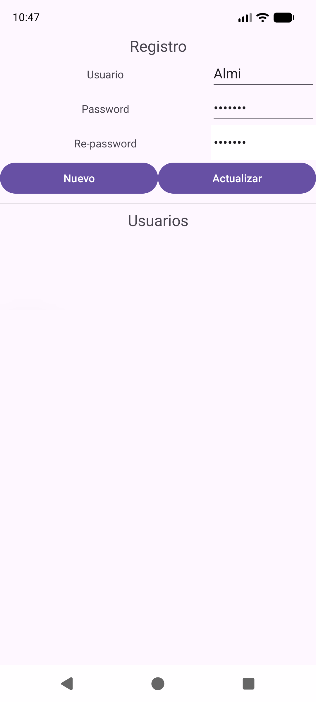
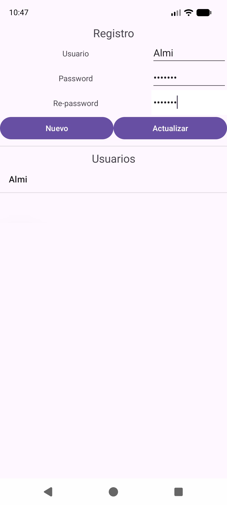

---
tags:
  - android
  - guia
---

# Guía: cómo abrir, ejecutar y probar una app (emulador y móvil real)

Esta guía es para **antes** de tocar código: cómo abrir un proyecto, hacer que compile y verlo funcionando. Está pensada para alguien que nunca ha usado Android Studio.

> **Sobre las capturas:** las imágenes de esta carpeta (`../img/`) son capturas **reales de la app** ejecutándose en un emulador (Android 17, Pixel de 1080×2400). Las capturas de la propia ventana de Android Studio no las incluyo; en su lugar te doy la **ruta exacta de menús** (con los nombres en inglés que usa Android Studio) para cada paso.

---

## 0. Qué necesitas instalado

| Pieza | Para qué | ¿Ya lo tienes? |
|---|---|---|
| **Android Studio** | El programa donde escribes y ejecutas | Sí, en `C:\Program Files\Android\Android Studio` |
| **Android SDK** | Las librerías de Android | Sí, en `C:\Android\Sdk` |
| **Un dispositivo** (emulador o móvil) | Donde se ejecuta la app | Sí: emuladores `Icloud` y `Pixel_8a` |

Detalle de qué es cada cosa: [09 — Instalación y estructura de proyecto](../02-conceptos/09-instalacion-estructura-proyecto.md).

---

## 1. Abrir un proyecto

1. Abre Android Studio.
2. **File → Open…** y elige la **carpeta del proyecto** (la que contiene `app/`, `gradle/` y `settings.gradle.kts`), por ejemplo `C:\Users\Dam2\AndroidStudioProjects\EjemploDialogoPersonalizado`.
   - ⚠️ Abre la carpeta del proyecto, **no** la carpeta `app` de dentro.
   - Si el proyecto viene de un `.zip`: **descomprímelo antes** (clic derecho → *Extraer todo*) y abre la carpeta resultante.
3. Espera. Abajo a la derecha verás una barra de progreso: **Gradle está sincronizando** (descargando librerías y preparando todo). La primera vez puede tardar varios minutos.
4. Cuando termine, en la pestaña **Build** (abajo) debe aparecer `BUILD SUCCESSFUL` o simplemente desaparecer la barra.

### Qué es "sincronizar" (Sync)
Gradle lee los ficheros `build.gradle.kts` y `libs.versions.toml`, descarga las librerías que piden (Room, Material...) y deja el proyecto listo. Si cambias algún fichero `.gradle`/`.toml`, Android Studio muestra arriba un aviso **Sync Now** (o pulsa el icono del **elefante** de la barra superior). **Hay que sincronizar antes de ejecutar.**

---

## 2. El error que ya te ha pasado: *"incompatible version of the Android Gradle plugin"*

```
The project is using an incompatible version (AGP 9.4.1) of the Android Gradle plugin.
Latest supported version is AGP 9.3.0
```

**Qué significa:** el proyecto pide una versión del plugin de Android (AGP) **más nueva** que la que entiende tu Android Studio.

**Solución A (rápida): bajar la versión del plugin.** Abre `gradle/libs.versions.toml` y cambia:

```toml
[versions]
agp = "9.3.0"      # antes: "9.4.1"
```
Después pulsa **Sync Now**. Es lo que se hizo en `EjemploDialogoPersonalizado`.

**Solución B: actualizar Android Studio.** **Help → Check for Updates…** Con un Android Studio más nuevo ya soporta el AGP 9.4.1.

> Regla: **el AGP del proyecto no puede ser mayor que el que soporta tu Android Studio.** Los proyectos que copias de otro ordenador pueden traer un AGP más nuevo.

---

## 3. Preparar un emulador (móvil virtual en tu PC)

1. **Tools → Device Manager** (o el icono de móvil en la barra lateral derecha).
2. Si ya ves uno (`Pixel_8a`, `Icloud`), puedes saltarte al punto 4.
3. **Create Device** (el botón `+`):
   - **Category → Phone**, elige **Pixel 8** → **Next**.
   - Elige una **System Image** (versión de Android). Si tiene una flechita de descarga junto al nombre, pulsa **Download** y espera. Recomendada: la más reciente con **Google Play**.
   - **Next → Finish**.
4. Pulsa el botón **▶ (Start)** junto al dispositivo. Tarda 1–2 minutos en arrancar; verás un móvil en pantalla.

### Si el emulador no arranca (Windows)
El emulador necesita **virtualización** activada:
- Activa **Windows Hypervisor Platform** (*Panel de control → Programas → Activar o desactivar características de Windows*) y reinicia.
- Si aun así falla, activa **Virtualization / VT-x / SVM** en la BIOS del PC.
- Para comprobarlo desde la terminal: `C:\Android\Sdk\emulator\emulator.exe -accel-check` (en este equipo responde *"WHPX is installed and usable"*, o sea, todo bien).

---

## 4. Ejecutar la app en el emulador

1. En la barra superior, en el desplegable de dispositivos, elige el emulador (aparece como *Pixel 8a API …*).
   - Si no aparece, primero arráncalo (paso 3.4).
2. Comprueba a su izquierda que el módulo seleccionado es **app**.
3. Pulsa el botón verde **▶ Run 'app'** (atajo: **Shift + F10**).
4. Gradle compila, instala y **abre la app sola** en el emulador. La primera vez tarda; las siguientes son rápidas.

Lo que deberías ver de `EjemploDialogoPersonalizado`:

| Pantalla principal | Diálogo de login |
|---|---|
|  |  |

Cada vez que cambies código, pulsa ▶ otra vez. El botón ⚡ (**Apply Changes**) permite aplicar cambios pequeños sin reinstalar.

---

## 5. Ejecutar la app en tu móvil real

Sirve para probar de verdad la app y no depender del emulador.

### 5.1. Activar el modo desarrollador (una sola vez)
1. **Ajustes → Acerca del teléfono** (en algunos: *Información del software*).
2. Toca **7 veces** seguidas sobre **Número de compilación**. Aparecerá *"Ahora eres desarrollador"*.
3. Vuelve a Ajustes → **Sistema → Opciones de desarrollador** y activa **Depuración por USB** (*USB debugging*).

### 5.2. Conectarlo
1. Conecta el móvil al PC con un **cable USB que transmita datos** (algunos cables solo cargan).
2. En el móvil aparece *"¿Permitir depuración USB?"* → marca **Permitir siempre desde este ordenador** → **Permitir**.
3. En Android Studio, el móvil aparece en el desplegable de dispositivos con su modelo. Selecciónalo y pulsa **▶**.

### 5.3. Sin cable (Android 11 o superior)
En Opciones de desarrollador activa **Depuración inalámbrica**. En Android Studio: **Device Manager → Pair devices using Wi-Fi** y escanea el código QR con el móvil. PC y móvil deben estar en **la misma red Wi-Fi**.

### Si el móvil no aparece
- Prueba otro cable o puerto USB.
- En el móvil, cambia el modo USB a **Transferencia de archivos**.
- En una terminal: `C:\Android\Sdk\platform-tools\adb.exe devices`. Debe listar tu dispositivo como `device`. Si sale `unauthorized`, acepta el aviso en el móvil.
- Instala el **driver USB** del fabricante (Samsung, Xiaomi...) si Windows no lo reconoce.

---

## 6. Ver los mensajes y errores: Logcat

Si la app **se cierra sola** ("se ha detenido"), la explicación está en **Logcat**.

1. Abajo, pestaña **Logcat** (o **View → Tool Windows → Logcat**).
2. En el filtro escribe `package:mine` para ver solo los mensajes de tu app, y ponle nivel **Error**.
3. Busca en rojo `FATAL EXCEPTION`. Debajo aparece el tipo de error y una lista de líneas.
4. **Cómo leerlo:**
   - La primera línea dice **qué** falló (`NullPointerException`, `ClassCastException`...).
   - Busca **`Caused by:`**: suele ser la causa real.
   - Busca la primera línea que contenga **tu paquete** (`com.example.…`): es **dónde** falló; incluye el fichero y el número de línea (haz clic y salta al código).

Tabla de errores más típicos y su arreglo: [03 — Errores comunes y cómo arreglarlos](03-errores-comunes.md).

### Mensajes propios (útil para depurar)
```java
Log.d("MIAPP", "el valor es " + valor);   // aparece en Logcat con la etiqueta MIAPP
```
Filtra por `tag:MIAPP`.

---

## 7. Ver la base de datos por dentro (Room)

Con la app ejecutándose en el emulador o el móvil:

**View → Tool Windows → App Inspection → pestaña Database Inspector.**

Verás tus tablas (`Usuario`) y sus filas **en vivo**. Si insertas un usuario en la app, aparece aquí al instante. Muy útil para comprobar si un `INSERT`, `UPDATE` o `DELETE` ha funcionado.

---

## 8. Alternativa: compilar e instalar desde la terminal

Desde la carpeta del proyecto (en PowerShell):

```powershell
.\gradlew.bat assembleDebug        # compila y genera el .apk
.\gradlew.bat installDebug         # compila E INSTALA en el dispositivo conectado
C:\Android\Sdk\platform-tools\adb.exe devices          # lista dispositivos
C:\Android\Sdk\platform-tools\adb.exe logcat -d -s AndroidRuntime:E   # errores de crash
```
El `.apk` queda en `app\build\outputs\apk\debug\app-debug.apk`. Se puede pasar a otro móvil e instalar a mano.

---

## 9. Recorrido de la app `EjemploDialogoPersonalizado`

Sigue estos pasos con la app abierta para comprobar que todo funciona. Cada paso muestra lo que deberías ver.

**1. Pulsa `Registrar`.** Aparece el formulario vacío:


**2. Escribe `Almi`, `Almi123` y en Re-password `Almi12` (mal).** El campo se pone rojo:


> En la **versión original** del proyecto, *Nuevo* se desactiva aquí (aparece en gris). En la versión con las mejoras del [nivel 7](../07-ejercicios/07-nivel-7-mejoras-del-proyecto.md) además se vigila el campo Password.

**3. Añade el `3` que falta.** Coinciden: el campo vuelve a blanco y *Nuevo* se activa:



Pulsa **Nuevo** y el usuario aparece en la lista:



**4. Crea un segundo usuario y pulsa uno de la lista.** Sus datos se cargan en el formulario (*clic corto*):

| Dos usuarios | Uno seleccionado |
|---|---|
|  |  |

**5. Mantén pulsado un usuario (clic largo).** Sale la confirmación de borrado:


Si pulsas **no**, aparece un aviso (`Toast`) y no se borra nada:


**6. Vuelve atrás, pulsa `Acceder`** y entra con un usuario que hayas registrado. Se abre la pantalla central:


---

## 10. Lista de comprobación: "mi app no arranca"

- [ ] ¿Terminó la sincronización de Gradle sin errores? (pestaña **Build**)
- [ ] ¿El plugin AGP no es mayor que el de tu Android Studio? (apartado 2)
- [ ] ¿Está el dispositivo elegido en el desplegable y arrancado?
- [ ] ¿El módulo seleccionado es **app**?
- [ ] ¿Hay errores en rojo en el código? (**Build → Rebuild Project**)
- [ ] ¿Declaraste todas las `Activity` en `AndroidManifest.xml`?
- [ ] ¿Se cierra al abrir? Mira **Logcat** (apartado 6).
- [ ] Como último recurso: **File → Invalidate Caches… → Invalidate and Restart**, y **Build → Clean Project**.

## Ver también
- [03 — Errores comunes y cómo arreglarlos](03-errores-comunes.md)
- [02 — Glosario](02-glosario.md)
- [09 — Instalación y estructura de proyecto](../02-conceptos/09-instalacion-estructura-proyecto.md)
