---
tags:
  - android
  - proyecto-profesor
  - indice
aliases:
  - Mapa de proyectos del profesor
  - AndroidEjemploProyectos
---

# Mapa de proyectos del profesor (`AndroidEjemploProyectos`)

Los 12 proyectos están en `android/codigo/AndroidEjemploProyectos/`. Todos son **Java**, con **AGP 9.3.x**, **Gradle 9.5.0**, `compileSdk`/`targetSdk` **37** y `minSdk` **24**. Todos, salvo `aaaa`, parten de la plantilla *Empty Views Activity* ([MyApplication](MyApplication.md)).

> [!tip] 💡 Cómo usar esta carpeta
> Cada nota tiene: objetivo → qué aprendes → estructura → flujo paso a paso → diagrama → clases (variables, métodos y código comentado) → layouts → manifest → Gradle → ⚠️ bugs → ✅ reutilizable → ejercicios. En la carpeta de cada proyecto hay además un `README.md` corto.

## Resumen general

| # | Proyecto | Qué enseña | Nivel | Archivos principales | PDF |
|---|---|---|---|---|---|
| 1 | [MyApplication](MyApplication.md) | Estructura de un proyecto, `onCreate`, EdgeToEdge, manifest, Gradle | ⭐ | `MainActivity`, `activity_main.xml` | [0 Instalación](../03-pdfs/01-instalacion-android.md) |
| 2 | [DisenyoConstraint](DisenyoConstraint.md) | Restricciones de `ConstraintLayout`, *bias*, vista sin restricciones | ⭐ | `activity_main.xml` | [2 Constraint](../03-pdfs/04-constraint.md) |
| 3 | [DisenyoPesos](DisenyoPesos.md) | Pesos, drawables XML, estilos, toast con `Dialog`, `AsyncTask` + `ProgressBar` | ⭐⭐ | `activity_main.xml`, `MainActivity`, `ProgressAndando` | [Pesos](../03-pdfs/02-diseno-basado-en-pesos.md), [Toast](../03-pdfs/05-toast-personalizado.md), [AsyncTask](../03-pdfs/06-asynctask.md) |
| 4 | [EjercicioAsyncTaskAlumnos](EjercicioAsyncTaskAlumnos.md) | Repetir el patrón AsyncTask (caballo) | ⭐⭐ | `AsyntaskDamCaballo` | [AsyncTask](../03-pdfs/06-asynctask.md) |
| 5 | [AdapterDam2](AdapterDam2.md) | `ListView`/`Spinner`/`GridView`, `BaseAdapter` y `ArrayAdapter`, Glide, transiciones y *shared element* | ⭐⭐⭐ | 3 adaptadores, `GridViewDam2Activity`, `DetalleActivity` | [Adaptadores](../03-pdfs/09-adaptadores.md), [Transiciones](../03-pdfs/10-transiciones.md) |
| 6 | [EjercicioSpinner](EjercicioSpinner.md) | Spinner personalizado + pantalla de detalle | ⭐⭐⭐ | `EjercicioSpinerAdapter` | [Adaptadores](../03-pdfs/09-adaptadores.md) |
| 7 | [EjercicioAdaptadoresFinal](EjercicioAdaptadoresFinal.md) | 3 niveles de navegación, `Serializable`, Picasso, `INTERNET` | ⭐⭐⭐ | modelos, 2 adaptadores, 3 Activities | [Adaptadores](../03-pdfs/09-adaptadores.md) |
| 8 | [EjemploFragmentos2](EjemploFragmentos2.md) | Fragmentos, interfaz de comunicación, `newInstance`, Toolbar + menú | ⭐⭐⭐⭐ | `IControlFragmentos`, 2 fragmentos | [Fragmentos](../03-pdfs/11-fragmentos.md) |
| 9 | [EjercicioFragmentos](EjercicioFragmentos.md) | 3 fragmentos encadenados, lista `Serializable` acumulada | ⭐⭐⭐⭐ | 3 fragmentos, `AdaptadorPersona` | [Fragmentos](../03-pdfs/11-fragmentos.md) |
| 10 | [EjercicioPokemon](EjercicioPokemon.md) | CRUD con Room, `LiveData`, doble toque, filtros | ⭐⭐⭐⭐⭐ | `bbdd/*`, `MainActivity` | [Diálogo + SQLite](../03-pdfs/12-dialogo-sqlite-personalizado.md) |
| 11 | [EjemploDialogoPersonalizado](EjemploDialogoPersonalizado.md) | `DialogFragment`, Room, `AlertDialog`, `TextWatcher`, **sensores, cámara, MediaStore, voz** | ⭐⭐⭐⭐⭐ | 7 Activities, `bbdd/*` | [Diálogo](../03-pdfs/12-dialogo-sqlite-personalizado.md), [Sensores](../03-pdfs/13-sensores.md), [Cámara](../03-pdfs/14-camara-y-almacenamiento.md), [Voz](../03-pdfs/15-voz.md) |
| 12 | [aaaa](aaaa.md) | Plantilla moderna: View Binding, Navigation, ViewModel, RecyclerView | ⭐⭐⭐⭐⭐⭐ | `MainActivity`, `TransformFragment` | — (fuera del temario) |

## Orden de estudio recomendado

```mermaid
flowchart LR
    A[MyApplication] --> B[DisenyoConstraint] --> C[DisenyoPesos] --> D[EjercicioAsyncTaskAlumnos]
    D --> E[AdapterDam2] --> F[EjercicioSpinner] --> G[EjercicioAdaptadoresFinal]
    G --> H[EjemploFragmentos2] --> I[EjercicioFragmentos]
    I --> J[EjemploDialogoPersonalizado<br/>login + Room] --> K[EjercicioPokemon]
    K --> L[EjemploDialogoPersonalizado<br/>sensores · cámara · voz] --> M[aaaa]
```

1. **Base (1–2):** entiende la plantilla y cómo se colocan las vistas.
2. **Diseño y primeros hilos (3–4):** un menú bonito, avisos propios y tareas en segundo plano.
3. **Listas (5–7):** el bloque más largo; los adaptadores salen en casi todos los exámenes.
4. **Fragmentos (8–9).**
5. **Datos persistentes (11 → 10):** primero el ejemplo guía (login + registro) y después el ejercicio Pokémon, que aplica lo mismo.
6. **Hardware (11, segunda parte):** sensores, cámara y voz.
7. **Para ir más allá (12):** cómo se hace todo lo anterior en Android moderno.

## Comparativa: proyectos del profesor frente a tus proyectos

| Profesor (`AndroidEjemploProyectos/`) | Tuyo (`proyectos-alumno/`) | Diferencia principal |
|---|---|---|
| [AdapterDam2](AdapterDam2.md) | [AdapterDam2](../05-proyectos-alumno/AdapterDam2.md) | Tus imágenes son otras (pikachus, logos 2025) y tu código está comentado |
| [DisenyoPesos](DisenyoPesos.md) | [Diseobesos](../05-proyectos-alumno/Diseobesos.md), [EjercicioDiseno](../05-proyectos-alumno/EjercicioDiseno.md) | Los tuyos añaden más animaciones y toasts |
| [DisenyoConstraint](DisenyoConstraint.md) | [anclados](../05-proyectos-alumno/anclados.md) | Tu versión es un esqueleto |
| [EjemploFragmentos2](EjemploFragmentos2.md) | [EjemploFragmentos](../05-proyectos-alumno/EjemploFragmentos.md) | Casi idénticos |
| [EjercicioFragmentos](EjercicioFragmentos.md) | [EjercicioFragmentos](../05-proyectos-alumno/EjercicioFragmentos.md), [FragmentosNombres](../05-proyectos-alumno/FragmentosNombres.md) | FragmentosNombres está sin terminar |
| [EjercicioAdaptadoresFinal](EjercicioAdaptadoresFinal.md) | [EjercicioAdaptadoresFinal](../05-proyectos-alumno/EjercicioAdaptadoresFinal.md), [equiposFutbol](../05-proyectos-alumno/equiposFutbol.md) | Tu versión incluye un caso real de depuración de transición |
| [EjemploDialogoPersonalizado](EjemploDialogoPersonalizado.md) | [EjemploDialogoPersonalizado](../05-proyectos-alumno/EjemploDialogoPersonalizado.md) | La del profesor **añade sensores, cámara y voz** |
| [EjercicioPokemon](EjercicioPokemon.md) | `EjercicioDialogoPokemon` ([ficha](../09-fichas-faciles/EjercicioDialogoPokemon.md)) | Mismo ejercicio |
| [EjercicioSpinner](EjercicioSpinner.md) | [EjercicioSergio](../05-proyectos-alumno/EjercicioSergio.md) | El tuyo está sin empezar |
| [EjercicioAsyncTaskAlumnos](EjercicioAsyncTaskAlumnos.md) | — | Solo existe la del profesor |
| [MyApplication](MyApplication.md), [aaaa](aaaa.md) | [Pokemons](../05-proyectos-alumno/Pokemons.md) (esqueleto) | Plantillas |

## Cosas comunes a todos los proyectos

- **Bloque EdgeToEdge** en cada `onCreate` → [01 — Fundamentos](../02-conceptos/01-fundamentos-bundle-intent-ciclo-vida.md).
- **Tema** `Theme.Material3.DayNight.NoActionBar` (salvo `aaaa`): sin barra de título; en modo oscuro se usa `values-night/themes.xml`.
- **Manifest:** la primera Activity con `MAIN`/`LAUNCHER` y `exported="true"`; el resto con `exported="false"` → [24 — Manifest y permisos](../02-conceptos/24-manifest-y-permisos.md).
- **Gradle** con *version catalog* (`gradle/libs.versions.toml`) → [25 — Gradle y librerías](../02-conceptos/25-gradle-y-librerias.md).

> [!warning] ⚠️ Cuidado: el inventario completo de archivos
> El listado de **todas** las clases, layouts, recursos y dependencias está en [INVENTARIO](../INVENTARIO.md). Los bugs de todos los proyectos, juntos, están en [Código antiguo y malas prácticas](../01-guias/05-codigo-antiguo-y-malas-practicas.md).
