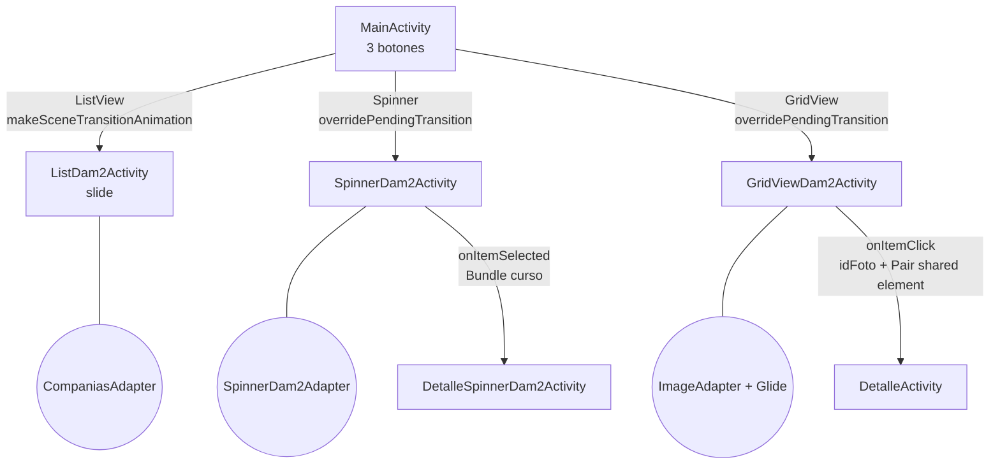

---
tags:
  - android
  - proyecto-profesor
  - nivel/3
  - tema/adaptadores
  - tema/transiciones
aliases:
  - AdapterDam2 (profesor)
---

# AdapterDam2 — ListView, Spinner, GridView y transiciones

> [!info] Ficha rápida
> **Código:** `android/codigo/AndroidEjemploProyectos/AdapterDam2` · **Nivel:** ⭐⭐⭐
> **PDFs:** [6 — Adaptadores](../03-pdfs/09-adaptadores.md) → [7 — Transiciones](../03-pdfs/10-transiciones.md)
> **Conceptos:** [07 Adaptadores](../02-conceptos/07-adaptadores.md) · [08 Transiciones](../02-conceptos/08-transiciones.md) · [19 Eventos de lista](../02-conceptos/19-textwatcher-y-eventos-de-lista.md)
> **Tu versión:** [AdapterDam2 (alumno)](../05-proyectos-alumno/AdapterDam2.md), explicada fragmento a fragmento

## 1. Objetivo del proyecto

Un menú con tres botones grandes, **ListView**, **Spinner** y **GridView**. Cada uno abre una pantalla que muestra datos con **su propio adaptador**:

| Pantalla | Qué muestra | Adaptador |
|---|---|---|
| `ListDam2Activity` | 4 compañías telefónicas (logo, nombre, precio) en filas de color alterno | `CompaniasAdapter extends BaseAdapter` |
| `SpinnerDam2Activity` | Desplegable de 8 cursos con una fila "Seleccione una opción" al principio | `SpinnerDam2Adapter extends ArrayAdapter<String>` |
| `GridViewDam2Activity` | Rejilla de 10 paisajes cargados con Glide | `ImageAdapter extends BaseAdapter` |

Sobre esa base, el PDF de Transiciones añade animaciones entre pantallas: `explode`/`slide` en el tema, `slide` propio en la lista, animaciones `anim/` y una transición de **elemento compartido**: la foto de la rejilla "vuela" hasta la pantalla de detalle.

## 2. Qué aprende el alumno

- El patrón **Adaptador**: datos → adaptador → vista de lista.
- `BaseAdapter` (4 métodos obligatorios) frente a `ArrayAdapter` (ya trae casi todo).
- `getView` frente a `getDropDownView` en un `Spinner`.
- Modelo de datos (`CompaniaTelefonica`) y relleno de datos de prueba.
- Recursos `string-array` (`getStringArray`) y arrays de drawables (`obtainTypedArray`).
- La librería **Glide** para cargar imágenes grandes sin gastar demasiada memoria.
- `OnItemSelectedListener` (Spinner) y `OnItemClickListener` (GridView).
- Transiciones: por tema (`windowEnterTransition`), por código (`setEnterTransition`), `overridePendingTransition` y *shared element* con `ActivityOptionsCompat` + `Pair` + `setTransitionName`.

## 3. Estructura del proyecto

```
java/com/example/adapterdam2/
├── MainActivity.java               → menú de 3 botones (3 formas de lanzar Activity)
├── ListDam2Activity.java           → ListView de compañías + transición slide
├── SpinnerDam2Activity.java        → Spinner de cursos → DetalleSpinnerDam2Activity
├── DetalleSpinnerDam2Activity.java → muestra el curso elegido
├── GridViewDam2Activity.java       → GridView de paisajes → DetalleActivity (shared element)
├── DetalleActivity.java            → foto grande + título + descripción
├── adaptadores/CompaniasAdapter.java · SpinnerDam2Adapter.java · ImageAdapter.java
└── model/CompaniaTelefonica.java
res/
├── layout/ activity_main · activity_list_dam2 · activity_spinner_dam2 · activity_detalle_spinner_dam2
│           activity_grid_view_dam2 · activity_detalle · compania_telefonica_list · spinner_per · grid_item_view
├── anim/entrada.xml · salida.xml        → fundidos (alpha) para overridePendingTransition
├── transition/explode.xml · slide.xml   → transiciones de ventana
├── values/array.xml (cursos) · recursos.xml (paisajes) · themes.xml (transiciones globales)
└── drawable/logo*.png · paisaje1..10.jpg
```

## 4. Flujo de funcionamiento

1. **Arranque:** `MainActivity.onCreate` → `activity_main.xml` (3 botones con peso 1 cada uno, un tercio de pantalla por botón). El tema activa las transiciones de ventana (`explode` al entrar, `slide` al salir).
2. **ListView:** clic → `makeSceneTransitionAnimation(MainActivity.this)` + `startActivity(intent, options.toBundle())` → `ListDam2Activity` entra con `slide` desde abajo (1 s) → `rellenarCompanias()` → `new CompaniasAdapter(...)` → `setAdapter`. El `ListView` llama a `getCount()` y a `getView()` por cada fila visible.
3. **Spinner:** clic → `startActivity` + `overridePendingTransition(entrada, salida)` → `SpinnerDam2Activity` → adaptador con los 8 cursos + la fila de aviso. Al elegir un curso (no la fila 0, y no en la selección automática inicial) → `DetalleSpinnerDam2Activity` con `putExtras(bundle "curso")`.
4. **GridView:** clic → `GridViewDam2Activity` → `ImageAdapter` con el `TypedArray` de paisajes y Glide. Al tocar una foto → `Intent` con `"idFoto"=position` + `Pair(vista, "imagenCabecera")` → `DetalleActivity` recibe la posición, carga esa foto con Glide y marca su `ImageView` con el mismo *transition name* → la foto "crece" de la celda a la cabecera.



## 5. Clases

### Clase: `MainActivity`

| Método | Cuándo | Qué hace |
|---|---|---|
| `onCreate` | Al abrir | Programa los 3 botones |
| 3 × `onClick` | Al pulsar cada botón | Abren cada pantalla con una técnica de transición distinta |

```java
// ListView: se lanza con "opciones de escena". Sin ellas, la transición slide
// que ListDam2Activity configura en su onCreate NO se vería.
ActivityOptionsCompat options = ActivityOptionsCompat.makeSceneTransitionAnimation(MainActivity.this);
startActivity(new Intent(getApplicationContext(), ListDam2Activity.class), options.toBundle());

// Spinner y GridView: animación "clásica" de ventana con recursos res/anim/.
// Se llama JUSTO DESPUÉS de startActivity: (animación de entrada de la nueva, de salida de la actual).
startActivity(new Intent(getApplicationContext(), SpinnerDam2Activity.class));
overridePendingTransition(R.anim.entrada, R.anim.salida);
```

---

### Clase: `CompaniaTelefonica` (modelo)

| Variable | Tipo | Para qué sirve |
|---|---|---|
| `nombre` | `String` | "Movistar", "Euskaltel"… |
| `logo` | `int` | Id del drawable (`R.drawable.logomovistar`) |
| `precio` | `float` | Precio mensual |

> [!warning] ⚠️ Cuidado: orden del constructor
> `CompaniaTelefonica(String nombre, float precio, int logo)`: el precio va **antes** que el logo. En `new CompaniaTelefonica("Movistar", 80, R.drawable.logomovistar)` el `80` es el precio. Si los cambias de orden, compila igualmente (los dos son números) y verás logos rotos.

---

### Clase: `ListDam2Activity`

| Variable | Tipo | Para qué sirve |
|---|---|---|
| `companiasTelefonicas` | `ArrayList<CompaniaTelefonica>` (final) | Datos de la lista |
| `listaCompanias` | `ListView` | La vista `lvTelefonicas` |

| Método | Cuándo | Qué hace |
|---|---|---|
| `onCreate` | Al abrir | Configura la transición **antes** de `setContentView`, rellena los datos y conecta el adaptador |
| `rellenarCompanias()` | Desde `onCreate` | Añade 4 compañías "a mano" |

```java
EdgeToEdge.enable(this);
// La transición de entrada debe fijarse ANTES de setContentView: la ventana
// necesita saber cómo animarse antes de dibujar su contenido.
Transition slide = TransitionInflater.from(this).inflateTransition(R.transition.slide);
getWindow().setEnterTransition(slide);   // sustituye al "explode" del tema solo en esta pantalla
setContentView(R.layout.activity_list_dam2);
...
rellenarCompanias();
CompaniasAdapter adapter = new CompaniasAdapter(this, companiasTelefonicas);
listaCompanias = findViewById(R.id.lvTelefonicas);
listaCompanias.setAdapter(adapter);      // a partir de aquí el ListView pide filas al adaptador
```

---

### Clase: `CompaniasAdapter extends BaseAdapter`

| Variable | Tipo | Para qué sirve |
|---|---|---|
| `context` | `Context` | Para obtener un `LayoutInflater` |
| `companiaTelefonicas` | `ArrayList<CompaniaTelefonica>` | Los datos |

| Método | Quién lo llama | Qué devuelve |
|---|---|---|
| `getCount()` | El `ListView`, para saber cuántas filas hay | `size()` de la lista |
| `getItem(pos)` | Tú o el `ListView` | La compañía de esa posición |
| `getItemId(pos)` | El `ListView` | `0` siempre (ver ⚠️) |
| `getView(pos, convertView, parent)` | El `ListView`, por cada fila visible | La fila ya rellenada |

```java
@Override
public View getView(int position, View convertView, ViewGroup parent) {
    // 1) Crear la fila a partir del XML. attachToRoot=false: el ListView la añadirá él mismo.
    LayoutInflater inflater = LayoutInflater.from(this.context);
    View fila = inflater.inflate(R.layout.compania_telefonica_list, parent, false);

    // 2) Obtener el dato de ESTA posición.
    CompaniaTelefonica compania = this.companiaTelefonicas.get(position);

    // 3) Buscar las vistas DENTRO de la fila (fila.findViewById, no findViewById a secas).
    ImageView ivLogo = fila.findViewById(R.id.iconoTelefono);
    TextView tvTelefono = fila.findViewById(R.id.tvNombreTelefono);
    TextView tvPrecio = fila.findViewById(R.id.tvPrecioTelefono);

    // 4) Pintar los datos. setText(float) NO existe con ese sentido: se concatena "" para pasar a String.
    ivLogo.setImageResource(compania.getLogo());
    tvTelefono.setText(compania.getNombre());
    tvPrecio.setText(compania.getPrecio() + "");

    // 5) Efecto "cebra": filas pares gris oscuro, impares gris claro.
    fila.setBackgroundColor(position % 2 == 0 ? Color.GRAY : Color.LTGRAY);
    return fila;
}
```

> [!important] 📌 Importante
> `tvPrecio.setText(compania.getPrecio())` **sin** `+ ""` compilaría si el valor fuera `int`, porque Android lo trataría como **id de un string** y la app se cerraría con `Resources$NotFoundException`. Con `float` directamente no compila. Convierte siempre los números a `String`.

---

### Clase: `SpinnerDam2Activity` + `SpinnerDam2Adapter`

`SpinnerDam2Activity`:

| Variable | Tipo | Para qué sirve |
|---|---|---|
| `cbCursos` | `Spinner` | El desplegable |
| `ver` | `int` | "Bandera" para ignorar la selección automática al abrir |

```java
cbCursos.setAdapter(new SpinnerDam2Adapter(this,
        R.layout.spinner_per,                              // layout de cada fila
        getResources().getStringArray(R.array.cursos)));   // String[] de res/values/array.xml

final Intent intent = new Intent(this, DetalleSpinnerDam2Activity.class);
cbCursos.setOnItemSelectedListener(new AdapterView.OnItemSelectedListener() {
    @Override
    public void onItemSelected(AdapterView<?> parent, View view, int position, long id) {
        // Android llama a onItemSelected UNA VEZ al montar el Spinner (posición 0).
        // "ver" evita navegar en esa primera llamada; position>0 ignora la fila "Seleccione…".
        if (ver == 1 && position > 0) {
            Bundle bundle = new Bundle();
            // position-1 porque el adaptador tiene una fila extra al principio.
            bundle.putString("curso", parent.getItemAtPosition(position - 1) + "");
            intent.putExtras(bundle);
            startActivity(intent);
        }
        ver = 1;
    }
    @Override public void onNothingSelected(AdapterView<?> parent) { }
});
```

`SpinnerDam2Adapter extends ArrayAdapter<String>`:

| Método | Qué hace |
|---|---|
| `getCount()` | `datos.length + 1`, por la fila de aviso |
| `getItem(pos)` | `datos[pos]` (ojo: sin restar 1) |
| `getView(...)` | Fila **cerrada** (lo que se ve con el desplegable plegado) → `vistaPersonalizada` |
| `getDropDownView(...)` | Filas de la **lista desplegada** → `vistaPersonalizada` |
| `vistaPersonalizada(...)` | Posición 0: "Selecione una opción:" con fondo azul. Resto: `datos[position-1]`, y fondo gris en las pares |

> [!warning] ⚠️ Cuidado: el "+1" y `getItem`
> `getCount()` devuelve 9 pero `getItem(8)` haría `datos[8]` → `ArrayIndexOutOfBoundsException`. Funciona porque la Activity siempre pide `position - 1`. Es un truco frágil. La forma limpia es meter "Seleccione una opción" como primer elemento del array y no tocar los índices.

---

### Clase: `DetalleSpinnerDam2Activity`

```java
String saludo = getIntent().getStringExtra("curso");            // misma clave que putString
((TextView) findViewById(R.id.tvDetalleSpinner)).setText(saludo);
```

---

### Clase: `GridViewDam2Activity` + `ImageAdapter`

```java
grid = findViewById(R.id.gridImagenes);
// El adaptador recibe el TypedArray de paisajes (res/values/recursos.xml).
grid.setAdapter(new ImageAdapter(getApplicationContext(),
        getResources().obtainTypedArray(R.array.paisajes)));

grid.setOnItemClickListener(new AdapterView.OnItemClickListener() {
    @Override
    public void onItemClick(AdapterView<?> parent, View view, int position, long id) {
        Intent intent = new Intent(GridViewDam2Activity.this, DetalleActivity.class);
        intent.putExtra("idFoto", position);                        // qué foto se pulsó

        // "view" es la CELDA pulsada; dentro está la ImageView que va a "volar".
        View imagenPulsada = view.findViewById(R.id.imagenGridView);
        ActivityOptionsCompat opciones = ActivityOptionsCompat.makeSceneTransitionAnimation(
                GridViewDam2Activity.this,
                new Pair<>(imagenPulsada, DetalleActivity.VIEW_NAME_HEADER_IMAGE)); // origen ↔ etiqueta
        ActivityCompat.startActivity(GridViewDam2Activity.this, intent, opciones.toBundle());
    }
});
```

`ImageAdapter.getView` infla `grid_item_view.xml` y carga la imagen con Glide:
```java
Glide.with(contexto)
     .load(imagenes.getResourceId(position, -1))   // id del drawable de esa posición
     .into(imageView);                              // Glide la reescala al tamaño de la vista (100dp)
```
Sin Glide, `setImageResource` con JPG de 350 KB a resolución completa hace que la rejilla vaya a tirones o dé `OutOfMemoryError`.

---

### Clase: `DetalleActivity`

| Variable | Tipo | Para qué sirve |
|---|---|---|
| `VIEW_NAME_HEADER_IMAGE` | `public static final String` = `"imagenCabecera"` | Etiqueta común origen/destino de la transición |

```java
int pos = getIntent().getIntExtra("idFoto", 0);        // 0 = valor por defecto si no llega nada
TypedArray paisajes = getResources().obtainTypedArray(R.array.paisajes);
int idImagen = paisajes.getResourceId(pos, -1);
paisajes.recycle();                                     // ✔ libera el TypedArray

ImageView ivImagen = findViewById(R.id.ivDetalles);
// Marca ESTA ImageView como destino: mismo nombre que el Pair de la pantalla anterior.
ViewCompat.setTransitionName(ivImagen, VIEW_NAME_HEADER_IMAGE);
Glide.with(getApplicationContext()).load(idImagen).into(ivImagen);

((TextView) findViewById(R.id.tvDetallesTitulo)).setText("Paisaje " + (pos + 1));
((TextView) findViewById(R.id.tvDetallesDescripcion)).setText("Imagen número " + (pos + 1) + " de la galería.");
```

> [!important] 📌 Importante: por qué `public static final`
> - `static`: se usa como `DetalleActivity.VIEW_NAME_HEADER_IMAGE` desde otra clase, sin crear un objeto `DetalleActivity`.
> - `final`: es una constante; si alguien la cambiara, origen y destino dejarían de coincidir.
> - `public`: `GridViewDam2Activity` está en otra clase y necesita leerla.

## 6. Layouts

| Layout | Componentes (ID) | Organización | Lo usa |
|---|---|---|---|
| `activity_main.xml` | `btnListView`, `btnSpinner`, `btnGridView` (40sp) | `LinearLayout` vertical, cada botón con `height=0dp, weight=1` | `MainActivity` |
| `activity_list_dam2.xml` | `textView` "Compañias Telefonicas", `ListView lvTelefonicas` (352×576dp) | `ConstraintLayout` | `ListDam2Activity` |
| `compania_telefonica_list.xml` | `ImageView iconoTelefono` (peso 1) + columna con `tvNombreTelefono` y `tvPrecioTelefono` (peso 2) | `LinearLayout` horizontal, logo ⅓ y textos ⅔ | `CompaniasAdapter` |
| `activity_spinner_dam2.xml` | `TextView` "Cursos:", `Spinner cbCursos` | `LinearLayout` (horizontal por defecto) | `SpinnerDam2Activity` |
| `spinner_per.xml` | `TextView tvSpinner` (20sp, centrado) | `LinearLayout` | `SpinnerDam2Adapter` |
| `activity_detalle_spinner_dam2.xml` | `TextView tvDetalleSpinner` (60sp) | `ConstraintLayout` con márgenes grandes | `DetalleSpinnerDam2Activity` |
| `activity_grid_view_dam2.xml` | `GridView gridImagenes` (`numColumns=3`) | `LinearLayout` | `GridViewDam2Activity` |
| `grid_item_view.xml` | `ImageView imagenGridView` 100×100 | `LinearLayout` centrado, padding 4dp | `ImageAdapter` |
| `activity_detalle.xml` | `ImageView ivDetalles` (300dp, `centerCrop`), `ScrollView svDetalles` → `tvDetallesTitulo`, `tvDetallesDescripcion` | `LinearLayout` vertical; el `ScrollView` ocupa el resto (`0dp` + peso 1) | `DetalleActivity` |

> [!success] ✅ Reutilizable: fila de lista "imagen + dos textos" (`compania_telefonica_list.xml`)
> ```xml
> <LinearLayout xmlns:android="http://schemas.android.com/apk/res/android"
>     android:layout_width="match_parent" android:layout_height="wrap_content"
>     android:orientation="horizontal" android:padding="8dp">
>     <ImageView android:id="@+id/ivIcono"
>         android:layout_width="0dp" android:layout_height="70dp" android:layout_weight="1" />
>     <LinearLayout android:layout_width="0dp" android:layout_height="wrap_content"
>         android:layout_weight="2" android:orientation="vertical">
>         <TextView android:id="@+id/tvTitulo" android:layout_width="match_parent"
>             android:layout_height="wrap_content" android:textSize="24sp" android:gravity="center"/>
>         <TextView android:id="@+id/tvSubtitulo" android:layout_width="match_parent"
>             android:layout_height="wrap_content" android:textSize="16sp" android:gravity="center"/>
>     </LinearLayout>
> </LinearLayout>
> ```

> [!success] ✅ Reutilizable: pantalla de detalle con imagen de cabecera y texto con scroll (`activity_detalle.xml`).

### Recursos de animación y transición

| Archivo | Contenido | Uso |
|---|---|---|
| `anim/entrada.xml` | `alpha` 0 → 1 en 1000 ms | Entrada con `overridePendingTransition` |
| `anim/salida.xml` | `alpha` 0 → 1 en 1000 ms (⚠️ igual que la entrada) | Salida |
| `transition/explode.xml` | `<explode/>` | Tema: `windowEnterTransition` |
| `transition/slide.xml` | `<slide slideEdge="bottom" duration="1000"/>` | Tema: `windowExitTransition` + `ListDam2Activity` |
| `values/themes.xml` | `windowActivityTransitions=true`, `windowEnterTransition=@transition/explode`, `windowExitTransition=@transition/slide` | Transiciones globales |

## 7. Manifest

6 Activities: `MainActivity` (LAUNCHER, `exported=true`) y el resto con `exported=false`. **Sin permisos:** todas las imágenes son locales (`R.drawable`), así que no hace falta `INTERNET`, aunque Glide la usaría si cargara URLs.

## 8. Gradle y librerías

| Librería | Para qué | Dónde se usa | ¿Reutilizable? |
|---|---|---|---|
| `com.github.bumptech.glide:glide:4.16.0` | Carga eficiente de imágenes (locales, URL, `Uri`) | `ImageAdapter`, `DetalleActivity` | ✅ |
| `libs.picasso` (2.8) | Otra librería de carga de imágenes | **En ningún sitio** (declarada, sin usar) | Sobra aquí |
| Resto (appcompat, material, constraintlayout, activity-ktx) | Plantilla | — | ✅ |

> [!tip] 💡 Recomendación
> Glide se declara "a mano" (`implementation("com.github...:4.16.0")`) mientras que Picasso va por el *version catalog* (`libs.picasso`). Funciona, pero lo ordenado es meter las dos en `libs.versions.toml`. Ver [25 — Gradle](../02-conceptos/25-gradle-y-librerias.md).

## 9. ⚠️ Bugs, código antiguo y mejoras

> [!warning] ⚠️ Cuidado: `salida.xml` es igual que `entrada.xml`
> Las dos van de `alpha 0` a `1`. La pantalla que se va debería desvanecerse (`fromAlpha="1" toAlpha="0"`).

> [!warning] ⚠️ Cuidado: `overridePendingTransition` está obsoleto en Android 14+
> Se sustituye por `overrideActivityTransition(OVERRIDE_TRANSITION_OPEN, R.anim.entrada, R.anim.salida)`. Para clase basta con entenderlo.

> [!warning] ⚠️ Cuidado: los adaptadores no reciclan `convertView`
> Todos los `getView` inflan una fila nueva siempre. Con 4 o 10 elementos da igual; con 1000 iría lento. La solución es `if (convertView == null) convertView = inflater.inflate(...)` + ViewHolder, o directamente `RecyclerView` ([14 — RecyclerView](../02-conceptos/14-recyclerview.md)).

> [!warning] ⚠️ Cuidado: `getItemId` devuelve 0 en `CompaniasAdapter`
> No rompe nada aquí, pero lo correcto es devolver `position` o un id real.

> [!warning] ⚠️ Cuidado: el `TypedArray` del GridView no se recicla
> Se crea en `GridViewDam2Activity` y se entrega al adaptador, que lo usa mientras la pantalla vive. Lo correcto sería reciclarlo en `onDestroy`, o convertirlo antes en un `int[]` de ids.

> [!tip] 💡 Recomendación: textos del XML
> "Compañias Telefonicas", "Cursos:"… están escritos en el XML (sin tildes). Mejor en `strings.xml`.

## 10. Fragmentos reutilizables

- ✅ `BaseAdapter` completo → [Listas y adaptadores](../06-codigo-reutilizable/06-listas-y-adaptadores.md)
- ✅ Spinner con adaptador propio y "ignorar la primera selección" → idem
- ✅ Shared element (origen + destino) → [Cambiar de pantalla](../06-codigo-reutilizable/02-cambiar-de-pantalla.md)
- ✅ Glide en una línea → [Utilidades](../06-codigo-reutilizable/09-utilidades.md)

## 11. Ejercicios

1. Arregla `salida.xml` para que la pantalla anterior se desvanezca.
2. Añade una quinta compañía ("Orange", 45 €, con logo). ¿Cuántos archivos tocas? (Pista: `drawable/` y `rellenarCompanias`.)
3. Al pulsar una compañía en la lista, muestra un `Toast` con su nombre (`setOnItemClickListener` + `getItem`).
4. Quita el truco del "+1" del Spinner (fila de aviso dentro del array) y simplifica el adaptador.
5. Recicla `convertView` en `CompaniasAdapter`.
6. Cambia el `GridView` a 2 columnas y las celdas a 150dp.
7. Convierte el `ListView` en `RecyclerView` (ver [14 — RecyclerView](../02-conceptos/14-recyclerview.md)).

## Relacionado

- [EjercicioSpinner](EjercicioSpinner.md): el mismo Spinner hecho por el alumno
- [EjercicioAdaptadoresFinal](EjercicioAdaptadoresFinal.md): adaptadores con Picasso y 3 niveles de navegación
- [Nivel 3 de ejercicios](../07-ejercicios/03-nivel-3-adaptadores.md)
