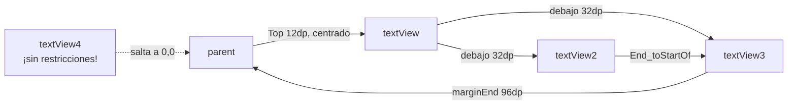

---
tags:
  - android
  - proyecto-profesor
  - nivel/1
  - tema/layouts
aliases:
  - DisenyoConstraint (profesor)
---

# DisenyoConstraint — primeras restricciones

> [!info] Ficha rápida
> **Código:** `android/codigo/AndroidEjemploProyectos/DisenyoConstraint` · **Nivel:** ⭐
> **PDF:** [2 — Constraint](../03-pdfs/04-constraint.md) · **Concepto:** [03 — ConstraintLayout](../02-conceptos/03-constraintlayout.md)
> **Anterior:** [MyApplication](MyApplication.md) · **Siguiente:** [DisenyoPesos](DisenyoPesos.md)

## 1. Objetivo del proyecto

Es un **boceto de prácticas** con `ConstraintLayout`. El Java es idéntico al de la plantilla; todo lo interesante está en `activity_main.xml`. Ahí hay cuatro `TextView` colocados con distintos tipos de restricción, **incluido un error típico** (una vista sin restricciones).

> [!note] Relación con el PDF
> El PDF [2-constraint](../03-pdfs/04-constraint.md) pide reconstruir con `ConstraintLayout` el menú de [DisenyoPesos](DisenyoPesos.md). Este proyecto **no llega a hacerlo**: es la prueba previa en clase para aprender a atar vistas. El menú completo con constraint no está en ningún proyecto del profesor.

## 2. Qué aprende el alumno

- Atar una vista a los bordes del padre (`parent`) y a otras vistas (`@+id/...`).
- Centrar horizontalmente (`Start` y `End` al padre).
- Colocar una vista **debajo** de otra (`Top_toBottomOf`).
- El *bias* vertical (`layout_constraintVertical_bias`).
- Qué pasa si una vista **no tiene restricciones** (`tools:layout_editor_absoluteX/Y`).

## 3. Estructura

| Tipo | Archivo | Descripción |
|---|---|---|
| Clase | `MainActivity.java` | Igual que [MyApplication](MyApplication.md): solo carga el layout |
| Layout | `activity_main.xml` | 4 `TextView` con restricciones |
| Manifest | `AndroidManifest.xml` | Plantilla: solo `MainActivity` (LAUNCHER) |
| Gradle | `app/build.gradle.kts` | Plantilla (compileSdk 37, minSdk 24) |

## 4. Flujo de funcionamiento

1. Se abre `MainActivity` (LAUNCHER).
2. `onCreate` → `EdgeToEdge.enable` → `setContentView(R.layout.activity_main)`.
3. Se dibujan los 4 textos donde dicen sus restricciones.
4. No hay interacción: el proyecto es solo visual.



## 5. Clases

### Clase: `MainActivity`

Idéntica a la de [MyApplication](MyApplication.md) (§6): `onCreate` con el bloque EdgeToEdge. No tiene variables ni otros métodos.

## 6. Layouts

### Layout: `activity_main.xml`

**Para qué sirve:** practicar restricciones.

| Componente | ID | Restricciones | Resultado |
|---|---|---|---|
| `ConstraintLayout` | `main` | — | Contenedor raíz |
| `TextView` | `textView` | Top→parent (12dp), Start/End→parent | Arriba y centrado. Tamaño fijo `97dp x 22dp` |
| `TextView` | `textView2` | Top→bottom de `textView` (32dp), Bottom→parent, Start→parent, **End→start de `textView3`**, `vertical_bias 0.04` | Debajo del primero, a la izquierda de `textView3` |
| `TextView` | `textView3` | Top→bottom de `textView`, Bottom→parent, End→parent (marginEnd 96dp), `vertical_bias 0.04` | Debajo del primero, hacia la derecha |
| `TextView` | `textView4` | **ninguna** (solo `tools:layout_editor_absoluteX/Y`) | En el editor sale en (165, 273); **en el móvil sale arriba a la izquierda** |

**Atributos importantes:**
- `app:layout_constraintTop_toBottomOf="@+id/textView"`: "mi borde de arriba se pega al borde de abajo de `textView`".
- `app:layout_constraintEnd_toStartOf="@+id/textView3"`: "mi final se pega al principio de `textView3`". Como `textView2` también tiene `Start→parent`, queda **centrado entre** el borde izquierdo y `textView3`.
- `layout_constraintVertical_bias="0.04"`: como la vista está atada arriba (`textView`) y abajo (`parent`), se colocaría en el centro. El *bias* 0.04 la desplaza al 4 % del recorrido, es decir, casi arriba del todo.
- `android:layout_marginTop="32dp"`: separación respecto a lo que tiene atado arriba.

> [!warning] ⚠️ Cuidado: `textView4` no tiene restricciones
> `tools:layout_editor_absoluteX="165dp"` es **solo para el editor**; en el móvil se ignora. Una vista sin restricciones en un `ConstraintLayout` se coloca en la esquina superior izquierda (0,0). Android Studio lo avisa con *"This view is not constrained"*. **Solución:** añade al menos una restricción horizontal y otra vertical. Con el botón *Infer Constraints* (varita mágica) el editor las pone por ti.

> [!warning] ⚠️ Cuidado: tamaños fijos (`97dp x 22dp`)
> Si el texto crece (otro idioma, fuente grande) se corta. Prefiere `wrap_content`, o `0dp` (*match constraint*) si quieres que ocupe el hueco entre dos restricciones.

> [!success] ✅ Reutilizable: dos vistas en fila bajo un título
> ```xml
> <TextView android:id="@+id/tvTitulo"
>     android:layout_width="wrap_content" android:layout_height="wrap_content"
>     android:layout_marginTop="16dp" android:text="@string/titulo"
>     app:layout_constraintTop_toTopOf="parent"
>     app:layout_constraintStart_toStartOf="parent"
>     app:layout_constraintEnd_toEndOf="parent" />
>
> <TextView android:id="@+id/tvIzq"
>     android:layout_width="0dp" android:layout_height="wrap_content"
>     android:layout_marginTop="16dp" android:text="@string/izquierda"
>     app:layout_constraintTop_toBottomOf="@id/tvTitulo"
>     app:layout_constraintStart_toStartOf="parent"
>     app:layout_constraintEnd_toStartOf="@id/tvDer" />
>
> <TextView android:id="@+id/tvDer"
>     android:layout_width="0dp" android:layout_height="wrap_content"
>     android:layout_marginTop="16dp" android:text="@string/derecha"
>     app:layout_constraintTop_toBottomOf="@id/tvTitulo"
>     app:layout_constraintStart_toEndOf="@id/tvIzq"
>     app:layout_constraintEnd_toEndOf="parent" />
> ```
> `tvIzq` y `tvDer` se atan **entre sí**, así que forman una *cadena* (chain) y se reparten el ancho a partes iguales.

## 7. Manifest y Gradle

Idénticos a la plantilla: ver [MyApplication §8–9](MyApplication.md).

## 8. Ejercicios

1. Arregla `textView4`: átalo debajo de `textView2` y céntralo horizontalmente.
2. Cambia `vertical_bias` de `textView2` a `0.5` y a `1`. ¿Qué pasa?
3. Rehaz la **cabecera** de [DisenyoPesos](DisenyoPesos.md) (título y subtítulo centrados) usando solo `ConstraintLayout`.
4. (Reto del PDF) Rehaz la rejilla 2×3 de botones de DisenyoPesos con `ConstraintLayout` y cadenas.

## Relacionado

- [03 — ConstraintLayout](../02-conceptos/03-constraintlayout.md)
- [Nivel 2 de ejercicios — Diseños XML](../07-ejercicios/02-nivel-2-disenos-xml.md)
- Tu versión: [anclados](../05-proyectos-alumno/anclados.md)
