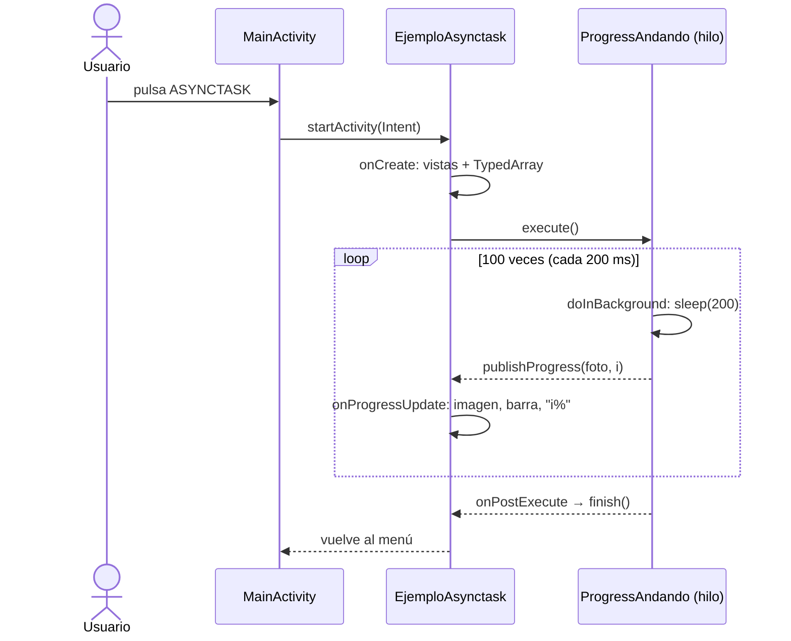

---
tags:
  - android
  - proyecto-profesor
  - nivel/2
  - tema/layouts
  - tema/hilos
aliases:
  - DisenyoPesos (profesor)
---

# DisenyoPesos — menú por pesos, "toast" personalizado y AsyncTask

> [!info] Ficha rápida
> **Código:** `android/codigo/AndroidEjemploProyectos/DisenyoPesos` · **Nivel:** ⭐⭐
> **PDFs:** [Diseño basado en pesos](../03-pdfs/02-diseno-basado-en-pesos.md) → [Toast personalizado](../03-pdfs/05-toast-personalizado.md) → [AsyncTask](../03-pdfs/06-asynctask.md)
> **Conceptos:** [02 Pesos](../02-conceptos/02-diseno-basado-en-pesos.md) · [15 Drawables](../02-conceptos/15-drawables-formas-y-selectores.md) · [04 Toast personalizado](../02-conceptos/04-toast-personalizado.md) · [05 AsyncTask](../02-conceptos/05-asynctask-e-hilos.md)
> **Tu versión:** [Diseobesos](../05-proyectos-alumno/Diseobesos.md) · [EjercicioDiseno](../05-proyectos-alumno/EjercicioDiseno.md)

## 1. Objetivo del proyecto

Es **el proyecto que acompaña a tres PDFs seguidos**. Cada PDF parte del proyecto como lo dejó el anterior:

1. **Diseño por pesos:** un menú del "Centro de Estudios Almi" con cabecera, rejilla de 6 botones-imagen (2 columnas × 3 filas) y pie, todo repartido con `layout_weight`. Fondo degradado, cabecera con borde redondeado y botones que cambian de imagen al pulsarlos.
2. **Toast personalizado:** el botón **TOAST** muestra un aviso flotante propio (imagen + texto) hecho con un `Dialog` sin fondo.
3. **AsyncTask:** el botón **ASYNCTASK** abre otra pantalla donde un muñeco "anda" (cambian las imágenes) mientras avanza una barra de progreso. Al llegar al final, la pantalla se cierra sola.

Los otros 4 botones (ADAPTER, FRAME BY FRAME, TWEEN, PROPERTY) están dibujados pero **no hacen nada**: son huecos para temas posteriores.

## 2. Qué aprende el alumno

- `LinearLayout` anidados + `layout_weight` + `0dp` para repartir la pantalla en proporciones.
- Drawables XML: `<shape>` con degradado (`fondo.xml`), `<shape>` con borde y esquinas (`cabecera.xml`) y `<selector>` de estados (`boton_pulsado.xml`).
- Estilos reutilizables con herencia (`cursoTitulo` → `cursoTitulo.subtitulo`) y `dimens.xml`.
- Inflar un layout a mano (`getLayoutInflater().inflate`) y mostrarlo dentro de un `Dialog` transparente.
- Abrir otra Activity con `Intent`.
- `AsyncTask<Void, Integer, Void>`: `doInBackground`, `publishProgress`, `onProgressUpdate` y `onPostExecute`.
- `TypedArray` para recorrer una lista de drawables declarada en XML.
- `ProgressBar` horizontal.

## 3. Estructura del proyecto

```
app/src/main/
├── java/com/example/disenyopesos/
│   ├── MainActivity.java        → menú; botón TOAST (Dialog) y botón ASYNCTASK (Intent)
│   ├── EjemploAsynctask.java    → pantalla de la animación; crea y lanza el hilo
│   └── ProgressAndando.java     → AsyncTask que cambia imagen y progreso
└── res/
    ├── layout/activity_main.xml            → menú por pesos
    ├── layout/activity_ejemplo_asynctask.xml → texto % + barra + imagen
    ├── layout/toast_per.xml                → diseño del "toast" (imagen + texto)
    ├── drawable/fondo.xml · cabecera.xml · boton_pulsado.xml
    ├── drawable/a1.png · a2.png            → imagen normal / pulsada de los botones
    ├── drawable/andando1..4.png            → fotogramas del muñeco
    ├── drawable/logoalmi.jpg
    └── values/strings.xml · dimens.xml · colors.xml · themes.xml · frames.xml
```

| Tipo | Nombre | Descripción |
|---|---|---|
| Clase | `MainActivity` | Menú principal. Programa 2 de los 6 botones |
| Clase | `EjemploAsynctask` | Pantalla de la animación. Expone sus vistas con *getters* para que el hilo las use |
| Clase | `ProgressAndando` | `AsyncTask` que hace 100 pasos de 200 ms |
| Layout | `activity_main.xml` | Cabecera (peso 2) / cuerpo (peso 7) / pie (peso 1) |
| Layout | `activity_ejemplo_asynctask.xml` | `ConstraintLayout`: `tvAnimacion`, `pbAnimacion` e `ivAnimacion` |
| Layout | `toast_per.xml` | `ivToast` (200×200) + `tvToast` (40sp) |
| Drawable | `fondo.xml` | Degradado vertical azul → blanco azulado → azul |
| Drawable | `cabecera.xml` | Rectángulo transparente con borde blanco de 2dp y esquinas de 48dp |
| Drawable | `boton_pulsado.xml` | `state_pressed=true` → `a2`, si no → `a1` |
| Recurso | `frames.xml` | `string-array` `cursos` (sin usar) e `imagenes` (andando1..4) |
| Recurso | `dimens.xml` | `tamanoTitulo 20sp`, `tamanoSubtitulo 10sp`, `espacioTitulo 7dp` |
| Recurso | `themes.xml` | Tema de la app + estilos `cursoTitulo` y `cursoTitulo.subtitulo` |

## 4. Flujo de funcionamiento

1. Se abre `MainActivity`: `onCreate` carga `activity_main.xml` (menú por pesos).
2. Se buscan `btnAsynctask` y `btnToast` y se les pone un `OnClickListener`.
3. **Si el usuario pulsa TOAST:**
   1. Se infla `toast_per.xml` → `vista`.
   2. Se cambia su imagen (`andando1`) y su texto ("DAM ---- 2").
   3. Se crea un `Dialog`, se le pone `vista` como contenido y se hace transparente el fondo de su ventana.
   4. `dialogo.show()`. Se cierra al tocar la imagen (`dismiss()`) o al tocar fuera.
4. **Si el usuario pulsa ASYNCTASK:**
   1. `startActivity(new Intent(..., EjemploAsynctask.class))`.
   2. `EjemploAsynctask.onCreate` carga su layout, obtiene el `TypedArray` de imágenes y las 3 vistas, y configura la barra (0–100).
   3. `new ProgressAndando(this).execute()` arranca el hilo.
   4. En segundo plano, `doInBackground` hace 100 vueltas: duerme 200 ms y llama a `publishProgress(foto, i)`.
   5. En el hilo principal, cada `publishProgress` provoca `onProgressUpdate`, que cambia la imagen, la barra y el texto "i%".
   6. Al acabar (unos 20 s), `onPostExecute` llama a `activity.finish()` → se vuelve al menú.



## 5. Clases

### Clase: `MainActivity`

**Archivo:** `java/com/example/disenyopesos/MainActivity.java` · **Hereda:** `AppCompatActivity`

| Variable (local) | Tipo | Para qué sirve |
|---|---|---|
| `btnAsyncTask` | `ImageButton` | Botón que abre `EjemploAsynctask` |
| `btnToast` | `ImageButton` | Botón que muestra el "toast" |
| `vista` | `View` | El layout `toast_per` ya inflado |
| `dialogo` | `Dialog` (final) | Ventana flotante que contiene `vista` |

| Método | Cuándo se ejecuta | Qué hace |
|---|---|---|
| `onCreate` | Al abrir la pantalla | Carga el menú y programa los 2 botones |
| `onClick` (btnAsyncTask) | Al pulsar ASYNCTASK | Lanza `EjemploAsynctask` |
| `onClick` (btnToast) | Al pulsar TOAST | Construye y muestra el `Dialog` |
| `onClick` (ivToast) | Al tocar la imagen del toast | Cierra el `Dialog` |

#### Método: `onClick` del botón TOAST (comentado)

```java
btnToast.setOnClickListener(new View.OnClickListener() {
    @Override
    public void onClick(View v) {
        // Convierte toast_per.xml en un objeto View. Se pasa null como padre porque
        // la vista aún no pertenece a ninguna pantalla: la meteremos en un Dialog.
        View vista = getLayoutInflater().inflate(R.layout.toast_per, null);

        // Como la vista es nuestra, se puede modificar antes de enseñarla.
        // Ojo: se busca con vista.findViewById, NO con findViewById a secas
        // (a secas buscaría en activity_main y devolvería null).
        ImageView ivToast = vista.findViewById(R.id.ivToast);
        ivToast.setImageResource(R.drawable.andando1);
        TextView tvToast = vista.findViewById(R.id.tvToast);
        tvToast.setText("DAM ---- 2");

        // Un Dialog es una ventana flotante. Se usa en vez de Toast porque
        // Toast.setView() está obsoleto desde Android 11 y ya no muestra vistas propias.
        final Dialog dialogo = new Dialog(MainActivity.this);
        dialogo.setContentView(vista);

        // Quita el recuadro blanco del Dialog para que parezca un aviso flotante.
        if (dialogo.getWindow() != null) {
            dialogo.getWindow().setBackgroundDrawableResource(android.R.color.transparent);
        }
        dialogo.show();

        // Cierre manual: tocar la imagen cierra el aviso.
        ivToast.setOnClickListener(new View.OnClickListener() {
            @Override
            public void onClick(View v) { dialogo.dismiss(); }
        });

        // El PDF cierra el aviso solo a los 2 s con un Handler; aquí está comentado:
        // new Handler(Looper.getMainLooper()).postDelayed(dialogo::dismiss, 2000);
    }
});
```

**Conceptos:** `LayoutInflater`, `Dialog`, clase anónima, `final` (necesario para usar `dialogo` dentro del listener interior). Ver [04 — Toast personalizado](../02-conceptos/04-toast-personalizado.md).

**Errores comunes:**
- `findViewById(R.id.ivToast)` sin `vista.` delante devuelve `null`, porque `ivToast` no está en `activity_main`.
- Olvidar el fondo transparente: sale un recuadro blanco alrededor.

---

### Clase: `EjemploAsynctask`

**Archivo:** `java/com/example/disenyopesos/EjemploAsynctask.java` · **Hereda:** `AppCompatActivity`

**Para qué sirve:** es la pantalla que *se ve*. No anima nada por sí misma: prepara las vistas y **se las presta** al hilo mediante *getters*.

| Variable | Tipo | Para qué sirve |
|---|---|---|
| `imagenes` | `TypedArray` | Lista de drawables `@array/imagenes` (andando1..4) |
| `barra` | `ProgressBar` | Barra `pbAnimacion` (0–100) |
| `imagenCentral` | `ImageView` | `ivAnimacion`, donde se ve el muñeco |
| `texto` | `TextView` | `tvAnimacion`, muestra el porcentaje |

| Método | Cuándo se ejecuta | Qué hace |
|---|---|---|
| `onCreate` | Al abrir la pantalla | Obtiene recursos y vistas, configura la barra y lanza `ProgressAndando` |
| `getImagenes`, `getImagenCentral`, `getTexto`, `getBarra` | Los llama el hilo | Dan acceso a las vistas |
| `setXxx` | Nunca | *Setters* generados, sin uso |
| `finalizar()` | Nunca | Llama a `finish()`; el hilo usa `finish()` directamente |

```java
// Lee <string-array name="imagenes"> de frames.xml como lista de recursos.
imagenes = getResources().obtainTypedArray(R.array.imagenes);
// Solo para depurar: imprime la ruta interna del primer drawable en Logcat (filtro "dam").
Log.d("dam", imagenes.getString(0) + "-------------");

barra = findViewById(R.id.pbAnimacion);
imagenCentral = findViewById(R.id.ivAnimacion);
texto = findViewById(R.id.tvAnimacion);

barra.setMax(100);                     // la barra irá de 0 a 100
barra.setProgress(0);
barra.setBackgroundColor(Color.GRAY);  // fondo gris detrás de la barra

// Crea la tarea pasándole ESTA pantalla, para que pueda llamar a los getters.
ProgressAndando hilo = new ProgressAndando(this);
hilo.execute();                        // arranca: onPreExecute → doInBackground en otro hilo
```

---

### Clase: `ProgressAndando`

**Archivo:** `java/com/example/disenyopesos/ProgressAndando.java`
**Hereda:** `AsyncTask<Void, Integer, Void>`. Los tres tipos genéricos significan:

| Posición | Tipo | Significado |
|---|---|---|
| 1 — *Params* | `Void` | `execute()` no recibe datos |
| 2 — *Progress* | `Integer` | `publishProgress(foto, i)` envía enteros |
| 3 — *Result* | `Void` | `doInBackground` no devuelve nada (`return null`) |

| Variable | Tipo | Para qué sirve |
|---|---|---|
| `activity` | `EjemploAsynctask` | Referencia a la pantalla para tocar sus vistas |

| Método | Hilo | Cuándo | Qué hace |
|---|---|---|---|
| `onPreExecute` | Principal | Antes de empezar | Vacío |
| `doInBackground` | **Secundario** | Tras `execute()` | 100 vueltas: `sleep(200)` + `publishProgress(foto, i)` |
| `onProgressUpdate` | Principal | Tras cada `publishProgress` | Cambia la imagen, la barra y el texto |
| `onPostExecute` | Principal | Cuando `doInBackground` hace `return` | `activity.finish()` |

```java
@Override
protected Void doInBackground(Void... voids) {
    int foto = 0;
    for (int i = 0; i < 100; i++) {
        foto++;
        if (foto >= 3) { foto = 0; }      // índices 1, 2, 0, 1, 2, 0… (ver ⚠️ más abajo)
        try {
            Thread.sleep(200);            // espera sin congelar la pantalla: estamos en otro hilo
            publishProgress(foto, i);     // "avisa" al hilo principal; NO toques vistas aquí
        } catch (InterruptedException e) {
            throw new RuntimeException(e);
        }
    }
    return null;                          // al terminar se ejecutará onPostExecute
}

@Override
protected void onProgressUpdate(Integer... values) {
    // values[0] = foto, values[1] = i (en el mismo orden que publishProgress)
    activity.getImagenCentral().setImageResource(
            activity.getImagenes().getResourceId(values[0], -1));  // -1 si no existe
    activity.getBarra().setProgress(values[1]);
    activity.getTexto().setText(values[1] + "%");
}
```

> [!important] 📌 Importante: la regla de oro de los hilos
> Las vistas **solo** se tocan desde el hilo principal. Por eso `doInBackground` no llama a `setImageResource`, sino a `publishProgress`, y es `onProgressUpdate` (hilo principal) quien pinta. Si tocas una vista en `doInBackground`, la app se cierra con `CalledFromWrongThreadException`. Más en [12 — Hilos a fondo](../02-conceptos/12-hilos-en-profundidad.md).

## 6. Layouts

### Layout: `activity_main.xml` — el menú por pesos

```
LinearLayout vertical (fondo degradado)
├── CABECERA  weight=2  (borde redondeado)  → título + subtítulo (estilos)
├── CUERPO    weight=7
│   ├── FILA 1  weight=1  → [TOAST]      [ASYNCTASK]
│   ├── FILA 2  weight=1  → [ADAPTER]    [FRAME BY FRAME]
│   └── FILA 3  weight=1  → [TWEEN]      [PROPERTY]
└── PIE       weight=1  → www.almi.eus
```
Cada celda es un `LinearLayout` vertical con un `ImageButton` (peso 3) y un `TextView` (peso 1). Es decir: el icono ocupa ¾ de la celda y la etiqueta ¼.

| Componente | ID | Función |
|---|---|---|
| `LinearLayout` raíz | `main` | Vertical, `background="@drawable/fondo"` |
| `TextView` | — | `@string/titulo1` con `style="@style/cursoTitulo"` |
| `TextView` | — | `@string/curso` con `style="@style/cursoTitulo.subtitulo"` |
| `ImageButton` | `btnToast` | Fondo `@drawable/boton_pulsado` |
| `ImageButton` | `btnAsynctask` | Fondo `@drawable/boton_pulsado` |
| 4 × `ImageButton` | (sin id) | Sin funcionalidad |
| `TextView` pie | — | `@string/pie` |

**Atributos importantes:**
- `android:layout_height="0dp"` + `android:layout_weight="2"`: en un `LinearLayout` **vertical** se reparte la **altura**. El `0dp` dice "no calcules mi tamaño, dámelo según el peso". Cabecera 2 + cuerpo 7 + pie 1 = 10 partes; la cabecera se lleva el 20 %.
- En las filas (horizontales) se reparte el **ancho** con `layout_width="0dp"` + `layout_weight="1"` → dos celdas del 50 %.
- `android:gravity="center"`: centra el **contenido** dentro de la vista (≠ `layout_gravity`, que coloca la vista dentro de su padre).
- `style="@style/cursoTitulo.subtitulo"`: el punto significa herencia; hereda todo de `cursoTitulo` y cambia solo `textSize`.

> [!success] ✅ Reutilizable: rejilla de 2 columnas por pesos
> ```xml
> <LinearLayout android:layout_width="match_parent" android:layout_height="0dp"
>     android:layout_weight="1" android:orientation="horizontal">
>     <!-- celda -->
>     <LinearLayout android:layout_width="0dp" android:layout_height="match_parent"
>         android:layout_weight="1" android:orientation="vertical" android:gravity="center">
>         <ImageButton android:id="@+id/btnOpcion1"
>             android:layout_width="match_parent" android:layout_height="0dp"
>             android:layout_weight="3" android:background="@drawable/boton_pulsado"
>             android:contentDescription="@string/opcion1" />
>         <TextView android:layout_width="match_parent" android:layout_height="0dp"
>             android:layout_weight="1" android:gravity="center" android:text="@string/opcion1" />
>     </LinearLayout>
>     <!-- copia la celda para la segunda columna -->
> </LinearLayout>
> ```

### Layout: `activity_ejemplo_asynctask.xml`

| Componente | ID | Función |
|---|---|---|
| `TextView` | `tvAnimacion` | Porcentaje ("37%") |
| `ProgressBar` | `pbAnimacion` | `style="?android:attr/progressBarStyleHorizontal"` → barra horizontal, no ruedita |
| `ImageView` | `ivAnimacion` | Muñeco; empieza con `andando1` (`app:srcCompat`) |

Los tres encadenados de arriba abajo con `ConstraintLayout`. Se conecta con `setContentView(R.layout.activity_ejemplo_asynctask)` en `EjemploAsynctask`.

### Layout: `toast_per.xml`

| Componente | ID | Función |
|---|---|---|
| `LinearLayout` vertical, `padding 16dp` | — | Contenedor del aviso |
| `ImageView` 200×200 | `ivToast` | Logo (por defecto `logoalmi`) |
| `TextView` 40sp | `tvToast` | Texto (por defecto "Almi") |

No lo carga una Activity, sino el código: `getLayoutInflater().inflate(R.layout.toast_per, null)`.

### Drawables XML

```xml
<!-- boton_pulsado.xml: el primer item cuyo estado coincida gana; por eso "pulsado" va primero -->
<selector>
    <item android:state_pressed="true"  android:drawable="@drawable/a2"/>
    <item android:state_pressed="false" android:drawable="@drawable/a1"/>
</selector>

<!-- fondo.xml: degradado de arriba (270°) a abajo, con un color central -->
<shape android:shape="rectangle">
    <gradient android:startColor="#00bfff" android:centerColor="#e0f8f7"
              android:endColor="#00bfff" android:angle="270"/>
</shape>

<!-- cabecera.xml: "marco" transparente con borde blanco y esquinas redondeadas -->
<shape android:shape="rectangle">
    <solid android:color="@android:color/transparent"/>
    <padding android:left="8dp" android:right="8dp" android:top="2dp" android:bottom="2dp"/>
    <corners android:radius="48dp"/>
    <stroke android:color="@color/white" android:width="2dp"/>
</shape>
```
✅ Los tres son reutilizables tal cual: cambia colores e imágenes. Explicación completa en [15 — Drawables](../02-conceptos/15-drawables-formas-y-selectores.md).

## 7. Manifest

Declara `MainActivity` (LAUNCHER) y `EjemploAsynctask` (`exported="false"`: solo la abre esta app). Sin permisos. Si se borra la declaración de `EjemploAsynctask`, al pulsar ASYNCTASK la app se cierra con `ActivityNotFoundException`.

## 8. Gradle

Plantilla sin librerías extra. `AsyncTask` viene en el propio Android (`android.os.AsyncTask`), no hace falta ninguna dependencia. Ver [MyApplication](MyApplication.md) §9.

## 9. ⚠️ Bugs, código antiguo y mejoras

> [!warning] ⚠️ Cuidado: `andando4` nunca se ve
> `foto` recorre 1, 2, 0, 1, 2, 0… (se reinicia al llegar a 3), así que solo se usan los índices 0–2 de 4 imágenes. **Arreglo:** `foto = (foto + 1) % imagenes.length()`, o `if (foto >= 4)`.

> [!warning] ⚠️ Cuidado: `AsyncTask` está obsoleto (deprecated desde API 30)
> Sigue funcionando y es lo que pide el temario, pero hoy se usa `ExecutorService` + `Handler`, o corrutinas en Kotlin. Además, la tarea guarda una referencia fuerte a la Activity: si el usuario pulsa *Atrás*, el hilo sigue 20 s pintando en una pantalla ya cerrada (fuga de memoria). **Mejora:** guarda el `AsyncTask` en un atributo y llama a `cancel(true)` en `onDestroy()`. Alternativa moderna en [20 — Executors y LiveData](../02-conceptos/20-executors-y-livedata.md) y [Código reutilizable → Utilidades](../06-codigo-reutilizable/09-utilidades.md).

> [!warning] ⚠️ Cuidado: el `TypedArray` no se recicla
> `obtainTypedArray` reserva memoria que hay que liberar con `imagenes.recycle()` cuando ya no se usa (por ejemplo, en `onPostExecute` o en `onDestroy`). Compáralo con `DetalleActivity` de [AdapterDam2](AdapterDam2.md), que sí lo hace.

> [!warning] ⚠️ Cuidado: la barra termina en 99 %
> El bucle va de `i = 0` a `99`. Para terminar en 100 %, usa `publishProgress(foto, i + 1)`.

> [!tip] 💡 Recomendación
> - Añade `android:contentDescription` a los `ImageButton` (accesibilidad; Android Studio lo avisa).
> - `setXxx()` y `finalizar()` sobran: son código muerto.
> - Los colores `rojo`, `gris` y `verde` y el array `cursos` no se usan.

## 10. Fragmentos reutilizables

- ✅ Menú en rejilla por pesos → arriba, §6.
- ✅ Selector de botón pulsado / degradado / marco redondeado → §6.
- ✅ "Toast" personalizado con `Dialog` → [Código reutilizable → Mensajes](../06-codigo-reutilizable/04-mensajes-toast-dialogos.md).
- ✅ Tarea en segundo plano con progreso → [Código reutilizable → Utilidades](../06-codigo-reutilizable/09-utilidades.md).

## 11. Ejercicios

1. Haz que el "toast" se cierre solo a los 2 s (descomenta y adapta el `Handler`).
2. Arregla el bug para que se vean las 4 imágenes.
3. Da funcionalidad al botón **FRAME BY FRAME** con una `AnimationDrawable` (ver [06 — Frame by frame](../02-conceptos/06-animaciones-frame-by-frame.md)).
4. Muestra un `Toast` "Tarea finalizada" en `onPostExecute` (como en el PDF).
5. Pasa un texto de `MainActivity` a `EjemploAsynctask` con `putExtra` y muéstralo en `tvAnimacion` antes de empezar.

## Relacionado

- [EjercicioAsyncTaskAlumnos](EjercicioAsyncTaskAlumnos.md): el mismo patrón AsyncTask con un caballo
- [Nivel 2](../07-ejercicios/02-nivel-2-disenos-xml.md) y [Nivel 4](../07-ejercicios/04-nivel-4-toast-asynctask-animaciones-transiciones.md) de ejercicios
