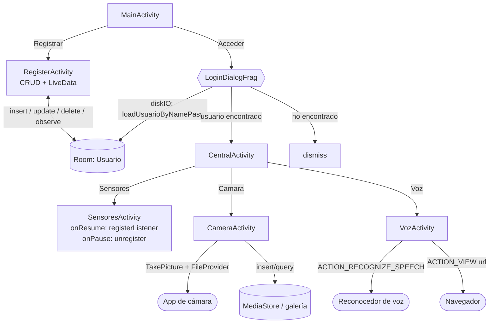

---
tags:
  - android
  - proyecto-profesor
  - nivel/5
  - tema/dialogos
  - tema/room
  - tema/sensores
  - tema/camara
  - tema/voz
aliases:
  - EjemploDialogoPersonalizado (profesor)
  - Login Room Sensores Cámara Voz
---

# EjemploDialogoPersonalizado — login, Room, sensores, cámara y voz

> [!info] Ficha rápida
> **Código:** `android/codigo/AndroidEjemploProyectos/EjemploDialogoPersonalizado` · **Nivel:** ⭐⭐⭐⭐⭐
> **PDFs (en este orden):** [1 — Diálogo personalizado y SQLite](../03-pdfs/12-dialogo-sqlite-personalizado.md) → [2 — Sensores](../03-pdfs/13-sensores.md) → [3 — Cámara y almacenamiento](../03-pdfs/14-camara-y-almacenamiento.md) → [4 — Voz](../03-pdfs/15-voz.md)
> **Conceptos:** [18 Diálogos](../02-conceptos/18-dialogos.md) · [17 Room](../02-conceptos/17-room-base-de-datos.md) · [20 Executors y LiveData](../02-conceptos/20-executors-y-livedata.md) · [19 TextWatcher](../02-conceptos/19-textwatcher-y-eventos-de-lista.md) · [21 Sensores](../02-conceptos/21-sensores.md) · [22 Cámara](../02-conceptos/22-camara-y-almacenamiento.md) · [23 Voz](../02-conceptos/23-voz-e-intents-implicitos.md) · [24 Permisos](../02-conceptos/24-manifest-y-permisos.md)
> **Tu versión (solo login/registro, muy detallada):** [EjemploDialogoPersonalizado (alumno)](../05-proyectos-alumno/EjemploDialogoPersonalizado.md)

## 1. Objetivo del proyecto

Es **el proyecto "vivo" del segundo bloque del curso**: cada PDF nuevo le añade una pantalla. Hoy tiene:

| Pantalla | Qué hace | PDF |
|---|---|---|
| `MainActivity` | "FP Almi" + botones **Acceder** y **Registrar** | 1 |
| `LoginDialogFrag` | Diálogo propio (logo + usuario + contraseña) que comprueba el login contra la BD | 1 |
| `RegisterActivity` | CRUD de usuarios: alta, edición (tocar fila), borrado (pulsación larga + `AlertDialog`), validación de contraseñas con `TextWatcher`, lista con `LiveData` | 1 |
| `CentralActivity` | Menú tras el login: **Sensores**, **Voz**, **Camara**, **Volley** (sin programar) | 1–4 |
| `SensoresActivity` | "Cerca/Lejos" (proximidad) e "Izquierda/Derecha" (giroscopio) | 2 |
| `CameraActivity` | Saca fotos con la app de cámara, las copia a la galería y las muestra en una rejilla | 3 |
| `VozActivity` | Dictado por voz a un `EditText` + búsqueda en Google | 4 |

## 2. Qué aprende el alumno

- **Diálogos:** `DialogFragment` con layout propio frente a `AlertDialog.Builder`.
- **Room completo:** entidad con `@Ignore`, DAO con consulta de login, Singleton y `LiveData`.
- **Hilos:** `AppExecutors` (disco → principal).
- **Eventos:** `OnItemClick`, `OnItemLongClick` y `TextWatcher`.
- **Sensores:** `SensorManager`, `Sensor`, `SensorEventListener`, y registrar en `onResume` / liberar en `onPause`.
- **Activity Result API:** `registerForActivityResult` con los contratos `TakePicture`, `RequestPermission` y `StartActivityForResult`.
- **Almacenamiento:** carpeta privada (`getExternalFilesDir`), `FileProvider` y `content://`, `MediaStore` + `ContentResolver` (insert/query/update), `IS_PENDING` y *scoped storage*.
- **Permisos:** `uses-feature`, permiso con `maxSdkVersion` y permiso en tiempo de ejecución solo en versiones antiguas.
- **Intents implícitos:** `RecognizerIntent.ACTION_RECOGNIZE_SPEECH` y `Intent.ACTION_VIEW` con una URL.

## 3. Estructura

```
java/com/example/ejemplodialogopersonalizado/
├── MainActivity.java            → Acceder (muestra LoginDialogFrag) / Registrar
├── RegisterActivity.java        → CRUD usuarios
├── CentralActivity.java         → menú Sensores / Voz / Cámara
├── SensoresActivity.java        → proximidad + giroscopio
├── CameraActivity.java          → foto + galería
├── VozActivity.java             → reconocimiento de voz + búsqueda web
├── fragmentos/LoginDialogFrag.java      → DialogFragment de login
├── adaptadores/UsuariosAdapter.java     → ArrayAdapter<Usuario> (simple_list_item_1)
├── adaptadores/FotosGridViewAdapter.java → BaseAdapter de Uri con Glide
├── bbdd/AppDatabase.java · UsuariosDao.java · AppExecutors.java
└── model/Usuario.java           → @Entity
res/
├── layout/ activity_main · dialog_personalizado · activity_register · activity_central
│           activity_sensores · activity_camera · item_foto · activity_voz
├── xml/file_paths.xml           → carpetas que puede compartir el FileProvider
└── drawable/logo_almi.jpg
```

## 4. Flujo de funcionamiento



**Paso a paso del camino principal:**
1. `MainActivity` → **Registrar** → `RegisterActivity.onCreate` obtiene la BD, monta el `ListView` con un `UsuariosAdapter` vacío y llama a `consultarUsuarios()` (observa `loadAllUsuarios()`). En cuanto Room responde, la lista se rellena.
2. El usuario escribe usuario, contraseña y repetición. El `TextWatcher` de la repetición **desactiva Nuevo y pinta el campo de rojo** mientras no coincidan.
3. **Nuevo** → `guardarUsuario` → `insertUsuario` en `diskIO` → Room avisa al `LiveData` → la lista se refresca sola.
4. Atrás → **Acceder** → `new LoginDialogFrag().show(getSupportFragmentManager(), "Login")`.
5. **Aceptar** → en `diskIO`: `loadUsuarioByNamePass(nombre, pass)` → luego en "`mainThread`" (⚠️ §9): si existe → `CentralActivity`; si no → `dismiss()`.
6. En `CentralActivity`, cada botón abre su pantalla con un `Intent` explícito.

## 5. Clases — Login y Registro

> Explicación línea a línea del login y el registro (muy completa): [EjemploDialogoPersonalizado (alumno)](../05-proyectos-alumno/EjemploDialogoPersonalizado.md). Aquí va el resumen más lo que cambia en la versión del profesor.

### `Usuario` (entidad)

| Variable | Tipo | Notas |
|---|---|---|
| `id` | `int` | `@PrimaryKey(autoGenerate = true)` |
| `usuario` | `String` | Nombre de usuario |
| `password` | `String` | ⚠️ En texto plano |

```java
public Usuario() { }                        // Room usa ESTE (vacío) + setters para leer filas

@Ignore                                     // "Room, ignora este constructor": es solo para nosotros
public Usuario(String usuario, String password) { ... }
```
> [!important] 📌 Importante: `@Ignore` en el constructor
> Si una entidad tiene **dos** constructores, Room no sabe cuál usar y da un error de compilación. `@Ignore` marca el que Room debe ignorar. En [EjercicioPokemon](EjercicioPokemon.md) solo hay un constructor, por eso allí no hace falta.

### `UsuariosDao`

| Método | Consulta | Devuelve | Se usa en |
|---|---|---|---|
| `loadAllUsuarios()` | `SELECT * FROM Usuario ORDER BY id` | `LiveData<List<Usuario>>` | `RegisterActivity.consultarUsuarios` |
| `insertUsuario(u)` | `@Insert` | `void` | `guardarUsuario` |
| `updateUsuario(u)` | `@Update` | `void` | `actualizar` |
| `delete(u)` | `@Delete` | `void` | `eliminar` |
| `loadUsuarioById(id)` | `… WHERE id = :id` | `Usuario` | `actualizar`, `eliminar` |
| `loadUsuarioByNamePass(usu, pass)` | `… WHERE usuario = :usu AND password = :pass` | `Usuario` o `null` | `LoginDialogFrag` |

### `LoginDialogFrag extends DialogFragment`

| Variable | Tipo | Para qué sirve |
|---|---|---|
| `etNombre`, `etPassword` | `EditText` | Campos `etUser` / `etPassword` |
| `btnAceptar`, `btnCancelar` | `Button` | Botones del diálogo |
| `mDb` | `AppDatabase` | BD |

| Método | Cuándo | Qué hace |
|---|---|---|
| `onCreateDialog` | Al crear la ventana | Crea el `Dialog` y le pone el título "Login" |
| `onCreateView` | Al crear la vista | Infla `dialog_personalizado.xml` |
| `onViewCreated` | Con la vista lista | Busca las vistas y programa Aceptar/Cancelar |
| `onCancel`, `onDetach` | Al cancelar / separarse | Solo llaman a `super` |

```java
btnAceptar.setOnClickListener(v -> {
    String nombre = etNombre.getText().toString();
    String password = etPassword.getText().toString();
    // 1) Consultar la BD FUERA del hilo principal (Room lo exige para consultas no-LiveData).
    AppExecutors.getInstance().getDiskIO().execute(() -> {
        final Usuario usu = mDb.usuariosDao().loadUsuarioByNamePass(nombre, password);
        // 2) "Volver" al hilo principal para tocar la interfaz… (⚠️ ver §9: no vuelve de verdad)
        AppExecutors.getInstance().getMainThread().execute(() -> {
            if (usu != null) {
                startActivity(new Intent(getContext(), CentralActivity.class));
            } else {
                // Toast.makeText(getContext(), "Usuario o contraseña no válidas", ...).show();
                dismiss();
            }
        });
    });
});
```

### `RegisterActivity`

| Variable | Tipo | Para qué sirve |
|---|---|---|
| `lvUsers` | `ListView` | Lista de usuarios |
| `btnRegistrarNuevo`, `btnUpdateUsuario` | `Button` | Nuevo / Actualizar |
| `etNombre`, `etPassword`, `etRePassword` | `EditText` | Formulario |
| `mDb` | `AppDatabase` | BD |
| `usuariosAdapter` | `UsuariosAdapter` | Adaptador de la lista |
| `idUsuario` | `int` (-1) | Id del usuario seleccionado para actualizar |

| Método | Cuándo | Qué hace |
|---|---|---|
| `onCreate` | Al abrir | Todo el montaje + `consultarUsuarios()` |
| `onItemClick` | Toque en fila | Carga el usuario en el formulario y guarda `idUsuario` |
| `onItemLongClick` | Pulsación larga | `AlertDialog` "¿Seguro…?" → `eliminar(id)` o Toast "No se ha eliminado"; `return true` |
| `afterTextChanged` (TextWatcher) | Al cambiar `etRePassword` | Activa/desactiva Nuevo y colorea el campo |
| `guardarUsuario(user, pass)` | Nuevo | `insertUsuario` en disco |
| `actualizar(id, user, pass)` | Actualizar | Busca por id y `updateUsuario` |
| `eliminar(id)` | Tras confirmar | Busca por id y `delete` |
| `consultarUsuarios()` | `onCreate` | `observe` → `setmUsuarioList` |

```java
lvUsers.setOnItemLongClickListener((parent, view, position, id) -> {
    final int idEliminar = usuariosAdapter.getItem(position).getId();
    AlertDialog.Builder alerta = new AlertDialog.Builder(RegisterActivity.this); // patrón Builder
    alerta.setTitle("Advertencia");
    alerta.setMessage("¿Estás seguro de que deseas eliminar el usuario?");
    alerta.setPositiveButton("si", (dialog, which) -> eliminar(idEliminar));
    alerta.setNegativeButton("no", (dialog, which) ->
            Toast.makeText(getApplicationContext(), "No se ha eliminado", Toast.LENGTH_SHORT).show());
    alerta.show();
    return true;   // "consumido": sin esto, al soltar se dispararía también onItemClick
});

etRePassword.addTextChangedListener(new TextWatcher() {
    @Override
    public void afterTextChanged(Editable s) {          // tras cada letra escrita o borrada
        boolean iguales = etPassword.getText().toString().equals(etRePassword.getText().toString());
        btnRegistrarNuevo.setEnabled(iguales);           // no deja registrar si no coinciden
        etRePassword.setBackgroundColor(iguales ? Color.WHITE : Color.RED);
    }
    @Override public void beforeTextChanged(CharSequence s, int a, int b, int c) { }
    @Override public void onTextChanged(CharSequence s, int a, int b, int c) { }
});
```

### `UsuariosAdapter extends ArrayAdapter<Usuario>`

Guarda su propia `List<Usuario>` y la cambia con `setmUsuarioList(lista)` + `notifyDataSetChanged()`. Así **reutiliza** el mismo adaptador cada vez que el `LiveData` avisa (mejor que en [EjercicioPokemon](EjercicioPokemon.md)). Cada fila usa el layout **del sistema** `android.R.layout.simple_list_item_1` (un único `TextView` con id `android.R.id.text1`).

### `CentralActivity`

Tres `Button` (`btnSensores`, `btnCamara`, `btnVoz`) y tres `Intent` explícitos. El layout tiene un cuarto botón, `btnVolley`, **sin listener**: queda reservado para el tema de peticiones HTTP con Volley (el PDF 1 ya lo dibuja).

## 6. Clases — Sensores

### `SensoresActivity`

| Variable | Tipo | Para qué sirve |
|---|---|---|
| `sensorManager` | `SensorManager` | Servicio del sistema que da acceso a los sensores |
| `proximitySensor` / `gyroscopeSensor` | `Sensor` | El sensor concreto (o `null` si el móvil no lo tiene) |
| `proximityListener` / `gyroscopeListener` | `SensorEventListener` | Qué hacer al llegar cada lectura |
| `tvProximidad` / `tvGiroscopio` | `TextView` | Donde se muestra el resultado |

| Método | Cuándo | Qué hace |
|---|---|---|
| `onCreate` | Al abrir | Obtiene el `SensorManager`, los sensores y crea los listeners |
| `onResume` | Al volver a primer plano (también tras `onCreate`) | `registerListener` de cada sensor que exista |
| `onPause` | Al dejar de estar en primer plano | `unregisterListener` de ambos |
| `onSensorChanged(SensorEvent)` | Con cada lectura | Actualiza el texto |
| `onAccuracyChanged` | Si cambia la precisión | Vacío (obligatorio por la interfaz) |

```java
sensorManager = (SensorManager) getSystemService(SENSOR_SERVICE);  // servicio del sistema (casteo necesario)
proximitySensor = sensorManager.getDefaultSensor(Sensor.TYPE_PROXIMITY);
if (proximitySensor == null) Log.e("SENSORES", "No existe sensor de proximidad");  // no todos los móviles lo tienen

proximityListener = new SensorEventListener() {
    @Override
    public void onSensorChanged(SensorEvent event) {
        // values[0] = distancia en cm. Muchos sensores solo dan 2 valores: 0 (cerca) o el máximo (lejos).
        tvProximidad.setText(event.values[0] < proximitySensor.getMaximumRange() ? "Cerca" : "Lejos");
    }
    @Override public void onAccuracyChanged(Sensor sensor, int accuracy) { }
};

gyroscopeListener = new SensorEventListener() {
    @Override
    public void onSensorChanged(SensorEvent event) {
        // values[2] = VELOCIDAD de giro (rad/s) sobre el eje Z. No es la posición:
        // mientras giras sale Izquierda/Derecha; al parar, el texto se queda con el último valor.
        if (event.values[2] > 0.5f)       tvGiroscopio.setText("Izquierda");
        else if (event.values[2] < -0.5f) tvGiroscopio.setText("Derecha");
    }
    @Override public void onAccuracyChanged(Sensor sensor, int accuracy) { }
};

@Override
protected void onResume() {
    super.onResume();
    // Registrar solo mientras la pantalla se ve: los sensores gastan batería.
    if (proximitySensor != null)
        sensorManager.registerListener(proximityListener, proximitySensor, SensorManager.SENSOR_DELAY_NORMAL);
    if (gyroscopeSensor != null)
        sensorManager.registerListener(gyroscopeListener, gyroscopeSensor, SensorManager.SENSOR_DELAY_NORMAL);
}

@Override
protected void onPause() {
    super.onPause();
    sensorManager.unregisterListener(proximityListener);   // ¡imprescindible! si no, sigue leyendo en segundo plano
    sensorManager.unregisterListener(gyroscopeListener);
}
```

**Probarlo en el emulador:** `⋮` (Extended Controls) → **Virtual sensors** → *Additional sensors* → deslizador **Proximity**. Para el giroscopio: pestaña *Device Pose* → mover el deslizador **Z-Rot**.

## 7. Clases — Cámara y almacenamiento

### `CameraActivity`

| Variable | Tipo | Para qué sirve |
|---|---|---|
| `ivFoto` | `ImageView` | Última foto a tamaño grande |
| `fotoActual` | `File` | Archivo donde la cámara escribe la foto en curso |
| `tomarFotoLauncher` | `ActivityResultLauncher<Uri>` | Lanza la cámara y recibe si hubo éxito |
| `permisoLauncher` | `ActivityResultLauncher<String>` | Pide `WRITE_EXTERNAL_STORAGE` (solo Android ≤ 9) |
| `gvMiniaturas` | `GridView` | Galería de miniaturas |
| `fotos` | `List<Uri>` (final) | Uris de las fotos en `MediaStore` |
| `adapter` | `FotosGridViewAdapter` | Adaptador del grid |

| Método | Cuándo | Qué hace |
|---|---|---|
| `onCreate` | Al abrir | Registra los **dos launchers** (¡aquí, no en un clic!), monta el grid y carga la galería |
| `abrirCamara()` | Botón *Sacar Foto* | Si Android < 10 y falta el permiso, lo pide; si no, `lanzarCamara()` |
| `lanzarCamara()` | Tras comprobar permisos | Crea el `File` en la carpeta privada, obtiene su `Uri` del `FileProvider` y lanza la cámara |
| callback de `TakePicture` | Al volver de la cámara | Si hay éxito: copia a la galería, muestra la foto y recarga el grid |
| `guardarEnGaleria(File)` | Tras la foto | Inserta en `MediaStore` y copia los bytes (con `IS_PENDING` en Android 10+) |
| `cargarImagenes()` | Al abrir y tras cada foto | Consulta a `MediaStore` las imágenes `foto_%` más recientes |

```java
// ── onCreate: registrar los launchers ANTES de que la Activity esté visible ──
tomarFotoLauncher = registerForActivityResult(new ActivityResultContracts.TakePicture(), exito -> {
    if (Boolean.TRUE.equals(exito) && fotoActual != null) {   // exito es Boolean (puede ser null)
        guardarEnGaleria(fotoActual);                         // copia pública (galería)
        Glide.with(CameraActivity.this).load(fotoActual).into(ivFoto);  // Glide reduce la foto grande
        cargarImagenes();                                     // refresca miniaturas
    }
});
permisoLauncher = registerForActivityResult(new ActivityResultContracts.RequestPermission(), concedido -> {
    if (Boolean.TRUE.equals(concedido)) lanzarCamara();
    else Toast.makeText(this, "Sin permiso no se puede guardar en galería", Toast.LENGTH_SHORT).show();
});

// ── lanzarCamara ──
File carpeta = getExternalFilesDir(Environment.DIRECTORY_PICTURES); // .../Android/data/<paquete>/files/Pictures (privada, sin permisos)
String nombre = "foto_" + new SimpleDateFormat("yyyyMMdd_HHmmss", Locale.getDefault()).format(new Date()) + ".jpg";
fotoActual = new File(carpeta, nombre);
// La cámara es OTRA app: no puede escribir en una ruta privada nuestra. El FileProvider
// crea una Uri content:// que le da permiso temporal SOLO para ese archivo.
Uri uri = FileProvider.getUriForFile(this, getPackageName() + ".fileprovider", fotoActual);
tomarFotoLauncher.launch(uri);
```

```java
// ── guardarEnGaleria: copiar el archivo privado al MediaStore (galería del sistema) ──
ContentValues valores = new ContentValues();
valores.put(MediaStore.Images.Media.DISPLAY_NAME, archivo.getName());   // "foto_2026....jpg"
valores.put(MediaStore.Images.Media.MIME_TYPE, "image/jpeg");
if (Build.VERSION.SDK_INT >= Build.VERSION_CODES.Q) {
    valores.put(MediaStore.Images.Media.IS_PENDING, 1);   // "escribiendo, no la enseñes aún"
}
Uri destino = getContentResolver().insert(MediaStore.Images.Media.EXTERNAL_CONTENT_URI, valores);
if (destino == null) return;
try (InputStream in = new FileInputStream(archivo);                        // try-with-resources:
     OutputStream out = getContentResolver().openOutputStream(destino)) { // cierra los flujos solo
    byte[] buffer = new byte[8192];
    int leidos;
    while ((leidos = in.read(buffer)) > 0) out.write(buffer, 0, leidos);   // copia en bloques de 8 KB
} catch (IOException e) {
    throw new RuntimeException(e);                         // ⚠️ el PDF usa printStackTrace (no cierra la app)
}
if (Build.VERSION.SDK_INT >= Build.VERSION_CODES.Q) {
    ContentValues v = new ContentValues();
    v.put(MediaStore.Images.Media.IS_PENDING, 0);          // ya está completa: visible en la galería
    getContentResolver().update(destino, v, null, null);
}
```

```java
// ── cargarImagenes: consulta SQL-like al MediaStore ──
Uri coleccion = MediaStore.Images.Media.EXTERNAL_CONTENT_URI;
String[] proyeccion = {MediaStore.Images.Media._ID};                  // SELECT _id
String seleccion = MediaStore.Images.Media.DISPLAY_NAME + " LIKE ?";  // WHERE display_name LIKE ?
String[] args = {"foto_%"};                                            //   … 'foto_%'
String orden = MediaStore.Images.Media.DATE_ADDED + " DESC";           // ORDER BY date_added DESC
try (Cursor cursor = getContentResolver().query(coleccion, proyeccion, seleccion, args, orden)) {
    if (cursor != null) {
        int idCol = cursor.getColumnIndexOrThrow(MediaStore.Images.Media._ID);
        while (cursor.moveToNext()) {                                  // recorre fila a fila
            long id = cursor.getLong(idCol);
            fotos.add(ContentUris.withAppendedId(coleccion, id));      // content://media/…/images/media/<id>
        }
    }
}
adapter.notifyDataSetChanged();
```

### `FotosGridViewAdapter extends BaseAdapter`

Igual que `ImageAdapter` de [AdapterDam2](AdapterDam2.md), pero con `List<Uri>`. Glide carga por igual un `File`, una `Uri`, una URL o un id de drawable.

## 8. Clases — Voz

### `VozActivity`

| Variable | Tipo | Para qué sirve |
|---|---|---|
| `editTexto` | `EditText` | Recibe el texto dictado |
| `vozLauncher` | `ActivityResultLauncher<Intent>` | Lanza el reconocedor y recibe el resultado |

| Método | Cuándo | Qué hace |
|---|---|---|
| `onCreate` | Al abrir | Registra `vozLauncher` y programa **Voz** y **Web Search** |
| callback de `vozLauncher` | Al terminar de hablar | Pone el resultado más probable en `editTexto` |
| `realizarBusqueda(String)` | Botón Web Search | Codifica el texto y abre `google.com/search?q=…` |

```java
vozLauncher = registerForActivityResult(new ActivityResultContracts.StartActivityForResult(), resultado -> {
    if (resultado.getResultCode() == RESULT_OK && resultado.getData() != null) {
        // El reconocedor devuelve VARIAS transcripciones, de más a menos probable.
        ArrayList<String> textos = resultado.getData().getStringArrayListExtra(RecognizerIntent.EXTRA_RESULTS);
        if (textos != null && !textos.isEmpty()) editTexto.setText(textos.get(0));
    }
});

btnVoz.setOnClickListener(v -> {
    // Intent IMPLÍCITO: no decimos qué app, sino QUÉ queremos ("reconocer voz").
    Intent intent = new Intent(RecognizerIntent.ACTION_RECOGNIZE_SPEECH);
    intent.putExtra(RecognizerIntent.EXTRA_LANGUAGE_MODEL, RecognizerIntent.LANGUAGE_MODEL_FREE_FORM); // dictado libre
    intent.putExtra(RecognizerIntent.EXTRA_PROMPT, "AHORA PUEDES HABLAR .....");                       // texto del diálogo
    vozLauncher.launch(intent);
});

private void realizarBusqueda(String texto) {
    try {
        String consulta = URLEncoder.encode(texto, "UTF-8");   // "hola mundo" → "hola+mundo" (espacios y tildes seguros)
        Uri uri = Uri.parse("https://www.google.com/search?q=" + consulta);
        startActivity(new Intent(Intent.ACTION_VIEW, uri));    // implícito: lo abre el navegador
    } catch (Exception e) {
        throw new RuntimeException(e);                          // ⚠️ convierte cualquier fallo en cierre de la app
    }
}
```

> [!important] 📌 Importante: no hace falta `RECORD_AUDIO`
> La app **no** graba: delega en la app de reconocimiento de voz del sistema, y es esa app la que tiene y pide el permiso del micrófono.

## 9. ⚠️ Bugs, código antiguo y mejoras

> [!warning] ⚠️ Cuidado: `AppExecutors.getMainThread()` NO es el hilo principal
> Por el orden cruzado de parámetros (el error **ya viene del PDF** y se repite en [EjercicioPokemon](EjercicioPokemon.md)), `getMainThread()` devuelve un **pool de 3 hilos**. En `LoginDialogFrag`, el código que debería correr en el hilo principal (`startActivity`, `dismiss`, `Toast`) corre en un hilo secundario. `startActivity` y `dismiss` normalmente no fallan (por dentro reenvían el trabajo al hilo principal), pero un `Toast` en un hilo sin `Looper` lanza `RuntimeException: Can't toast on a thread that has not called Looper.prepare()`. **Muy probablemente por eso está comentado el Toast de "Usuario o contraseña no válidas".** Arreglo:
> ```java
> sInstance = new AppExecutors(Executors.newSingleThreadExecutor(),   // diskIO
>                              new MainThreadExecutor(),              // mainThread ✔
>                              Executors.newFixedThreadPool(3));      // networkIO
> ```

> [!warning] ⚠️ Cuidado: el diálogo de login no se cierra al entrar
> Si el login es correcto, se abre `CentralActivity` pero el `DialogFragment` sigue abierto debajo: al volver atrás, reaparece. Añade `dismiss()` tras `startActivity`. Y si el login falla, se cierra sin decir nada: muestra el Toast (una vez arreglado `AppExecutors`) o `etPassword.setError(...)`.

> [!warning] ⚠️ Cuidado: el registro no valida
> Se pueden crear usuarios con nombre o contraseña vacíos, y usuarios repetidos. **Actualizar** sin haber seleccionado a nadie (`idUsuario == -1`) no hace nada y no avisa. Las contraseñas se guardan en claro: vale para clase, jamás en una app real (se guarda un *hash*). Soluciones en [Nivel 7 de ejercicios](../07-ejercicios/07-nivel-7-mejoras-del-proyecto.md).

> [!warning] ⚠️ Cuidado: E/S de ficheros en el hilo principal
> `guardarEnGaleria` copia varios MB y `cargarImagenes` consulta el `MediaStore` en el hilo principal. Con fotos grandes, la pantalla se congela un momento. Muévelo a `AppExecutors.getDiskIO()` (una vez arreglado) y vuelve al principal para `notifyDataSetChanged()`.

> [!warning] ⚠️ Cuidado: la voz se cierra en emuladores sin Google
> Si no hay ninguna app que atienda `ACTION_RECOGNIZE_SPEECH`, `vozLauncher.launch(intent)` lanza `ActivityNotFoundException` y la app se cierra. Envuélvelo en `try { … } catch (ActivityNotFoundException e) { Toast… }`. Igual con `ACTION_VIEW` si no hay navegador.

> [!warning] ⚠️ Cuidado: diferencias con los PDFs
> - Cámara: el proyecto **no** pone `RELATIVE_PATH` (el PDF usa `Pictures/EjemploDialog`), así que las fotos van a la carpeta por defecto de imágenes.
> - Cámara: en el `catch`, el proyecto hace `throw new RuntimeException(e)` y el PDF `e.printStackTrace()`. Con la versión del proyecto, un fallo de copia **cierra la app**.
> - Paquete: el PDF usa `com.example.ejemplodialog`; el proyecto, `com.example.ejemplodialogopersonalizado`.
> - Id del botón: el PDF usa `btncamara`; el proyecto, `btnCamara`.

> [!warning] ⚠️ Cuidado: si declaras `CAMERA` en el manifest…
> Este proyecto **no** declara el permiso `CAMERA`, y hace bien: con `TakePicture` la cámara la maneja otra app. Pero si algún día lo añades al manifest (por ejemplo, para CameraX), Android exigirá que el usuario lo **conceda** incluso para `TakePicture`; si no, `SecurityException`.

> [!tip] 💡 Recomendación
> - `UsuariosAdapter` recibe `getApplicationContext()`: inflar con el contexto de la aplicación ignora el tema de la Activity (colores del modo oscuro). Pasa `this`.
> - `Toast "Base de datos Preparada"` engaña: Room no crea el fichero hasta la primera consulta.
> - El giroscopio mide velocidad: para saber la *inclinación* se usa el acelerómetro o `TYPE_ROTATION_VECTOR`.

## 10. Layouts

| Layout | Componentes (ID) | Notas | Lo usa |
|---|---|---|---|
| `activity_main.xml` | TextView "FP Almi", `btnAcceder`, `btnRegistro` | `LinearLayout` vertical centrado | `MainActivity` |
| `dialog_personalizado.xml` | ImageView logo (80dp), `etUser`, `etPassword` (`textPassword`), `btnAceptar`, `btnCancelar` (150dp) | `autofillHints="username"/"password"` para el autocompletado | `LoginDialogFrag.onCreateView` |
| `activity_register.xml` | `etRegistroUser`, `etRegistroPassword`, `etRegistroRePassword`, `btnNuevoUsuario`, `btnUpdateUsuario`, separador `View` 1dp, `lvUsers` | Filas etiqueta (peso 2) + campo (peso 1) | `RegisterActivity` |
| `activity_central.xml` | TextView "DAM ALMI", `btnSensores`, `btnVoz`, `btnCamara`, `btnVolley` | `btnVolley` sin usar | `CentralActivity` |
| `activity_sensores.xml` | `tvProximidad` ("Lejos"), `tvGiroscopio` ("Centro"), 40sp | Centrados | `SensoresActivity` |
| `activity_camera.xml` | `btnSacarFoto`, `ivFoto` (peso 1, `fitCenter`), `gvMiniaturas` (peso 1, 3 columnas) | Mitad foto, mitad galería | `CameraActivity` |
| `item_foto.xml` | `ivItem` 120×120 `centerCrop` | | `FotosGridViewAdapter` |
| `activity_voz.xml` | `btnVoz`, `editTexto` (hint + texto inicial "Texto"), `btnWeb` | | `VozActivity` |

> [!success] ✅ Reutilizable: separador horizontal
> ```xml
> <View android:layout_width="match_parent" android:layout_height="1dp"
>       android:layout_marginVertical="8dp" android:background="?android:attr/listDivider" />
> ```

## 11. AndroidManifest.xml

```xml
<!-- Hardware que la app PUEDE usar. required="false": se instala aunque el móvil no lo tenga
     (por eso el código comprueba "if (sensor == null)"). -->
<uses-feature android:name="android.hardware.sensor.proximity" android:required="false" />
<uses-feature android:name="android.hardware.sensor.gyroscope" android:required="false" />

<!-- Solo hace falta en Android 9 (API 28) o menos para escribir en la galería.
     maxSdkVersion evita pedirlo en móviles modernos, donde el scoped storage lo hace innecesario. -->
<uses-permission android:name="android.permission.WRITE_EXTERNAL_STORAGE" android:maxSdkVersion="28" />

<application …>
    <!-- 7 activities: MainActivity (LAUNCHER) + 6 con exported="false" -->
    <provider
        android:name="androidx.core.content.FileProvider"
        android:authorities="${applicationId}.fileprovider"   
        android:exported="false"
        android:grantUriPermissions="true">
        <meta-data android:name="android.support.FILE_PROVIDER_PATHS"
                   android:resource="@xml/file_paths" />
    </provider>
</application>
```

| Permiso / feature | Para qué sirve | Dónde se usa |
|---|---|---|
| `uses-feature sensor.proximity` (no obligatorio) | Informar a Google Play; no bloquea la instalación | `SensoresActivity` |
| `uses-feature sensor.gyroscope` (no obligatorio) | Ídem | `SensoresActivity` |
| `WRITE_EXTERNAL_STORAGE` (`maxSdkVersion=28`) | Escribir en la galería en Android ≤ 9 | `CameraActivity.abrirCamara` / `guardarEnGaleria` |

- `${applicationId}` se sustituye al compilar por `com.example.ejemplodialogopersonalizado`. El código usa `getPackageName() + ".fileprovider"`. **Ambos deben coincidir**; si no, `IllegalArgumentException: Couldn't find meta-data for provider`.
- `res/xml/file_paths.xml`: `<external-files-path name="fotos" path="Pictures"/>` autoriza a compartir solo esa carpeta. Si guardas en otra carpeta, `getUriForFile` falla.

## 12. Gradle y librerías

| Dependencia | Para qué | Dónde se usa | ¿Reutilizable? |
|---|---|---|---|
| `androidx.room:room-runtime:2.8.5` | Base de datos | `bbdd/*`, `RegisterActivity`, `LoginDialogFrag` | ✅ |
| `annotationProcessor androidx.room:room-compiler:2.8.5` | Genera el código de Room al compilar | — | ✅ (misma versión que runtime) |
| `com.github.bumptech.glide:glide:4.16.0` | Imágenes | `CameraActivity`, `FotosGridViewAdapter` | ✅ |
| `activity-ktx` (plantilla) | `registerForActivityResult`, `ActivityResultContracts` | Cámara y Voz | ✅ |
| `appcompat` (plantilla) | `FileProvider` (vía `androidx.core`), `DialogFragment`, `AlertDialog` | Varios | ✅ |

## 13. Fragmentos reutilizables

- ✅ Login con `DialogFragment` → [Mensajes y diálogos](../06-codigo-reutilizable/04-mensajes-toast-dialogos.md)
- ✅ `AlertDialog` de confirmación → idem
- ✅ `TextWatcher` para validar contraseñas → [Formularios](../06-codigo-reutilizable/05-formularios.md)
- ✅ Room completo → [Base de datos](../06-codigo-reutilizable/07-base-de-datos-room.md)
- ✅ Sensor con registro en `onResume`/`onPause`, cámara con `FileProvider`, voz → [Multimedia](../06-codigo-reutilizable/10-multimedia-sensores-camara-voz.md)

## 14. Ejercicios

1. Arregla `AppExecutors` y descomenta el Toast del login fallido.
2. Cierra el diálogo al entrar (`dismiss()`) y pasa el nombre del usuario a `CentralActivity` para saludarle.
3. Valida el registro: campos vacíos y usuario repetido (consulta nueva en el DAO: `SELECT * FROM Usuario WHERE usuario = :u`).
4. Sensores: añade el **acelerómetro** y muestra los valores X, Y y Z.
5. Cámara: añade `RELATIVE_PATH` como en el PDF y mueve la copia a un hilo secundario.
6. Voz: protege `launch` con `try/catch (ActivityNotFoundException)`.
7. Programa el botón **Volley** para que muestre un Toast "Próximamente".

## Relacionado

- [EjemploDialogoPersonalizado (alumno)](../05-proyectos-alumno/EjemploDialogoPersonalizado.md) · [Nivel 6](../07-ejercicios/06-nivel-6-dialogos-y-room.md) · [Nivel 7](../07-ejercicios/07-nivel-7-mejoras-del-proyecto.md)
- [EjercicioPokemon](EjercicioPokemon.md)
