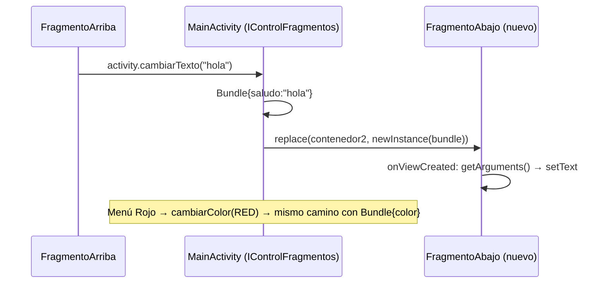

---
tags:
  - android
  - proyecto-profesor
  - nivel/4
  - tema/fragmentos
  - tema/menus
aliases:
  - EjemploFragmentos2 (profesor)
---

# EjemploFragmentos2 — dos fragmentos que se hablan

> [!info] Ficha rápida
> **Código:** `android/codigo/AndroidEjemploProyectos/EjemploFragmentos2` (paquete `com.example.ejemplofragmentos`) · **Nivel:** ⭐⭐⭐⭐
> **PDF:** [8 — Fragmentos](../03-pdfs/11-fragmentos.md) (es exactamente el ejemplo guía)
> **Conceptos:** [16 Fragmentos](../02-conceptos/16-fragmentos.md) · [26 Menús y Toolbar](../02-conceptos/26-menus-y-toolbar.md)
> **Tu versión:** [EjemploFragmentos (alumno)](../05-proyectos-alumno/EjemploFragmentos.md)

## 1. Objetivo del proyecto

Una pantalla partida en dos mitades, cada una un **fragmento**:
- **Arriba (`FragmentoArriba`):** un `EditText` y un botón **enviar**.
- **Abajo (`FragmentoAbajo`):** un texto grande (60sp) que dice "abajo".

Al pulsar *enviar*, el texto escrito aparece abajo. Una **Toolbar** con menú de tres puntos ofrece **Rojo** y **Verde**, que cambian el color del texto de abajo.

Lo importante es **cómo** viajan los datos: el fragmento de arriba **no conoce** al de abajo. Avisa a la Activity mediante una **interfaz**, y la Activity **sustituye** el fragmento de abajo por uno nuevo que recibe los datos en un `Bundle`.

## 2. Qué aprende el alumno

- Crear fragmentos: `onCreateView` (inflar) y `onViewCreated` (buscar vistas y listeners).
- `FragmentContainerView` como hueco en el layout.
- `getSupportFragmentManager().beginTransaction().add(...)` / `.replace(...)` / `.commit()`.
- Comunicación **Fragment → Activity** con una interfaz (`IControlFragmentos`) obtenida en `onAttach`.
- Paso de datos **Activity → Fragment** con `newInstance(Bundle)` + `setArguments` / `getArguments`.
- `MaterialToolbar` + `setSupportActionBar` + menú de opciones (`onCreateOptionsMenu`, `onOptionsItemSelected`).

## 3. Estructura

| Tipo | Nombre | Descripción |
|---|---|---|
| Interfaz | `IControlFragmentos` | Contrato: `cambiarColor(int)` y `cambiarTexto(String)` |
| Clase | `MainActivity` | Implementa la interfaz, coloca los fragmentos y gestiona el menú |
| Clase | `fragmentos/FragmentoArriba` | Formulario; avisa a la Activity |
| Clase | `fragmentos/FragmentoAbajo` | Muestra texto/color recibidos por `Bundle` |
| Layout | `activity_main.xml` | `MaterialToolbar` + 2 × `FragmentContainerView` (peso 1 cada uno) |
| Layout | `fragment_fragmento_arriba.xml` | `etTexto` + `btnEnviar` |
| Layout | `fragment_fragmento_abajo.xml` | `tvAbajo` (60sp) |
| Menú | `menu/menu_main.xml` | Ítems `rojo` y `verde` (`showAsAction="never"` → dentro de los tres puntos) |

## 4. Flujo de funcionamiento

1. `MainActivity.onCreate` → layout → `setSupportActionBar(toolbar)` (la Toolbar pasa a ser la barra de la app).
2. Dos transacciones: `add(contenedor1, new FragmentoArriba())` y `add(contenedor2, new FragmentoAbajo())`.
3. Ciclo del fragmento: `onAttach(context)` → `onCreateView` → `onViewCreated`. En `onAttach` de `FragmentoArriba` se guarda `activity = (IControlFragmentos) context`.
4. Android llama a `onCreateOptionsMenu` → se infla `menu_main` en la Toolbar.
5. **Enviar:** `FragmentoArriba` → `activity.cambiarTexto(texto)` → `MainActivity.cambiarTexto` crea un `Bundle{"saludo"}` → `replace(contenedor2, FragmentoAbajo.newInstance(bundle))` → el nuevo `FragmentoAbajo` lee `getArguments()` en `onViewCreated` y pinta el texto.
6. **Menú Rojo/Verde:** `onOptionsItemSelected` → `cambiarColor(Color.RED)` → mismo mecanismo con `Bundle{"color"}`.



## 5. Clases

### Interfaz: `IControlFragmentos`

```java
// Contrato: cualquier Activity que quiera alojar estos fragmentos debe saber hacer estas dos cosas.
public interface IControlFragmentos {
    void cambiarColor(int color);
    void cambiarTexto(String texto);
}
```
**Por qué una interfaz:** así `FragmentoArriba` no depende de `MainActivity` en concreto. Solo sabe que su Activity "cumple el contrato", y se puede reutilizar en otra Activity que también lo implemente.

### Clase: `MainActivity extends AppCompatActivity implements IControlFragmentos`

| Método | Cuándo | Qué hace |
|---|---|---|
| `onCreate` | Al abrir | Toolbar + añade los 2 fragmentos |
| `cambiarColor(int)` | Desde el menú | Sustituye el fragmento de abajo con `Bundle{"color"}` |
| `cambiarTexto(String)` | Desde `FragmentoArriba` | Sustituye el fragmento de abajo con `Bundle{"saludo"}` |
| `onCreateOptionsMenu(Menu)` | Android, al crear la barra | Infla `menu_main` |
| `onOptionsItemSelected(MenuItem)` | Al elegir una opción | Rojo → `cambiarColor(RED)`; Verde → `GREEN` |

```java
@Override
public void cambiarTexto(String texto) {
    Bundle bundle = new Bundle();
    bundle.putString("saludo", texto);
    getSupportFragmentManager()
            .beginTransaction()
            // replace = quita el fragmento que haya en contenedor2 y pone uno NUEVO con los datos.
            .replace(R.id.contenedor2, FragmentoAbajo.newInstance(bundle))
            .commit();                         // sin commit() no pasa nada
}

@Override
public boolean onCreateOptionsMenu(Menu menu) {
    getMenuInflater().inflate(R.menu.menu_main, menu);   // XML de menú → ítems reales
    return true;                                         // true = muestra el menú
}

@Override
public boolean onOptionsItemSelected(@NonNull MenuItem item) {
    int id = item.getItemId();
    if (id == R.id.rojo)  { cambiarColor(Color.RED);   return true; }  // true = "ya lo he gestionado"
    if (id == R.id.verde) { cambiarColor(Color.GREEN); return true; }
    return super.onOptionsItemSelected(item);
}
```

> [!important] 📌 Importante: al cambiar el color se pierde el texto (y al revés)
> Cada `replace` crea un `FragmentoAbajo` **nuevo** con un `Bundle` que solo lleva **una** clave. Si escribes "hola" y luego pulsas Rojo, el texto vuelve a "abajo" en rojo. Es el comportamiento del ejemplo del PDF, no un fallo de tu copia. Para conservar ambos, guarda texto y color en atributos de la Activity y mete los dos en el `Bundle`.

### Clase: `FragmentoArriba extends Fragment`

| Variable | Tipo | Para qué sirve |
|---|---|---|
| `activity` | `IControlFragmentos` | La Activity anfitriona, vista "a través del contrato" |

| Método | Cuándo | Qué hace |
|---|---|---|
| Constructor vacío | Android, al (re)crearlo | Obligatorio y sin parámetros |
| `onAttach(Context)` | Al unirse a la Activity (1.º) | `activity = (IControlFragmentos) context` |
| `onCreateView` | Al necesitar su vista | `inflate(R.layout.fragment_fragmento_arriba, container, false)` |
| `onViewCreated(View, Bundle)` | Con la vista ya creada | Busca `etTexto`/`btnEnviar` **en `view`** y programa el clic |
| `onDetach` | Al separarse | Vacío (aquí convendría `activity = null`) |

```java
@Override
public void onAttach(@NonNull Context context) {
    super.onAttach(context);
    // El "context" que recibe un fragmento ES su Activity. Si esa Activity no implementa
    // IControlFragmentos, este casteo lanza ClassCastException (error claro y temprano).
    this.activity = (IControlFragmentos) context;
}

@Override
public void onViewCreated(@NonNull View view, @Nullable Bundle savedInstanceState) {
    super.onViewCreated(view, savedInstanceState);
    EditText etTexto = view.findViewById(R.id.etTexto);   // view.findViewById: un fragmento no tiene findViewById propio
    Button btnEnviar = view.findViewById(R.id.btnEnviar);
    btnEnviar.setOnClickListener(v -> activity.cambiarTexto(etTexto.getText().toString()));
}
```

### Clase: `FragmentoAbajo extends Fragment`

```java
// "Fábrica": la forma recomendada de crear un fragmento con datos.
// NO se usa un constructor con parámetros porque Android recrea los fragmentos
// (al girar el móvil) con el constructor VACÍO, y los datos se perderían.
public static FragmentoAbajo newInstance(Bundle bundle) {
    FragmentoAbajo f = new FragmentoAbajo();
    if (bundle != null) f.setArguments(bundle);   // los "arguments" sí sobreviven a la recreación
    return f;
}

@Override
public void onViewCreated(@NonNull View view, @Nullable Bundle savedInstanceState) {
    super.onViewCreated(view, savedInstanceState);
    TextView tvAbajo = view.findViewById(R.id.tvAbajo);
    Bundle bundle = getArguments();                // null si se creó con new FragmentoAbajo()
    if (bundle != null) {
        if (bundle.containsKey("saludo")) tvAbajo.setText(bundle.getString("saludo"));
        if (bundle.containsKey("color"))  tvAbajo.setTextColor(bundle.getInt("color"));
    }
}
```

## 6. Layouts

### `activity_main.xml`

| Componente | ID | Función |
|---|---|---|
| `LinearLayout` vertical | `main` | Raíz |
| `com.google.android.material.appbar.MaterialToolbar` | `toolbar` | Barra superior; `app:title="Fragmentos"`, `background="?attr/colorPrimary"` |
| `androidx.fragment.app.FragmentContainerView` | `contenedor1` | Hueco del fragmento de arriba (`0dp` + peso 1) |
| `FragmentContainerView` | `contenedor2` | Hueco del de abajo (`0dp` + peso 1) |

- `?attr/colorPrimary`: el `?` significa "el valor que diga **el tema** para este atributo", no un color fijo.
- `android:theme="@style/ThemeOverlay.AppCompat.Dark.ActionBar"`: iconos y texto claros sobre fondo oscuro, solo dentro de la Toolbar.

> [!success] ✅ Reutilizable: pantalla con Toolbar + dos huecos para fragmentos
> ```xml
> <LinearLayout xmlns:android="http://schemas.android.com/apk/res/android"
>     xmlns:app="http://schemas.android.com/apk/res-auto"
>     android:id="@+id/main" android:layout_width="match_parent"
>     android:layout_height="match_parent" android:orientation="vertical">
>     <com.google.android.material.appbar.MaterialToolbar
>         android:id="@+id/toolbar" android:layout_width="match_parent"
>         android:layout_height="?attr/actionBarSize"
>         android:background="?attr/colorPrimary"
>         app:title="@string/app_name" app:titleTextColor="?attr/colorOnPrimary"/>
>     <androidx.fragment.app.FragmentContainerView android:id="@+id/contenedor1"
>         android:layout_width="match_parent" android:layout_height="0dp" android:layout_weight="1"/>
>     <androidx.fragment.app.FragmentContainerView android:id="@+id/contenedor2"
>         android:layout_width="match_parent" android:layout_height="0dp" android:layout_weight="1"/>
> </LinearLayout>
> ```

### `fragment_fragmento_arriba.xml` / `fragment_fragmento_abajo.xml`

| Layout | Componentes | Notas |
|---|---|---|
| arriba | `EditText etTexto` (hint "escribe un texto", `inputType="text"`), `Button btnEnviar` | `autofillHints=""` desactiva el autocompletado |
| abajo | `TextView tvAbajo` (60sp, centrado, `match_parent`) | `tools:context=".fragmentos.FragmentoArriba"` está mal copiado (debería ser Abajo); no afecta a nada |

### `menu/menu_main.xml`

```xml
<menu xmlns:android="http://schemas.android.com/apk/res/android"
      xmlns:app="http://schemas.android.com/apk/res-auto">
    <!-- showAsAction="never": la opción va dentro del menú de tres puntos -->
    <item android:id="@+id/rojo"  android:title="Rojo"  app:showAsAction="never"/>
    <item android:id="@+id/verde" android:title="Verde" app:showAsAction="never"/>
</menu>
```

## 7. Manifest y Gradle

Plantilla: solo `MainActivity`, sin permisos. `MaterialToolbar` viene de la librería `material`, y `FragmentContainerView`/`Fragment` de `appcompat` (que incluye `fragment`). No hay dependencias extra.

## 8. ⚠️ Cosas a tener en cuenta

> [!warning] ⚠️ Cuidado: fragmentos duplicados al girar el móvil
> `onCreate` hace `add(...)` siempre. Al girar, Android recrea la Activity y el `FragmentManager` **restaura** los fragmentos que ya había, y `onCreate` añade otros dos encima (quedan superpuestos). Envuelve las transacciones iniciales en `if (savedInstanceState == null) { ... }`. Lo mismo pasa en [EjercicioFragmentos](EjercicioFragmentos.md).

> [!warning] ⚠️ Cuidado: `replace` recrea el fragmento en cada envío
> Funciona y es lo que enseña el PDF, pero no es eficiente: crea un objeto y una vista nuevos cada vez. Alternativa moderna: un `ViewModel` compartido con `LiveData` que ambos fragmentos observan ([27 — Navigation, ViewBinding y ViewModel](../02-conceptos/27-navigation-viewbinding-viewmodel.md)).

> [!tip] 💡 Recomendación
> - En `onDetach`, pon `activity = null` para no retener la Activity.
> - Los textos "Rojo", "Verde", "enviar" y "escribe un texto" deberían ir en `strings.xml`.
> - `hello_blank_fragment` en `strings.xml` es un resto de la plantilla y no se usa.

## 9. Ejercicios

1. Añade un ítem de menú **Azul**.
2. Conserva a la vez texto y color (guárdalos en la Activity y mete los dos en el `Bundle`).
3. Pon `app:showAsAction="ifRoom"` a Rojo. ¿Dónde aparece ahora?
4. Añade un tercer fragmento que cuente cuántos mensajes se han enviado.
5. Gira el emulador tras enviar un texto. ¿Se conserva? ¿Por qué? (Pista: los *arguments* sobreviven a la recreación.)

## Relacionado

- [EjercicioFragmentos](EjercicioFragmentos.md): la versión con 3 fragmentos y lista acumulada
- [16 — Fragmentos](../02-conceptos/16-fragmentos.md) · [Nivel 5 de ejercicios](../07-ejercicios/05-nivel-5-fragmentos.md)
