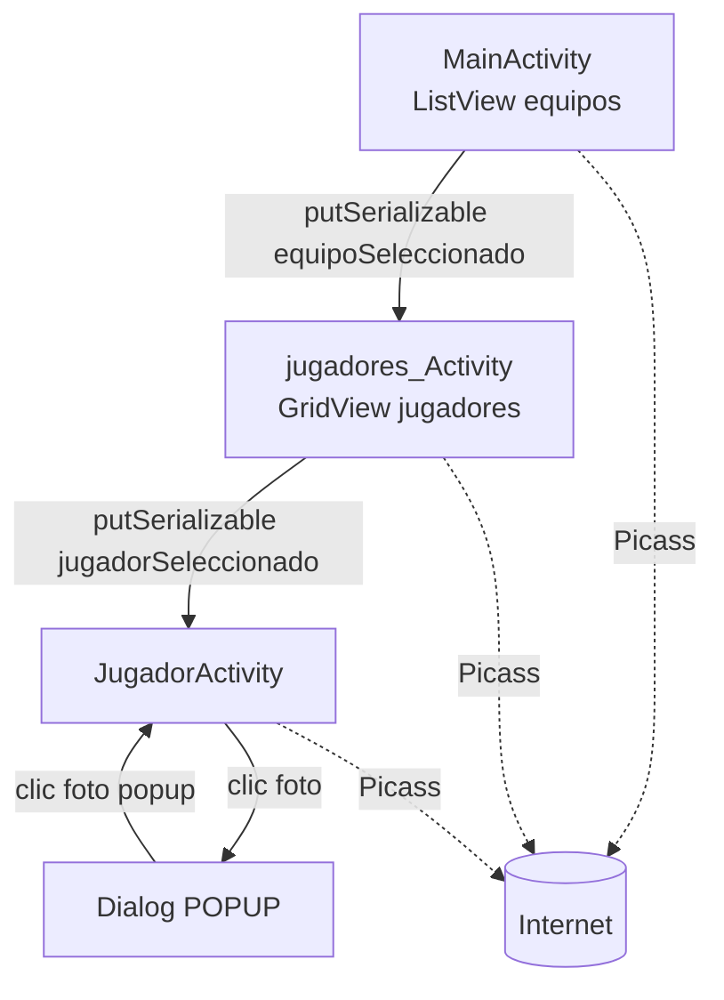

---
tags:
  - android
  - proyecto-profesor
  - nivel/3
  - tema/adaptadores
aliases:
  - EjercicioAdaptadoresFinal (profesor)
  - NBA equipos y jugadores
---

# EjercicioAdaptadoresFinal — Liga → Equipos → Jugadores

> [!info] Ficha rápida
> **Código:** `android/codigo/AndroidEjemploProyectos/EjercicioAdaptadoresFinal` · **Nivel:** ⭐⭐⭐
> **PDF:** [6 — Adaptadores](../03-pdfs/09-adaptadores.md) (+ una prueba de [7 — Transiciones](../03-pdfs/10-transiciones.md))
> **Tu versión:** [EjercicioAdaptadoresFinal (alumno)](../05-proyectos-alumno/EjercicioAdaptadoresFinal.md) · Ficha fácil: [aquí](../09-fichas-faciles/EjercicioAdaptadoresFinal.md)

## 1. Objetivo del proyecto

Ejercicio final de adaptadores con **tres niveles de navegación**, pasando **objetos completos** de una pantalla a otra:

1. **`MainActivity`**: `ListView` de equipos (logo, nombre, ciudad, precio).
2. **`jugadores_Activity`**: logo y nombre del equipo + `GridView` de 2 columnas con sus jugadores (foto, nombre, posición).
3. **`JugadorActivity`**: foto grande y nombre del jugador. Al tocar la foto sale un **popup** (`Dialog`) con la misma foto y el texto "POPUP"; al tocar la foto del popup, se cierra.

Las imágenes son **URLs de internet** cargadas con **Picasso**, por eso hace falta el permiso `INTERNET`.

## 2. Qué aprende el alumno

- Modelos anidados: `Liga` contiene `ArrayList<Equipo>` y cada `Equipo` contiene `ArrayList<Jugador>`.
- `implements Serializable` para meter un objeto entero en un `Bundle` (`putSerializable` / `getSerializableExtra`).
- Dos `BaseAdapter` (lista y rejilla).
- Cargar imágenes de URL con **Picasso** (`Picasso.get().load(url).into(imageView)`).
- Permiso `INTERNET` en el manifest.
- Reutilizar un layout de Activity dentro de un `Dialog`.
- Primer contacto con `TransitionInflater` (sin terminar).

## 3. Estructura

```
java/com/example/ejercicioadaptadoresfinal/
├── MainActivity.java            → ListView de equipos
├── jugadores_Activity.java      → GridView de jugadores del equipo elegido
├── JugadorActivity.java         → detalle del jugador + popup
├── adaptadores/EquiposAdapter.java · JugadoresAdapter.java
└── modelos/Liga.java · Equipo.java · Jugador.java   (todos Serializable)
res/layout/ activity_main · item_equipo · activity_jugadores · jugador_item_view · activity_jugador
res/transition/opacidad.xml      → slide de abajo a arriba, 2 s (se crea pero no se aplica)
```

| Clase | Hereda / implementa | Función |
|---|---|---|
| `Liga` | `Serializable` | Contenedor de equipos |
| `Equipo` | `Serializable` | nombre, ciudad, logo (URL), precio, jugadores |
| `Jugador` | `Serializable` | nombre, dorsal, posición, foto (URL) |
| `EquiposAdapter` | `BaseAdapter` | Filas de `item_equipo` |
| `JugadoresAdapter` | `BaseAdapter` | Celdas de `jugador_item_view` |
| `MainActivity` | `AppCompatActivity` | Nivel 1 |
| `jugadores_Activity` | `AppCompatActivity` | Nivel 2 |
| `JugadorActivity` | `AppCompatActivity` | Nivel 3 + popup |

## 4. Flujo de funcionamiento

1. `MainActivity.onCreate` → `rellenarEquipos()` crea la liga con 3 equipos (los tres son "Lakers", ver ⚠️) que comparten la misma lista de 3 jugadores "lebron".
2. `lvEquipos.setAdapter(new EquiposAdapter(nba.getEquipos(), this))` → cada fila descarga su logo con Picasso.
3. Clic en un equipo → `bundle.putSerializable("equipoSeleccionado", equipo)` → `jugadores_Activity`.
4. `jugadores_Activity` → `(Equipo) getIntent().getSerializableExtra(...)` → pinta la cabecera y monta el `GridView` con `equipo.getJugadores()`.
5. Clic en un jugador → `putSerializable("jugadorSeleccionado", jugador)` → `JugadorActivity`.
6. `JugadorActivity` pinta la foto y el nombre, y **prepara** un `Dialog` inflando otra vez `activity_jugador.xml`. Tocar la foto → `dialogoLander.show()`. Tocar la foto del popup → `dismiss()`.



## 5. Clases

### Modelos: `Liga`, `Equipo`, `Jugador`

```java
public class Equipo implements Serializable {       // Serializable = "se puede convertir en bytes"
    private String nombre;
    private String ciudad;
    private String logo;                             // URL, no id de drawable
    private float precio;
    private ArrayList<Jugador> jugadores;            // Jugador TAMBIÉN debe ser Serializable
    // constructor + getters/setters
}
```
> [!important] 📌 Importante
> Para pasar un `Equipo` en un `Bundle`, **toda** la cadena debe ser `Serializable`: `Equipo` y cada objeto que contiene (`Jugador`). Si `Jugador` no lo fuera, la app se cerraría con `NotSerializableException` al llamar a `startActivity`. (`String`, `float` y `ArrayList` ya lo son.)

### Clase: `MainActivity`

| Variable | Tipo | Para qué sirve |
|---|---|---|
| `lvEquipos` | `ListView` | Lista de equipos |
| `nba` | `Liga` | Todos los datos |

| Método | Cuándo | Qué hace |
|---|---|---|
| `onCreate` | Al abrir | Datos + adaptador + listener de clic |
| `rellenarEquipos()` | Desde `onCreate` | Crea jugadores, equipos y la liga |

```java
lvEquipos.setOnItemClickListener(new AdapterView.OnItemClickListener() {
    @Override
    public void onItemClick(AdapterView<?> parent, View view, int position, long id) {
        Equipo equipo = nba.getEquipos().get(position);        // el equipo de la fila pulsada
        Bundle bundle = new Bundle();
        bundle.putSerializable("equipoSeleccionado", equipo);  // mete el OBJETO entero
        Intent intent = new Intent(getApplicationContext(), jugadores_Activity.class);
        intent.putExtras(bundle);
        startActivity(intent);
    }
});
```

### Clase: `EquiposAdapter` / `JugadoresAdapter`

Mismo patrón `BaseAdapter` que [AdapterDam2](AdapterDam2.md). Lo nuevo es la carga por URL:
```java
Picasso.get()                                   // instancia única de Picasso
       .load(equipo.get(position).getLogo())    // URL (String)
       .into(logo);                             // descarga en segundo plano y pinta al terminar
```
`JugadoresAdapter` pone `getPosicion()` en un `TextView` con id `tvAlturaJugador` (el id dice "altura" pero muestra la posición).

### Clase: `jugadores_Activity`

```java
Equipo equipo = (Equipo) getIntent().getSerializableExtra("equipoSeleccionado"); // casteo obligatorio
tvNombre.setText(equipo.getNombre());
Picasso.get().load(equipo.getLogo()).into(ivPerfilEquipo);
gridView.setAdapter(new JugadoresAdapter(equipo.getJugadores(), getApplicationContext()));
// + OnItemClickListener igual que en MainActivity, con "jugadorSeleccionado"
```

### Clase: `JugadorActivity`

```java
Jugador jugador = (Jugador) getIntent().getSerializableExtra("jugadorSeleccionado");
Picasso.get().load(jugador.getFoto()).into(imageView);
tvJugador.setText(jugador.getNombre());

final Dialog dialogoLander = new Dialog(this);

// Se infla OTRA copia de activity_jugador.xml para usarla como contenido del popup.
View vista = getLayoutInflater().inflate(R.layout.activity_jugador, null);
Picasso.get().load(jugador.getFoto()).into((ImageView) vista.findViewById(R.id.ivJugador));

// Se carga una transición… pero nunca se aplica (ver ⚠️).
Transition opacidad = TransitionInflater.from(getApplicationContext()).inflateTransition(R.transition.opacidad);
opacidad.addTarget((ImageView) vista.findViewById(R.id.ivJugador));

((TextView) vista.findViewById(R.id.tvJugador)).setText("POPUP");
vista.findViewById(R.id.ivJugador).setOnClickListener(v -> dialogoLander.dismiss()); // cerrar popup
dialogoLander.setContentView(vista);

imageView.setOnClickListener(v -> dialogoLander.show());                            // abrir popup
```

## 6. Layouts

| Layout | Componentes (ID) | Notas |
|---|---|---|
| `activity_main.xml` | `TextView` "Equipos" (96sp), `ListView lvEquipos` (345×500dp) | Tamaños fijos |
| `item_equipo.xml` | `ivEquipoLogo`, `tvEquipoNombre`, `tvEquipoCiudad`, `tvEquipoPrecio` | `tools:srcCompat="@tools:sample/avatars"` = imagen de muestra **solo en el editor** |
| `activity_jugadores.xml` | `ivLogoEquipo`, `tvEquipo`, `GridView gvJugadores` (`numColumns=2`) | |
| `jugador_item_view.xml` | `ivPerfilJugador`, `tvNombreJugador`, `tvAlturaJugador` | |
| `activity_jugador.xml` | `ivJugador` (380×620dp), `tvJugador` | Se usa en la Activity **y** en el popup |

> [!warning] ⚠️ Cuidado: `app:srcCompat="@drawable/m3_split_button_chevron_avd"`
> Varias `ImageView` usan como imagen provisional un drawable **interno de la librería Material**, puesto al elegir "cualquier imagen" en el editor. Funciona, pero puede desaparecer al actualizar Material y romper la compilación. Usa tu propio *placeholder*.

## 7. Manifest

```xml
<!-- Sin esta línea, Picasso no puede descargar nada: las imágenes salen vacías (sin cerrarse la app) -->
<uses-permission android:name="android.permission.INTERNET" />
```
| Permiso | Para qué | Dónde se usa |
|---|---|---|
| `INTERNET` | Descargar logos y fotos | Los dos adaptadores, `jugadores_Activity` y `JugadorActivity` (Picasso) |

`INTERNET` es un permiso **normal**: basta con declararlo, no se pide al usuario. Activities: `MainActivity` (LAUNCHER), `jugadores_Activity` y `JugadorActivity`.

## 8. Gradle

| Librería | Para qué | Dónde se usa | ¿Reutilizable? |
|---|---|---|---|
| `libs.picasso` (`com.squareup.picasso:picasso:2.8`) | Cargar imágenes de URL | Adaptadores y Activities | ✅ (aunque Picasso ya casi no se mantiene; hoy se prefiere Glide o Coil) |

## 9. ⚠️ Bugs, código antiguo y mejoras

> [!warning] ⚠️ Cuidado: datos de prueba repetidos
> `lakers`, `bulls` y `celtics` se crean con **el mismo nombre, ciudad y logo** ("Lakers", "Angeles") y comparten **la misma** `ArrayList` de jugadores, con 3 jugadores "lebron" idénticos. La app funciona, pero las 3 filas son iguales. Para el examen, rellena datos distintos por equipo.

> [!warning] ⚠️ Cuidado: la transición `opacidad` no hace nada
> Se infla y se le añade un *target*, pero nunca se pasa a `TransitionManager.beginDelayedTransition(...)` ni a `dialogoLander.getWindow().setEnterTransition(...)`. Además, `opacidad.xml` es un **`<slide>`**, no un `<fade>`: el nombre no coincide con el efecto. Para animar el popup, lo más sencillo es un estilo de ventana: `dialog.getWindow().getAttributes().windowAnimations = R.style.MiAnimacion`.

> [!warning] ⚠️ Cuidado: `getSerializableExtra(String)` está obsoleto en Android 13+
> La versión moderna es `getSerializableExtra("clave", Equipo.class)` (API 33) o `IntentCompat.getSerializableExtra(intent, "clave", Equipo.class)`. La forma antigua sigue funcionando.

> [!tip] 💡 Recomendación
> - Nombre de clase `jugadores_Activity`: en Java las clases van en *PascalCase*: `JugadoresActivity`.
> - Picasso sin *placeholder*: añade `.placeholder(R.drawable.cargando).error(R.drawable.sin_foto)` para que se vea algo mientras descarga o si falla la URL.
> - `Parcelable` es más rápido que `Serializable` en Android, pero más largo de escribir. Para clase, `Serializable` es suficiente.

## 10. Fragmentos reutilizables

- ✅ Pasar un objeto entero entre pantallas → [Pasar datos](../06-codigo-reutilizable/03-pasar-datos.md)
- ✅ Picasso/Glide desde URL → [Utilidades](../06-codigo-reutilizable/09-utilidades.md)
- ✅ Popup con `Dialog` reutilizando un layout → [Mensajes](../06-codigo-reutilizable/04-mensajes-toast-dialogos.md)

## 11. Ejercicios

1. Crea 3 equipos **distintos** (Lakers, Bulls, Celtics) con 3 jugadores cada uno y URLs reales.
2. Muestra el **dorsal** del jugador en la celda (el modelo ya lo tiene).
3. Añade `.placeholder()` y `.error()` a Picasso.
4. Haz que el popup aparezca con una animación de fundido.
5. Quita el permiso `INTERNET` y observa qué pasa (Logcat: busca `Picasso`).

## Relacionado

- [AdapterDam2](AdapterDam2.md) · [07 — Adaptadores](../02-conceptos/07-adaptadores.md) · [24 — Manifest y permisos](../02-conceptos/24-manifest-y-permisos.md)
- [Nivel 3 de ejercicios](../07-ejercicios/03-nivel-3-adaptadores.md)
