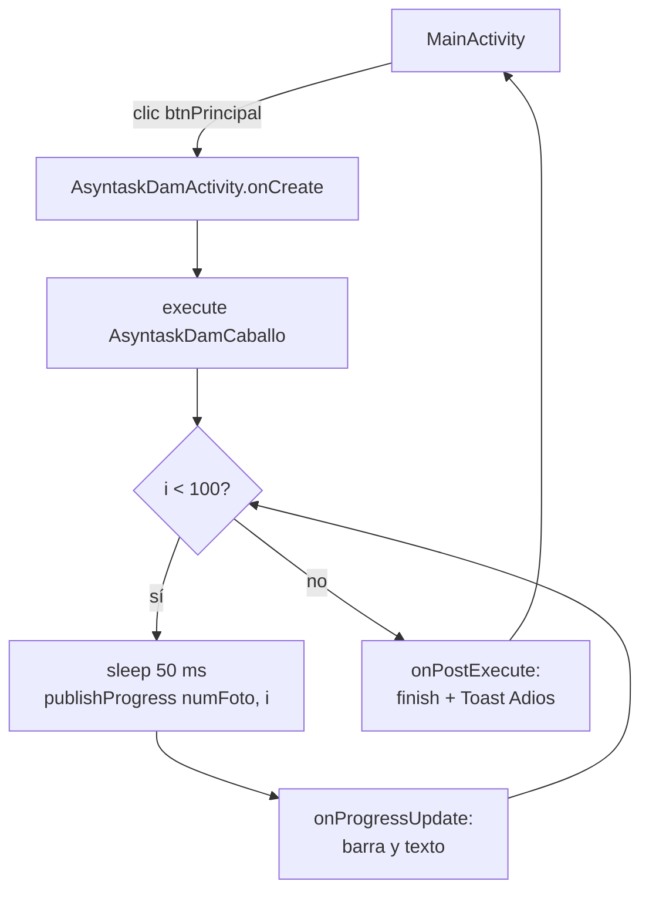

---
tags:
  - android
  - proyecto-profesor
  - nivel/2
  - tema/hilos
aliases:
  - EjercicioAsyncTaskAlumnos (profesor)
  - Caballo AsyncTask
---

# EjercicioAsyncTaskAlumnos — el caballo que corre

> [!info] Ficha rápida
> **Código:** `android/codigo/AndroidEjemploProyectos/EjercicioAsyncTaskAlumnos` · **Nivel:** ⭐⭐
> **PDF:** [4 — AsyncTask](../03-pdfs/06-asynctask.md) · **Concepto:** [05 — AsyncTask e hilos](../02-conceptos/05-asynctask-e-hilos.md)
> **Mismo patrón que:** [DisenyoPesos](DisenyoPesos.md) (`ProgressAndando`)

## 1. Objetivo del proyecto

Es la **solución del ejercicio de AsyncTask** que se hace en clase: un botón abre una pantalla con la imagen de un caballo, una barra de progreso y un porcentaje. Un `AsyncTask` avanza la barra del 0 al 99 % (100 pasos de 50 ms, unos 5 s) y, al terminar, cierra la pantalla y muestra un `Toast` "Adios".

La idea era que el caballo "galopara" cambiando entre `caballo1..8.png`, pero **esa parte no está terminada** (ver §7): el caballo nunca cambia de imagen.

## 2. Qué aprende el alumno

- Repetir el patrón **Activity + AsyncTask con getters** de [DisenyoPesos](DisenyoPesos.md), esta vez escrito por el alumno.
- Diferencia entre lo que corre en segundo plano (`doInBackground`) y lo que pinta en pantalla (`onProgressUpdate`, `onPostExecute`).
- Mostrar un `Toast` al terminar una tarea.
- Castear el resultado de `findViewById` en una línea: `((Button) findViewById(...)).setOnClickListener(...)`.

## 3. Estructura

| Tipo | Nombre | Descripción |
|---|---|---|
| Clase | `MainActivity` | Un botón "Asyntask" que abre la segunda pantalla |
| Clase | `AsyntaskDamActivity` | Pantalla con caballo, barra y texto; lanza el hilo |
| Clase | `AsyntaskDamCaballo` | `AsyncTask<Void,Integer,Void>` |
| Layout | `activity_main.xml` | `Button` `btnPrincipal` centrado |
| Layout | `activity_asyntask_dam.xml` | `ivCaballo` (303×247), `pbCaballo` (horizontal) y `tvCaballo` |
| Drawables | `caballo1..8.png` | Fotogramas del caballo (solo se usa `caballo1`) |

## 4. Flujo de funcionamiento

1. `MainActivity.onCreate` → layout con un botón.
2. El usuario pulsa **Asyntask** → `startActivity(new Intent(getApplicationContext(), AsyntaskDamActivity.class))`.
3. `AsyntaskDamActivity.onCreate` → busca `tvCaballo`, `pbCaballo` e `ivCaballo` → `new AsyntaskDamCaballo(this).execute()`.
4. `doInBackground`: 100 vueltas, `sleep(50)` + `publishProgress(numFoto, i)`.
5. `onProgressUpdate`: barra = `i` y texto = `"i%"`.
6. `onPostExecute`: `activity.finish()` + `Toast "Adios"` → se vuelve a `MainActivity`.



## 5. Clases

### Clase: `MainActivity`

```java
@SuppressLint("MissingInflatedId")   // silencia un aviso del editor sobre ids; no cambia nada al ejecutar
@Override
protected void onCreate(Bundle savedInstanceState) {
    ...
    // Casteo + listener en una sola línea: findViewById devuelve View,
    // (Button) lo trata como botón (aquí no haría falta, setOnClickListener existe en View).
    ((Button) findViewById(R.id.btnPrincipal)).setOnClickListener(new View.OnClickListener() {
        @Override
        public void onClick(View v) {
            // Intent explícito: "abre exactamente esta clase".
            startActivity(new Intent(getApplicationContext(), AsyntaskDamActivity.class));
        }
    });
}
```

### Clase: `AsyntaskDamActivity`

| Variable | Tipo | Para qué sirve |
|---|---|---|
| `ivCaballo` | `ImageView` | Imagen del caballo |
| `pbCaballo` | `ProgressBar` | Progreso 0–100 (máximo por defecto = 100) |
| `tvCaballo` | `TextView` | Texto "i%" |

| Método | Cuándo | Qué hace |
|---|---|---|
| `onCreate` | Al abrir | Busca las vistas y lanza el hilo |
| `getIvCaballo()`, `getPbCaballo()`, `getTvCaballo()` | Los llama el hilo | Dan acceso a las vistas |

### Clase: `AsyntaskDamCaballo`

| Método | Hilo | Qué hace |
|---|---|---|
| Constructor | Principal | Guarda la Activity |
| `doInBackground` | Secundario | Bucle de 100 pasos: calcula `numFoto` (0–6) y publica el progreso |
| `onProgressUpdate` | Principal | Barra y texto (**no** cambia la imagen) |
| `onPostExecute` | Principal | Cierra la pantalla y muestra "Adios" |

```java
@Override
protected void onPostExecute(Void unused) {
    super.onPostExecute(unused);
    activity.finish();   // cierra AsyntaskDamActivity → vuelve a MainActivity
    // Se usa getApplicationContext() porque la Activity se está cerrando;
    // el Toast sobrevive porque lo muestra el sistema, no la pantalla.
    Toast.makeText(activity.getApplicationContext(), "Adios", Toast.LENGTH_SHORT).show();
}
```

## 6. Layouts

| Layout | Componentes (ID) | Conexión |
|---|---|---|
| `activity_main.xml` | `Button btnPrincipal` ("Asyntask") centrado con *bias* ≈ 0.5 | `MainActivity` |
| `activity_asyntask_dam.xml` | `ImageView ivCaballo` (`srcCompat=@drawable/caballo1`) → `ProgressBar pbCaballo` (`progressBarStyleHorizontal`) → `TextView tvCaballo` | `AsyntaskDamActivity` |

## 7. ⚠️ Bugs y cosas sin terminar

> [!warning] ⚠️ Cuidado: el caballo no se mueve
> `doInBackground` calcula `numFoto` y lo envía como `values[0]`, pero `onProgressUpdate` **nunca lo usa**. Falta:
> 1. Un array de imágenes en `res/values/arrays.xml`:
>    ```xml
>    <array name="caballos">
>        <item>@drawable/caballo1</item> ... <item>@drawable/caballo8</item>
>    </array>
>    ```
> 2. Cargarlo en la Activity: `imagenes = getResources().obtainTypedArray(R.array.caballos);`
> 3. En `onProgressUpdate`: `activity.getIvCaballo().setImageResource(imagenes.getResourceId(values[0], -1));`
> 4. Arreglar el rango: hay **8** imágenes, pero `numFoto` se reinicia al llegar a 7 (solo 0–6). Usa `numFoto = (numFoto + 1) % 8`.

> [!warning] ⚠️ Cuidado: `AsyncTask` obsoleto y sin cancelar
> Igual que en [DisenyoPesos](DisenyoPesos.md) (§9): si el usuario sale antes de tiempo, la tarea sigue y hace `finish()` + `Toast` igualmente.

> [!tip] 💡 Recomendación
> El texto "Asyntask" del botón está en el XML (mejor en `strings.xml`), y el nombre `Asyntask` está mal escrito (falta la c de *AsyncTask*). No afecta al funcionamiento, pero en un examen conviene escribirlo bien.

## 8. Ejercicios

1. Termina la animación del caballo (pasos de §7).
2. Haz que el caballo avance hacia la derecha: en `onProgressUpdate`, `ivCaballo.setTranslationX(values[1] * 5)`.
3. Añade un botón "Cancelar" que llame a `hilo.cancel(true)`, y comprueba `isCancelled()` dentro del bucle.
4. Reescribe la tarea con `ExecutorService` + `Handler` (ver [Utilidades](../06-codigo-reutilizable/09-utilidades.md)).

## Relacionado

- [DisenyoPesos](DisenyoPesos.md) · [05 — AsyncTask e hilos](../02-conceptos/05-asynctask-e-hilos.md) · [12 — Hilos a fondo](../02-conceptos/12-hilos-en-profundidad.md)
- [Nivel 4 de ejercicios](../07-ejercicios/04-nivel-4-toast-asynctask-animaciones-transiciones.md)
