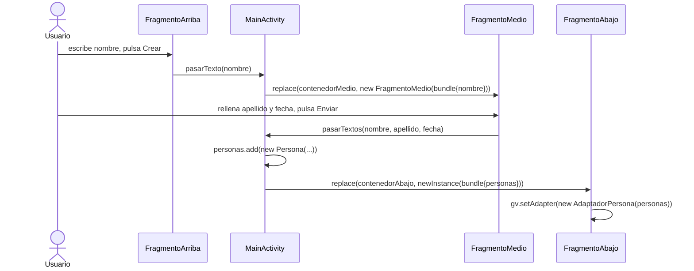

---
tags:
  - android
  - proyecto-profesor
  - nivel/4
  - tema/fragmentos
aliases:
  - EjercicioFragmentos (profesor)
---

# EjercicioFragmentos — formulario en 3 fragmentos

> [!info] Ficha rápida
> **Código:** `android/codigo/AndroidEjemploProyectos/EjercicioFragmentos` · **Nivel:** ⭐⭐⭐⭐
> **PDF:** [8 — Fragmentos](../03-pdfs/11-fragmentos.md) (ejercicio propuesto tras el ejemplo)
> **Base:** [EjemploFragmentos2](EjemploFragmentos2.md) · **Tu versión:** [EjercicioFragmentos (alumno)](../05-proyectos-alumno/EjercicioFragmentos.md) y [FragmentosNombres](../05-proyectos-alumno/FragmentosNombres.md)

## 1. Objetivo del proyecto

La pantalla se divide en **tres fragmentos** que forman un formulario en dos pasos:

1. **Arriba:** escribes un nombre y pulsas **Crear**.
2. **Medio:** aparece el nombre y rellenas **Apellido** y **Fecha**. Pulsas **Enviar**.
3. **Abajo:** un `GridView` de 2 columnas va **acumulando** todas las personas creadas (nombre, apellido y fecha).

Los datos pasan siempre por la Activity: Arriba → Activity → Medio → Activity → Abajo.

## 2. Qué aprende el alumno

- Encadenar **tres** fragmentos con una interfaz de dos métodos.
- Pasar un `ArrayList` de objetos (`Persona implements Serializable`) con `putSerializable`.
- Usar un `BaseAdapter` **dentro de un fragmento**.
- Guardar datos acumulados en la Activity (`personas`), que vive más que los fragmentos.
- (Por contraste) qué pasa si un fragmento recibe datos por **constructor** en vez de por `newInstance`.

## 3. Estructura

```
java/com/example/ejerciciofragmentos/
├── MainActivity.java                 → implementa IControlFragmentos; guarda la lista de personas
├── interfaces/IControlFragmentos.java → pasarTexto(nombre), pasarTextos(nombre, apellido, fecha)
├── fragmentos/FragmentoArriba.java   → etNombre + btnCrear
├── fragmentos/FragmentoMedio.java    → tvMedioNombre + etApellido + etFecha + btnEnviar
├── fragmentos/FragmentoAbajo.java    → GridView con AdaptadorPersona
├── adaptadores/AdaptadorPersona.java → BaseAdapter de item_persona
└── modelo/Persona.java               → nombre, apellido, fecha (Serializable)
```

| Layout | Componentes | Usado por |
|---|---|---|
| `activity_main.xml` | 3 `LinearLayout` (`contenedorArriba/Medio/Abajo`) con peso 1 | `MainActivity` |
| `fragment_fragmento_arriba.xml` | `FrameLayout` → `etNombre` + `btnCrear` en horizontal | `FragmentoArriba` |
| `fragment_fragmento_medio.xml` | 3 filas "etiqueta + campo" + `btnEnviar` | `FragmentoMedio` |
| `fragment_fragmento_abajo.xml` | `GridView gvLista` (`numColumns=2`) | `FragmentoAbajo` |
| `item_persona.xml` | `itNombre`, `itApellido`, `itFecha` centrados | `AdaptadorPersona` |

## 4. Flujo de funcionamiento



1. `onCreate` añade los tres fragmentos: Arriba y Medio vacíos, y Abajo con un `Bundle` vacío.
2. **Crear** → `activity.pasarTexto(etNombre)` → la Activity sustituye el del medio por `new FragmentoMedio(bundle)` con el nombre.
3. **Enviar** → `activity.pasarTextos(...)` → la Activity crea la `Persona`, la añade a `personas` y sustituye el de abajo por uno nuevo con **toda** la lista.

## 5. Clases

### `IControlFragmentos`
```java
public interface IControlFragmentos {
    void pasarTexto(String texto);                                   // Arriba → Activity
    void pasarTextos(String nombre, String apellido, String fecha); // Medio → Activity
}
```

### `MainActivity`

| Variable | Tipo | Para qué sirve |
|---|---|---|
| `personas` | `ArrayList<Persona>` | Lista acumulada. Vive en la Activity porque los fragmentos se reemplazan |

```java
@Override
public void pasarTextos(String nombre, String apellido, String fecha) {
    Bundle bundle = new Bundle();
    personas.add(new Persona(nombre, apellido, fecha));   // acumula
    bundle.putSerializable("personas", personas);          // ArrayList y Persona son Serializable
    getSupportFragmentManager().beginTransaction()
            .replace(R.id.contenedorAbajo, FragmentoAbajo.newInstance(bundle))
            .commit();
}
```

### `FragmentoMedio` — ⚠️ el constructor con parámetros

```java
private String nombre;

public FragmentoMedio(Bundle bundle) {        // ⚠️ constructor con datos
    nombre = bundle.getString("nombre");
}
public FragmentoMedio() { }                   // el vacío también existe (obligatorio)

@Override
public void onViewCreated(@NonNull View view, @Nullable Bundle savedInstanceState) {
    TextView tvNombre = view.findViewById(R.id.tvMedioNombre);
    tvNombre.setText(this.nombre);            // null la primera vez → se ve vacío
    EditText etApellido = view.findViewById(R.id.etApellido);
    EditText etFecha = view.findViewById(R.id.etFecha);
    view.findViewById(R.id.btnEnviar).setOnClickListener(v ->
            activity.pasarTextos(tvNombre.getText() + "", etApellido.getText() + "", etFecha.getText() + ""));
}
```

> [!warning] ⚠️ Cuidado: constructor con parámetros en un Fragment
> Al **girar el móvil**, Android destruye y recrea los fragmentos llamando al constructor **vacío**. Así que `nombre` vuelve a `null` y el dato se pierde. Android Studio lo marca (*"Avoid non-default constructors in fragments"*). **Lo correcto** es lo que hace `FragmentoAbajo`: `newInstance(bundle)` + `setArguments` y, en `onViewCreated`, `getArguments().getString("nombre")`. Compara las dos clases: es una pregunta típica de examen.

### `FragmentoAbajo`

```java
private Context mContext;

public static Fragment newInstance(Bundle bundle) { ... setArguments(bundle) ... }  // ✔ forma correcta

@Override
public void onViewCreated(@NonNull View view, @Nullable Bundle savedInstanceState) {
    GridView gv = view.findViewById(R.id.gvLista);
    assert getArguments() != null;           // ⚠️ en Android los assert están DESACTIVADOS: no comprueba nada
    if (getArguments().containsKey("personas")) {
        gv.setAdapter(new AdaptadorPersona(
                (ArrayList<Persona>) getArguments().getSerializable("personas"),  // casteo "unchecked"
                this.mContext));
    }
}

@Override
public void onAttach(@NonNull Context context) {
    super.onAttach(context);
    mContext = context;                      // alternativa más limpia: requireContext() cuando se necesite
}
```

### `AdaptadorPersona extends BaseAdapter`

`getView` infla `item_persona` y pone nombre, apellido y fecha. Mismo patrón que [AdapterDam2](AdapterDam2.md).

### `Persona implements Serializable`

Tres `String` (`nombre`, `apellido`, `fecha`) con constructor, *getters* y *setters*.

## 6. Layouts: detalles

- `activity_main.xml` usa `LinearLayout` como contenedores de fragmentos (en [EjemploFragmentos2](EjemploFragmentos2.md) son `FragmentContainerView`). Funciona, pero `FragmentContainerView` es el contenedor recomendado: gestiona bien las animaciones y el orden de dibujo.
- Los tres contenedores tienen `layout_height="match_parent"` + `layout_weight="1"`. Con pesos iguales el reparto sale igual, pero lo correcto es `0dp`.
- En `fragment_fragmento_medio.xml`, `etApellido` y `etFecha` tienen `android:text="Name"`, así que aparecen **rellenos** con "Name". Debería ser `android:hint`.

> [!success] ✅ Reutilizable: fila de formulario "etiqueta + campo"
> ```xml
> <LinearLayout android:layout_width="match_parent" android:layout_height="wrap_content"
>     android:orientation="horizontal">
>     <TextView android:layout_width="0dp" android:layout_height="wrap_content"
>         android:layout_weight="1" android:text="@string/apellido" />
>     <EditText android:id="@+id/etApellido" android:layout_width="0dp"
>         android:layout_height="wrap_content" android:layout_weight="2"
>         android:hint="@string/apellido" android:inputType="textPersonName"
>         android:autofillHints="familyName" />
> </LinearLayout>
> ```

## 7. Manifest y Gradle

Plantilla, sin permisos ni librerías extra.

## 8. ⚠️ Bugs y mejoras

> [!warning] ⚠️ Cuidado: fragmentos duplicados al girar
> `onCreate` añade los fragmentos **siempre**. Al girar, el `FragmentManager` ya restaura los que había y `onCreate` añade otros tres encima: se duplican. **Arreglo** (vale para todos los proyectos con fragmentos):
> ```java
> if (savedInstanceState == null) {   // solo la primera vez, no al recrear
>     getSupportFragmentManager().beginTransaction()
>         .add(R.id.contenedorArriba, new FragmentoArriba())
>         ...
>         .commit();
> }
> ```

> [!warning] ⚠️ Cuidado: sin validación
> Se puede pulsar **Enviar** sin haber creado un nombre (sale una persona con nombre vacío) y con apellido o fecha vacíos. Mira [Formularios](../06-codigo-reutilizable/05-formularios.md) para validar campos vacíos con `setError`.

> [!tip] 💡 Recomendación
> - Para la fecha, un `DatePickerDialog` evita formatos inventados.
> - La lista `personas` se pierde al girar. Guárdala en `onSaveInstanceState` o, mejor, en un `ViewModel`.

## 9. Ejercicios

1. Convierte `FragmentoMedio` al patrón `newInstance(Bundle)`.
2. Añade la comprobación `savedInstanceState == null`.
3. Valida que nombre, apellido y fecha no estén vacíos (`setError`).
4. Al tocar una persona del `GridView`, muestra un `Toast` con su nombre completo.
5. Tras enviar, limpia los campos del fragmento medio.

## Relacionado

- [EjemploFragmentos2](EjemploFragmentos2.md) · [16 — Fragmentos](../02-conceptos/16-fragmentos.md) · [Nivel 5](../07-ejercicios/05-nivel-5-fragmentos.md)
