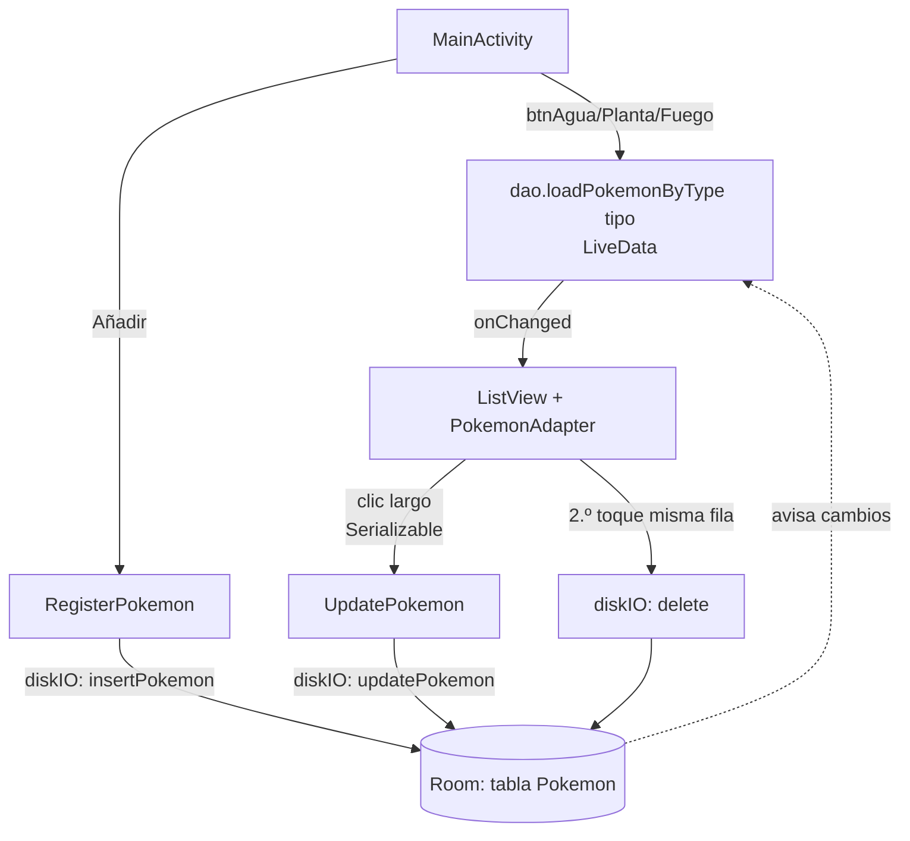

---
tags:
  - android
  - proyecto-profesor
  - nivel/5
  - tema/room
  - tema/adaptadores
aliases:
  - EjercicioPokemon (profesor)
  - Pokédex Room
---

# EjercicioPokemon — Pokédex con Room

> [!info] Ficha rápida
> **Código:** `android/codigo/AndroidEjemploProyectos/EjercicioPokemon` · **Nivel:** ⭐⭐⭐⭐⭐
> **PDF:** [1 — Diálogo personalizado y SQLite](../03-pdfs/12-dialogo-sqlite-personalizado.md) (ejercicio de aplicación)
> **Conceptos:** [17 Room](../02-conceptos/17-room-base-de-datos.md) · [20 Executors y LiveData](../02-conceptos/20-executors-y-livedata.md) · [19 Eventos de lista](../02-conceptos/19-textwatcher-y-eventos-de-lista.md)
> **Tu versión:** `codigo/proyectos-alumno/EjercicioDialogoPokemon` · Ficha fácil: [EjercicioDialogoPokemon](../09-fichas-faciles/EjercicioDialogoPokemon.md)

## 1. Objetivo del proyecto

Una Pokédex personal guardada en una **base de datos local** (Room/SQLite):

- **Pantalla principal:** botones **Agua**, **Planta** y **Fuego** que filtran la lista, un `ListView` de Pokémon (foto de internet, nombre, tipo y número) y un botón **Añadir Pokemon**.
- **Pulsación larga** en un Pokémon → pantalla de **edición**.
- **Doble toque** en un Pokémon → se **borra** (ver ⚠️: el doble toque está mal calculado).
- **Añadir:** formulario con nombre, tipo, número de Pokédex y URL de la foto.

Es el CRUD completo (*Create, Read, Update, Delete*) aplicado a un tema nuevo.

## 2. Qué aprende el alumno

- Definir una **entidad** Room (`@Entity`, `@PrimaryKey(autoGenerate = true)`).
- Un **DAO** con `@Insert`, `@Update`, `@Delete` y `@Query` con parámetros (`:tipo`).
- La base de datos **Singleton** (`AppDatabase.getInstance`).
- Hacer las operaciones de BD **fuera del hilo principal** con `AppExecutors.getDiskIO()`.
- `LiveData` + `observe`: la lista se refresca sola cuando cambian los datos.
- `OnItemClickListener` frente a `OnItemLongClickListener` (`return true`).
- Pasar un objeto `Serializable` a la pantalla de edición.
- Picasso con `.fit().centerCrop()`.

## 3. Estructura

```
java/com/example/ejerciciopokemon/
├── MainActivity.java          → filtros, lista, doble clic = borrar, clic largo = editar
├── RegisterPokemon.java       → formulario de alta
├── UpdatePokemon.java         → formulario de edición (precargado)
├── adapter/PokemonAdapter.java → BaseAdapter con Picasso
├── bbdd/AppDatabase.java      → @Database Singleton
├── bbdd/PokemonsDao.java      → @Dao con 6 operaciones
├── bbdd/AppExecutors.java     → hilos (disco, principal, red)
└── model/Pokemon.java         → @Entity (Serializable)
    model/Tipo.java            → modelo SIN USAR
```

| Layout | Componentes | Usado por |
|---|---|---|
| `activity_main.xml` | Fila `btnAgua`/`btnPlanta`/`btnFuego` (pesos) · `lvPokemons` (peso 8) · `btnAnadirPokemon` (peso 1) | `MainActivity` |
| `item_pokemon.xml` | `ivPokemon` 120×120 + `tvNombre`, `tvTipo`, `tvPokedex` | `PokemonAdapter` |
| `activity_register_pokemon.xml` | 4 filas etiqueta + `EditText` (`etNombre`, `etTipo`, `etPokedex`, `etFoto`) + `btnCrearPokemon` | `RegisterPokemon` |
| `activity_update_pokemon.xml` | Igual con ids `etUpdate…` + `btnUpdatePokemon` | `UpdatePokemon` |

## 4. Flujo de funcionamiento

1. `MainActivity.onCreate` → busca vistas → programa los listeners → `mydb = AppDatabase.getInstance(...)`. **La lista empieza vacía:** no se carga nada hasta pulsar un tipo.
2. **Filtro (p. ej. Agua)** → `cargaPokemonsTipo("Agua")` → `dao.loadPokemonByType("Agua").observe(this, …)`. Room ejecuta la consulta **en su propio hilo** y llama a `onChanged(lista)` en el principal → nuevo `PokemonAdapter` → `setAdapter`.
3. **Añadir** → `RegisterPokemon` → al pulsar Crear: lee los campos → `new Pokemon(...)` → `getDiskIO().execute(() -> dao.insertPokemon(p))`. Al volver atrás, el `LiveData` de la pantalla principal detecta el cambio y **refresca solo** la lista (si el tipo coincide).
4. **Pulsación larga** → `putSerializable("pokemon", p)` → `UpdatePokemon` precarga los campos → Actualizar → `setXxx` + `dao.updatePokemon(p)` en disco. Room reconoce la fila por su `id`.
5. **Segundo toque** sobre la misma fila → `dao.delete(p)` en disco → `LiveData` → la fila desaparece.



## 5. Clases

### `Pokemon` — la entidad

```java
@Entity(tableName = "Pokemon")                 // → CREATE TABLE Pokemon (...)
public class Pokemon implements Serializable { // Serializable para pasarlo a UpdatePokemon
    @PrimaryKey(autoGenerate = true)           // Room asigna 1, 2, 3… al insertar
    private int id;
    private String nombre;                     // cada atributo = una columna
    private String tipo;
    private String foto;                       // URL
    private int pokedex;

    // Room usa este constructor porque sus parámetros se llaman igual que las columnas;
    // el id lo rellena después con setId().
    public Pokemon(String nombre, String tipo, String foto, int pokedex) { ... }
    // getters y setters (Room los necesita para leer/escribir campos private)
}
```

### `PokemonsDao` — las consultas

| Método | Anotación | SQL equivalente | Devuelve |
|---|---|---|---|
| `loadAllPokemons()` | `@Query("SELECT * FROM Pokemon ORDER BY id")` | igual | `LiveData<List<Pokemon>>` (**sin usar**) |
| `insertPokemon(p)` | `@Insert` | `INSERT INTO Pokemon …` | `void` |
| `updatePokemon(p)` | `@Update` | `UPDATE Pokemon SET … WHERE id = p.id` | `void` |
| `delete(p)` | `@Delete` | `DELETE FROM Pokemon WHERE id = p.id` | `void` |
| `loadPokemonById(id)` | `@Query("… WHERE id = :id")` | con parámetro | `Pokemon` (**sin usar**) |
| `loadPokemonByType(tipo)` | `@Query("… WHERE tipo = :tipo")` | con parámetro | `LiveData<List<Pokemon>>` |

> [!important] 📌 Importante: `LiveData` o no `LiveData`
> - Los métodos que devuelven **`LiveData`** se pueden llamar desde el hilo principal: Room hace la consulta en segundo plano y avisa con `observe`.
> - Los que devuelven un **valor directo** (`Pokemon`, `void`) **deben** llamarse desde otro hilo. Si no, Room lanza `IllegalStateException: Cannot access database on the main thread`.

### `AppDatabase` — el Singleton

```java
@Database(entities = {Pokemon.class}, version = 1, exportSchema = false)
public abstract class AppDatabase extends RoomDatabase {
    private static final Object LOCK = new Object();
    private static AppDatabase sInstance;                // la única instancia de toda la app

    public static AppDatabase getInstance(Context context) {
        if (sInstance == null) {
            synchronized (LOCK) {                        // evita que dos hilos la creen a la vez
                sInstance = Room.databaseBuilder(context.getApplicationContext(),
                        AppDatabase.class, "AppDatabase").build();   // nombre del fichero .db
            }
        }
        return sInstance;
    }
    public abstract PokemonsDao pokemonDao();            // Room genera la implementación al compilar
}
```

### `AppExecutors`

Da tres `Executor`: disco, hilo principal y red. Lo usan las tres Activities para `insert`, `update` y `delete`. **Tiene el bug del orden de parámetros** (ver ⚠️ §8).

### `MainActivity`

| Variable | Tipo | Para qué sirve |
|---|---|---|
| `btnAnadir`, `btnAgua`, `btnPlanta`, `btnFuego` | `Button` | Botones |
| `mydb` | `AppDatabase` | Acceso a la BD |
| `lvPokemons` | `ListView` | Lista |
| `adapter` | `PokemonAdapter` | Se recrea en cada `onChanged` |
| `tiempoUltimoClick` | `float` ⚠️ | Instante del último toque |
| `posicionClickado` | `int` | Fila del último toque (-1 al inicio) |

| Método | Cuándo | Qué hace |
|---|---|---|
| `onCreate` | Al abrir | Listeners + BD |
| `onItemLongClick` | Pulsación larga | Abre `UpdatePokemon` con el Pokémon; `return true` = "consumido" (no dispara también el clic normal) |
| `onItemClick` | Toque | Detecta el "doble toque" y borra |
| `cargaPokemonsTipo(String)` | Botones de tipo | Observa la consulta por tipo |

```java
lvPokemons.setOnItemClickListener((parent, view, position, id) -> {
    float ahora = System.currentTimeMillis();
    // Intención: "si es la misma fila y han pasado menos de 300 ms → doble toque".
    if (position == posicionClickado && tiempoUltimoClick - ahora < 300) {   // ⚠️ resta al revés
        AppExecutors.getInstance().getDiskIO().execute(() ->
                mydb.pokemonDao().delete((Pokemon) adapter.getItem(position)));
    }
    posicionClickado = position;
    tiempoUltimoClick = ahora;
});

private void cargaPokemonsTipo(String tipo) {
    // observe(this, …): "this" es el LifecycleOwner. El observer se pausa y se elimina
    // solo cuando la Activity se para o se destruye: no hay que desuscribirse a mano.
    mydb.pokemonDao().loadPokemonByType(tipo).observe(this, pokemons -> {
        adapter = new PokemonAdapter(pokemons, getApplicationContext());
        lvPokemons.setAdapter(adapter);
    });
}
```

### `RegisterPokemon`

```java
btnCrear.setOnClickListener(v -> {
    EditText etNombre = findViewById(R.id.etNombre);
    ...
    int numPoke = Integer.parseInt(etPokedex.getText().toString());  // ⚠️ se cierra si está vacío o no es número
    final Pokemon pokemon = new Pokemon(etNombre.getText().toString(), etTipo.getText().toString(),
                                        etFoto.getText().toString(), numPoke);
    // Log con Integer.getInteger: ⚠️ NO convierte texto a número (lee una "propiedad del sistema") → imprime null
    Log.d("prueba", Integer.getInteger(etPokedex.getText().toString()) + "");
    AppExecutors.getInstance().getDiskIO().execute(() -> mydb.pokemonDao().insertPokemon(pokemon));
    // ⚠️ no hay finish() ni Toast: el usuario no sabe si se ha guardado
});
```

### `UpdatePokemon`

```java
pokemon = (Pokemon) getIntent().getExtras().getSerializable("pokemon");  // incluye su id
etNombre.setText(pokemon.getNombre());      // precarga el formulario
...
btnActualizar.setOnClickListener(v -> {
    pokemon.setNombre(etNombre.getText().toString());
    ...
    pokemon.setPokedex(Integer.parseInt(etPokedex.getText().toString()));
    AppExecutors.getInstance().getDiskIO().execute(() -> mydb.pokemonDao().updatePokemon(pokemon));
});
```

### `PokemonAdapter extends BaseAdapter`

`getView` infla `item_pokemon` y usa Picasso con `.fit().centerCrop()`: reescala la foto al tamaño exacto del `ImageView` (120dp) y la recorta para rellenarlo. Tiene `setListaPokemons(lista)` con `notifyDataSetChanged()`, pensado para **reutilizar** el adaptador, pero `MainActivity` no lo usa (crea uno nuevo cada vez).

## 6. Manifest y Gradle

| Permiso | Para qué | Dónde |
|---|---|---|
| `INTERNET` | Descargar la foto (`foto` es una URL) | `PokemonAdapter` (Picasso) |

| Dependencia | Para qué | ¿Reutilizable? |
|---|---|---|
| `androidx.room:room-runtime:2.8.5` | Room en ejecución (`Room`, `RoomDatabase`, `LiveData` de consultas) | ✅ |
| `annotationProcessor("androidx.room:room-compiler:2.8.5")` | Genera al compilar el código de `@Dao` y `@Database` (en Java; en Kotlin sería `ksp`) | ✅ |
| `com.squareup.picasso:picasso:2.8` | Imágenes por URL | ✅ |

> [!warning] ⚠️ Cuidado: `room-runtime` y `room-compiler` deben tener **la misma versión**. Si no, al compilar aparecen errores raros del tipo *"cannot find implementation for AppDatabase"*.

## 7. Layouts

- `activity_main.xml`: `LinearLayout` vertical. La fila de filtros es un `LinearLayout` horizontal con 3 botones `0dp` + peso 1; la lista tiene peso 8 y el botón inferior peso 1.
- Formularios: cada fila es `TextView` (peso 1) + `EditText` (peso 1). ⚠️ Ningún `EditText` tiene `inputType`: el de Pokédex debería ser `inputType="number"` (teclado numérico y evita el crash de `parseInt`) y el de la foto `textUri`.
- `item_pokemon.xml`: raíz con `layout_height="match_parent"`. En una fila de lista lo correcto es `wrap_content`.

## 8. ⚠️ Bugs, código antiguo y mejoras

> [!warning] ⚠️ Cuidado: el "doble clic" borra con cualquier segundo toque
> 1. `tiempoUltimoClick - ahora` es **negativo** (el pasado menos el presente), así que siempre es `< 300`. Cualquier segundo toque en la misma fila borra el Pokémon, aunque pase un minuto.
> 2. Guardar milisegundos en un `float` pierde precisión: `currentTimeMillis()` ronda 1,7·10¹² y un `float` solo tiene ~7 cifras significativas (saltos de ~2 minutos).
> **Arreglo:**
> ```java
> private long tiempoUltimoClick = 0;
> ...
> long ahora = System.currentTimeMillis();
> if (position == posicionClickado && ahora - tiempoUltimoClick < 300) { ... }
> ```
> Y, ya puestos, pide confirmación con un `AlertDialog`, como en [EjemploDialogoPersonalizado](EjemploDialogoPersonalizado.md).

> [!warning] ⚠️ Cuidado: los observers se acumulan
> Cada pulsación de un filtro añade **otro** observer a **otro** `LiveData`, y los anteriores siguen activos. Si pulsas Agua y luego Fuego y después añades un Pokémon de Agua, el observer de Agua se dispara y la lista cambia a Agua aunque tengas Fuego seleccionado. **Arreglo:** guarda el `LiveData` actual en un atributo y llama a `removeObservers(this)` antes de observar otro. La forma moderna es un `ViewModel` con `switchMap`.

> [!warning] ⚠️ Cuidado: `AppExecutors` con los parámetros cruzados
> Error copiado del PDF. El constructor es `(diskIO, mainThread, networkIO)`, pero se llama con `(singleThread, fixedThreadPool(3), MainThreadExecutor)`. Resultado: `getMainThread()` **no** es el hilo principal (es un pool de 3 hilos) y `getNetworkIO()` **sí** lo es. Aquí no explota porque solo se usa `getDiskIO()`, pero en [EjemploDialogoPersonalizado](EjemploDialogoPersonalizado.md) sí tiene consecuencias. Arreglo: `new AppExecutors(Executors.newSingleThreadExecutor(), new MainThreadExecutor(), Executors.newFixedThreadPool(3))`. Detalle en [20 — Executors y LiveData](../02-conceptos/20-executors-y-livedata.md).

> [!warning] ⚠️ Cuidado: crashes del formulario
> `Integer.parseInt("")` lanza `NumberFormatException` y la app se cierra. Valida antes (ver [Formularios](../06-codigo-reutilizable/05-formularios.md)) y pon `inputType="number"`.

> [!warning] ⚠️ Cuidado: el tipo es texto libre
> "agua", "Agua " o "AGUA" no coinciden con el filtro `"Agua"`. Usa un `Spinner` con los tipos permitidos. La clase `Tipo` parece pensada para eso, pero no se usa.

> [!tip] 💡 Recomendación
> - Mostrar todos los Pokémon al arrancar (`loadAllPokemons()` ya existe).
> - `finish()` + `Toast` tras insertar o actualizar.
> - En el Singleton, un segundo `if (sInstance == null)` **dentro** del `synchronized` y `volatile` en `sInstance` ("double-checked locking" completo).
> - Reutilizar el adaptador con `setListaPokemons(...)` en vez de crear uno nuevo en cada `onChanged`.

## 9. Fragmentos reutilizables

- ✅ Entidad + DAO + Database + Executors → [Base de datos Room](../06-codigo-reutilizable/07-base-de-datos-room.md)
- ✅ Detección de doble toque (versión corregida) → [Utilidades](../06-codigo-reutilizable/09-utilidades.md)
- ✅ Formulario que precarga y actualiza un objeto → [Formularios](../06-codigo-reutilizable/05-formularios.md)

## 10. Ejercicios

1. Arregla el doble clic y añade un `AlertDialog` de confirmación.
2. Muestra todos los Pokémon al arrancar y añade un botón **Todos**.
3. Cambia el `EditText` de tipo por un `Spinner` (Agua/Planta/Fuego).
4. Añade `inputType="number"` y valida los campos vacíos.
5. Tras guardar, vuelve atrás con `finish()` y muestra un `Toast`.
6. Añade el campo `nivel` a la entidad. ¿Qué pasa al ejecutar sobre la BD antigua? (Pista: sube `version` y usa `.fallbackToDestructiveMigration(true)`.)

## Relacionado

- [EjemploDialogoPersonalizado](EjemploDialogoPersonalizado.md): el ejemplo guía de Room del que parte este ejercicio
- [Nivel 6 de ejercicios — Diálogos y Room](../07-ejercicios/06-nivel-6-dialogos-y-room.md)
