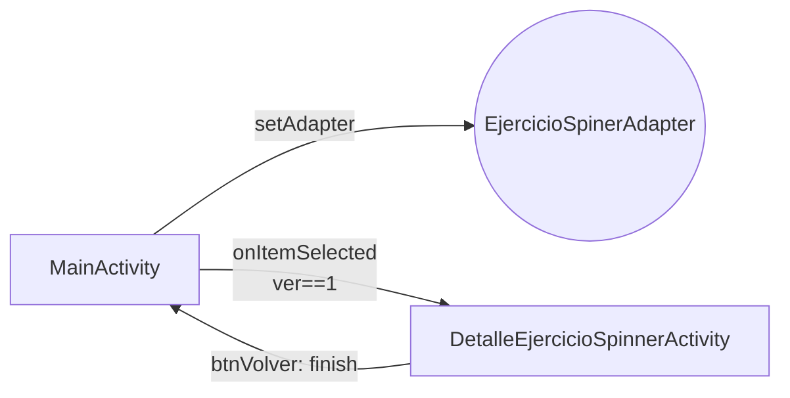

---
tags:
  - android
  - proyecto-profesor
  - nivel/3
  - tema/adaptadores
aliases:
  - EjercicioSpinner (profesor)
  - Spinner Lakers
---

# EjercicioSpinner — Spinner de jugadores de los Lakers

> [!info] Ficha rápida
> **Código:** `android/codigo/AndroidEjemploProyectos/EjercicioSpinner` · **Nivel:** ⭐⭐⭐
> **PDF:** [6 — Adaptadores](../03-pdfs/09-adaptadores.md) · **Modelo a copiar:** `SpinnerDam2Activity` de [AdapterDam2](AdapterDam2.md)
> **Tu versión:** [EjercicioSergio](../05-proyectos-alumno/EjercicioSergio.md) (esqueleto sin empezar)

## 1. Objetivo del proyecto

Ejercicio de clase: un título "Lakers" y un `Spinner` con 6 jugadores. Cada fila del desplegable muestra **número y nombre** ("2 - Rui Hachimura"). Al elegir un jugador se abre una pantalla que muestra su nombre en grande y tiene un botón **Volver**.

## 2. Qué aprende el alumno

- Crear un adaptador propio para `Spinner` extendiendo `ArrayAdapter` y sobrescribiendo `getView` + `getDropDownView`.
- Rellenar datos en un `ArrayList<String>`.
- La "bandera" `ver` para ignorar la selección automática del Spinner.
- Pasar un `String` con `Bundle` y leerlo con `getStringExtra`.
- Cerrar una pantalla con `finish()` (botón *Volver*).

## 3. Estructura

| Tipo | Nombre | Descripción |
|---|---|---|
| Clase | `MainActivity` | Rellena los datos, monta el Spinner y navega al elegir |
| Clase | `EjercicioSpinerAdapter` | `ArrayAdapter` que pinta "posición - nombre" |
| Clase | `DetalleEjercicioSpinnerActivity` | Muestra el jugador y el botón Volver |
| Layout | `activity_main.xml` | `TextView` "Lakers" (34sp) + `Spinner spEjercicio` |
| Layout | `item_spinner.xml` | `tvNumero` + `tvNombre` en `ConstraintLayout` |
| Layout | `activity_detalle_ejercicio_spinner.xml` | `tvDetalleEjercicio` (48sp) + `btnVolver` |

## 4. Flujo de funcionamiento

1. `MainActivity.onCreate` → `rellenarDatos()` (6 nombres) → `setAdapter(new EjercicioSpinerAdapter(this, -1, datos))`.
2. Al montarse, el Spinner selecciona la posición 0 y llama a `onItemSelected`. Como `ver == 0`, no navega y pone `ver = 1`.
3. El usuario abre el desplegable (`getDropDownView` pinta cada fila) y elige un jugador → `onItemSelected(position)` → `Bundle "jugador"` → `startActivity`.
4. `DetalleEjercicioSpinnerActivity` lee `"jugador"` y lo pinta. **Volver** → `finish()`.



## 5. Clases

### Clase: `MainActivity`

| Variable | Tipo | Para qué sirve |
|---|---|---|
| `ver` | `int` | 0 hasta la primera llamada automática; luego 1 |
| `datos` | `ArrayList<String>` | Nombres de los jugadores |

| Método | Cuándo | Qué hace |
|---|---|---|
| `onCreate` | Al abrir | Monta el Spinner y su listener |
| `rellenarDatos()` | Desde `onCreate` | Añade 6 nombres |

```java
rellenarDatos();
// -1 como "resource": el constructor de ArrayAdapter lo pide, pero no se usa
// porque getView/getDropDownView inflan su propio layout (item_spinner).
((Spinner) findViewById(R.id.spEjercicio)).setAdapter(new EjercicioSpinerAdapter(this, -1, datos));

final Intent intent = new Intent(this, DetalleEjercicioSpinnerActivity.class);
((Spinner) findViewById(R.id.spEjercicio)).setOnItemSelectedListener(new AdapterView.OnItemSelectedListener() {
    @Override
    public void onItemSelected(AdapterView<?> parent, View view, int position, long id) {
        if (ver == 1) {                                     // ignora la selección automática inicial
            Bundle bundle = new Bundle();
            bundle.putString("jugador", datos.get(position)); // aquí no hay fila extra: sin -1
            intent.putExtras(bundle);
            startActivity(intent);
        }
        ver = 1;
    }
    @Override public void onNothingSelected(AdapterView<?> parent) { }
});
```

### Clase: `EjercicioSpinerAdapter`

**Hereda:** `ArrayAdapter<ArrayList<String>>` ⚠️ (ver §7).

| Variable | Tipo | Para qué sirve |
|---|---|---|
| `context` | `Context` | Se castea a `Activity` para obtener el inflater |
| `datos` | `ArrayList<String>` | Nombres |

| Método | Qué hace |
|---|---|
| `getCount()` | `datos.size()`. **Imprescindible**: el constructor `super(context, i)` no recibe los datos, así que sin este método el Spinner saldría vacío |
| `getView` / `getDropDownView` | Delegan en `vistaPersonalizada` |
| `vistaPersonalizada` | Infla `item_spinner` y pone `"position - "` y el nombre |

```java
private View vistaPersonalizada(int position, @Nullable View convertView, @NonNull ViewGroup parent) {
    // Castear el Context a Activity funciona porque se pasó "this" (una Activity).
    // Si se pasara getApplicationContext(), este casteo lanzaría ClassCastException.
    LayoutInflater inflater = ((Activity) this.context).getLayoutInflater();
    View fila = inflater.inflate(R.layout.item_spinner, parent, false);
    ((TextView) fila.findViewById(R.id.tvNumero)).setText(position + " - ");
    ((TextView) fila.findViewById(R.id.tvNombre)).setText(datos.get(position) + "");
    return fila;
}
```

### Clase: `DetalleEjercicioSpinnerActivity`

```java
String jugador = getIntent().getStringExtra("jugador");
((TextView) findViewById(R.id.tvDetalleEjercicio)).setText(jugador);
((Button) findViewById(R.id.btnVolver)).setOnClickListener(v -> finish()); // equivale a pulsar "Atrás"
```

## 6. Layouts

| Layout | Componentes | Atributos destacables |
|---|---|---|
| `activity_main.xml` | `TextView` "Lakers", `Spinner spEjercicio` | Spinner con ancho fijo `409dp` (⚠️ en móviles estrechos se sale; mejor `0dp` con Start/End al padre) |
| `item_spinner.xml` | `tvNumero`, `tvNombre` (264×20dp) | `tvNombre` atado a la derecha de `tvNumero` (`Start_toEndOf`) |
| `activity_detalle_ejercicio_spinner.xml` | `tvDetalleEjercicio` (48sp), `btnVolver` | Márgenes enormes (`marginTop 284dp`) arrastrados desde el editor |

## 7. ⚠️ Bugs y malas prácticas

> [!warning] ⚠️ Cuidado: tipo genérico equivocado
> `ArrayAdapter<ArrayList<String>>` significa "cada elemento es una **lista** de strings". Lo correcto es `ArrayAdapter<String>`. Funciona porque se sobrescriben `getCount`/`getView` y nunca se usa `getItem`; pero si alguien llama a `getItem(pos)`, el tipo no cuadra. **Arreglo:** `extends ArrayAdapter<String>` y `super(context, 0, datos)`. Así ya no hace falta `getCount()`.

> [!warning] ⚠️ Cuidado: no se puede elegir al primer jugador
> "Luka Doncic" (posición 0) ya está seleccionado al abrir. Volver a elegirlo **no** dispara `onItemSelected`, porque el Spinner solo avisa cuando la selección **cambia**. Por eso [AdapterDam2](AdapterDam2.md) añade la fila "Seleccione una opción" al principio.

> [!warning] ⚠️ Cuidado: al volver del detalle
> Al pulsar Volver, el Spinner sigue en el jugador elegido. Si eliges el mismo otra vez, no pasa nada (misma causa). Solución habitual: en `onResume()`, `spinner.setSelection(0)` con la fila de aviso.

> [!warning] ⚠️ Cuidado: `findViewById` repetido
> Se busca `R.id.spEjercicio` dos veces. Mejor guardarlo en una variable `Spinner sp = findViewById(...)`.

## 8. Ejercicios

1. Corrige el genérico del adaptador (§7).
2. Añade la fila "Elige un jugador" como en AdapterDam2 para poder elegir a Luka.
3. Cambia `ArrayList<String>` por un modelo `Jugador(nombre, dorsal, posicion)` y muestra el dorsal en vez de la posición.
4. Pasa también el dorsal a la pantalla de detalle con `putInt` y muéstralo.

## Relacionado

- [AdapterDam2 — SpinnerDam2Adapter](AdapterDam2.md) · [07 — Adaptadores](../02-conceptos/07-adaptadores.md)
- [Listas y adaptadores reutilizables](../06-codigo-reutilizable/06-listas-y-adaptadores.md)
