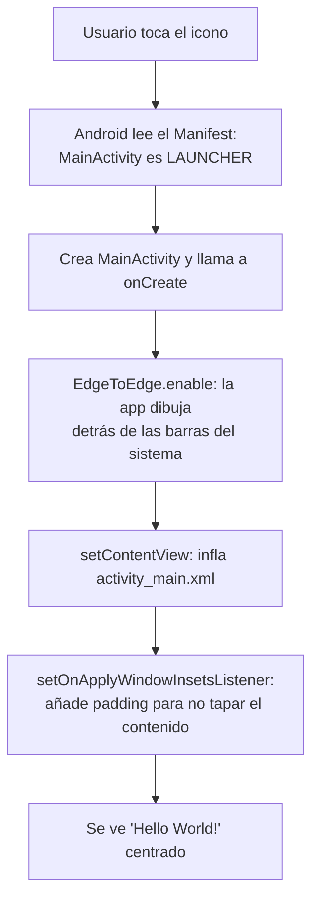

---
tags:
  - android
  - proyecto-profesor
  - nivel/0
aliases:
  - MyApplication (profesor)
  - Plantilla Empty Views Activity
---

# MyApplication — la plantilla vacía

> [!info] Ficha rápida
> **Código:** `android/codigo/AndroidEjemploProyectos/MyApplication` · **Nivel:** ⭐ (punto de partida)
> **PDF relacionado:** [0 — Instalación de Android](../03-pdfs/01-instalacion-android.md) · **Siguiente proyecto:** [DisenyoConstraint](DisenyoConstraint.md)

## 1. Objetivo del proyecto

Es el proyecto **tal y como lo crea Android Studio** con la plantilla *Empty Views Activity* (Java). No tiene nada propio: una sola pantalla con el texto "Hello World!" centrado.

Aun así es **el proyecto más importante para entender todos los demás**. Los otros 11 proyectos del profesor empiezan exactamente con estos mismos archivos. Si entiendes bien este, en los demás solo tendrás que fijarte en lo que se ha **añadido**.

## 2. Qué aprende el alumno

- Qué carpetas y archivos crea Android Studio y para qué sirve cada uno.
- Qué es una `Activity` y el método `onCreate()`.
- Cómo se conecta el Java con el XML: `setContentView(R.layout.activity_main)` y `R.id.main`.
- El bloque **EdgeToEdge**, que aparece en **todas** las Activities del curso.
- Qué es el `AndroidManifest.xml` y la Activity *launcher*.
- Qué es Gradle, qué es el *version catalog* (`libs.versions.toml`) y qué significan `minSdk`/`targetSdk`.

## 3. Estructura del proyecto

```
MyApplication/
├── settings.gradle.kts          → nombre del proyecto + repositorios (google(), mavenCentral())
├── build.gradle.kts             → Gradle "de proyecto": solo declara el plugin de Android
├── gradle/libs.versions.toml    → catálogo de versiones de librerías (AGP 9.3.2, appcompat...)
├── gradle/wrapper/…             → qué versión de Gradle se descarga (9.5.0)
└── app/
    ├── build.gradle.kts         → Gradle "del módulo app": SDKs, dependencias
    └── src/main/
        ├── AndroidManifest.xml  → declara la app y la Activity de arranque
        ├── java/com/example/myapplication/MainActivity.java
        └── res/
            ├── layout/activity_main.xml
            ├── values/strings.xml · colors.xml · themes.xml
            ├── values-night/themes.xml   → tema para modo oscuro
            ├── mipmap-*/ic_launcher…     → icono de la app en varias densidades
            └── xml/backup_rules.xml · data_extraction_rules.xml → copias de seguridad
```

| Tipo | Archivo | Para qué sirve |
|---|---|---|
| Clase | `MainActivity.java` | La única pantalla. Carga el layout y aplica el bloque EdgeToEdge |
| Layout | `activity_main.xml` | `ConstraintLayout` con un `TextView` "Hello World!" centrado |
| Manifest | `AndroidManifest.xml` | Declara `MainActivity` como pantalla de arranque |
| Gradle | `app/build.gradle.kts` | `compileSdk 37`, `minSdk 24`, `targetSdk 37`, Java 11 |
| Recursos | `strings.xml` | Solo `app_name` = "My Application" |
| Recursos | `themes.xml` | Tema `Theme.Material3.DayNight.NoActionBar` (sin barra de título) |

> Más detalle de la estructura en [09 — Instalación y estructura de proyecto](../02-conceptos/09-instalacion-estructura-proyecto.md).

## 4. Flujo de funcionamiento

1. **Qué pantalla aparece primero:** `MainActivity`, porque en el manifest es la que tiene el `intent-filter` con `MAIN` + `LAUNCHER`.
2. **Qué método se ejecuta primero:** Android crea el objeto `MainActivity` y llama automáticamente a `onCreate(Bundle)`.
3. **Qué layout se carga:** `R.layout.activity_main` → `res/layout/activity_main.xml`.
4. **Qué componentes se inicializan:** ninguno propio. Solo se busca la vista raíz `R.id.main` para aplicarle el *padding* de las barras del sistema.
5. **Qué puede hacer el usuario:** nada, salvo ver el texto.
6. **Qué eventos ocurren:** ninguno programado. Android sí dispara el ciclo de vida (`onStart`, `onResume`…), pero la clase no los sobrescribe.
7. **Qué cambia en la interfaz:** nada.
8. **Conexión Java ↔ XML:** `setContentView(R.layout.activity_main)` convierte el XML en vistas reales ("inflar"). `findViewById(R.id.main)` recupera la vista cuyo XML dice `android:id="@+id/main"`.

## 5. Diagrama lógico



## 6. Clases

### Clase: `MainActivity`

**Archivo:** `app/src/main/java/com/example/myapplication/MainActivity.java`
**Para qué sirve:** es la pantalla principal y única.
**Hereda de:** `AppCompatActivity`, la versión "compatible" de `Activity`. Permite usar funciones modernas en móviles antiguos (desde `minSdk 24`).

| Variable | Tipo | Para qué sirve |
|---|---|---|
| — | — | No tiene atributos propios |

| Método | Cuándo se ejecuta | Qué hace |
|---|---|---|
| `onCreate(Bundle)` | Automáticamente, al crearse la pantalla | Activa EdgeToEdge, carga el layout y ajusta los márgenes de sistema |

#### Método: `onCreate(Bundle savedInstanceState)`

- **Cuándo se ejecuta:** lo llama **Android**, no tú. Ocurre una vez cada vez que se crea la pantalla: al abrirla, y también al **girar el móvil**, porque Android destruye y recrea la Activity.
- **Parámetro:** `savedInstanceState` es un `Bundle` con el estado guardado si la pantalla se está recreando, o `null` si es la primera vez.
- **Devuelve:** nada (`void`).

```java
@Override
protected void onCreate(Bundle savedInstanceState) {
    // Obligatorio: deja que AppCompatActivity haga su propia preparación
    // (tema, fragmentos, estado guardado). Si se omite, la app se cierra con SuperNotCalledException.
    super.onCreate(savedInstanceState);

    // Permite que la app dibuje "de borde a borde", también detrás de la barra de estado
    // y de la barra de navegación (obligatorio en Android 15+ al apuntar a SDK 35 o más).
    EdgeToEdge.enable(this);

    // Infla activity_main.xml y lo convierte en la interfaz visible de esta pantalla.
    // A partir de aquí ya se puede usar findViewById.
    setContentView(R.layout.activity_main);

    // Como ahora dibujamos detrás de las barras, hay que "empujar" el contenido hacia dentro.
    // Este listener recibe el tamaño de las barras (insets) y lo aplica como padding a la vista raíz.
    ViewCompat.setOnApplyWindowInsetsListener(findViewById(R.id.main), (v, insets) -> {
        Insets systemBars = insets.getInsets(WindowInsetsCompat.Type.systemBars());
        v.setPadding(systemBars.left, systemBars.top, systemBars.right, systemBars.bottom);
        return insets;
    });
}
```

> [!important] 📌 Importante
> El bloque EdgeToEdge + `setOnApplyWindowInsetsListener` aparece **en todas las Activities de todos los proyectos**. Busca `R.id.main`. Si borras `android:id="@+id/main"` del layout, `findViewById` devuelve `null` y la app se cierra con `NullPointerException` al arrancar. Explicado a fondo en [01 — Fundamentos](../02-conceptos/01-fundamentos-bundle-intent-ciclo-vida.md).

**Errores comunes:**
- Llamar a `findViewById` **antes** de `setContentView`: devuelve `null`, porque el layout aún no existe.
- Olvidar `super.onCreate(...)`: la app se cierra al abrir la pantalla.
- Cambiar el nombre del layout sin cambiar `R.layout.xxx`: da error de compilación `cannot find symbol`.

✅ **Reutilizable:** este `onCreate` es el esqueleto de cualquier Activity nueva. Solo cambia `R.layout.activity_main` por tu layout.

## 7. Layouts

### Layout: `activity_main.xml`

**Para qué sirve:** es el diseño de `MainActivity`.

| Componente | ID | Función |
|---|---|---|
| `ConstraintLayout` | `main` | Contenedor raíz. Su id lo usa el bloque EdgeToEdge |
| `TextView` | — (sin id) | Muestra "Hello World!" |

**Atributos importantes:**
- `android:layout_width="match_parent"` / `layout_height="match_parent"`: el contenedor ocupa toda la pantalla.
- `wrap_content` en el `TextView`: ocupa solo lo que mide su texto.
- `app:layout_constraintTop_toTopOf="parent"` (+ `Bottom`, `Start` y `End` hacia `parent`): el texto queda "atado" a los 4 bordes, así que se centra. Ver [03 — ConstraintLayout](../02-conceptos/03-constraintlayout.md).
- `tools:context=".MainActivity"`: solo lo usa el editor visual para saber qué Activity usa el layout. No afecta a la app.

**Conexión con el código:** `setContentView(R.layout.activity_main);` en `MainActivity`.

> [!success] ✅ Reutilizable: centrar cualquier vista en un ConstraintLayout
> ```xml
> <TextView
>     android:id="@+id/tvCentro"
>     android:layout_width="wrap_content"
>     android:layout_height="wrap_content"
>     android:text="@string/mi_texto"
>     app:layout_constraintTop_toTopOf="parent"
>     app:layout_constraintBottom_toBottomOf="parent"
>     app:layout_constraintStart_toStartOf="parent"
>     app:layout_constraintEnd_toEndOf="parent" />
> ```

## 8. AndroidManifest.xml

```xml
<application
    android:allowBackup="true"
    android:dataExtractionRules="@xml/data_extraction_rules"
    android:fullBackupContent="@xml/backup_rules"
    android:icon="@mipmap/ic_launcher"
    android:label="@string/app_name"
    android:roundIcon="@mipmap/ic_launcher_round"
    android:supportsRtl="true"
    android:theme="@style/Theme.MyApplication">
    <activity
        android:name=".MainActivity"
        android:exported="true"
        android:windowSoftInputMode="adjustResize">
        <!-- MAIN + LAUNCHER = esta es la pantalla que se abre al tocar el icono -->
        <intent-filter>
            <action android:name="android.intent.action.MAIN" />
            <category android:name="android.intent.category.LAUNCHER" />
        </intent-filter>
    </activity>
</application>
```

| Atributo | Qué significa |
|---|---|
| `allowBackup` | Permite la copia de seguridad automática en Google Drive |
| `dataExtractionRules` / `fullBackupContent` | Qué archivos entran en la copia (Android 12+ / Android 11 o menos) |
| `icon` / `roundIcon` | Icono de la app (carpetas `mipmap-*`) |
| `label` | Nombre bajo el icono (`@string/app_name`) |
| `supportsRtl` | Soporta idiomas que se escriben de derecha a izquierda |
| `theme` | Tema global, definido en `res/values/themes.xml` |
| `name=".MainActivity"` | El punto inicial equivale al paquete: `com.example.myapplication.MainActivity` |
| `exported="true"` | Otras apps (el *launcher*) pueden abrirla. Obligatorio en la Activity de arranque |
| `windowSoftInputMode="adjustResize"` | Al salir el teclado, la pantalla se encoge en vez de quedar tapada |

- **Activity principal:** `MainActivity`, por el `intent-filter` MAIN + LAUNCHER.
- **Permisos:** ninguno.
- **Qué es obligatorio:** que exista `<application>`, que cada Activity esté declarada y que la launcher tenga `exported="true"`.

Todo el detalle está en [24 — Manifest y permisos](../02-conceptos/24-manifest-y-permisos.md).

## 9. Gradle y librerías

| Librería | Para qué sirve | Dónde se usa | ¿Reutilizable? |
|---|---|---|---|
| `activity-ktx` | `EdgeToEdge`, Activity Result API | `MainActivity` (`EdgeToEdge.enable`) | ✅ Siempre |
| `appcompat` | `AppCompatActivity`, compatibilidad con móviles antiguos | `MainActivity extends AppCompatActivity` | ✅ Siempre |
| `constraintlayout` | El `ConstraintLayout` del XML | `activity_main.xml` | ✅ |
| `material` | Temas Material 3 (`Theme.Material3...`) | `themes.xml` | ✅ |
| `junit` (`testImplementation`) | Tests unitarios en el PC | `src/test` (plantilla) | Solo si haces tests |
| `espresso-core`, `ext.junit` (`androidTestImplementation`) | Tests en el móvil/emulador | `src/androidTest` (plantilla) | Solo si haces tests |

Configuración clave: `compileSdk 37`, `minSdk 24` (Android 7.0), `targetSdk 37`, Java 11, AGP 9.3.2, Gradle 9.5.0.

Explicación completa de cada palabra (`implementation`, `minSdk`, *version catalog*…) en [25 — Gradle y librerías](../02-conceptos/25-gradle-y-librerias.md).

## 10. ⚠️ Cosas a tener en cuenta

> [!warning] ⚠️ Cuidado: el texto está escrito directamente en el XML
> `android:text="Hello World!"` va escrito tal cual en el layout (Android Studio lo marca en amarillo). Lo correcto es `@string/...` en `strings.xml`, porque así se puede traducir y se cambia en un solo sitio. Para clase solo hace falta entenderlo; en tus apps usa `strings.xml`.

> [!warning] ⚠️ Cuidado: versiones muy nuevas
> AGP 9.3 y `compileSdk 37` necesitan un Android Studio muy reciente. Si al abrir el proyecto sale *"The project is using an incompatible version of the Android Gradle plugin"*, mira [Guía 01 — Ejecutar la app](../01-guias/01-ejecutar-la-app.md).

## 11. Ejercicios sobre este proyecto

1. Cambia "Hello World!" por tu nombre **usando `strings.xml`** (crea `<string name="saludo">`).
2. Añade un `android:id="@+id/tvSaludo"` al `TextView` y, en `onCreate`, cambia su texto desde Java con `findViewById`.
3. Borra `EdgeToEdge.enable(this)` y ejecuta. ¿Qué cambia? Vuelve a ponerlo.
4. Quita `android:id="@+id/main"` del layout y ejecuta. Lee el error en Logcat (debería ser un `NullPointerException`).

## Relacionado

- [Mapa de proyectos del profesor](00-mapa-de-proyectos.md)
- [01 — Fundamentos: Bundle, Intent y ciclo de vida](../02-conceptos/01-fundamentos-bundle-intent-ciclo-vida.md)
- [10 — La clase Activity, a fondo](../02-conceptos/10-activity-en-profundidad.md)
- Tus proyectos-esqueleto equivalentes: [anclados](../05-proyectos-alumno/anclados.md), [Pokemons](../05-proyectos-alumno/Pokemons.md)
