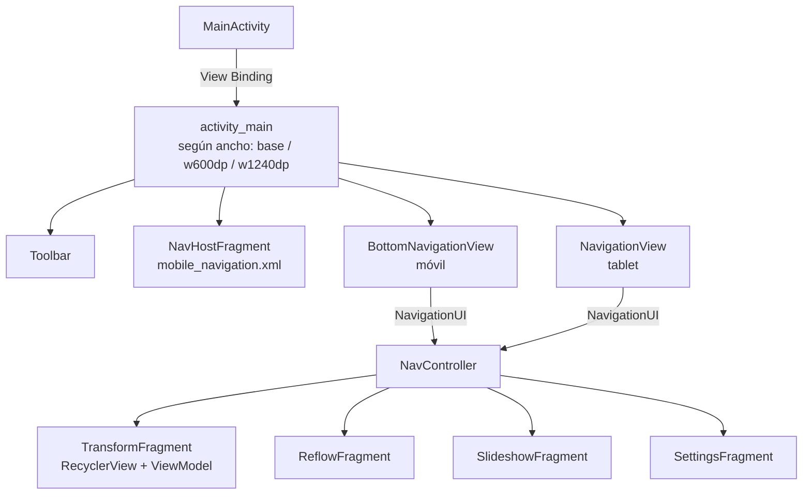

---
tags:
  - android
  - proyecto-profesor
  - nivel/6
  - tema/navegacion
  - tema/recyclerview
aliases:
  - aaaa (profesor)
  - Plantilla Responsive Views Activity
---

# aaaa — plantilla avanzada: Navigation, View Binding, ViewModel y RecyclerView

> [!info] Ficha rápida
> **Código:** `android/codigo/AndroidEjemploProyectos/aaaa` · **Nivel:** ⭐⭐⭐⭐⭐⭐ (avanzado, fuera de los PDFs)
> **PDF:** ninguno. Es la plantilla **"Responsive Views Activity"** de Android Studio, sin modificar.
> **Conceptos:** [27 — Navigation, View Binding y ViewModel](../02-conceptos/27-navigation-viewbinding-viewmodel.md) · [14 — RecyclerView](../02-conceptos/14-recyclerview.md) · [26 — Menús y Toolbar](../02-conceptos/26-menus-y-toolbar.md)

## 1. Objetivo del proyecto

El nombre `aaaa` delata que es un proyecto creado **para ver qué genera Android Studio** con la plantilla más compleja. No tiene código propio del profesor, pero es muy útil como **referencia de cómo se programa Android hoy**:

- Una app con **4 secciones** (Transform, Reflow, Slideshow, Settings), cada una un fragmento.
- La navegación **se adapta al tamaño de pantalla**:
  - **Móvil:** barra inferior (`BottomNavigationView`) con 3 secciones y Settings en el menú de tres puntos.
  - **Tablet (≥ 600dp de ancho):** menú lateral (`NavigationView`) fijo.
  - **Pantallas muy anchas (≥ 1240dp):** sin `DrawerLayout`; la `NavigationView` y el FAB van dentro de `content_main` (menú lateral siempre visible).
- "Transform" muestra 16 elementos (avatar + "This is item # N") en un **`RecyclerView`**: lista en móvil y **rejilla** en tablet.
- Botón flotante (**FAB**) que muestra un **Snackbar**.

## 2. Qué aprende el alumno (conceptos que no salen en los PDFs)

| Concepto | Dónde aparece | Qué sustituye de lo visto en clase |
|---|---|---|
| **View Binding** | `ActivityMainBinding`, `FragmentTransformBinding`… | Todos los `findViewById` |
| **Navigation Component** | `res/navigation/mobile_navigation.xml`, `NavController`, `NavHostFragment` | Las transacciones `replace()` a mano de [EjemploFragmentos2](EjemploFragmentos2.md) |
| **ViewModel + LiveData** | `TransformViewModel`, `ReflowViewModel`… | Guardar datos en la Activity (y perderlos al girar) |
| **RecyclerView + ListAdapter + DiffUtil** | `TransformFragment` | `ListView` + `BaseAdapter` |
| **Layouts por tamaño de pantalla** | `layout-w600dp/`, `layout-w1240dp/`, `values-w600dp/dimens.xml` | Un único layout para todos |
| **Tema MaterialComponents con ActionBar** | `Theme.Aaaa` (`DarkActionBar`) + `Theme.Aaaa.NoActionBar` | El `NoActionBar` de Material3 del resto de proyectos |
| **Snackbar y FAB** | `app_bar_main.xml`, `MainActivity` | El `Toast` |
| **Vector drawables** | `avatar_1..16.xml`, `ic_*_black_24dp.xml` | PNG/JPG |

## 3. Estructura

```
java/com/example/aaaa/
├── MainActivity.java                → View Binding + Toolbar + NavController + drawer/bottom nav + FAB
└── ui/
    ├── transform/TransformFragment.java · TransformViewModel.java  → RecyclerView de 16 items
    ├── reflow/ReflowFragment.java · ReflowViewModel.java           → un texto
    ├── slideshow/SlideshowFragment.java · SlideshowViewModel.java  → un texto
    └── settings/SettingsFragment.java · SettingsViewModel.java     → un texto
res/
├── navigation/mobile_navigation.xml   → grafo: 4 destinos, empieza en nav_transform
├── menu/bottom_navigation.xml · navigation_drawer.xml · overflow.xml
├── layout/  activity_main · app_bar_main · content_main · nav_header_main
│            fragment_transform · item_transform · fragment_reflow · fragment_slideshow · fragment_settings
├── layout-w600dp/  activity_main · app_bar_main · content_main · fragment_transform · item_transform
├── layout-w1240dp/ activity_main · app_bar_main · content_main
├── values/ strings · colors (purple/teal) · dimens · themes
├── values-w600dp/dimens.xml · values-w936dp/dimens.xml
└── drawable/ avatar_1..16.xml · ic_camera/gallery/slideshow/settings_black_24dp.xml · side_nav_bar.xml
```

## 4. Flujo de funcionamiento

1. `MainActivity.onCreate` infla el layout **con View Binding**: `ActivityMainBinding.inflate(getLayoutInflater())` → `setContentView(binding.getRoot())`. Android elige automáticamente `layout/`, `layout-w600dp/` o `layout-w1240dp/` según el ancho.
2. `setSupportActionBar(binding.appBarMain.toolbar)`: la Toolbar del layout pasa a ser la barra de la app.
3. Si en este layout existe el FAB (`binding.appBarMain.fab != null`), al pulsarlo muestra un Snackbar.
4. Obtiene el `NavController` del `NavHostFragment` (`nav_host_fragment_content_main`), que carga el grafo `mobile_navigation.xml` y muestra el destino inicial, `nav_transform`.
5. Si existe `navView` (tablet) → lo conecta al `NavController` con 4 destinos de nivel superior. Si existe `bottomNavView` (móvil) → lo conecta con 3.
6. `onCreateOptionsMenu`: si **no** hay menú lateral, infla `overflow.xml` (Settings en los tres puntos).
7. Al tocar una sección, `NavigationUI` llama a `navController.navigate(id)` → el `NavHostFragment` sustituye el fragmento.
8. `TransformFragment.onCreateView` → pide su `TransformViewModel` → observa `getTexts()` → `adapter.submitList(lista)` → el `RecyclerView` pinta los 16 elementos.



## 5. Clases

### `MainActivity`

| Variable | Tipo | Para qué sirve |
|---|---|---|
| `mAppBarConfiguration` | `AppBarConfiguration` | Qué destinos son de "nivel superior" (sin flecha ←) |
| `binding` (local) | `ActivityMainBinding` | Acceso tipado a todas las vistas con id |

| Método | Cuándo | Qué hace |
|---|---|---|
| `onCreate` | Al abrir | Binding, Toolbar, FAB y conexión de la navegación |
| `onCreateOptionsMenu` | Al crear la barra | Añade Settings al menú si no hay drawer |
| `onOptionsItemSelected` | Al elegir Settings | `navController.navigate(R.id.nav_settings)` |
| `onSupportNavigateUp` | Al pulsar la flecha ← de la Toolbar | `NavigationUI.navigateUp(...)` |

```java
// View Binding: Android genera ActivityMainBinding a partir de activity_main.xml
// (nombre del layout en PascalCase + "Binding"). Cada vista con id es un campo:
// android:id="@+id/nav_view" → binding.navView. Sin findViewById y sin casteos.
ActivityMainBinding binding = ActivityMainBinding.inflate(getLayoutInflater());
setContentView(binding.getRoot());

// <include android:id="@+id/app_bar_main" …> → binding.appBarMain (otro binding anidado)
setSupportActionBar(binding.appBarMain.toolbar);

// El FAB solo existe en algunos layouts (según el ancho), por eso se comprueba null.
if (binding.appBarMain.fab != null) {
    binding.appBarMain.fab.setOnClickListener(view ->
            Snackbar.make(view, "Replace with your own action", Snackbar.LENGTH_LONG)
                    .setAction("Action", null)          // botón de acción del Snackbar (aquí sin hacer nada)
                    .setAnchorView(R.id.fab)            // aparece encima del FAB, no tapándolo
                    .show());
}

NavHostFragment navHostFragment =
        (NavHostFragment) getSupportFragmentManager().findFragmentById(R.id.nav_host_fragment_content_main);
NavController navController = navHostFragment.getNavController();   // "el mando" de la navegación

NavigationView navigationView = binding.navView;                     // null en móvil
if (navigationView != null) {
    mAppBarConfiguration = new AppBarConfiguration.Builder(
            R.id.nav_transform, R.id.nav_reflow, R.id.nav_slideshow, R.id.nav_settings)
            .setOpenableLayout(binding.drawerLayout)   // la hamburguesa ☰ abre el drawer
            .build();
    NavigationUI.setupActionBarWithNavController(this, navController, mAppBarConfiguration); // título + flecha
    NavigationUI.setupWithNavController(navigationView, navController);                      // menú → destinos
}
BottomNavigationView bottom = binding.appBarMain.contentMain.bottomNavView;   // null en tablet
if (bottom != null) { … lo mismo con 3 destinos … }
```

> [!important] 📌 Importante: los ids del menú = los ids del grafo
> `NavigationUI.setupWithNavController` funciona porque cada `<item android:id="@+id/nav_reflow">` del menú tiene **el mismo id** que un `<fragment android:id="@+id/nav_reflow">` del grafo de navegación. Al tocar el ítem, navega al destino con ese id. Si no coinciden, el menú no hace nada.

### `TransformFragment` (RecyclerView moderno)

```java
public View onCreateView(@NonNull LayoutInflater inflater, ViewGroup container, Bundle savedInstanceState) {
    // ViewModelProvider devuelve SIEMPRE el mismo ViewModel para este fragmento,
    // también tras girar la pantalla: los datos no se recrean.
    TransformViewModel vm = new ViewModelProvider(this).get(TransformViewModel.class);
    binding = FragmentTransformBinding.inflate(inflater, container, false);

    RecyclerView recyclerView = binding.recyclerviewTransform;
    ListAdapter<String, TransformViewHolder> adapter = new TransformAdapter();
    recyclerView.setAdapter(adapter);
    // Cuando cambie la lista, submitList calcula las diferencias (DiffUtil) y solo repinta lo que cambia.
    vm.getTexts().observe(getViewLifecycleOwner(), adapter::submitList);   // referencia a método
    return binding.getRoot();
}

@Override
public void onDestroyView() {
    super.onDestroyView();
    binding = null;   // el fragmento puede vivir más que su vista: soltar el binding evita fugas de memoria
}
```
- **`TransformAdapter extends ListAdapter<String, TransformViewHolder>`:** un `RecyclerView.Adapter` que ya gestiona la lista. Recibe un `DiffUtil.ItemCallback` (cómo saber si dos elementos son "el mismo" y si su contenido cambió).
- **`onCreateViewHolder`:** infla `item_transform` (con binding) **solo unas pocas veces**.
- **`onBindViewHolder`:** rellena un holder ya existente con el texto y el avatar de la posición. Es el reciclaje que a `BaseAdapter` le falta en los demás proyectos.
- **`TransformViewHolder`:** guarda `imageView` y `textView` para no buscarlos otra vez.
- El `LayoutManager` **no está en Java**: se declara en `fragment_transform.xml` (`LinearLayoutManager` en móvil; `GridLayoutManager` con `spanCount=4` en `layout-w600dp`).

### `TransformViewModel` (y los otros 3 ViewModels)

```java
public class TransformViewModel extends ViewModel {
    private final MutableLiveData<List<String>> mTexts;   // Mutable: solo el ViewModel la cambia
    public TransformViewModel() {
        mTexts = new MutableLiveData<>();
        List<String> texts = new ArrayList<>();
        for (int i = 1; i <= 16; i++) texts.add("This is item # " + i);
        mTexts.setValue(texts);
    }
    public LiveData<List<String>> getTexts() { return mTexts; }  // hacia fuera, solo lectura
}
```
`ReflowViewModel`, `SlideshowViewModel` y `SettingsViewModel` son iguales, pero con un único `String`.

## 6. Layouts

| Layout | Contenido | Notas |
|---|---|---|
| `activity_main.xml` (base) | `FrameLayout` → `DrawerLayout drawer_layout` → `<include app_bar_main>` | En móvil el drawer **no** tiene `NavigationView` → `binding.navView == null` |
| `layout-w600dp/activity_main.xml` | Incluye además la `NavigationView nav_view` | Drawer en tablet |
| `app_bar_main.xml` | `CoordinatorLayout` → `AppBarLayout` + `Toolbar toolbar` → `<include content_main>` → FAB `fab` | El `CoordinatorLayout` interior hace que el Snackbar no tape la barra inferior |
| `content_main.xml` | `FragmentContainerView nav_host_fragment_content_main` (`name=NavHostFragment`, `navGraph=@navigation/mobile_navigation`, `defaultNavHost=true`) + `BottomNavigationView bottom_nav_view` | `defaultNavHost`: el botón Atrás del sistema navega dentro del grafo |
| `fragment_transform.xml` | `RecyclerView recyclerview_transform` con `app:layoutManager="LinearLayoutManager"` | En `w600dp`: `GridLayoutManager` de 4 columnas |
| `item_transform.xml` | `image_view_item_transform` + `text_view_item_transform` | `tools:src="@tools:sample/avatars"` solo en el editor |
| `fragment_reflow/slideshow/settings.xml` | Un `TextView` centrado | |
| `nav_header_main.xml` | Cabecera del menú lateral | |

**`res/navigation/mobile_navigation.xml`:**
```xml
<navigation … android:id="@+id/mobile_navigation" app:startDestination="@+id/nav_transform">
    <fragment android:id="@+id/nav_transform"
              android:name="com.example.aaaa.ui.transform.TransformFragment"
              android:label="@string/menu_transform"
              tools:layout="@layout/fragment_transform" />
    … nav_reflow, nav_slideshow, nav_settings …
</navigation>
```
- `android:name`: la clase del fragmento que se muestra en ese destino.
- `android:label`: el título que pone en la Toolbar al llegar.
- `tools:layout`: solo sirve para la vista previa del editor de navegación.

**Carpetas con cualificador** (`layout-w600dp`, `values-w936dp`…): Android escoge en tiempo de ejecución el archivo cuyo cualificador encaja con la pantalla. Es la misma idea que `values-night/` para el modo oscuro.

## 7. Manifest

```xml
<activity
    android:name=".MainActivity"
    android:exported="true"
    android:label="@string/app_name"
    android:resizeableActivity="true"
    android:theme="@style/Theme.Aaaa.NoActionBar"
    tools:targetApi="24">
```
- `resizeableActivity="true"`: permite multiventana y pantalla partida.
- `theme=".NoActionBar"`: esta Activity no usa la ActionBar del tema; usa su propia `Toolbar`.
Sin permisos.

## 8. Gradle

```kotlin
android {
    …
    buildFeatures {
        viewBinding = true      // ← genera las clases XxxBinding. Sin esto, ActivityMainBinding no existe
    }
}
dependencies {
    implementation(libs.lifecycle.livedata.ktx)   // LiveData
    implementation(libs.lifecycle.viewmodel.ktx)  // ViewModel
    implementation(libs.navigation.fragment)      // NavHostFragment
    implementation(libs.navigation.ui)            // NavigationUI (conecta menús y Toolbar)
    implementation(libs.recyclerview)             // RecyclerView (1.3.0)
    …
}
```

| Librería | Para qué | Dónde | ¿Reutilizable? |
|---|---|---|---|
| `lifecycle-livedata-ktx` 2.11.0 | `LiveData`, `MutableLiveData` | ViewModels | ✅ |
| `lifecycle-viewmodel-ktx` 2.11.0 | `ViewModel`, `ViewModelProvider` | Fragmentos | ✅ |
| `navigation-fragment` 2.10.1 | `NavHostFragment`, grafo | `content_main.xml` | ✅ |
| `navigation-ui` 2.10.1 | `NavigationUI`, `AppBarConfiguration` | `MainActivity` | ✅ |
| `recyclerview` 1.3.0 | `RecyclerView`, `ListAdapter` | `TransformFragment` | ✅ |

> [!note] Curiosidad
> Este proyecto **no** incluye `activity-ktx` ni usa `EdgeToEdge`: la plantilla *Responsive Views Activity* es más antigua que la *Empty Views Activity* y usa `fitsSystemWindows` en el `DrawerLayout`.

## 9. ⚠️ Qué tener en cuenta

> [!warning] ⚠️ Cuidado: no es materia de examen (salvo que el profesor lo diga)
> Nada de esto aparece en los PDFs. Úsalo para **entender hacia dónde va** lo que haces en clase: cómo se escribe hoy lo mismo con menos código y menos errores.

> [!tip] 💡 Recomendación
> - Textos en inglés de la plantilla ("This is item # 1"…): tradúcelos en `strings.xml` si lo usas de base.
> - El `assert navHostFragment != null` no hace nada en Android (los `assert` están desactivados); si el id estuviera mal, fallaría en la línea siguiente con `NullPointerException`.

## 10. Ejercicios (avanzados)

1. Cambia el texto de `ReflowViewModel` y comprueba que sobrevive al girar la pantalla.
2. Sustituye los 16 elementos de Transform por tus 6 jugadores de [EjercicioSpinner](EjercicioSpinner.md).
3. Añade una quinta sección "Acerca de": fragmento + entrada en el grafo + ítem en `bottom_navigation.xml` y `navigation_drawer.xml` (con el mismo id).
4. Activa `viewBinding = true` en [DisenyoPesos](DisenyoPesos.md) y reescribe `MainActivity` sin `findViewById`.
5. Ejecuta en un emulador de tablet (Pixel Tablet) y compara con el de móvil.

## Relacionado

- [27 — Navigation, View Binding y ViewModel](../02-conceptos/27-navigation-viewbinding-viewmodel.md)
- [14 — RecyclerView](../02-conceptos/14-recyclerview.md)
