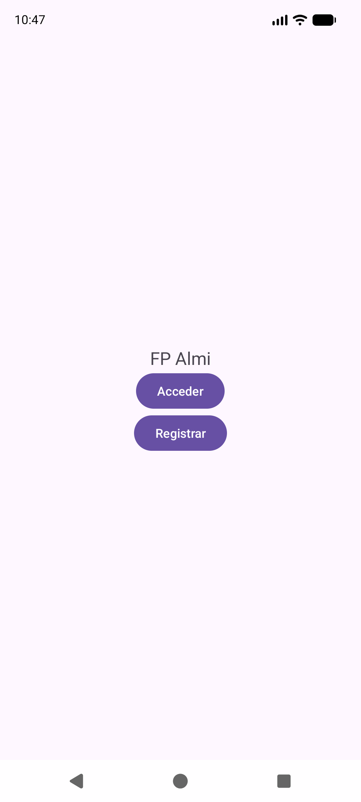
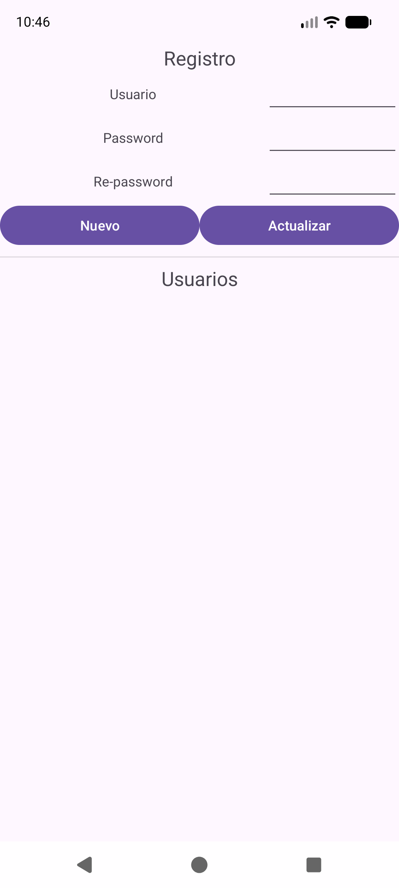
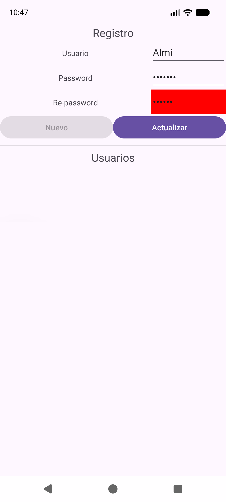
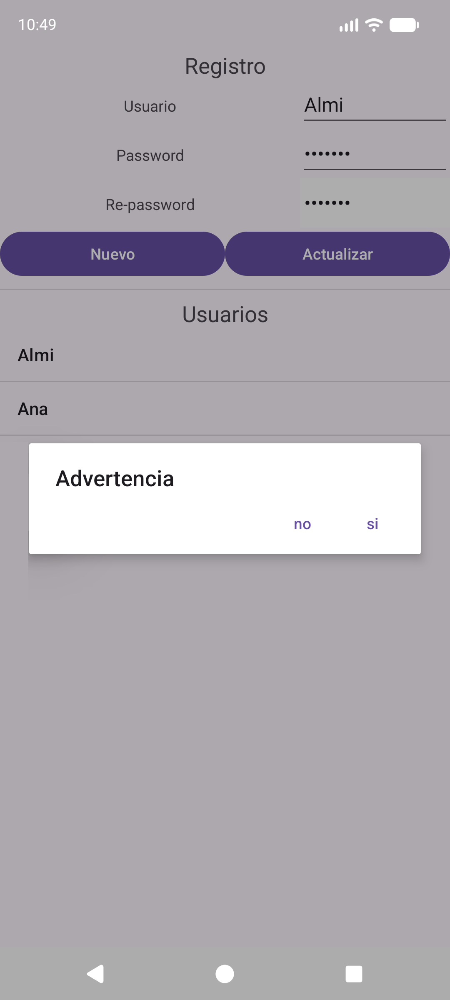
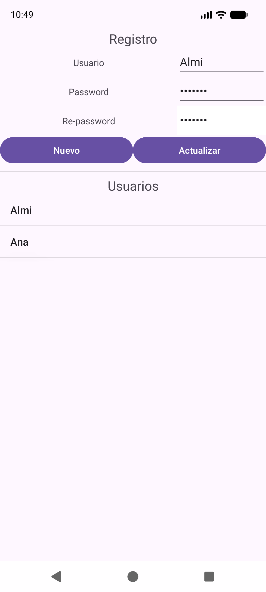
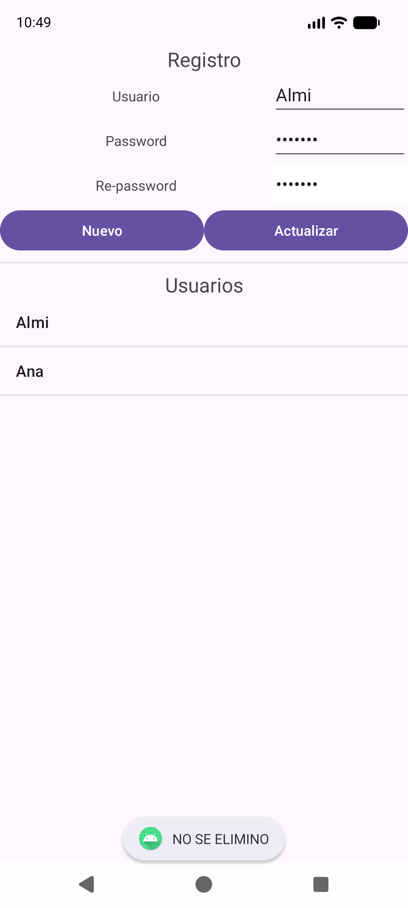
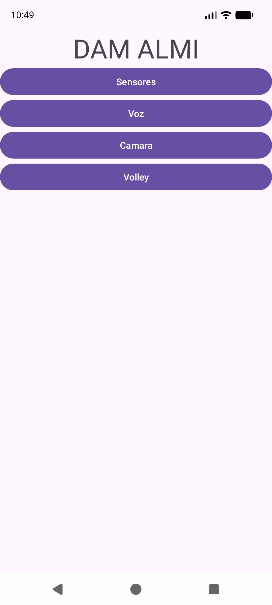

---
tags:
  - android
  - proyecto
  - estado/completo
---

# Proyecto: `EjemploDialogoPersonalizado`

> **Nota:** este documento sustituye a la versión anterior, que describía un esqueleto con solo un login "de mentira". El proyecto ahora es una **app completa de login + registro con base de datos local (Room)**. Sigue el PDF `adjuntos/pdfs/1-DialogSQLitePersonalizado.pdf`.

## Qué es

Una app con tres pantallas y una base de datos local de usuarios:

| Pantalla | Qué hace |
|---|---|
| **`MainActivity`** | Inicio ("FP Almi"). Botón **Acceder** (abre el diálogo de login) y botón **Registrar** (va a `RegisterActivity`) |
| **Diálogo `LoginDialogFrag`** | Pide usuario y contraseña, los busca en la base de datos y, si existen, abre `CentralActivity` |
| **`RegisterActivity`** | CRUD de usuarios: **C**rear (Nuevo), **R**ead/listar, **U**pdate (Actualizar) y **D**elete (clic largo) |
| **`CentralActivity`** | Menú al que se llega tras el login: cuatro botones (Sensores, Voz, Cámara, Volley) **todavía sin programar**, pensados para temas futuros |

Flujo típico: **Registrar** → crear un usuario → volver → **Acceder** → escribir esos datos → pantalla central.

## Así se ve la app (capturas reales)

Capturas hechas ejecutando el proyecto en un emulador (Android 17). Para ejecutarlo tú, sigue la [Guía: cómo abrir, ejecutar y probar una app](../01-guias/01-ejecutar-la-app.md).

| 1. Inicio | 2. Diálogo de login | 3. Registro vacío |
|---|---|---|
|  |  |  |

| 4. Contraseñas distintas | 5. Dos usuarios en la lista | 6. Clic largo: borrar |
|---|---|---|
|  |  |  |

| 7. Clic corto: cargar usuario | 8. Aviso al cancelar | 9. Pantalla central |
|---|---|---|
|  |  |  |

> En la captura 4 se ve la validación: el campo Re-password en **rojo** y el botón *Nuevo* en **gris** (desactivado).

## Estructura

```
app/src/main/java/com/example/ejemplodialogopersonalizado/
├── MainActivity.java              → pantalla inicial (Acceder / Registrar)
├── RegisterActivity.java          → CRUD de usuarios con ListView
├── CentralActivity.java           → pantalla de destino tras el login
├── model/
│   └── Usuario.java               → la entidad (la tabla)
├── bbdd/
│   ├── UsuariosDao.java           → operaciones sobre la tabla
│   ├── AppDatabase.java           → la base de datos (Singleton)
│   └── AppExecutors.java          → hilos para no bloquear la pantalla
├── adaptadores/
│   └── UsuariosAdapter.java       → rellena el ListView
└── fragmentos/
    └── LoginDialogFrag.java       → diálogo de login (DialogFragment)

app/src/main/res/layout/
├── activity_main.xml       activity_register.xml
├── activity_central.xml    dialog_per.xml  (el diseño del diálogo)
```

## Orden recomendado para construirlo (como en el PDF)

1. **Diálogo sin base de datos**: `activity_main.xml` + botón Acceder → `dialog_per.xml` → `LoginDialogFrag` → comprobar con un usuario fijo (`Almi`/`Almi123`).
2. **`CentralActivity`** y lanzarla con un `Intent` cuando el login es correcto.
3. **`RegisterActivity`**: su layout + botón Registrar en `MainActivity`.
4. **Room**: dependencias → `Usuario` → `UsuariosDao` → `AppDatabase` → `AppExecutors`.
5. **`UsuariosAdapter`** y conectar el `ListView` en `RegisterActivity` (insertar + listar con `LiveData`).
6. **Editar y borrar**: clic corto, clic largo con `AlertDialog`, botón Actualizar.
7. **Validación** de contraseñas con `TextWatcher`.
8. **Login contra la BD**: `loadUsuarioByNamePass` + `getDiskIO` / `getMainThread`.

---

## `MainActivity.java` — dos botones

```java
btnAcceder = findViewById(R.id.btnAcceder);
btnAcceder.setOnClickListener(new View.OnClickListener() {
    @Override public void onClick(View v) {
        dialog = new LoginDialogFrag();
        dialog.show(getSupportFragmentManager(), "Login");
    }
});

btnRegistro = findViewById(R.id.btnRegistro);
btnRegistro.setOnClickListener(new View.OnClickListener() {
    @Override public void onClick(View v) {
        Intent intent = new Intent(getApplicationContext(), RegisterActivity.class);
        startActivity(intent);
    }
});
```
- **Acceder**: crea el diálogo y lo muestra con el gestor de fragmentos (ver [18-dialogos](../02-conceptos/18-dialogos.md)).
- **Registrar**: un `Intent` explícito a otra `Activity` (ver [11-intent-en-profundidad](../02-conceptos/11-intent-en-profundidad.md)).
- El bloque `EdgeToEdge` + `setOnApplyWindowInsetsListener` es el arranque estándar que se repite en todos los proyectos (ver [01-fundamentos](../02-conceptos/01-fundamentos-bundle-intent-ciclo-vida.md)).

## `model/Usuario.java` — la entidad

`@Entity(tableName = "Usuario")` convierte la clase en una **tabla** con tres columnas: `id` (clave primaria autogenerada), `usuario` y `password`. Tiene un constructor vacío (lo usa Room) y otro de dos parámetros marcado con `@Ignore` (lo usamos nosotros). Detalle completo en [17-room-base-de-datos](../02-conceptos/17-room-base-de-datos.md).

## `bbdd/UsuariosDao.java` — las operaciones

| Método | Anotación | Para qué |
|---|---|---|
| `loadAllUsusarios()` | `@Query` → `LiveData<List<Usuario>>` | Toda la tabla; la pantalla se actualiza sola |
| `insertUsuario(u)` | `@Insert` | Registrar un usuario nuevo |
| `updateUsuario(u)` | `@Update` | Modificar uno existente (por `id`) |
| `deleteUsuario(u)` | `@Delete` | Borrar (por `id`) |
| `loadUsuarioById(id)` | `@Query` | Buscar por `id` (para editar/borrar) |
| `loadUsuarioByNamePass(usu, pass)` | `@Query` | **El login**: `null` si no coincide |

> `loadAllUsusarios` lleva una errata en el nombre ("Ususarios"); es válida mientras se escriba igual en todos los sitios, pero conviene renombrarla (`Refactor → Rename` en Android Studio).

## `bbdd/AppDatabase.java` — la base de datos

`@Database(entities = {Usuario.class}, version = 1, exportSchema = false)`, clase `abstract` con **Singleton** (`getInstance`, `LOCK`, `sInstance`) y el método `usuariosDao()` que da acceso al DAO. El fichero queda como `AppDatabase` (el PDF lo llamaba `UsuariosBD`). Ver [17](../02-conceptos/17-room-base-de-datos.md).

## `bbdd/AppExecutors.java` — hilos

Tres ejecutores: `getDiskIO()` (un hilo, para la BD), `getMainThread()` y `getNetworkIO()`. **Aviso:** el orden de los parámetros en `getInstance()` está cambiado respecto al constructor (igual que en el PDF), por lo que `getMainThread()` no devuelve realmente el hilo principal. Explicación y corrección en [20-executors-y-livedata](../02-conceptos/20-executors-y-livedata.md).

## `adaptadores/UsuariosAdapter.java` — la lista

Hereda de `ArrayAdapter<Usuario>` pero **sobrescribe** `getCount`, `getItem` y `getView` para usar su propia lista `mUsuarioList`:

```java
@Override
public View getView(int position, View convertView, ViewGroup parent) {
    LayoutInflater inflater = LayoutInflater.from(context);
    View view = inflater.inflate(android.R.layout.simple_list_item_1, parent, false);
    TextView tvUsuario = view.findViewById(android.R.id.text1);
    tvUsuario.setText(mUsuarioList.get(position).getUsuario());
    return view;
}

public void setmUsuarioList(List<Usuario> lista) {
    this.mUsuarioList = lista;
    notifyDataSetChanged();     // "la lista cambió, redibuja"
}
```
- Usa una fila **ya incluida en Android** (`simple_list_item_1`, con un único `TextView` de id `text1`), por eso no hay layout propio de fila.
- El segundo parámetro del constructor (`1`) es el "recurso de fila" que exige `ArrayAdapter`; como `getView` está sobrescrito, **nunca se usa**. El PDF lo explica: se pasa `1` porque no hay un layout contenedor.
- **Mejora posible:** `getView` crea una fila nueva cada vez e ignora `convertView`. Reutilizarla (ver [07-adaptadores](../02-conceptos/07-adaptadores.md)) es más eficiente.

## `RegisterActivity.java` — el CRUD

Atributos: `lvUsers` (lista), `etNombre/etPassword/etRePassword`, dos botones, `mDb` (BD), `usuariosAdapter` y **`idUsuario = -1`** (a quién editar; `-1` = nadie).

Todo lo que ocurre en `onCreate`:

| Acción del usuario | Qué pasa |
|---|---|
| Abre la pantalla | Se obtiene la BD (`AppDatabase.getInstance`), se crea el adaptador y se llama a `consultarUsuarios()` |
| Escribe y pulsa **Nuevo** | `guardarUsuario(user, password)` → `insertUsuario` en `getDiskIO()` |
| **Clic corto** en un usuario | Guarda su `id` en `idUsuario` y rellena los tres campos |
| Cambia datos y pulsa **Actualizar** | `actualizar(idUsuario, user, pass)` → busca por `id`, cambia y `updateUsuario` |
| **Clic largo** en un usuario | `AlertDialog` "Advertencia": *sí* → `eliminar(id)`; *no* → `Toast` |
| Escribe en **Re-password** | El `TextWatcher` activa/desactiva *Nuevo* y pone el campo rojo/blanco |

### `consultarUsuarios()` — la lista que se refresca sola
```java
mDb.usuariosDao().loadAllUsusarios().observe(this, new Observer<List<Usuario>>() {
    @Override public void onChanged(List<Usuario> usuarios) {
        usuariosAdapter.setmUsuarioList(usuarios);
    }
});
```
Se llama **una vez**. Después, cada insertar/actualizar/borrar dispara `onChanged` y la lista se redibuja sola (ver [20-executors-y-livedata](../02-conceptos/20-executors-y-livedata.md)).

### Operaciones en segundo plano
`guardarUsuario`, `actualizar` y `eliminar` siguen el mismo esquema: `AppExecutors.getInstance().getDiskIO().execute(new Runnable() { ... })`, porque **Room no permite operar en el hilo principal**.

### `eliminar` y `actualizar` buscan primero
`@Delete` y `@Update` necesitan el objeto `Usuario` completo. Por eso se hace `loadUsuarioById(id)` y se comprueba `if (usu != null)` antes de operar.

Los listeners (`OnItemClick`, `OnItemLongClick`, `TextWatcher`) están explicados en [19-textwatcher-y-eventos-de-lista](../02-conceptos/19-textwatcher-y-eventos-de-lista.md) y el `AlertDialog` en [18-dialogos](../02-conceptos/18-dialogos.md).

## `fragmentos/LoginDialogFrag.java` — el login

Es un `DialogFragment` con el diseño `dialog_per.xml`. Sus métodos (`onCreateDialog`, `onCreateView`, `onViewCreated`) están descritos en [18-dialogos](../02-conceptos/18-dialogos.md). La lógica del botón **Aceptar**:

```java
AppExecutors.getInstance().getDiskIO().execute(new Runnable() {
    @Override public void run() {
        final Usuario usu = mDb.usuariosDao().loadUsuarioByNamePass(nombre, password);
        AppExecutors.getInstance().getMainThread().execute(new Runnable() {
            @Override public void run() {
                if (usu != null) {
                    startActivity(new Intent(getContext(), CentralActivity.class));
                } else {
                    dismiss();
                }
            }
        });
    }
});
```
1. Consulta en **segundo plano**.
2. Vuelta a "la pantalla" para abrir la Activity o cerrar el diálogo.

**Botón Cancelar:** `dismiss()`.

## `CentralActivity.java` y `activity_central.xml`

Solo el arranque estándar. Su layout tiene el texto "DAM ALMI" y cuatro botones (`btnSensores`, `btnVoz`, `btnCamara`, `btnVolley`) **sin ningún `setOnClickListener`**: son el punto de partida de los temas siguientes del curso (sensores, reconocimiento de voz, cámara y la librería de red Volley).

## Los layouts

- **`dialog_per.xml`** — logo (`@drawable/logo_almi`, un `.jpg` en `res/drawable`), dos filas `TextView` + `EditText` con `layout_weight="1"` (ver [02-diseno-basado-en-pesos](../02-conceptos/02-diseno-basado-en-pesos.md)) y dos botones. `inputType="textPassword"` oculta la contraseña.
- **`activity_register.xml`** — título, tres filas (pesos 2:1), botones Nuevo/Actualizar, una línea separadora (`?android:attr/listDivider`), otro título y el `ListView` `lvUsers`.
- **`activity_main.xml`** — `LinearLayout` vertical centrado con texto y dos botones.

## `AndroidManifest.xml`

Las tres `Activity` están declaradas. **Solo `MainActivity`** lleva `intent-filter` con `MAIN` + `LAUNCHER` (es la que se abre al tocar el icono) y `exported="true"`; `CentralActivity` y `RegisterActivity` llevan `exported="false"` (solo la propia app puede abrirlas). `windowSoftInputMode="adjustResize"` hace que el teclado no tape los campos.

## Compilación (nota de entorno)

`gradle/libs.versions.toml` fija la versión del plugin de Android (`agp`). Con **AGP 9.4.1** Android Studio avisó de "versión incompatible" (la más reciente soportada era la 9.3.0); se solucionó con `agp = "9.3.0"`. Si se actualiza Android Studio, se puede volver a subir. Room va en `app/build.gradle.kts` (`room-runtime` y `room-compiler`, ambos `2.8.5`).

## Bugs y detalles reales encontrados

| Qué | Explicación |
|---|---|
| `AlertaDialog` en vez de `AlertDialog` | Errata de una letra → error de compilación `cannot find symbol`. **Corregido.** |
| `AlertDialog` sin `setMessage` | El usuario ve "Advertencia" pero no qué se borrará. Recomendado añadir un mensaje. |
| Login fallido silencioso | El `Toast` de error está comentado; el diálogo solo desaparece. |
| Orden de parámetros en `AppExecutors` | `getMainThread()` no es el hilo principal (igual que en el PDF). Ver [20](../02-conceptos/20-executors-y-livedata.md). |
| Actualizar sin seleccionar | `idUsuario == -1` → no ocurre nada, sin aviso. |
| Se puede guardar usuario vacío / repetido | El botón *Nuevo* está activo al abrir (vacío = vacío) y no hay restricción `UNIQUE`. |
| El `TextWatcher` solo vigila Re-password | Editar Password después no revalida. |
| Contraseñas en texto plano | Aceptable en un ejercicio; en una app real, nunca. |

## Ejercicios sobre este proyecto

- **[Nivel 7 — Mejoras del proyecto real](../07-ejercicios/07-nivel-7-mejoras-del-proyecto.md)**: arreglar exactamente los fallos de la tabla de arriba (mensaje del diálogo, `AppExecutors`, login, actualizar sin seleccionar, validación, usuarios repetidos). Cada uno con su solución **probada en el emulador**. (El cifrado de contraseñas está como extra opcional, no visto en clase.)
- **[Nivel 6 — Diálogos y Room](../07-ejercicios/06-nivel-6-dialogos-y-room.md)**: los mismos pasos del PDF (`AlertDialog` → `DialogFragment` → entidad → DAO → BD → Activity) construidos desde cero en pequeño.
- **[Simulacro C — Login y registro con Room y diálogos](../07-ejercicios/08-simulacros-de-examen.md)**: un examen completo con este mismo proyecto.
- Código de todas las soluciones: `android/codigo/proyectos-zip/EjemploDialogoPersonalizado-con-soluciones.zip`.

## Ver también
- [17 — Room](../02-conceptos/17-room-base-de-datos.md) · [18 — Diálogos](../02-conceptos/18-dialogos.md) · [19 — TextWatcher y eventos de lista](../02-conceptos/19-textwatcher-y-eventos-de-lista.md) · [20 — Executors y LiveData](../02-conceptos/20-executors-y-livedata.md)
- [16 — Fragmentos](../02-conceptos/16-fragmentos.md) — el `DialogFragment` es un tipo de fragmento.
- [07 — Adaptadores](../02-conceptos/07-adaptadores.md) — `ArrayAdapter`, `getView`, `notifyDataSetChanged`.
- [00 — Programación básica](../02-conceptos/00-programacion-basica.md) — `extends`, interfaces, clases anónimas, `static`, `null`.
- [anclados](anclados.md) — el mismo arranque estándar, para comparar.
