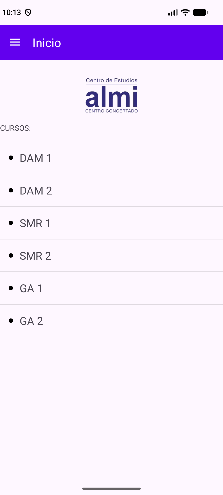
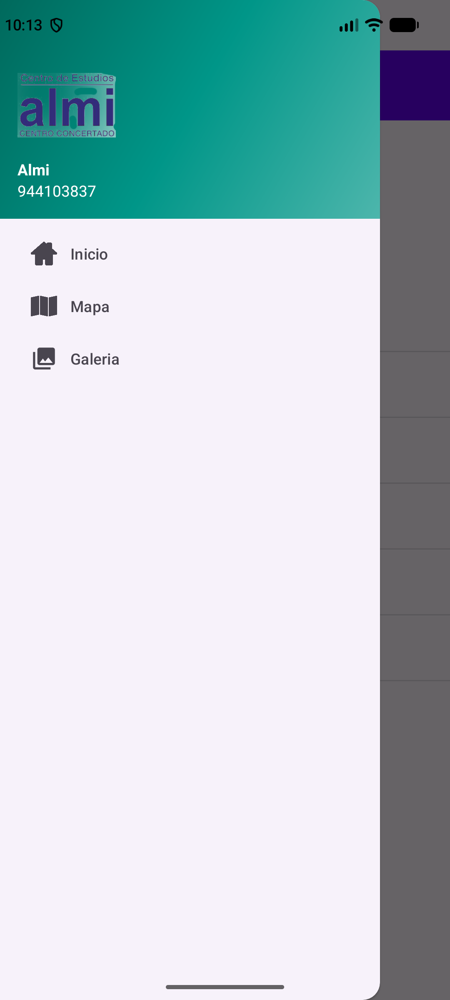
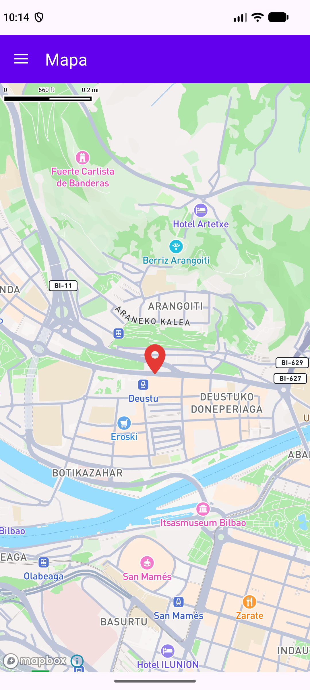
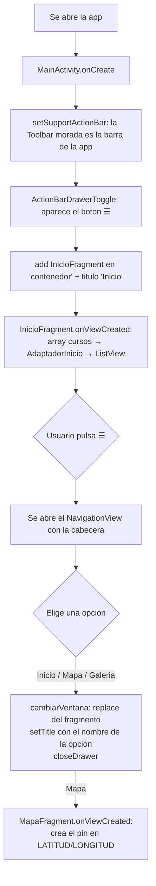

---
tags:
  - android
  - proyecto
  - tema/fragmentos
  - tema/menus
  - tema/adaptadores
  - tema/mapas
---

# Proyecto: `MyApplication`

> [!info] Ficha rápida
> **Código:** `AndroidStudioProjects\MyApplication` (copia en `codigo/proyectos-alumno/MyApplication`)
> **Se parece a:** la parte de arriba de `RetoIndividual1` (`Downloads\Examen.zip`): Toolbar morada + menú lateral con foto
> **Conceptos:** [16 — Fragmentos](../02-conceptos/16-fragmentos.md) · [07 — Adaptadores](../02-conceptos/07-adaptadores.md) · [26 — Menús y Toolbar](../02-conceptos/26-menus-y-toolbar.md) · [15 — Drawables y formas](../02-conceptos/15-drawables-formas-y-selectores.md) · [25 — Gradle y librerías](../02-conceptos/25-gradle-y-librerias.md)

## Qué hace la app

Una sola Activity con **3 ventanas (fragmentos)** que se eligen desde un **menú lateral (drawer)**:

| Inicio | Menú lateral | Mapa |
|---|---|---|
|  |  |  |
| Logo + lista de cursos (sale de un array de `values`) con un punto negro en cada fila | Se abre con ☰. Cabecera con el logo, "Almi" y el teléfono | Mapa de **Mapbox** con un pin rojo en una ubicación |

## Archivos del proyecto

| Tipo | Archivo | Para qué sirve |
|---|---|---|
| Activity | `MainActivity.java` | Toolbar, botón ☰, menú lateral y cambio de fragmentos |
| Fragmento | `fragmentos/InicioFragment.java` | Mete el array de cursos en la lista |
| Fragmento | `fragmentos/MapaFragment.java` | Pone el pin rojo en el mapa |
| Fragmento | `fragmentos/GaleriaFragment.java` | Solo un texto (sin hacer todavía) |
| Adaptador | `adaptadores/AdaptadorInicio.java` | Crea una fila de la lista por cada curso |
| Layout | `activity_main.xml` | `DrawerLayout` → pantalla (Toolbar + contenedor) + `NavigationView` |
| Layout | `nav_header_main.xml` | Cabecera del menú lateral (logo, nombre, teléfono) |
| Layout | `fragment_inicio.xml` · `item_curso.xml` | Pantalla de Inicio · una fila de la lista |
| Layout | `fragment_mapa.xml` · `fragment_galeria.xml` | El mapa · el texto de Galería |
| Menú | `menu/bottom_navigation.xml` | Las 3 opciones del menú lateral (id, icono, texto) |
| Valores | `values/array.xml` | El `string-array` `cursos` (DAM 1, DAM 2…) |
| Valores | `values/mapbox_access_token.xml` | El token público de Mapbox (`pk.…`) |
| Drawables | `side_nav_bar.xml` · `punto_negro.xml` · `ic_marcador.xml` · `logo.png` | Degradado de la cabecera · punto de la lista · pin del mapa · logo de almi (Inicio y cabecera) |
| Gradle | `settings.gradle.kts` · `libs.versions.toml` · `app/build.gradle.kts` | Añaden la librería de Mapbox |

## Flujo: qué pasa desde que abres la app



---

## 1. La pantalla principal: `DrawerLayout` + Toolbar

### `activity_main.xml`

El **`DrawerLayout`** es la raíz y tiene **2 hijos**:

```
DrawerLayout (id desplegable)
├── 1er hijo: LinearLayout vertical (id main)   ← la pantalla normal
│     ├── MaterialToolbar (id toolBar)          ← la barra morada
│     └── FrameLayout (id contenedor)           ← aquí se cargan los fragmentos
└── 2º hijo: NavigationView (id nav_view)       ← el menú lateral
      app:headerLayout="@layout/nav_header_main"
      app:menu="@menu/bottom_navigation"
      android:layout_gravity="start"            ← sale por la izquierda
```

- **Toolbar morada:** `android:background="@color/purple_500"` (`#FF6200EE`, el mismo morado del examen) y `app:titleTextColor="@color/white"`.
- **Contenedor:** `layout_height="0dp"` + `layout_weight="1"` = ocupa todo lo que sobra debajo de la Toolbar.
- **`layout_gravity="start"`** en el `NavigationView` es **obligatorio**: así el `DrawerLayout` sabe que es el menú que se esconde a la izquierda. Sin él, el menú se ve siempre encima de todo.

### `MainActivity.java`: la Toolbar y el botón ☰

```java
// Usar la Toolbar como barra de arriba de la app
setSupportActionBar(toolBar);

// El boton de las 3 rayas de la Toolbar: abre y cierra el menu lateral
ActionBarDrawerToggle toggle = new ActionBarDrawerToggle(this, desplegable, toolBar,
        R.string.abrir_menu, R.string.cerrar_menu);
desplegable.addDrawerListener(toggle);
toggle.syncState();
// Pintar las 3 rayas de blanco para que se vean sobre el morado
toggle.getDrawerArrowDrawable().setColor(ContextCompat.getColor(this, R.color.white));
```

| Línea | Qué hace |
|---|---|
| `setSupportActionBar(toolBar)` | El tema es `NoActionBar`, así que la app no trae barra. Esto convierte tu `MaterialToolbar` en la barra de la app |
| `new ActionBarDrawerToggle(...)` | Crea el botón ☰. Recibe: la Activity, el drawer que abre, la Toolbar donde se pinta y 2 textos de accesibilidad |
| `addDrawerListener(toggle)` | El botón se entera cuando el menú se abre o se cierra (también deslizando el dedo desde el borde) |
| `syncState()` | Dibuja el icono en su estado correcto. **Sin esto el ☰ no aparece** |
| `setColor(...white)` | Las 3 rayas en blanco |

> [!warning] ⚠️ El título de la Toolbar
> Para cambiarlo se usa **`setTitle(...)` de la Activity**, no `toolBar.setTitle(...)`. Después de `setSupportActionBar`, Android vuelve a poner el nombre de la app ("My Application") y pisa lo que pongas directamente en la Toolbar.

### Los insets (bloque EdgeToEdge)

```java
ViewCompat.setOnApplyWindowInsetsListener(findViewById(R.id.main), (v, insets) -> {
    Insets systemBars = insets.getInsets(WindowInsetsCompat.Type.systemBars());
    v.setPadding(systemBars.left, systemBars.top, systemBars.right, systemBars.bottom);
    return insets;
});
```

- El padding va en **`main`** (la pantalla), **no** en el `DrawerLayout`: si se lo pones al `DrawerLayout`, el menú lateral también se desplaza y queda mal.
- Se devuelve **`insets`** y no `WindowInsetsCompat.CONSUMED`, para que el `NavigationView` también los reciba y su cabecera no quede debajo de la hora.

---

## 2. El menú lateral

### Las opciones: `menu/bottom_navigation.xml`

```xml
<group android:checkableBehavior="single">   <!-- solo una marcada a la vez -->
    <item android:id="@+id/nav_Inicio"  android:icon="@drawable/icono_inicio"          android:title="@string/menu_Inicio" />
    <item android:id="@+id/nav_Mapa"    android:icon="@drawable/menu_mapa"             android:title="@string/menu_Mapa" />
    <item android:id="@+id/nav_Galeria" android:icon="@drawable/ic_gallery_black_24dp" android:title="@string/menu_Galeria" />
</group>
```

(Se llama `bottom_navigation` porque antes era un menú de abajo; el `NavigationView` lo usa igual.)

### La cabecera: `nav_header_main.xml`

Un `LinearLayout` vertical de **200dp** con `android:gravity="bottom"` (todo pegado abajo) y de fondo el degradado `@drawable/side_nav_bar`. Dentro: `ImageView` con `@drawable/logo`, y dos `TextView` blancos con el nombre y el teléfono (`@string/almi` y `@string/almi_telefono`).

En el examen medía 176dp; aquí 200dp porque con EdgeToEdge la cabecera empieza detrás de la barra de la hora y la imagen quedaba tapada.

### Qué pasa al pulsar una opción

```java
navView.setNavigationItemSelectedListener(new NavigationView.OnNavigationItemSelectedListener() {
    @Override
    public boolean onNavigationItemSelected(@NonNull MenuItem item) {
        int id = item.getItemId();
        if (id == R.id.nav_Inicio) {
            cambiarVentana(new InicioFragment());
        } else if (id == R.id.nav_Mapa) {
            cambiarVentana(new MapaFragment());
        } else if (id == R.id.nav_Galeria) {
            cambiarVentana(new GaleriaFragment());
        }
        setTitle(item.getTitle());   // titulo de la Toolbar = texto de la opcion
        cerrarMenu();                // closeDrawer(GravityCompat.START)
        return true;                 // true = gestionado, la opcion queda marcada
    }
});
```

```java
private void cambiarVentana(Fragment fragmento) {
    getSupportFragmentManager().beginTransaction()
            .replace(R.id.contenedor, fragmento)
            .commit();
}
```

- `add` (al arrancar) **mete** un fragmento en el contenedor vacío; `replace` **quita** el que hubiera y pone el nuevo.
- `GravityCompat.START` = el lado izquierdo, el mismo que `layout_gravity="start"` del XML.

---

## 3. Inicio: un array de `values` en una lista

Hacen falta **4 piezas**:

| Pieza | Archivo | Qué es |
|---|---|---|
| Los datos | `values/array.xml` | `<string-array name="cursos">` con `<item>DAM 1</item>`… |
| Cómo es una fila | `layout/item_curso.xml` | Punto negro + `TextView tvCurso` |
| El que crea las filas | `adaptadores/AdaptadorInicio.java` | `ArrayAdapter<String>` |
| El que los junta | `fragmentos/InicioFragment.java` | Lee el array y le pone el adaptador a la lista |

### El adaptador (mismo patrón que `SpinnerDam2Adapter` de [AdapterDam2](AdapterDam2.md))

```java
public class AdaptadorInicio extends ArrayAdapter<String> {
    private Context mContext;
    private String[] cursos;

    public AdaptadorInicio(@NonNull Context context, int resource, String[] cursos) {
        super(context, resource, cursos);   // el ArrayAdapter tambien tiene que saber los datos
        this.mContext = context;
        this.cursos = cursos;
    }

    @Override
    public int getCount() {                 // numero de filas = longitud del array
        return cursos.length;
    }

    @NonNull
    @Override
    public View getView(int position, @Nullable View convertView, @NonNull ViewGroup parent) {
        return vistaCursos(position, convertView, parent);   // la lista lo llama por cada fila
    }

    private View vistaCursos(int position, @Nullable View convertView, @NonNull ViewGroup parent) {
        LayoutInflater inflater = ((Activity) mContext).getLayoutInflater();
        View fila = inflater.inflate(R.layout.item_curso, parent, false);
        TextView tvCurso = fila.findViewById(R.id.tvCurso);
        tvCurso.setText(cursos[position]);
        return fila;
    }
}
```

### El fragmento (mismo patrón que `Fragmento3` de [EjercicioFragmentos](EjercicioFragmentos.md))

```java
@Override
public void onAttach(@NonNull Context context) {
    super.onAttach(context);
    mContext = context;          // la Activity donde esta el fragmento
}

@Override
public void onViewCreated(@NonNull View view, @Nullable Bundle savedInstanceState) {
    super.onViewCreated(view, savedInstanceState);
    ListView lvInicio = view.findViewById(R.id.lvInicio);
    String[] cursos = getResources().getStringArray(R.array.cursos);
    lvInicio.setAdapter(new AdaptadorInicio(mContext, R.layout.item_curso, cursos));
}
```

- En un fragmento, `findViewById` va con **`view.`** delante (el fragmento no tiene ese método; su vista sí).
- El `((Activity) mContext)` del adaptador funciona porque lo que llega a `onAttach` es la `MainActivity`.

### El punto negro de cada fila

`drawable/punto_negro.xml` es un **shape** ovalado relleno de negro:

```xml
<shape android:shape="oval">
    <solid android:color="@color/black" />
</shape>
```

Y en `item_curso.xml` el `LinearLayout` es **`horizontal`** con **`gravity="center_vertical"`**, y delante del `TextView` hay una `View` de 8×8dp con ese shape de fondo y `layout_marginEnd="12dp"`.

---

## 4. Mapa: Mapbox con un pin

### Paso 1 — Añadir la librería (3 archivos de Gradle)

**`settings.gradle.kts`** — de dónde se descarga (dentro de `dependencyResolutionManagement → repositories`):
```kotlin
maven {
    url = uri("https://api.mapbox.com/downloads/v2/releases/maven")
}
```

**`gradle/libs.versions.toml`** — la versión:
```toml
[versions]
mapbox = "11.31.1"

[libraries]
mapbox = { group = "com.mapbox.maps", name = "android-ndk27", version.ref = "mapbox" }
```

> [!warning] ⚠️ `android-ndk27` y no `android`
> Con `name = "android"` Android Studio avisa: *"APK app-debug.apk is not compatible with 16 KB devices… libmapbox-maps.so"*. Es solo un aviso (la app funciona), pero Google Play exige desde noviembre de 2025 que las apps funcionen en móviles con páginas de memoria de 16 KB. La variante **`android-ndk27`** es la misma librería compilada para eso.

**`app/build.gradle.kts`** — usarla:
```kotlin
implementation(libs.mapbox)
```

Después, en Android Studio: **Sync Now** (o *File → Sync Project with Gradle Files*). Sin el sync, Android Studio no conoce `MapView` y lo marca en rojo.

> [!note] Ya no hace falta el token secreto
> Los tutoriales antiguos piden un token `sk.…` en `gradle.properties` para descargar la librería. Con la 11.31.1 se descarga sin contraseña.

### Paso 2 — Token y permiso

- **Token:** `values/mapbox_access_token.xml` con `<string name="mapbox_access_token">pk.…</string>`. Mapbox lo busca solo por ese nombre; no hay que ponerlo en ningún otro sitio.
- **Permiso:** solo **`INTERNET`** (el mapa se descarga de internet). Es un permiso normal: se concede al instalar, sin preguntar al usuario.
- `ACCESS_FINE_LOCATION` / `ACCESS_COARSE_LOCATION` solo hacen falta para enseñar **dónde está el usuario** (el punto azul). Para un sitio fijo no se usan.

### Paso 3 — El mapa en el layout (`fragment_mapa.xml`)

```xml
<com.mapbox.maps.MapView
    android:id="@+id/mapView"
    android:layout_width="match_parent"
    android:layout_height="match_parent"
    mapbox:mapbox_cameraTargetLat="43.271846691282065"
    mapbox:mapbox_cameraTargetLng="-2.948931073628467"
    mapbox:mapbox_cameraZoom="14.0" />
```
(con `xmlns:mapbox="http://schemas.android.com/apk/res-auto"` arriba)

- `cameraTargetLat` / `cameraTargetLng`: dónde se centra el mapa al abrirse.
- `cameraZoom`: 14 ≈ barrio, 17 ≈ calle.

### Paso 4 — El pin (`MapaFragment.java`)

```java
private static final double LATITUD = 43.271846691282065;
private static final double LONGITUD = -2.948931073628467;

@Override
public void onViewCreated(@NonNull View view, @Nullable Bundle savedInstanceState) {
    super.onViewCreated(view, savedInstanceState);
    MapView mapView = view.findViewById(R.id.mapView);

    // 1. El gestor de marcadores del mapa
    AnnotationPlugin marcas = AnnotationsUtils.getAnnotations(mapView);
    PointAnnotationManager gestorMarcadores =
            PointAnnotationManagerKt.createPointAnnotationManager(marcas, new AnnotationConfig());

    // 2. Como es el marcador
    PointAnnotationOptions marcador = new PointAnnotationOptions()
            .withPoint(Point.fromLngLat(LONGITUD, LATITUD))   // ¡primero LONGITUD!
            .withIconImage(crearBitmap(R.drawable.ic_marcador))
            .withIconAnchor(IconAnchor.BOTTOM);

    // 3. Ponerlo
    gestorMarcadores.create(marcador);
}
```

| Cosa | Explicación |
|---|---|
| `AnnotationsUtils.getAnnotations(mapView)` | Saca del mapa el "plugin" que gestiona marcas (pines, círculos, líneas…) |
| `createPointAnnotationManager(...)` | Crea un gestor solo para **puntos** (pines) |
| `Point.fromLngLat(LONGITUD, LATITUD)` | ⚠️ **Al revés de lo normal**: primero longitud. Si los cambias, el pin se va a otro sitio del mundo |
| `withIconImage(Bitmap)` | Mapbox quiere el icono como `Bitmap`; `crearBitmap(...)` dibuja el drawable en uno con un `Canvas` |
| `IconAnchor.BOTTOM` | La **punta de abajo** del pin marca el sitio (si no, sería el centro del icono) |
| `create(marcador)` | Lo pone en el mapa |

Los nombres raros (`AnnotationsUtils`, `…ManagerKt`) son porque Mapbox está escrito en **Kotlin**; desde Java se llama así.

> [!tip] La forma fácil (sin Java) y por qué no se usa
> Se puede poner el pin como un `ImageView` encima del `MapView` (en un `FrameLayout`, con `layout_gravity="center"` y `layout_marginBottom="24dp"`). Funciona, pero el pin está **pegado a la pantalla**: si arrastras el mapa, se queda en el centro y deja de señalar el sitio. Con el código de arriba, el pin se mueve con el mapa.

---

## Cómo cambiar cosas

| Quiero… | Dónde |
|---|---|
| Otra ubicación en el mapa | `LATITUD`/`LONGITUD` en `MapaFragment.java` **y** `cameraTargetLat`/`Lng` en `fragment_mapa.xml` (en Google Maps: clic derecho sobre el sitio → las dos cifras; la primera es la latitud) |
| Más o menos zoom | `mapbox_cameraZoom` en `fragment_mapa.xml` |
| Otros cursos | `values/array.xml` |
| Color o tamaño del punto | `solid` en `punto_negro.xml` · los `8dp` de la `View` en `item_curso.xml` |
| Color de la Toolbar | `purple_500` en `colors.xml` (o el `background` de la Toolbar) |
| Imagen / nombre / teléfono del menú | `src` del `ImageView` en `nav_header_main.xml` · `almi` y `almi_telefono` en `strings.xml` |
| Otra opción en el menú | Un `<item>` en `bottom_navigation.xml` + su `else if` en `MainActivity` |

## Errores comunes

| Síntoma | Causa | Solución |
|---|---|---|
| `MapView` en rojo / *Unresolved class* | No se ha hecho el Gradle Sync | **Sync Now** |
| El mapa sale gris o en blanco | Falta el token, o sin internet | Revisar `mapbox_access_token.xml` y el permiso `INTERNET` |
| El pin sale en otro país | `fromLngLat` con latitud y longitud cambiadas | Primero **longitud** |
| La app se cierra al abrir Inicio (`NullPointerException`) | Falta `onAttach` y `mContext` vale `null` | Guardar el contexto en `onAttach` |
| No sale el ☰ | Falta `toggle.syncState()` | Añadirlo después de `addDrawerListener` |
| La Toolbar pone "My Application" | Se usó `toolBar.setTitle(...)` | Usar `setTitle(...)` de la Activity |
| El menú lateral se ve siempre, encima de todo | Falta `layout_gravity="start"` en el `NavigationView` | Ponerlo |

> [!note] La copia de `codigo/proyectos-alumno/MyApplication` no lleva el token
> `mapbox_access_token.xml` no se copia a los apuntes. Para ejecutar esa copia, crea ese archivo con tu token `pk.…`.

## Relacionado

- [16 — Fragmentos](../02-conceptos/16-fragmentos.md) · [07 — Adaptadores](../02-conceptos/07-adaptadores.md) · [26 — Menús y Toolbar](../02-conceptos/26-menus-y-toolbar.md)
- [AdapterDam2](AdapterDam2.md) (el `ArrayAdapter` de referencia) · [EjercicioFragmentos](EjercicioFragmentos.md) (`onAttach` + `onViewCreated`)
- [aaaa (profesor)](../04-proyectos-profesor/aaaa.md): el mismo tipo de menú hecho con Navigation Component
