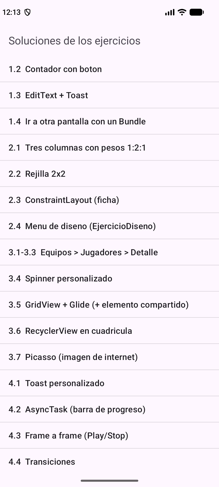

---
tags:
  - android
  - ejercicio
---

# Ejercicios para practicar y preparar el examen

Ejercicios **de más fácil a más difícil**, con la solución paso a paso. Están hechos **a partir de lo que diste en clase**: los PDFs del curso y tus proyectos (`EjercicioDiseno`, `AdapterDam2`, `EjercicioAdaptadoresFinal`, `Diseobesos`, `EjemploFragmentos`, `EjercicioFragmentos` y `EjemploDialogoPersonalizado`). El código usa **las mismas técnicas y el mismo estilo** que ahí: clases anónimas (`new View.OnClickListener() { … }`), `Bundle`, `getApplicationContext()`, el bloque `EdgeToEdge`, `AppExecutors`, `AsyncTask`…

## ✅ Todo el código está verificado

Cada solución se ha **compilado y ejecutado en un emulador** (Android 17) tocando botones, listas, diálogos y la base de datos. El código que ves en los documentos **se inserta directamente desde los ficheros que se probaron**, así que no hay diferencias entre lo que lees y lo que funcionó. Las capturas son de esas mismas pantallas.

Además, tienes **todo el código listo para abrir** en:

`android/codigo/proyectos-zip/EjemploDialogoPersonalizado-con-soluciones.zip`

Descomprime, **File → Open** en Android Studio, espera al *Sync* y ejecuta ▶. En el móvil aparecen **dos iconos**: la app original y un segundo llamado **"Ejercicios"**, un menú que abre cada solución con un toque:

**Úsalo para comparar con lo tuyo, no para copiar**: si copias no aprendes. (Lee también el `LEEME.txt` que hay dentro del zip.)

## Mapa de niveles

| Nivel | Documento | Basado en… | Temas |
|---|---|---|---|
| ⭐ 1 | [Java y primera app](01-nivel-1-java-y-primera-app.md) | PDFs de Toast y AsyncTask (`Bundle`) | Métodos, `for`, `ArrayList`, botón, `EditText`, `Toast`, `Intent`, `Bundle` |
| ⭐⭐ 2 | [Diseños XML](02-nivel-2-disenos-xml.md) | `1-EjercicioDiseno.pdf`, PDFs de pesos y constraint | Pesos, rejilla 2×2, `ConstraintLayout`, estilos con sombra, selectores, **el ejercicio de diseño de clase** |
| ⭐⭐⭐ 3 | [Adaptadores](03-nivel-3-adaptadores.md) | `6-Adaptadores.pdf`, `EjercicioAdaptadoresFinal`, `AdapterDam2` | `ListView`/`GridView` con `BaseAdapter`, `Spinner` personalizado, Glide, `RecyclerView`, Picasso |
| ⭐⭐⭐⭐ 4 | [Toast, AsyncTask, animaciones y transiciones](04-nivel-4-toast-asynctask-animaciones-transiciones.md) | PDFs de Toast, AsyncTask, Frame by frame y Transiciones; `EjercicioAnimaciones.pdf` | Toast con `Dialog`, `AsyncTask`, `animation-list`, transiciones, elemento compartido |
| ⭐⭐⭐⭐ 5 | [Fragmentos](05-nivel-5-fragmentos.md) | `8-Fragmentos.pdf`, `EjemploFragmentos`, `EjercicioFragmentos` | Fragmento, `newInstance(Bundle)`, `IControlFragmentos`, menú, formulario de 3 fragmentos |
| ⭐⭐⭐⭐⭐ 6 | [Diálogos y Room](06-nivel-6-dialogos-y-room.md) | `1-DialogSQLitePersonalizado.pdf` | `AlertDialog`, `DialogFragment`, Room con `AppExecutors` y `LiveData` |
| 🔧 7 | [Mejoras del proyecto real](07-nivel-7-mejoras-del-proyecto.md) | `EjemploDialogoPersonalizado` | 7 arreglos sobre tu propio proyecto |
| 🎯 8 | [Simulacros de examen](08-simulacros-de-examen.md) | Tus proyectos de clase | 4 exámenes (adaptadores, diseño, Room+diálogos, fragmentos) + test de teoría |

## Cómo estudiar con estos ejercicios

1. **Lee el enunciado** y cierra el documento. Intenta hacerlo **tú solo**, sin mirar.
2. Si te atascas más de 10 minutos, abre **solo la primera pista**. Luego intenta otra vez.
3. Cuando te salga (o te rindas), **lee la solución paso a paso** y compárala con la tuya.
4. Anota **qué error cometiste**. Los errores se repiten: [03 — Errores comunes](../01-guias/03-errores-comunes.md).
5. **Repite el ejercicio a los dos días** sin mirar la solución.
6. No pases de nivel hasta que el anterior te salga **sin ayuda y sin nervios**.

## Cada ejercicio tiene siempre

- 📝 **Enunciado** y de qué clase/proyecto sale.
- 🎯 **Qué practicas** (con enlaces a la teoría).
- 💡 **Pistas** de menos a más reveladoras.
- ✅ **Solución** completa y explicada.
- ⚠️ **Errores típicos**.
- 🚀 **Reto extra**.

> **Nota sobre los `import`:** en los documentos no aparecen los `import` para que el código se lea mejor. Cuando algo salga en rojo, pon el cursor encima y pulsa **Alt + Intro → Import class**. Tampoco se repite en cada ejemplo el bloque de `EdgeToEdge` + insets: verás `// ... (bloque de insets de siempre)`. Es el que ya conoces de todos tus proyectos ([01 §5](../02-conceptos/01-fundamentos-bundle-intent-ciclo-vida.md)).

## Estrategia para el día del examen

- **Empieza por lo que sabes** para asegurar puntos.
- **Compila a menudo** (▶ cada 10–15 líneas). Un error pequeño es fácil de encontrar; veinte a la vez, no.
- Si la app se cierra al abrirla, **mira Logcat** ([Guía 01 §6](../01-guias/01-ejecutar-la-app.md)).
- Antes de entregar: ¿están todas las `Activity` en el **manifiesto**? ¿Pusiste `.show()` en los `Toast` y los `AlertDialog`? ¿Las operaciones de base de datos van en **segundo plano** (`AppExecutors`)? ¿Pusiste el permiso `INTERNET` si cargas imágenes con Picasso?
- Los nombres de `id` y las claves de `Bundle` se copian y pegan; **no se reescriben a mano**.

## Ver también
- [INDICE](../INICIO.md) — toda la documentación.
- [02 — Glosario](../01-guias/02-glosario.md) — si un término no lo conoces.
