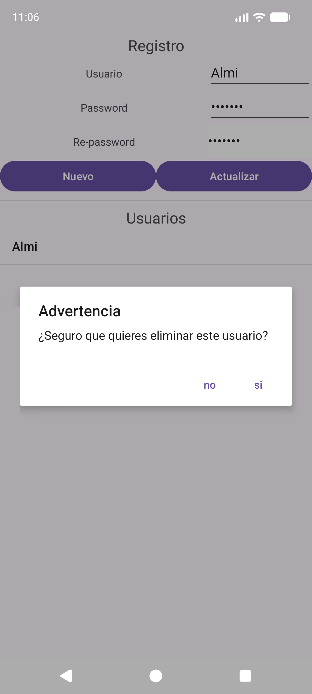
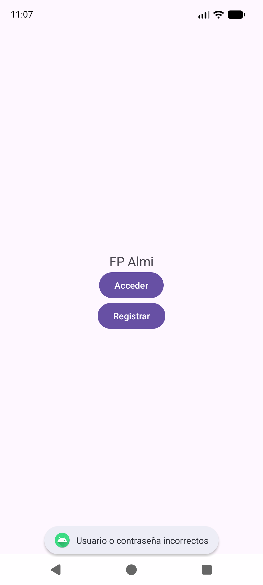
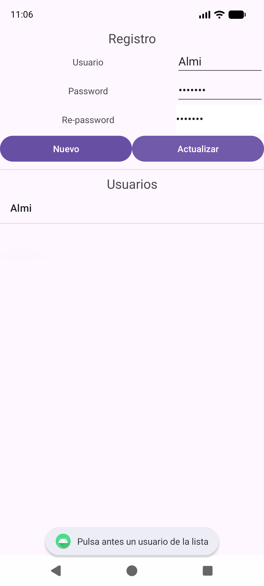
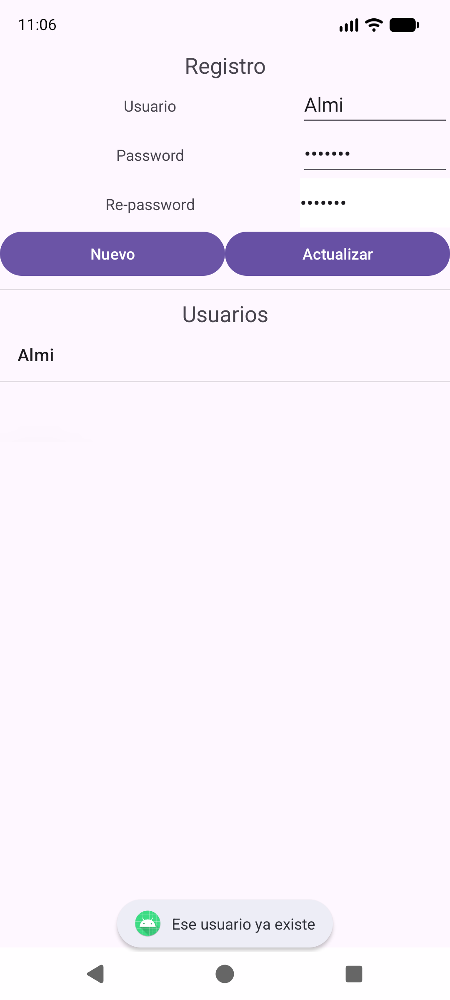

---
tags:
  - android
  - ejercicio
---

# Nivel 7 🔧 — Mejoras del proyecto real `EjemploDialogoPersonalizado`

En el examen es muy habitual recibir un proyecto que **ya existe** y pedirte que **arregles o amplíes** algo. Leer código ajeno y tocarlo sin romperlo es una habilidad distinta a escribir desde cero. Aquí practicas con **fallos reales** de tu proyecto, todos detectados al usarlo.

> ✅ **Verificado:** las mejoras 7.1 a 7.5 están aplicadas en `codigo/proyectos-zip/EjemploDialogoPersonalizado-con-soluciones.zip`, compiladas y **probadas en el emulador** (formulario vacío, avisos, duplicados, login incorrecto/correcto). Tu proyecto original en `AndroidStudioProjects` **no se ha modificado**.

> 🏫 **Todo con lo que diste en clase.** Las soluciones usan solo: `AlertDialog.Builder`, `Toast`, `dismiss()`, `TextWatcher`, una `@Query` de Room (`SELECT … WHERE …`, como las del PDF) y `AppExecutors`. Lo que **no** se vio en clase está marcado como **🧪 extra** (ejercicios 7.6 y 7.7) y es opcional.

**Cómo trabajar este nivel:** abre tu proyecto, **localiza** el fallo, **piensa** el arreglo y solo entonces mira la solución. Antes de cada ejercicio, lee el "síntoma": es lo que verías tú al usar la app.

Ficheros implicados: `RegisterActivity.java`, `LoginDialogFrag.java`, `UsuariosDao.java`, `AppExecutors.java`.

**Orden recomendado:** 7.1 → **7.2** → 7.3 → 7.4 → 7.5. El 7.2 va antes que el 7.5 porque el 7.5 usa `getMainThread()`.

---

## Ejercicio 7.1 ⭐ — El diálogo de borrar no dice qué va a borrar

### 🐞 Síntoma
Mantienes pulsado un usuario y aparece un diálogo **"Advertencia"** con los botones *no* / *si*, pero **sin ningún mensaje**.

### 🎯 Qué practicas
`AlertDialog.Builder.setMessage` ([18 §1](../02-conceptos/18-dialogos.md)).

### 💡 Pista
Un diálogo de confirmación siempre debería explicar la acción. Mira qué método del `Builder` falta.

### ✅ Solución
En `RegisterActivity`, dentro de `onItemLongClick`, **añade una línea** después de `setTitle`:

```java
alerta.setTitle("Advertencia");
alerta.setMessage("¿Seguro que quieres eliminar este usuario?");
```

**Comprobación:** mantén pulsado un usuario → ahora se lee la pregunta bajo el título.

| Antes (sin mensaje) | Después (con mensaje) |
|---|---|
|  |  |

---

## Ejercicio 7.2 ⭐⭐⭐ — `getMainThread()` no es el hilo principal

### 🐞 Síntoma
Casi nunca se nota, pero el `Toast` de un `getMainThread().execute(...)` **se cae** con un error parecido a `Can't toast on a thread that has not called Looper.prepare()`. Y `startActivity` y `dismiss` del login se ejecutan en **un hilo secundario**, cuando la regla dice que la interfaz solo se toca desde el hilo principal.

### 🎯 Qué practicas
Leer un constructor con **parámetros en un orden** y comprobar que se le pasan **en el mismo orden** ([20](../02-conceptos/20-executors-y-livedata.md)).

### 💡 Pistas
1. Mira la firma: `AppExecutors(Executor diskIO, Executor mainThread, Executor networkIO)`.
2. Mira cómo se llama en `getInstance()`: el **segundo** argumento debería ser el del hilo principal.
3. Compara con el nombre de cada parámetro.

### ✅ Solución
En `AppExecutors.getInstance()` **cambia el orden** de los dos últimos argumentos:

```java
//ANTES (mainThread recibe un grupo de hilos de fondo):
sInstance = new AppExecutors(Executors.newSingleThreadExecutor(), Executors.newFixedThreadPool(3), new MainThreadExecutor());

//DESPUES (cada ejecutor en su sitio):
sInstance = new AppExecutors(Executors.newSingleThreadExecutor(), new MainThreadExecutor(), Executors.newFixedThreadPool(3));
```

**Explicación:** el orden lo fija el constructor: `(diskIO, mainThread, networkIO)`. Con el orden original, `getMainThread()` devolvía un `newFixedThreadPool(3)` (hilos de fondo) y `getNetworkIO()` devolvía el ejecutor del hilo principal. **El código del PDF del curso tiene ese mismo orden**, así que no es un fallo tuyo: es un despiste del material.

> ⚠️ Cuidado con la moraleja: **un código puede "funcionar" y estar mal.** Que no se vea ningún error no significa que sea correcto. Además, con el orden original el ejercicio 7.5 (que muestra un `Toast` con `getMainThread()`) **se cerraría la app**.

> 📌 Tu proyecto original en `AndroidStudioProjects` se ha dejado **como lo tenías** (orden original) porque así lo pediste; en el zip de soluciones ya está corregido.

---

## Ejercicio 7.3 ⭐⭐ — El login falla en silencio y deja el diálogo abierto

### 🐞 Síntoma
1. Si escribes mal el usuario o la contraseña, el diálogo **desaparece sin decir nada**.
2. Si entras bien, se abre la pantalla central pero el **diálogo sigue "vivo" debajo**: al volver atrás lo ves otra vez.

### 🎯 Qué practicas
`Toast`, `dismiss()`, código que corre tras volver al hilo principal con `AppExecutors` ([18 §2](../02-conceptos/18-dialogos.md), [20](../02-conceptos/20-executors-y-livedata.md)).

### 💡 Pistas
1. Fíjate en el `if (usu != null) … else …` de `LoginDialogFrag`.
2. En el `else` había una línea de `Toast` **comentada**.
3. `dismiss()` cierra el diálogo; ¿en cuál de las dos ramas hace falta?

### ✅ Solución
En `LoginDialogFrag`, dentro del `Runnable` que corre en el ejecutor del hilo principal (`getMainThread()`):

```java
if(usu != null){
    //Login correcto: abrimos CentralActivity
    Intent intent = new Intent(getContext(), CentralActivity.class);
    startActivity(intent);
    dismiss();   //cerramos tambien el dialogo (si no, seguiria debajo de la nueva pantalla)
}else {
    //Login incorrecto: avisamos y cerramos el dialogo
    Toast.makeText(getContext(), "Usuario o contraseña incorrectos", Toast.LENGTH_SHORT).show();
    dismiss();
}
```

**Comprobación (probado):** login con contraseña mala → aparece el aviso; login bueno → abres la pantalla central y, al volver con **Atrás**, ya **no** está el diálogo debajo.



### ⚠️ Errores típicos
- Añadir `dismiss()` **antes** de `startActivity`: funciona, pero es más seguro abrir primero y cerrar después.
- Mostrar el `Toast` **fuera** del `getMainThread().execute(...)`, o sea, desde el hilo de la base de datos.

---

## Ejercicio 7.4 ⭐⭐⭐ — Arreglar "Actualizar" y validar el formulario

Son dos fallos de la pantalla de registro. Haz primero el **A** y luego el **B**.

### A) "Actualizar" no hace nada si no eliges usuario

**🐞 Síntoma:** abres la pantalla de registro, escribes algo y pulsas **Actualizar** sin haber pulsado antes un usuario de la lista: **no pasa nada**, ni error ni aviso.

**💡 Pistas**
1. `idUsuario` empieza en `-1` (= "nadie seleccionado").
2. `actualizar(-1, …)` busca el usuario `-1`, no lo encuentra (`null`) y el `if (usu != null)` lo ignora.
3. Comprueba el valor **antes** de llamar a `actualizar`.

**✅ Solución** — en el `onClick` del botón *Actualizar*:

```java
btnUpdateUsuario.setOnClickListener(new View.OnClickListener() {
    @Override
    public void onClick(View v) {
        if (idUsuario == -1) {
            Toast.makeText(RegisterActivity.this, "Pulsa antes un usuario de la lista", Toast.LENGTH_SHORT).show();
            return;
        }
        String user = etNombre.getText().toString();
        String password = etPassword.getText().toString();
        actualizar(idUsuario, user , password);
    }
});
```

**Comprobación (probado):** recién abierta la pantalla, **Actualizar** muestra *"Pulsa antes un usuario de la lista"*.



> ✅ Este es el patrón de las **"cláusulas de guarda"**: comprobar al principio si algo está mal y salir con `return`, en lugar de anidar todo dentro de un `if` enorme.

### B) Validar bien el formulario (tres fallos en uno)

**🐞 Síntomas**
1. Al abrir la pantalla, **Nuevo está activo con todo vacío** (porque `"".equals("")`), y permite guardar un usuario en blanco.
2. Si escribes la repetición **correcta** y después **cambias el Password**, el botón sigue activo aunque ya no coincidan (solo se vigila el campo Re-password).
3. Se puede guardar un usuario con **nombre vacío**.

**🎯 Qué practicas:** `TextWatcher`, un único vigilante en varios campos, un método de validación reutilizable ([19 §3](../02-conceptos/19-textwatcher-y-eventos-de-lista.md)).

**💡 Pistas**
1. Saca la lógica de comprobación a **un método** (`validarFormulario`) que no dependa de qué campo cambió.
2. **Un mismo** `TextWatcher` puede añadirse a **varios** `EditText`.
3. Condición para activar *Nuevo*: usuario no vacío **y** password no vacío **y** las dos passwords iguales.
4. Llama al método **una vez al arrancar** para dejar el estado inicial correcto.

**✅ Solución — sustituye el `TextWatcher` de Re-password por uno compartido:**

```java
TextWatcher vigilante = new TextWatcher() {
    @Override
    public void afterTextChanged(Editable s) {
        validarFormulario();
    }

    @Override
    public void beforeTextChanged(CharSequence s, int start, int count, int after) {
    }

    @Override
    public void onTextChanged(CharSequence s, int start, int before, int count) {
    }
};
etNombre.addTextChangedListener(vigilante);
etPassword.addTextChangedListener(vigilante);
etRePassword.addTextChangedListener(vigilante);
validarFormulario();   //estado inicial correcto: con todo vacio, Nuevo empieza desactivado
```

**Y añade el método de validación** en la clase:

```java
//Activa "Nuevo" solo si hay usuario, hay password y las dos passwords coinciden
private void validarFormulario() {
    String user = etNombre.getText().toString().trim();
    String password = etPassword.getText().toString();
    String repassword = etRePassword.getText().toString();

    boolean coinciden = password.equals(repassword);
    boolean completo = !user.isEmpty() && !password.isEmpty();

    btnRegistrarNuevo.setEnabled(coinciden && completo);
    if (coinciden) {
        etRePassword.setBackgroundColor(Color.WHITE);
    } else {
        etRePassword.setBackgroundColor(Color.RED);
    }
}
```

**Explicación:**
- `validarFormulario()` **lee el estado actual de los tres campos** cada vez, así que da igual cuál cambió.
- Es un `if / else` normal: si las contraseñas coinciden, fondo blanco; si no, rojo.
- Debe llamarse **después** de haber asignado los tres `EditText` y el botón (si no, `NullPointerException`).
- `.trim()` quita espacios: `"   "` cuenta como vacío.

**Comprobación (probado paso a paso):**

| Acción | Resultado esperado |
|---|---|
| Abrir la pantalla | *Nuevo* **desactivado** |
| Rellenar usuario, password y re-password iguales | *Nuevo* **activado** |
| Escribir un carácter más en *Password* | *Nuevo* **se desactiva** y Re-password se pone rojo |
| Borrar ese carácter | *Nuevo* **se vuelve a activar** |


### ⚠️ Errores típicos
- 📌 Llamar a `validarFormulario()` **antes** de inicializar `btnRegistrarNuevo` → `NullPointerException`.
- Crear **tres** `TextWatcher` copiando y pegando el mismo código: funciona, pero es justo lo que este ejercicio quiere evitar.
- Olvidar la llamada inicial: al abrir, el botón aparece activo.

---

## Ejercicio 7.5 ⭐⭐⭐ — Rechazar usuarios repetidos

### 🐞 Síntoma
Puedes registrar `Almi` dos, tres o diez veces. En el login, `loadUsuarioByNamePass` devolvería el primero que encuentre.

### 🎯 Qué practicas
Una `@Query` nueva del DAO (igual que `loadUsuarioById`), consulta previa en segundo plano y volver al hilo principal con `AppExecutors` para el `Toast` ([17](../02-conceptos/17-room-base-de-datos.md), [20](../02-conceptos/20-executors-y-livedata.md)).

### 💡 Pistas
1. Antes de insertar, pregunta a la BD **si ya existe** un usuario con ese nombre.
2. Copia el estilo de `loadUsuarioById`: una consulta `SELECT … WHERE usuario = :usu` que devuelve **un `Usuario`** (o `null` si no hay).
3. Si no es `null`, **no insertes** y avisa.
4. La consulta va en el ejecutor de disco (`getDiskIO`), el `Toast` en el del hilo principal (`getMainThread`). **Haz antes el 7.2.**

### ✅ Solución

**1) En `UsuariosDao`, añade la consulta** (es como `loadUsuarioById`, pero por nombre):

```java
//Busca un usuario solo por su nombre (null si no existe)
@Query("SELECT * FROM Usuario WHERE usuario = :usu")
Usuario loadUsuarioByName(String usu);
```

**2) En `RegisterActivity`, modifica `guardarUsuario`:**

```java
private void guardarUsuario(String user, String password) {
    final Usuario usuario = new Usuario(user.trim(), password);
    //Insertamos en un hilo secundario
    AppExecutors.getInstance().getDiskIO().execute(new Runnable() {
        @Override
        public void run() {
            //Primero comprobamos (en el hilo de fondo) si ya existe un usuario con ese nombre
            if (mDb.usuariosDao().loadUsuarioByName(usuario.getUsuario()) != null) {
                //El Toast toca la pantalla: hay que volver al hilo principal
                AppExecutors.getInstance().getMainThread().execute(new Runnable() {
                    @Override
                    public void run() {
                        Toast.makeText(RegisterActivity.this, "Ese usuario ya existe", Toast.LENGTH_SHORT).show();
                    }
                });
                return;
            }
            mDb.usuariosDao().insertUsuario(usuario);
        }
    });
}
```

**Explicación:**
- Si no hay ningún usuario con ese nombre, la consulta devuelve `null` y se inserta como siempre.
- El `Toast` toca la pantalla, por eso se lanza desde `getMainThread().execute(...)` (mismo patrón que `LoginDialogFrag`).
- `return;` dentro del `run()` corta la ejecución de **ese** `Runnable`, así que `insertUsuario` no se llega a ejecutar.
- Se usa `user.trim()` para que `"Almi"` y `"Almi "` no cuenten como distintos.

**Comprobación (probado):** registra `Almi`; pulsa **Nuevo** otra vez → aparece *"Ese usuario ya existe"* y la lista sigue con **una** sola fila `Almi`.



### ⚠️ Errores típicos
- 📌 Hacer la comprobación en el **hilo principal** → `Cannot access database on the main thread`.
- 📌 Mostrar el `Toast` desde el hilo de fondo → cierre de la app (por eso hace falta el 7.2).
- Olvidar el `return;` y que se inserte igualmente.

---

## Ejercicio 7.6 🧪 — Extra (no visto en clase): que la propia BD impida repetidos

> 🧪 **Extra, no visto en clase.** Es opcional: no lo necesitas para el examen si el profesor se ciñe a los PDFs.

Un **índice único** hace que la base de datos rechace dos filas con el mismo nombre:

```java
@Entity(tableName = "Usuario", indices = {@Index(value = "usuario", unique = true)})
```

Al cambiar la entidad **hay que subir `version`** en `@Database` (o desinstalar la app), y el `insert` lanzaría una excepción que tendrías que capturar. Para el examen basta con la consulta previa del 7.5.

---

## Ejercicio 7.7 🧪 — Extra (no visto en clase): no guardar las contraseñas en texto plano

> 🧪 **Extra, no visto en clase.** `MessageDigest`, *hash* y SHA-256 **no aparecen** en tus PDFs ni en tus proyectos. Léelo como cultura general de seguridad, no como materia de examen.
>
> ⚠️ **Verificado solo en parte:** se comprobó la función `sha256` de abajo, pero este ejercicio **no se ha integrado** en el proyecto de soluciones.

### 🐞 Problema
Las contraseñas se guardan **tal cual** en la tabla. Quien accediera a la BD (por ejemplo con *Database Inspector*) las vería. En una app real, **nunca** se guarda la contraseña: se guarda su **huella** (*hash*), y para comprobar el login se calcula la huella de lo escrito y se compara.

### Ayuda: la clase auxiliar (verificada)

```java
public class Seguridad {

    // Convierte un texto en su "huella" SHA-256 (64 caracteres hexadecimales).
    // El mismo texto da siempre la misma huella, pero de la huella NO se puede recuperar el texto.
    public static String sha256(String texto) {
        try {
            MessageDigest md = MessageDigest.getInstance("SHA-256");
            byte[] bytes = md.digest(texto.getBytes(StandardCharsets.UTF_8));
            StringBuilder sb = new StringBuilder();
            for (byte b : bytes) {
                sb.append(String.format("%02x", b));
            }
            return sb.toString();
        } catch (NoSuchAlgorithmException e) {
            throw new RuntimeException(e);
        }
    }
}
```
Comprobado: `Seguridad.sha256("abc")` da `ba7816bf8f01cfea414140de5dae2223b00361a396177a9cb410ff61f20015ad` (el valor estándar de SHA-256 para "abc").

### Guía (a completar por ti)

| Dónde | Cambio |
|---|---|
| `RegisterActivity.guardarUsuario` | `new Usuario(user.trim(), Seguridad.sha256(password))` |
| `LoginDialogFrag` (al llamar al DAO) | `loadUsuarioByNamePass(nombre, Seguridad.sha256(password))` |
| `RegisterActivity` clic corto | **Ya no puedes mostrar la contraseña** (solo tienes su huella): deja los campos de password **vacíos** al seleccionar |
| `RegisterActivity.actualizar` | Si el password está vacío, **no lo cambies**; si no, guarda `sha256(nuevo)` |

### ⚠️ Limitaciones
- Los usuarios **ya guardados** en texto plano dejan de poder entrar. Habría que borrar los datos o migrarlos.
- **SHA-256 sin "sal" no es suficiente** para una app real (se usan BCrypt o Argon2). Aquí solo sirve para entender la idea.

---

## ✅ Autoevaluación del Nivel 7

- [ ] Localizar el fichero y la línea de un fallo a partir de su síntoma.
- [ ] Añadir un mensaje a un `AlertDialog` y un aviso a un flujo silencioso.
- [ ] Detectar un argumento pasado **en el orden equivocado** a un constructor.
- [ ] Usar una **cláusula de guarda** (`if (...) { ...; return; }`).
- [ ] Extraer una validación a un método y compartir un `TextWatcher` entre varios campos.
- [ ] Añadir una `@Query` nueva al DAO y usarla **en segundo plano** (`getDiskIO`), volviendo a la pantalla con `getMainThread`.

Siguiente: **[Nivel 8 — Simulacros de examen](08-simulacros-de-examen.md)**.
