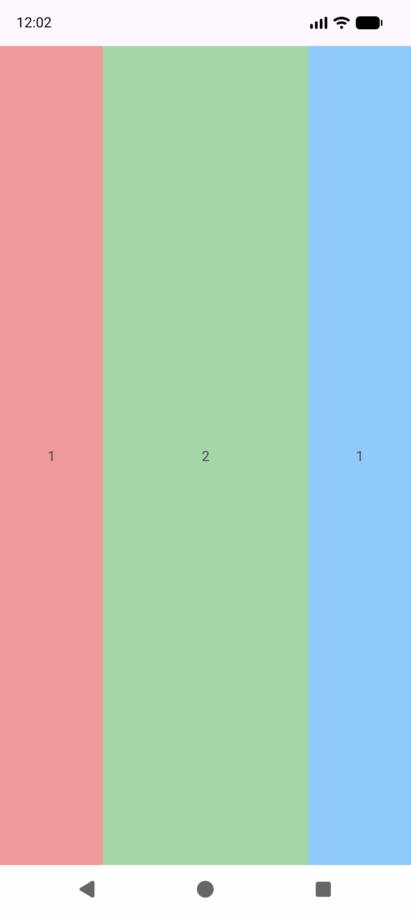
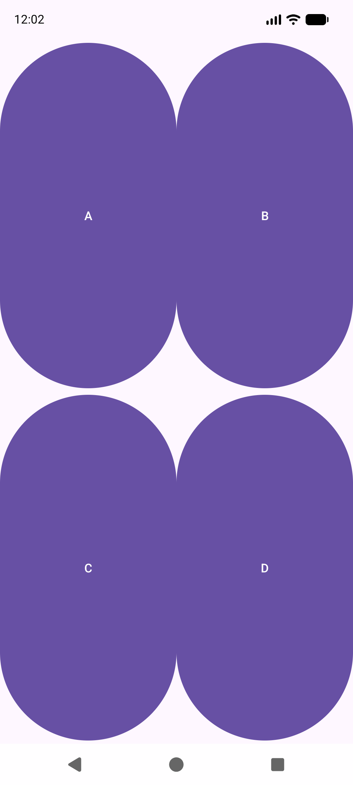
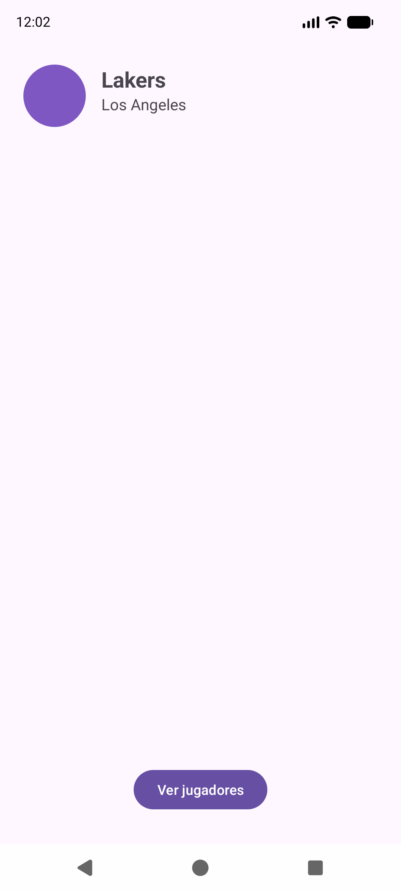

---
tags:
  - android
  - ejercicio
---

# Nivel 2 ⭐⭐ — Diseños XML: pesos, ConstraintLayout, estilos y selectores

**Antes de empezar, lee:** [02 — Diseño basado en pesos](../conceptos/02-diseno-basado-en-pesos.md), [03 — ConstraintLayout](../conceptos/03-constraintlayout.md) y [15 — Drawables: formas y selectores](../conceptos/15-drawables-formas-y-selectores.md).

> Los ejercicios de este nivel **no llevan código Java**: solo XML. Para verlos, crea una Activity vacía que haga `setContentView(R.layout.el_que_sea)`. En el zip de soluciones, el menú **"Ejercicios"** los abre por ti.
>
> Archivos en el zip (`res/`): `layout/ej_pesos_fila.xml`, `ej_rejilla.xml`, `ej_ficha.xml`, `ej_menu_diseno.xml`; `values/ej_styles.xml`, `ej_dimens.xml`; `drawable/ej_boton_*.xml`, `ej_cabecera.xml`.

## 💡 Recuerda: la raíz lleva `android:id="@+id/main"`

Todos los layouts de pantalla completa de tus proyectos tienen `android:id="@+id/main"` en el elemento raíz: es el id que busca el bloque de `EdgeToEdge` para dejar margen respecto a la barra de estado y la de navegación ([01 §5](../conceptos/01-fundamentos-bundle-intent-ciclo-vida.md)). **Si lo olvidas, `findViewById(R.id.main)` da `null` y la app se cierra al abrir esa pantalla.**

---

## Ejercicio 2.1 — Tres columnas con pesos 1 : 2 : 1

### 📝 Enunciado
Una pantalla dividida en **tres columnas de color**: la de en medio ocupa el **doble** de ancho que las de los lados. Cada una lleva un número centrado (`1`, `2`, `1`).

### 🎯 Qué practicas
`LinearLayout` horizontal, `layout_weight`, la regla de `0dp` ([02 §2](../conceptos/02-diseno-basado-en-pesos.md)).

### 💡 Pistas
1. `android:orientation="horizontal"` en el `LinearLayout` raíz.
2. En un layout **horizontal**, lo que se reparte es el **ancho**: `layout_width="0dp"`.
3. Pesos: `1`, `2`, `1` → total 4 → 25 % / 50 % / 25 %.

### ✅ Solución

```xml
<?xml version="1.0" encoding="utf-8"?>
<LinearLayout xmlns:android="http://schemas.android.com/apk/res/android"
    android:id="@+id/main"
    android:layout_width="match_parent"
    android:layout_height="match_parent"
    android:orientation="horizontal">

    <TextView
        android:layout_width="0dp"
        android:layout_height="match_parent"
        android:layout_weight="1"
        android:background="#EF9A9A"
        android:gravity="center"
        android:text="1" />

    <TextView
        android:layout_width="0dp"
        android:layout_height="match_parent"
        android:layout_weight="2"
        android:background="#A5D6A7"
        android:gravity="center"
        android:text="2" />

    <TextView
        android:layout_width="0dp"
        android:layout_height="match_parent"
        android:layout_weight="1"
        android:background="#90CAF9"
        android:gravity="center"
        android:text="1" />

</LinearLayout>
```



**Explicación:**
- Suma de pesos: `1 + 2 + 1 = 4`. Cada hijo recibe `su_peso / 4` del ancho.
- `layout_width="0dp"` le dice a Android "**no** tengas un ancho propio, quédate con lo que te toque del reparto".
- `gravity="center"` centra **el texto dentro** de cada `TextView` (no confundir con `layout_gravity`).

### ⚠️ Errores típicos
- Poner `wrap_content` o `match_parent` con pesos: el reparto no sale como esperas.
- Poner `0dp` en la dimensión **equivocada** (en un layout horizontal, el peso reparte el ancho, no el alto).

**🚀 Reto extra:** cambia los pesos a `1`, `3`, `2` y calcula de cabeza qué porcentaje ocupa cada columna (16,7 % / 50 % / 33,3 %).

---

## Ejercicio 2.2 — Rejilla 2×2 de botones

### 📝 Enunciado
Cuatro botones (`A`, `B`, `C`, `D`) en una **rejilla de 2 filas × 2 columnas** que ocupe **toda la pantalla**, con las cuatro celdas del mismo tamaño.

### 🎯 Qué practicas
Anidar `LinearLayout`, alternar orientación vertical/horizontal, pesos en cada nivel ([02 §3.1](../conceptos/02-diseno-basado-en-pesos.md)).

### 💡 Pistas
1. Un `LinearLayout` **vertical** raíz con **dos filas**; cada fila, un `LinearLayout` **horizontal** con **dos botones**.
2. Las filas reparten el **alto** (`layout_height="0dp"` + peso); los botones el **ancho** (`layout_width="0dp"` + peso).

### ✅ Solución

```xml
<?xml version="1.0" encoding="utf-8"?>
<LinearLayout xmlns:android="http://schemas.android.com/apk/res/android"
    android:id="@+id/main"
    android:layout_width="match_parent"
    android:layout_height="match_parent"
    android:orientation="vertical">

    <!-- FILA 1: ocupa la mitad de la altura -->
    <LinearLayout
        android:layout_width="match_parent"
        android:layout_height="0dp"
        android:layout_weight="1"
        android:orientation="horizontal">

        <Button
            android:layout_width="0dp"
            android:layout_height="match_parent"
            android:layout_weight="1"
            android:text="A" />

        <Button
            android:layout_width="0dp"
            android:layout_height="match_parent"
            android:layout_weight="1"
            android:text="B" />
    </LinearLayout>

    <!-- FILA 2: la otra mitad -->
    <LinearLayout
        android:layout_width="match_parent"
        android:layout_height="0dp"
        android:layout_weight="1"
        android:orientation="horizontal">

        <Button
            android:layout_width="0dp"
            android:layout_height="match_parent"
            android:layout_weight="1"
            android:text="C" />

        <Button
            android:layout_width="0dp"
            android:layout_height="match_parent"
            android:layout_weight="1"
            android:text="D" />
    </LinearLayout>

</LinearLayout>
```



**Explicación:** cada **nivel** de anidación reparte su propio espacio, sin importarle lo de fuera. Los botones salen "ovalados" y gigantes porque el tema Material redondea los botones y aquí son enormes; es normal.

### ⚠️ Errores típicos
- Poner el peso solo en los botones y no en las filas: la rejilla no llena la pantalla.
- Olvidar cambiar `orientation` entre niveles.

**🚀 Reto extra:** añade una **tercera fila** con un solo botón `E` que ocupe todo el ancho, con pesos de fila `1`, `1` y `0.5`.

---

## Ejercicio 2.3 — Una ficha con `ConstraintLayout` (como `item_equipo`)

### 📝 Enunciado
Reproduce la ficha de un equipo como en `item_equipo.xml` de `EjercicioAdaptadoresFinal`:
- El **logo** arriba a la izquierda (24 dp del borde izquierdo, 20 dp del superior).
- El **nombre** a la **derecha del logo**, alineado con su parte superior.
- La **ciudad** debajo del nombre.
- Un botón **"Ver jugadores"** abajo del todo, centrado.

### 🎯 Qué practicas
Restricciones a `parent` y a otras vistas, márgenes ([03 §2, §3](../conceptos/03-constraintlayout.md)).

### 💡 Pistas
1. Toda vista necesita **al menos una restricción horizontal y una vertical**.
2. "A la derecha de X" = `layout_constraintStart_toEndOf="@+id/x"`; "debajo de X" = `layout_constraintTop_toBottomOf`.
3. Para centrar en horizontal: `Start_toStartOf="parent"` **y** `End_toEndOf="parent"`.

### ✅ Solución

```xml
<?xml version="1.0" encoding="utf-8"?>
<androidx.constraintlayout.widget.ConstraintLayout xmlns:android="http://schemas.android.com/apk/res/android"
    xmlns:app="http://schemas.android.com/apk/res-auto"
    xmlns:tools="http://schemas.android.com/tools"
    android:id="@+id/main"
    android:layout_width="match_parent"
    android:layout_height="match_parent">

    <ImageView
        android:id="@+id/ivEquipoLogo"
        android:layout_width="64dp"
        android:layout_height="64dp"
        android:layout_marginStart="24dp"
        android:layout_marginTop="20dp"
        android:contentDescription="Logo"
        android:src="@drawable/ej_logo1"
        app:layout_constraintStart_toStartOf="parent"
        app:layout_constraintTop_toTopOf="parent" />

    <TextView
        android:id="@+id/tvEquipoNombre"
        android:layout_width="wrap_content"
        android:layout_height="wrap_content"
        android:layout_marginStart="16dp"
        android:text="Lakers"
        android:textSize="22sp"
        android:textStyle="bold"
        app:layout_constraintStart_toEndOf="@+id/ivEquipoLogo"
        app:layout_constraintTop_toTopOf="@+id/ivEquipoLogo" />

    <TextView
        android:id="@+id/tvEquipoCiudad"
        android:layout_width="wrap_content"
        android:layout_height="wrap_content"
        android:text="Los Angeles"
        android:textSize="16sp"
        app:layout_constraintStart_toStartOf="@+id/tvEquipoNombre"
        app:layout_constraintTop_toBottomOf="@+id/tvEquipoNombre" />

    <Button
        android:id="@+id/btnVer"
        android:layout_width="wrap_content"
        android:layout_height="wrap_content"
        android:layout_marginBottom="32dp"
        android:text="Ver jugadores"
        app:layout_constraintBottom_toBottomOf="parent"
        app:layout_constraintEnd_toEndOf="parent"
        app:layout_constraintStart_toStartOf="parent" />

</androidx.constraintlayout.widget.ConstraintLayout>
```



**Explicación:**
- El nombre se ata al **borde derecho** (`toEndOf`) del logo y a su **borde superior** (`Top_toTopOf`): si el logo cambia de tamaño, el texto se mueve con él.
- La ciudad se ata al **mismo inicio** que el nombre (`Start_toStartOf="@+id/tvEquipoNombre"`) y **debajo** de él.
- El botón, atado a los dos lados de `parent`, queda centrado; `Bottom_toBottomOf` lo pega abajo.
- Necesitas `xmlns:app="…"` en la raíz.

### ⚠️ Errores típicos
- Una vista **sin restricciones**: en el editor se ve bien pero en el móvil salta arriba a la izquierda.
- Al referirte a otra vista: `@+id/x` **crea** el id, `@id/x` lo **reutiliza**; ambos valen si el id existe.
- Olvidar `xmlns:app` → error en los atributos `app:`.

**🚀 Reto extra:** centra el nombre en horizontal usando `layout_constraintHorizontal_bias` ([03 §4](../conceptos/03-constraintlayout.md)).

---

## Ejercicio 2.4 — El ejercicio de diseño de clase (`EjercicioDiseno`)

### 📝 Enunciado
Es el enunciado real de `1-EjercicioDiseno.pdf`, adaptado (sin las imágenes de los botones):

1. Color de fondo de la aplicación `#AAC1E2`.
2. Los `TextView` bajo los botones llevan **sombra**: `shadowColor="#000000"`, `shadowDx="3"`, `shadowDy="2"`, `shadowRadius="1.8"`. Deben usar **estilos reutilizables** (uno para títulos/pies y otro para las etiquetas de los botones), para que el diseño quede limpio y fácil de modificar.
3. Los botones tienen **dos aspectos**: normal y pulsado (cambian al tocarlos).
4. La cabecera tiene un **marco redondeado** blanco.
5. Diseño **adaptativo**: cabecera 0.5 / cuerpo 4 / pie 0.5, con una rejilla 2×2 de botones en el cuerpo.

### 🎯 Qué practicas
Pesos anidados, `style` con herencia, `dimens.xml`, `<shape>` y `<selector>` ([02](../conceptos/02-diseno-basado-en-pesos.md), [15](../conceptos/15-drawables-formas-y-selectores.md), proyecto [EjercicioDiseno](../proyectos/EjercicioDiseno.md)).

### 💡 Pistas
1. Los estilos van en `res/values/`. `ej_titulo.sombreado` (con punto) **hereda** de `ej_titulo`.
2. Un `selector` se lee **de arriba abajo** y gana el primero que encaja: el item **sin estado** va **el último**.
3. Cada celda del cuerpo = un `LinearLayout` vertical con un `ImageButton` (peso 3) y su etiqueta (peso 1).

### ✅ Solución

**Tamaños centralizados `res/values/ej_dimens.xml`:**

```xml
<?xml version="1.0" encoding="utf-8"?>
<resources>
    <dimen name="ej_tamanoTitulo">20sp</dimen>
    <dimen name="ej_tamanoSubTitulo">12sp</dimen>
</resources>
```

**Estilos con herencia `res/values/ej_styles.xml`:**

```xml
<?xml version="1.0" encoding="utf-8"?>
<resources>
    <!-- Estilo base para los titulos y pies de pagina -->
    <style name="ej_titulo">
        <item name="android:gravity">center</item>
        <item name="android:textStyle">bold</item>
        <item name="android:textColor">#FFFFFF</item>
        <item name="android:textSize">@dimen/ej_tamanoTitulo</item>
    </style>

    <!-- Hereda de ej_titulo (por el punto en el nombre) y solo cambia el tamano -->
    <style name="ej_titulo.subTitulo">
        <item name="android:textSize">@dimen/ej_tamanoSubTitulo</item>
    </style>

    <!-- Hereda de ej_titulo y anade la sombra pedida en el enunciado -->
    <style name="ej_titulo.sombreado">
        <item name="android:shadowColor">#000000</item>
        <item name="android:shadowDx">3</item>
        <item name="android:shadowDy">2</item>
        <item name="android:shadowRadius">1.8</item>
    </style>
</resources>
```

**Los dos aspectos del botón y el selector (`res/drawable/`):**

```xml
<?xml version="1.0" encoding="utf-8"?>
<shape xmlns:android="http://schemas.android.com/apk/res/android" android:shape="rectangle">
    <solid android:color="#7E57C2" />
    <corners android:radius="24dp" />
</shape>
```

```xml
<?xml version="1.0" encoding="utf-8"?>
<shape xmlns:android="http://schemas.android.com/apk/res/android" android:shape="rectangle">
    <solid android:color="#311B92" />
    <corners android:radius="24dp" />
</shape>
```

```xml
<?xml version="1.0" encoding="utf-8"?>
<selector xmlns:android="http://schemas.android.com/apk/res/android">
    <!-- Mientras se mantiene pulsado: otra imagen -->
    <item android:drawable="@drawable/ej_boton_pulsado_shape" android:state_pressed="true" />
    <!-- Estado normal (item SIN estado: siempre el ULTIMO) -->
    <item android:drawable="@drawable/ej_boton_normal" />
</selector>
```

**El marco de la cabecera `ej_cabecera.xml`:**

```xml
<?xml version="1.0" encoding="utf-8"?>
<shape xmlns:android="http://schemas.android.com/apk/res/android" android:shape="rectangle">
    <solid android:color="#00000000" />
    <stroke
        android:width="2dp"
        android:color="#FFFFFF" />
    <corners android:radius="48dp" />
</shape>
```

**El menú completo `ej_menu_diseno.xml`:**

```xml
<?xml version="1.0" encoding="utf-8"?>
<LinearLayout xmlns:android="http://schemas.android.com/apk/res/android"
    android:id="@+id/main"
    android:layout_width="match_parent"
    android:layout_height="match_parent"
    android:background="#AAC1E2"
    android:orientation="vertical">

    <!-- CABECERA: 0.5 partes de 5 -->
    <LinearLayout
        android:layout_width="match_parent"
        android:layout_height="0dp"
        android:layout_margin="8dp"
        android:layout_weight="0.5"
        android:background="@drawable/ej_cabecera"
        android:gravity="center">

        <TextView
            style="@style/ej_titulo"
            android:layout_width="wrap_content"
            android:layout_height="wrap_content"
            android:text="Menu principal" />
    </LinearLayout>

    <!-- CUERPO: 4 partes de 5, rejilla 2 x 2 -->
    <LinearLayout
        android:layout_width="match_parent"
        android:layout_height="0dp"
        android:layout_weight="4"
        android:orientation="vertical">

        <LinearLayout
            android:layout_width="match_parent"
            android:layout_height="0dp"
            android:layout_weight="1"
            android:orientation="horizontal">

        <!-- Celda: boton (peso 3) + etiqueta (peso 1) -->
        <LinearLayout
            android:layout_width="0dp"
            android:layout_height="match_parent"
            android:layout_weight="1"
            android:orientation="vertical"
            android:padding="20dp">

            <ImageButton
                android:id="@+id/btnNuevo"
                android:layout_width="match_parent"
                android:layout_height="0dp"
                android:layout_weight="3"
                android:background="@drawable/ej_boton_pulsado"
                android:contentDescription="Nuevo" />

            <TextView
                style="@style/ej_titulo.sombreado"
                android:layout_width="match_parent"
                android:layout_height="0dp"
                android:layout_weight="1"
                android:text="Nuevo" />
        </LinearLayout>

        <!-- Celda: boton (peso 3) + etiqueta (peso 1) -->
        <LinearLayout
            android:layout_width="0dp"
            android:layout_height="match_parent"
            android:layout_weight="1"
            android:orientation="vertical"
            android:padding="20dp">

            <ImageButton
                android:id="@+id/btnToast"
                android:layout_width="match_parent"
                android:layout_height="0dp"
                android:layout_weight="3"
                android:background="@drawable/ej_boton_pulsado"
                android:contentDescription="Toast" />

            <TextView
                style="@style/ej_titulo.sombreado"
                android:layout_width="match_parent"
                android:layout_height="0dp"
                android:layout_weight="1"
                android:text="Toast" />
        </LinearLayout>

        </LinearLayout>

        <LinearLayout
            android:layout_width="match_parent"
            android:layout_height="0dp"
            android:layout_weight="1"
            android:orientation="horizontal">

        <!-- Celda: boton (peso 3) + etiqueta (peso 1) -->
        <LinearLayout
            android:layout_width="0dp"
            android:layout_height="match_parent"
            android:layout_weight="1"
            android:orientation="vertical"
            android:padding="20dp">

            <ImageButton
                android:id="@+id/btnAsync"
                android:layout_width="match_parent"
                android:layout_height="0dp"
                android:layout_weight="3"
                android:background="@drawable/ej_boton_pulsado"
                android:contentDescription="Animacion" />

            <TextView
                style="@style/ej_titulo.sombreado"
                android:layout_width="match_parent"
                android:layout_height="0dp"
                android:layout_weight="1"
                android:text="Animacion" />
        </LinearLayout>

        <!-- Celda: boton (peso 3) + etiqueta (peso 1) -->
        <LinearLayout
            android:layout_width="0dp"
            android:layout_height="match_parent"
            android:layout_weight="1"
            android:orientation="vertical"
            android:padding="20dp">

            <ImageButton
                android:id="@+id/btnFrames"
                android:layout_width="match_parent"
                android:layout_height="0dp"
                android:layout_weight="3"
                android:background="@drawable/ej_boton_pulsado"
                android:contentDescription="Frames" />

            <TextView
                style="@style/ej_titulo.sombreado"
                android:layout_width="match_parent"
                android:layout_height="0dp"
                android:layout_weight="1"
                android:text="Frames" />
        </LinearLayout>

        </LinearLayout>
    </LinearLayout>

    <!-- PIE: 0.5 partes de 5 -->
    <TextView
        style="@style/ej_titulo.subTitulo"
        android:layout_width="match_parent"
        android:layout_height="0dp"
        android:layout_weight="0.5"
        android:text="Diseno de Interfaces - DAM" />

</LinearLayout>
```


**Explicación:**
- **Fondo:** `android:background="#AAC1E2"` en la raíz.
- **Estilos:** `style="@style/ej_titulo.sombreado"` aplica de golpe alineación, negrita, color, tamaño (de `dimens`) **y** sombra. Si mañana quieres otro tamaño, lo cambias en **un solo sitio**.
- **Selector:** `state_pressed="true"` se activa mientras el dedo está encima. Aquí cambia de morado claro a oscuro.
- **Pesos:** 0.5 + 4 + 0.5 = 5. Dentro del cuerpo, dos filas de peso 1 y, dentro de cada fila, dos celdas de peso 1.
- El **pie** usa `ej_titulo.subTitulo` (mismo estilo, texto más pequeño).

### ⚠️ Errores típicos
- 📌 **Item por defecto el primero del `selector`**: siempre "gana" y el estado pulsado nunca se ve.
- Escribir mal el nombre de un estilo con herencia (`ej_titulo.sombreado` necesita que exista `ej_titulo`).
- Usar `android:src` en vez de `android:background` con una imagen con transparencia ([03 §9](../conceptos/03-constraintlayout.md)).

**🚀 Reto extra:** en `MainActivity` haz que el botón *Nuevo* abra una actividad vacía (`Intent` a `EjVaciaActivity`) — el punto 5 del enunciado original. Lo verás resuelto en el [Simulacro B](08-simulacros-de-examen.md).

---

## Ejercicio 2.5 — Calcula sin código (pregunta típica de examen)

### 📝 Enunciado
Un `LinearLayout` vertical de 1000 px de alto tiene tres hijos con `layout_height="0dp"` y pesos **1**, **3** y **6**.

1. ¿Cuántos píxeles ocupa cada hijo?
2. Si añades un cuarto hijo con peso **10**, ¿cuánto pasa a ocupar el primero?
3. ¿Qué pasa si el segundo hijo tuviera `layout_height="200dp"` en vez de `0dp`, manteniendo su peso 3?

### ✅ Solución
1. Suma = `1 + 3 + 6 = 10`. Cada uno recibe `peso/10 × 1000`: **100 px**, **300 px** y **600 px**.
2. Suma = `1 + 3 + 6 + 10 = 20`. El primero: `1/20 × 1000 =` **50 px**.
3. Con `200dp` el hijo **ya tiene tamaño propio**: Android le da primero esos 200 dp y solo **reparte el espacio sobrante** entre los pesos, así que ese hijo acaba **más grande** de lo que le tocaría. Por eso la regla de oro es **`0dp` + peso**.

---

## ✅ Autoevaluación del Nivel 2

- [ ] Repartir el ancho o el alto con pesos (y saber por qué va `0dp`).
- [ ] Anidar `LinearLayout` cambiando la orientación para hacer una rejilla.
- [ ] Atar una vista a `parent` y a otra vista con `ConstraintLayout`.
- [ ] Crear estilos con herencia y `dimens.xml`.
- [ ] Crear un `selector` con `state_pressed` y saber en qué orden van los items.
- [ ] Explicar por qué la raíz lleva `android:id="@+id/main"`.

Siguiente: **[Nivel 3 — Adaptadores](03-nivel-3-adaptadores.md)**.
