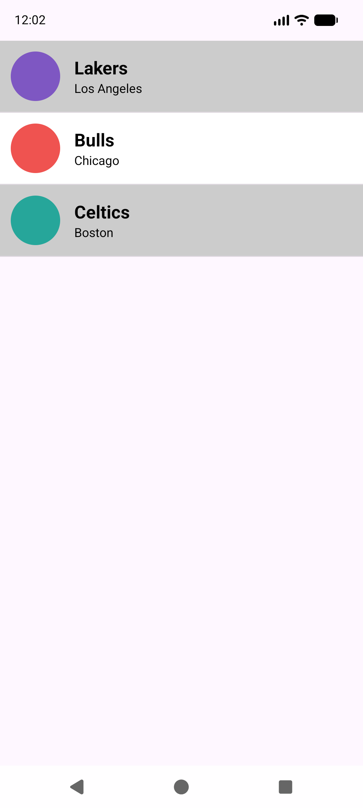
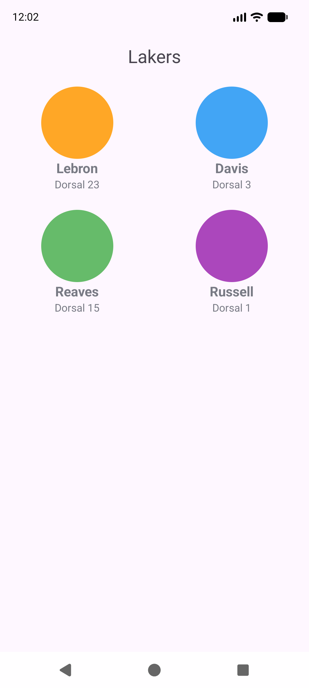
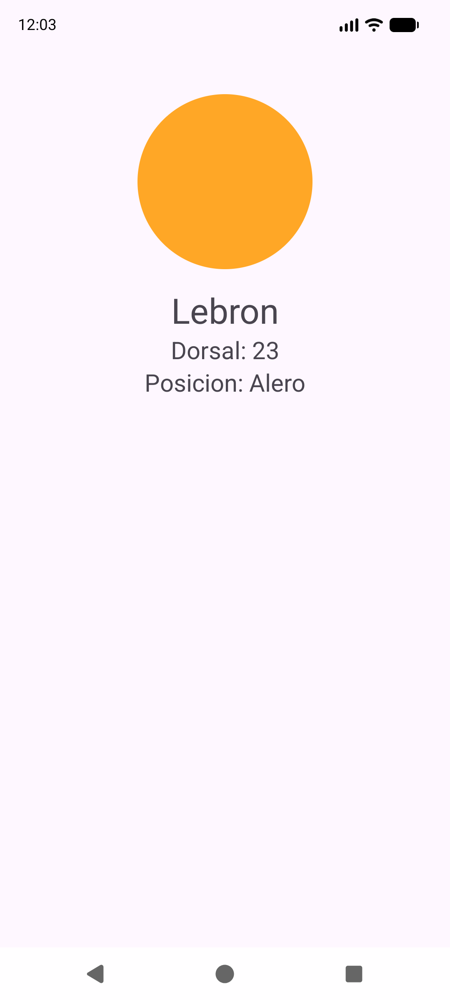
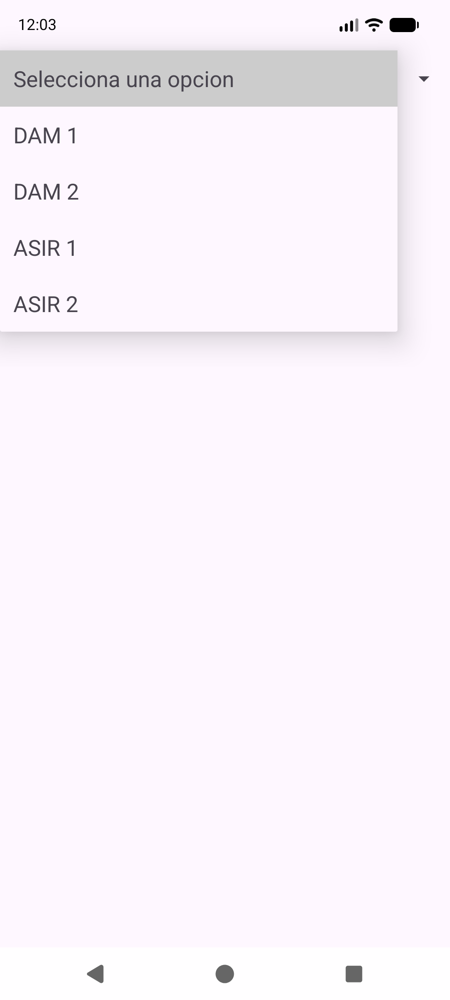
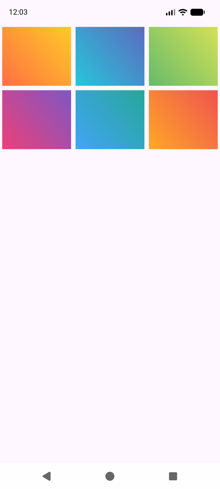
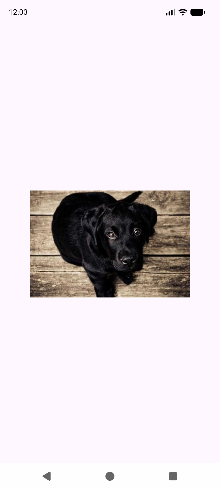

---
tags:
  - android
  - ejercicio
---

# Nivel 3 ⭐⭐⭐ — Adaptadores: `ListView`, `GridView`, `Spinner`, Glide, `RecyclerView` y Picasso

**Antes de empezar, lee:** [07 — Adaptadores](../conceptos/07-adaptadores.md), [14 — RecyclerView](../conceptos/14-recyclerview.md) y los proyectos [EjercicioAdaptadoresFinal](../proyectos/EjercicioAdaptadoresFinal.md) y [AdapterDam2](../proyectos/AdapterDam2.md), de donde salen estos ejercicios.

> Código verificado en el zip, paquete `ej/`: `Jugador`, `Equipo`, `DatosLiga`, `EquiposAdapter`, `JugadoresAdapter`, `Ej31EquiposActivity`, `Ej32JugadoresActivity`, `Ej33DetalleJugadorActivity`, `SpinnerCursosAdapter`, `Ej34SpinnerActivity`, `Ej34DetalleSpinnerActivity`, `ImageAdapter`, `Ej35GridActivity`, `ImageRecyclerAdapter`, `Ej36RecyclerActivity`, `Ej37PicassoActivity`.

## La idea que hay que tener clara (esquema para el examen)

```
1. El modelo           → clase Java con los datos (Equipo, Jugador…) que implementa Serializable
2. Los datos           → un ArrayList<Modelo> rellenado "a mano"
3. La fila             → un layout XML de UNA fila
4. El adaptador        → BaseAdapter: getCount, getItem, getItemId y getView
5. La vista            → ListView / GridView / Spinner  →  .setAdapter(adaptador)
6. La reacción al clic → setOnItemClickListener (listas y grids) / setOnItemSelectedListener (Spinner)
```

---

## Ejercicio 3.1 — `ListView` de equipos con un `BaseAdapter`

### 📝 Enunciado
Muestra en un `ListView` tres equipos (`Lakers`, `Bulls`, `Celtics`). Cada fila lleva el **logo** a la izquierda y, a su derecha, el **nombre** y la **ciudad**. Las filas alternan de color (efecto "cebra").

*(De clase: `EquiposAdapter` de `EjercicioAdaptadoresFinal` y `CompaniasAdapter` de `AdapterDam2` con el `position % 2`.)*



### 🎯 Qué practicas
Clase modelo `Serializable`, `BaseAdapter` con sus 4 métodos, `LayoutInflater.inflate(…, parent, false)` ([07 §2](../conceptos/07-adaptadores.md)).

### 💡 Pistas
1. Necesitas **cinco cosas**: el modelo (`Jugador`, `Equipo`), los datos, el layout de **una** fila, la clase adaptador y la Activity.
2. `BaseAdapter` obliga a escribir: `getCount`, `getItem`, `getItemId` y `getView`.
3. El trabajo de verdad está en `getView`: inflar la fila, buscar sus vistas, rellenarlas y devolverla.

### ✅ Solución

**Paso 1 — los modelos.** Implementan `Serializable` para poder pasarlos entre pantallas (así lo dice el comentario de `Equipo` en tu proyecto):

```java
//Si los datos son primitivos o serializables se pone Serializable para poder pasar los datos de una activity a otra
public class Jugador implements Serializable {

    private String nombre, posicion;
    private int dorsal;
    private int foto;   // R.drawable.xxx (recurso local)

    public Jugador(String nombre, int dorsal, String posicion, int foto) {
        this.nombre = nombre;
        this.dorsal = dorsal;
        this.posicion = posicion;
        this.foto = foto;
    }

    public String getNombre() { return nombre; }
    public String getPosicion() { return posicion; }
    public int getDorsal() { return dorsal; }
    public int getFoto() { return foto; }
}
```

```java
public class Equipo implements Serializable {

    private String nombre, ciudad;
    private int logo;                       // R.drawable.xxx
    private ArrayList<Jugador> jugadores;

    public Equipo(String nombre, String ciudad, int logo, ArrayList<Jugador> jugadores) {
        this.nombre = nombre;
        this.ciudad = ciudad;
        this.logo = logo;
        this.jugadores = jugadores;
    }

    public String getNombre() { return nombre; }
    public String getCiudad() { return ciudad; }
    public int getLogo() { return logo; }
    public ArrayList<Jugador> getJugadores() { return jugadores; }
}
```

**Paso 2 — los datos** (rellenados a mano, como en clase; cada equipo con **su propia** lista de jugadores):

```java
// Datos de ejemplo "quemados" en el codigo (en una app real vendrian de una BD o una API)
public class DatosLiga {

    public static ArrayList<Equipo> rellenarEquipos() {
        ArrayList<Jugador> jugadoresLakers = new ArrayList<>();
        jugadoresLakers.add(new Jugador("Lebron", 23, "Alero", R.drawable.ej_foto1));
        jugadoresLakers.add(new Jugador("Davis", 3, "Pivot", R.drawable.ej_foto2));
        jugadoresLakers.add(new Jugador("Reaves", 15, "Escolta", R.drawable.ej_foto3));
        jugadoresLakers.add(new Jugador("Russell", 1, "Base", R.drawable.ej_foto4));

        // Cada equipo con SU PROPIA lista (no compartir la misma referencia)
        ArrayList<Jugador> jugadoresBulls = new ArrayList<>();
        jugadoresBulls.add(new Jugador("LaVine", 8, "Escolta", R.drawable.ej_foto2));
        jugadoresBulls.add(new Jugador("Vucevic", 9, "Pivot", R.drawable.ej_foto4));
        jugadoresBulls.add(new Jugador("White", 0, "Base", R.drawable.ej_foto1));

        ArrayList<Jugador> jugadoresCeltics = new ArrayList<>();
        jugadoresCeltics.add(new Jugador("Tatum", 0, "Alero", R.drawable.ej_foto3));
        jugadoresCeltics.add(new Jugador("Brown", 7, "Escolta", R.drawable.ej_foto1));

        ArrayList<Equipo> equipos = new ArrayList<>();
        equipos.add(new Equipo("Lakers", "Los Angeles", R.drawable.ej_logo1, jugadoresLakers));
        equipos.add(new Equipo("Bulls", "Chicago", R.drawable.ej_logo2, jugadoresBulls));
        equipos.add(new Equipo("Celtics", "Boston", R.drawable.ej_logo3, jugadoresCeltics));
        return equipos;
    }
}
```

**Paso 3 — el layout de una fila `ej_item_equipo.xml`:**

```xml
<?xml version="1.0" encoding="utf-8"?>
<LinearLayout xmlns:android="http://schemas.android.com/apk/res/android"
    android:layout_width="match_parent"
    android:layout_height="wrap_content"
    android:gravity="center_vertical"
    android:orientation="horizontal"
    android:padding="12dp">

    <ImageView
        android:id="@+id/ivEquipoLogo"
        android:layout_width="56dp"
        android:layout_height="56dp"
        android:contentDescription="Logo" />

    <LinearLayout
        android:layout_width="0dp"
        android:layout_height="wrap_content"
        android:layout_marginStart="16dp"
        android:layout_weight="1"
        android:orientation="vertical">

        <TextView
            android:id="@+id/tvEquipoNombre"
            android:layout_width="wrap_content"
            android:layout_height="wrap_content"
            android:textColor="#000000"
            android:textSize="20sp"
            android:textStyle="bold" />

        <TextView
            android:id="@+id/tvEquipoCiudad"
            android:layout_width="wrap_content"
            android:layout_height="wrap_content"
            android:textColor="#000000"
            android:textSize="14sp" />
    </LinearLayout>

</LinearLayout>
```

**Paso 4 — el adaptador:**

```java
public class EquiposAdapter extends BaseAdapter {

    private ArrayList<Equipo> equipos;
    private Context context;

    public EquiposAdapter(Context context, ArrayList<Equipo> equipos) {
        this.context = context;
        this.equipos = equipos;
    }

    @Override
    public int getCount() {
        return equipos.size();            // 1. Cuantas filas hay
    }

    @Override
    public Object getItem(int position) {
        return equipos.get(position);     // 2. El objeto de esa posicion
    }

    @Override
    public long getItemId(int position) {
        return position;                  // 3. Un id por fila
    }

    @Override
    public View getView(int position, View convertView, ViewGroup parent) {
        // 4. EL MAS IMPORTANTE: construye la vista de UNA fila
        LayoutInflater inflater = LayoutInflater.from(this.context);
        View fila = inflater.inflate(R.layout.ej_item_equipo, parent, false);

        ImageView logo = fila.findViewById(R.id.ivEquipoLogo);
        TextView tvNombre = fila.findViewById(R.id.tvEquipoNombre);
        TextView tvCiudad = fila.findViewById(R.id.tvEquipoCiudad);

        Equipo equipo = equipos.get(position);
        logo.setImageResource(equipo.getLogo());
        tvNombre.setText(equipo.getNombre());
        tvCiudad.setText(equipo.getCiudad());

        // Colores de fila alternos (efecto "cebra")
        if (position % 2 == 0) {
            fila.setBackgroundColor(Color.LTGRAY);
        } else {
            fila.setBackgroundColor(Color.WHITE);
        }
        return fila;
    }
}
```

**Paso 5 — el layout de la pantalla `ej_lista_equipos.xml`** (solo un `ListView` con id `lvEquipos`, raíz con `@+id/main`) **y la Activity** (el `setOnItemClickListener` se explica en 3.3):

```java
public class Ej31EquiposActivity extends AppCompatActivity {

    private ArrayList<Equipo> equipos;

    @Override
    protected void onCreate(Bundle savedInstanceState) {
        super.onCreate(savedInstanceState);
        EdgeToEdge.enable(this);
        setContentView(R.layout.ej_lista_equipos);
        // ... (bloque de insets de siempre, ver 01-fundamentos §5)

        // Los datos
        equipos = DatosLiga.rellenarEquipos();

        // El adaptador propio + conectarlo a la lista
        EquiposAdapter adapter = new EquiposAdapter(this, equipos);
        ListView lvEquipos = findViewById(R.id.lvEquipos);
        lvEquipos.setAdapter(adapter);

        // Al pulsar una fila: abrimos los jugadores de ese equipo (ejercicio 3.3)
        lvEquipos.setOnItemClickListener(new AdapterView.OnItemClickListener() {
            @Override
            public void onItemClick(AdapterView<?> parent, View view, int position, long id) {
                Equipo equipo = equipos.get(position);
                Bundle bundle = new Bundle();
                bundle.putSerializable("equipoSeleccionado", equipo);
                Intent intent = new Intent(getApplicationContext(), Ej32JugadoresActivity.class);
                intent.putExtras(bundle);
                startActivity(intent);
            }
        });
    }
}
```

**Explicación de `getView`** (lo más preguntado):
1. `LayoutInflater.from(context)` obtiene el "inflador", que convierte XML en `View`.
2. `inflate(R.layout.ej_item_equipo, parent, false)` crea **una fila nueva**. `parent` = la lista (para que la fila tenga el tamaño correcto); **`false`** = "no la añadas tú, ya la coloca el `ListView`".
3. `fila.findViewById(...)` busca **dentro de la fila**, no en la Activity.
4. Se rellenan los datos de `equipos.get(position)` y `return fila`.

`getView` se llama **una vez por cada fila visible** (y otra vez al hacer scroll). Tus adaptadores no usan `convertView` (siempre inflan una vista nueva), como `EquiposAdapter` de clase; para listas cortas no se nota ([07 §3](../conceptos/07-adaptadores.md)).

### ⚠️ Errores típicos
- 📌 **`inflate(…, parent, true)`** en vez de `false`: la app se cierra con `UnsupportedOperationException: addView(View, LayoutParams) is not supported in AdapterView`.
- `findViewById(R.id.ivEquipoLogo)` sin `fila.`: busca en la Activity y devuelve `null` → `NullPointerException`.
- Olvidar `lvEquipos.setAdapter(adapter)`: pantalla en blanco, sin error.
- Compartir **la misma** `ArrayList<Jugador>` entre equipos: se modifican a la vez (ocurre en `EjercicioAdaptadoresFinal`).

**🚀 Reto extra:** usa `convertView` para **reciclar** la fila: `if (convertView == null) { fila = inflater.inflate(...); } else { fila = convertView; }` (como hace `FichaAdapter` en el [Nivel 5](05-nivel-5-fragmentos.md)).

---

## Ejercicio 3.2 — `GridView` de jugadores con un `BaseAdapter`

### 📝 Enunciado
Al pulsar un equipo se abre una pantalla con el **nombre del equipo** y sus jugadores en una **rejilla de 2 columnas**. Cada celda muestra la foto, el nombre y el dorsal.

*(De clase: `jugadores_Activity` + `JugadoresAdapter` de `EjercicioAdaptadoresFinal`.)*



### 🎯 Qué practicas
`GridView` (`android:numColumns`), otro `BaseAdapter`, recibir un objeto `Serializable` con `getSerializableExtra` y casting ([01 §2.3](../conceptos/01-fundamentos-bundle-intent-ciclo-vida.md)).

### 💡 Pistas
1. `GridView` y `ListView` usan **el mismo tipo de adaptador**; solo cambia el XML (`numColumns`).
2. Recibes el equipo con `(Equipo) getIntent().getSerializableExtra("equipoSeleccionado")`.
3. El adaptador recibe `equipo.getJugadores()`.

### ✅ Solución

**La celda `ej_grid_jugador.xml`:**

```xml
<?xml version="1.0" encoding="utf-8"?>
<LinearLayout xmlns:android="http://schemas.android.com/apk/res/android"
    android:layout_width="match_parent"
    android:layout_height="wrap_content"
    android:gravity="center"
    android:orientation="vertical"
    android:padding="12dp">

    <ImageView
        android:id="@+id/ivJugadorFoto"
        android:layout_width="96dp"
        android:layout_height="96dp"
        android:contentDescription="Foto" />

    <TextView
        android:id="@+id/tvJugadorNombre"
        android:layout_width="wrap_content"
        android:layout_height="wrap_content"
        android:textSize="18sp"
        android:textStyle="bold" />

    <TextView
        android:id="@+id/tvJugadorDorsal"
        android:layout_width="wrap_content"
        android:layout_height="wrap_content"
        android:textSize="14sp" />

</LinearLayout>
```

**El adaptador:**

```java
public class JugadoresAdapter extends BaseAdapter {

    private ArrayList<Jugador> jugadores;
    private Context context;

    public JugadoresAdapter(ArrayList<Jugador> jugadores, Context context) {
        this.jugadores = jugadores;
        this.context = context;
    }

    @Override
    public int getCount() {
        return jugadores.size();
    }

    @Override
    public Object getItem(int position) {
        return jugadores.get(position);
    }

    @Override
    public long getItemId(int position) {
        return position;
    }

    @Override
    public View getView(int position, View convertView, ViewGroup parent) {
        LayoutInflater inflater = LayoutInflater.from(context);
        View celda = inflater.inflate(R.layout.ej_grid_jugador, parent, false);

        ImageView foto = celda.findViewById(R.id.ivJugadorFoto);
        TextView tvNombre = celda.findViewById(R.id.tvJugadorNombre);
        TextView tvDorsal = celda.findViewById(R.id.tvJugadorDorsal);

        Jugador jugador = jugadores.get(position);
        foto.setImageResource(jugador.getFoto());
        tvNombre.setText(jugador.getNombre());
        tvDorsal.setText("Dorsal " + jugador.getDorsal());
        return celda;
    }
}
```

**La pantalla `ej_jugadores.xml`** (un `TextView` de título y un `GridView` con `android:numColumns="2"`) **y su Activity:**

```java
public class Ej32JugadoresActivity extends AppCompatActivity {

    @Override
    protected void onCreate(Bundle savedInstanceState) {
        super.onCreate(savedInstanceState);
        EdgeToEdge.enable(this);
        setContentView(R.layout.ej_jugadores);
        // ... (bloque de insets de siempre, ver 01-fundamentos §5)

        // Recogemos el equipo que nos mandan (casting: getSerializableExtra devuelve un tipo general)
        final Equipo equipo = (Equipo) getIntent().getSerializableExtra("equipoSeleccionado");

        TextView tvTituloEquipo = findViewById(R.id.tvTituloEquipo);
        tvTituloEquipo.setText(equipo.getNombre());

        GridView gridView = findViewById(R.id.gvJugadores);
        JugadoresAdapter jugadoresAdapter = new JugadoresAdapter(equipo.getJugadores(), getApplicationContext());
        gridView.setAdapter(jugadoresAdapter);

        // Al pulsar un jugador: su ficha (ejercicio 3.3)
        gridView.setOnItemClickListener(new AdapterView.OnItemClickListener() {
            @Override
            public void onItemClick(AdapterView<?> parent, View view, int position, long id) {
                Jugador jugador = equipo.getJugadores().get(position);
                Bundle bundle = new Bundle();
                bundle.putSerializable("jugadorSeleccionado", jugador);
                Intent intent = new Intent(getApplicationContext(), Ej33DetalleJugadorActivity.class);
                intent.putExtras(bundle);
                startActivity(intent);
            }
        });
    }
}
```

**Explicación:**
- El **casting** `(Equipo)` es necesario porque `getSerializableExtra` devuelve un tipo general ([00 §12](../conceptos/00-programacion-basica.md)).
- La clave `"equipoSeleccionado"` es **la misma** que puso `Ej31EquiposActivity` al enviar.
- `new JugadoresAdapter(equipo.getJugadores(), getApplicationContext())`: fíjate en el **orden** de los parámetros de tu constructor.

### ⚠️ Errores típicos
- Clave distinta al enviar y al recibir → `equipo` es `null` → `NullPointerException`.
- Olvidar `implements Serializable` en `Equipo` o en `Jugador`: falla **en ejecución**, no al compilar.
- Declarar `Ej32JugadoresActivity` sin ponerla en el manifiesto → `ActivityNotFoundException`.

**🚀 Reto extra:** que las columnas sean 3 en vez de 2 y comprobar cómo se adapta.

---

## Ejercicio 3.3 — Tres niveles: equipos → jugadores → ficha del jugador

### 📝 Enunciado
Completa la navegación: al pulsar un **jugador** se abre su **ficha** con la foto, el nombre, el dorsal y la posición. El objeto viaja en un `Bundle` con `putSerializable`.

*(De clase: `Detalles_Jugador` de `EjercicioAdaptadoresFinal`.)*



### 🎯 Qué practicas
`Bundle.putSerializable`, `intent.putExtras`, dos niveles de navegación, `ConstraintLayout` en cascada ([03 §3](../conceptos/03-constraintlayout.md)).

### 💡 Pistas
1. El clic ya está programado en `Ej31EquiposActivity` (equipo) y `Ej32JugadoresActivity` (jugador): mira su `setOnItemClickListener`.
2. En cada clic: `Bundle` → `putSerializable("clave", objeto)` → `intent.putExtras(bundle)` → `startActivity`.
3. La ficha se rellena con un `Jugador` recibido.

### ✅ Solución

**El clic del equipo** (en `Ej31EquiposActivity`, ya visto arriba):

```java
lvEquipos.setOnItemClickListener(new AdapterView.OnItemClickListener() {
    @Override
    public void onItemClick(AdapterView<?> parent, View view, int position, long id) {
        Equipo equipo = equipos.get(position);
        Bundle bundle = new Bundle();
        bundle.putSerializable("equipoSeleccionado", equipo);
        Intent intent = new Intent(getApplicationContext(), Ej32JugadoresActivity.class);
        intent.putExtras(bundle);
        startActivity(intent);
    }
});
```

Y el del jugador (en `Ej32JugadoresActivity`):

```java
gridView.setOnItemClickListener(new AdapterView.OnItemClickListener() {
    @Override
    public void onItemClick(AdapterView<?> parent, View view, int position, long id) {
        Jugador jugador = equipo.getJugadores().get(position);
        Bundle bundle = new Bundle();
        bundle.putSerializable("jugadorSeleccionado", jugador);
        Intent intent = new Intent(getApplicationContext(), Ej33DetalleJugadorActivity.class);
        intent.putExtras(bundle);
        startActivity(intent);
    }
});
```

**La ficha `ej_detalle_jugador.xml`** (`ConstraintLayout` con foto, nombre, dorsal y posición, cada uno colgando del anterior) **y su Activity:**

```java
public class Ej33DetalleJugadorActivity extends AppCompatActivity {

    @Override
    protected void onCreate(Bundle savedInstanceState) {
        super.onCreate(savedInstanceState);
        EdgeToEdge.enable(this);
        setContentView(R.layout.ej_detalle_jugador);
        // ... (bloque de insets de siempre, ver 01-fundamentos §5)

        // Sacamos el objeto con LA MISMA clave con la que lo metimos
        Jugador jugador = (Jugador) getIntent().getSerializableExtra("jugadorSeleccionado");

        ImageView ivFoto = findViewById(R.id.ivFotoJ);
        TextView tvNombre = findViewById(R.id.tvNombreJ);
        TextView tvDorsal = findViewById(R.id.tvDorsalJ);
        TextView tvPosicion = findViewById(R.id.tvPosicionJ);

        ivFoto.setImageResource(jugador.getFoto());
        tvNombre.setText(jugador.getNombre());
        tvDorsal.setText("Dorsal: " + jugador.getDorsal());
        tvPosicion.setText("Posicion: " + jugador.getPosicion());
    }
}
```

**Explicación:** el patrón completo es siempre el mismo: **Bundle con `putSerializable` → `Intent` con `putExtras` → destino con `getSerializableExtra` + casting**.

### ⚠️ Errores típicos
- Casting a la clase equivocada (`(Equipo)` en vez de `(Jugador)`): `ClassCastException`.
- Recibir con `getIntExtra` / `getStringExtra` algo que se envió como `Serializable`: devuelve el valor por defecto.

**🚀 Reto extra:** en la ficha, pinta el dorsal de un color según sea par o impar.

---

## Ejercicio 3.4 — `Spinner` personalizado (el `SpinnerDam2Adapter` de clase)

### 📝 Enunciado
Un desplegable de **cursos** (`DAM 1`, `DAM 2`, `ASIR 1`, `ASIR 2`) cuya primera fila sea el aviso **"Selecciona una opcion"**. Al elegir un curso, se abre otra pantalla que muestra `Curso: <curso>`.

*(De clase: `SpinnerDam2Activity` + `SpinnerDam2Adapter` de `AdapterDam2`, con el truco del `+1` y la bandera `ver`.)*



### 🎯 Qué practicas
`ArrayAdapter` personalizado, `getView` y `getDropDownView`, `<string-array>`, `OnItemSelectedListener` ([07 §6](../conceptos/07-adaptadores.md)).

### 💡 Pistas
1. Los datos van en `res/values` dentro de `<string-array name="ej_cursos">`; se leen con `getResources().getStringArray(R.array.ej_cursos)`.
2. `getCount()` devuelve `datos.length + 1` (la fila 0 es el aviso) y todo acceso al array se **desplaza** un índice: `datos[position - 1]`.
3. Un `Spinner` dispara `onItemSelected` **la primera vez que se monta**: usa una bandera para ignorarla.

### ✅ Solución

**Los datos `res/values/ej_arrays.xml`:**

```xml
<string-array name="ej_cursos">
    <item>DAM 1</item>
    <item>DAM 2</item>
    <item>ASIR 1</item>
    <item>ASIR 2</item>
</string-array>
```

**La fila `ej_spinner_fila.xml`** (un `TextView` de id `tvSpinner`) **y el adaptador:**

```java
public class SpinnerCursosAdapter extends ArrayAdapter<String> {

    private final Context contexto;
    private final String[] datos;

    public SpinnerCursosAdapter(Context context, int resource, String[] datos) {
        super(context, resource, datos);   // le pasamos los datos a la clase padre tambien
        this.contexto = context;
        this.datos = datos;
    }

    @Override
    public int getCount() {
        return datos.length + 1;    // +1: dejamos hueco para la fila "Selecciona una opcion"
    }

    @Override
    public View getView(int position, View convertView, ViewGroup parent) {
        return vistaPersonalizada(position, parent);   // fila cuando el spinner esta CERRADO
    }

    @Override
    public View getDropDownView(int position, View convertView, ViewGroup parent) {
        return vistaPersonalizada(position, parent);   // fila del desplegable ABIERTO
    }

    private View vistaPersonalizada(int position, ViewGroup parent) {
        View fila = LayoutInflater.from(contexto).inflate(R.layout.ej_spinner_fila, parent, false);
        TextView tvSpinner = fila.findViewById(R.id.tvSpinner);
        if (position == 0) {
            tvSpinner.setText("Selecciona una opcion");   // fila "falsa" 0, solo de aviso
            fila.setBackgroundColor(Color.LTGRAY);
        } else {
            tvSpinner.setText(datos[position - 1]);        // los datos reales, desplazados 1 posicion
        }
        return fila;
    }
}
```

**La pantalla (`ej_spinner.xml`, con un `Spinner` de id `cbCursos`) y su Activity:**

```java
public class Ej34SpinnerActivity extends AppCompatActivity {

    private int ver = 0;   // "bandera": el Spinner dispara onItemSelected al montarse

    @Override
    protected void onCreate(Bundle savedInstanceState) {
        super.onCreate(savedInstanceState);
        EdgeToEdge.enable(this);
        setContentView(R.layout.ej_spinner);
        // ... (bloque de insets de siempre, ver 01-fundamentos §5)

        // Los datos vienen de res/values (un TypedArray/array de recursos)
        String[] cursos = getResources().getStringArray(R.array.ej_cursos);

        Spinner cbCursos = findViewById(R.id.cbCursos);
        cbCursos.setAdapter(new SpinnerCursosAdapter(this, R.layout.ej_spinner_fila, cursos));

        // El Intent se crea UNA vez, fuera del listener
        final Intent intent = new Intent(this, Ej34DetalleSpinnerActivity.class);
        cbCursos.setOnItemSelectedListener(new AdapterView.OnItemSelectedListener() {
            @Override
            public void onItemSelected(AdapterView<?> parent, View view, int position, long id) {
                if (ver == 1 && position > 0) {
                    Bundle bundle = new Bundle();
                    bundle.putString("curso", parent.getItemAtPosition(position - 1) + "");
                    intent.putExtras(bundle);
                    startActivity(intent);
                }
                ver = 1;
            }

            @Override
            public void onNothingSelected(AdapterView<?> parent) {
                // obligatorio implementarlo, aqui no hace falta nada
            }
        });
    }
}
```

**La pantalla de destino** (`Ej34DetalleSpinnerActivity`):

```java
public class Ej34DetalleSpinnerActivity extends AppCompatActivity {

    @Override
    protected void onCreate(Bundle savedInstanceState) {
        super.onCreate(savedInstanceState);
        EdgeToEdge.enable(this);
        setContentView(R.layout.ej_detalle_spinner);
        // ... (bloque de insets de siempre, ver 01-fundamentos §5)

        String curso = getIntent().getStringExtra("curso");
        ((TextView) findViewById(R.id.tvDetalleSpinner)).setText("Curso: " + curso);
    }
}
```

**Explicación:**
- `getView` dibuja la fila con el `Spinner` **cerrado**; `getDropDownView`, las filas del desplegable **abierto**. Aquí ambas usan la misma función.
- **El truco del `+1`:** al haber una fila "falsa" en la posición 0, el dato de la posición `p` es `datos[p - 1]`. Por eso también `parent.getItemAtPosition(position - 1)`.
- **La bandera `ver`:** empieza en 0. La primera llamada (automática, al montarse) la pone a 1 sin hacer nada; solo a partir de la segunda (elección real) se navega. `position > 0` ignora la fila de aviso.
- El `Intent` se crea **una sola vez, fuera del listener** (evita el fallo de "variable sombra" de `equiposFutbol`).

### ⚠️ Errores típicos
- 📌 Usar `setOnItemClickListener` con un `Spinner`: lanza `RuntimeException` (usa `setOnItemSelectedListener`).
- 📌 Sin la bandera, la app **salta de pantalla nada más abrirla**.
- Olvidar `onNothingSelected`: no compila.
- Olvidar el `- 1`: se muestra el curso siguiente o `ArrayIndexOutOfBoundsException` en la última fila.

**🚀 Reto extra:** para un `Spinner` sencillo (sin fila personalizada) mira el atajo `ArrayAdapter.createFromResource(this, R.array.ej_cursos, android.R.layout.simple_spinner_dropdown_item)` ([07 §6.1](../conceptos/07-adaptadores.md)).

---

## Ejercicio 3.5 — `GridView` de imágenes con Glide y `TypedArray`

### 📝 Enunciado
Una galería de **6 imágenes en 3 columnas**, cargadas desde un array de recursos con **Glide**. (Al pulsar una imagen se abre su detalle con transición: eso es el [ejercicio 4.5](04-nivel-4-toast-asynctask-animaciones-transiciones.md).)

*(De clase: `GridDam` + `ImageAdapter` del PDF `6-Adaptadores.pdf`.)*



### 🎯 Qué practicas
`TypedArray`, `obtainTypedArray`, Glide, dependencias en `build.gradle.kts`.

### 💡 Pistas
1. Las imágenes van en un `<string-array>` con `@drawable/…`; en Java se obtienen con `getResources().obtainTypedArray(R.array.ej_paisajes)`.
2. Glide es una **librería**: hay que añadirla en `app/build.gradle.kts` y pulsar **Sync Now**.
3. `imagenes.getResourceId(position, -1)` da el id de la imagen de esa posición.

### ✅ Solución

**Dependencia** (`app/build.gradle.kts`, en `dependencies { }`), la de tu PDF:
```kotlin
implementation("com.github.bumptech.glide:glide:4.16.0")
```

**Las imágenes** (`res/values/ej_arrays.xml`):

```xml
<string-array name="ej_paisajes">
    <item>@drawable/ej_paisaje1</item>
    <item>@drawable/ej_paisaje2</item>
    <item>@drawable/ej_paisaje3</item>
    <item>@drawable/ej_paisaje4</item>
    <item>@drawable/ej_paisaje5</item>
    <item>@drawable/ej_paisaje6</item>
</string-array>
```

**El adaptador:**

```java
public class ImageAdapter extends BaseAdapter {

    private final Context contexto;
    private final TypedArray imagenes;

    public ImageAdapter(Context contexto, TypedArray imagenes) {
        this.contexto = contexto;
        this.imagenes = imagenes;
    }

    @Override
    public int getCount() {
        return imagenes.length();
    }

    @Override
    public Object getItem(int position) {
        return imagenes.getResourceId(position, -1);
    }

    @Override
    public long getItemId(int position) {
        return position;
    }

    @Override
    public View getView(int position, View convertView, ViewGroup parent) {
        LayoutInflater inflater = LayoutInflater.from(contexto);
        View vistaImagen = inflater.inflate(R.layout.ej_grid_item_view, parent, false);

        ImageView imagen = vistaImagen.findViewById(R.id.imagenGridView);

        // Glide carga la imagen de forma asincrona (y controla el tamano del buffer)
        Glide.with(contexto)
                .load(imagenes.getResourceId(position, -1))
                .into(imagen);

        return vistaImagen;
    }
}
```

**La pantalla `ej_grid_imagenes.xml`** (`GridView` con id `gridImagenes` y `numColumns="3"`), **la celda `ej_grid_item_view.xml`** (un `ImageView` de id `imagenGridView`) **y la Activity:**

```java
grid = findViewById(R.id.gridImagenes);
grid.setAdapter(new ImageAdapter(getApplicationContext(),
        getResources().obtainTypedArray(R.array.ej_paisajes)));
```

**Explicación:**
- El PDF explica por qué se usa Glide: con imágenes grandes la app tardaría en arrancar; Glide las carga de forma **asíncrona** y controla el tamaño del buffer.
- `getItem` devuelve `imagenes.getResourceId(position, -1)`: el `-1` es el valor por defecto si no existe.
- `TypedArray` es un array de **recursos**; por eso `getResourceId` y no `getString`.

### ⚠️ Errores típicos
- Olvidar el **Sync** tras añadir la dependencia: `cannot find symbol Glide`.
- Usar `getStringArray` en vez de `obtainTypedArray`: obtienes textos (`"res/drawable/..."`), no imágenes.

**🚀 Reto extra:** cambia `Glide.with(contexto).load(...)` por `imagen.setImageResource(...)` y comprueba que funciona igual (con imágenes pequeñas no se nota la diferencia).

---

## Ejercicio 3.6 — La misma rejilla con `RecyclerView`

### 📝 Enunciado
Repite la galería del 3.5 con un **`RecyclerView`** en cuadrícula de 3 columnas, con `ViewHolder` y `GridLayoutManager`.

*(De clase: `GridRecyclerDam` + `ImageRecyclerAdapter` del PDF `6-Adaptadores.pdf`.)*


### 🎯 Qué practicas
`RecyclerView.Adapter`, `ViewHolder`, `LayoutManager` ([14](../conceptos/14-recyclerview.md)).

### 💡 Pistas
1. Dependencia: `implementation("androidx.recyclerview:recyclerview:1.3.2")` + Sync.
2. El adaptador tiene **tres** métodos: `onCreateViewHolder`, `onBindViewHolder` y `getItemCount`.
3. El `ViewHolder` guarda el `findViewById` para no repetirlo en cada fila.
4. El número de columnas lo pone el `GridLayoutManager`, no el XML.

### ✅ Solución

**La pantalla** (`ej_recycler.xml`): un `androidx.recyclerview.widget.RecyclerView` con id `recyclerImagenes`.

**El adaptador:**

```java
public class ImageRecyclerAdapter extends RecyclerView.Adapter<ImageRecyclerAdapter.ImagenViewHolder> {

    private final Context contexto;
    private final TypedArray imagenes;

    public ImageRecyclerAdapter(Context contexto, TypedArray imagenes) {
        this.contexto = contexto;
        this.imagenes = imagenes;
    }

    // Se crea la vista y se guardan sus referencias en el ViewHolder (pocas veces)
    @NonNull
    @Override
    public ImagenViewHolder onCreateViewHolder(@NonNull ViewGroup parent, int viewType) {
        View vista = LayoutInflater.from(contexto).inflate(R.layout.ej_grid_item_view, parent, false);
        return new ImagenViewHolder(vista);
    }

    // Se rellena una vista reutilizada con la imagen de esa posicion (al hacer scroll)
    @Override
    public void onBindViewHolder(@NonNull ImagenViewHolder holder, int position) {
        Glide.with(contexto)
                .load(imagenes.getResourceId(position, -1))
                .into(holder.imagen);
    }

    @Override
    public int getItemCount() {
        return imagenes.length();
    }

    // El ViewHolder cachea el findViewById: una sola vez por vista
    static class ImagenViewHolder extends RecyclerView.ViewHolder {
        final ImageView imagen;

        ImagenViewHolder(@NonNull View itemView) {
            super(itemView);
            imagen = itemView.findViewById(R.id.imagenGridView);
        }
    }
}
```

**La Activity:**

```java
public class Ej36RecyclerActivity extends AppCompatActivity {

    private RecyclerView recycler;

    @Override
    protected void onCreate(Bundle savedInstanceState) {
        super.onCreate(savedInstanceState);
        EdgeToEdge.enable(this);
        setContentView(R.layout.ej_recycler);
        // ... (bloque de insets de siempre, ver 01-fundamentos §5)

        recycler = findViewById(R.id.recyclerImagenes);
        recycler.setLayoutManager(new GridLayoutManager(this, 3)); // 3 columnas, como el GridView
        recycler.setAdapter(new ImageRecyclerAdapter(this,
                getResources().obtainTypedArray(R.array.ej_paisajes)));
    }
}
```

**Explicación (PDF):** los componentes `ListView`, `GridView` y `Spinner` siguen siendo válidos, pero hoy las listas se construyen con `RecyclerView`, que **reutiliza las vistas** de forma más eficiente con el patrón `ViewHolder`. **El concepto de adaptador es el mismo.**

| `BaseAdapter` | `RecyclerView.Adapter` |
|---|---|
| `getCount()` | `getItemCount()` |
| `getView()` (infla y rellena) | `onCreateViewHolder()` (infla, pocas veces) + `onBindViewHolder()` (rellena, al hacer scroll) |
| Sin `ViewHolder` | `ViewHolder` obligatorio |

### ⚠️ Errores típicos
- Olvidar `setLayoutManager`: el `RecyclerView` no muestra nada.
- Olvidar la dependencia: `cannot find symbol RecyclerView`.

**🚀 Reto extra:** cambia `GridLayoutManager(this, 3)` por `LinearLayoutManager(this)` y observa que la cuadrícula se convierte en lista.

---

## Ejercicio 3.7 — Imagen desde internet con Picasso

### 📝 Enunciado
Muestra en un `ImageView` una imagen descargada de una **URL**, con **Picasso** (como los logos de `EquiposAdapter` en `EjercicioAdaptadoresFinal`).



### 🎯 Qué practicas
Picasso, permiso `INTERNET`, dependencias.

### 💡 Pistas
1. Dependencia: `implementation("com.squareup.picasso:picasso:2.71828")` (la versión de `AdapterDam2`) + Sync.
2. **Sin el permiso `INTERNET` en el manifiesto la app compila igual, pero la imagen nunca aparece** y no da error.
3. `Picasso.get().load(url).into(imageView)`.

### ✅ Solución

**Permiso** (`AndroidManifest.xml`, **fuera** de `<application>`):
```xml
<uses-permission android:name="android.permission.INTERNET" />
```

**La Activity** (layout con un `ImageView` de id `ivInternet`):

```java
public class Ej37PicassoActivity extends AppCompatActivity {

    @Override
    protected void onCreate(Bundle savedInstanceState) {
        super.onCreate(savedInstanceState);
        EdgeToEdge.enable(this);
        setContentView(R.layout.ej_picasso);
        // ... (bloque de insets de siempre, ver 01-fundamentos §5)

        ImageView ivInternet = findViewById(R.id.ivInternet);

        // Picasso descarga la imagen en segundo plano, la guarda en cache y la asigna al ImageView
        Picasso.get()
                .load("https://picsum.photos/id/237/400/300")
                .into(ivInternet);
    }
}
```

**Explicación:** Picasso descarga la imagen **en segundo plano**, la guarda en caché y la asigna al `ImageView` cuando está lista, todo en una línea, sin que gestiones hilos.

### ⚠️ Errores típicos
- 📌 **Falta el permiso `INTERNET`**: pantalla en blanco, sin ningún error.
- URL con `http://` (sin `s`): Android bloquea por defecto el tráfico no cifrado.
- Sin conexión en el emulador/móvil.

**🚀 Reto extra:** usa Picasso en `getView` de `EquiposAdapter` (con un campo `String logo`) como en `EjercicioAdaptadoresFinal`.

---

## Preguntas de teoría (sin código)

1. **¿Qué hace el tercer parámetro de `inflate(R.layout.fila, parent, false)`?** → `false` = "no añadas la vista al `parent`": el `ListView`/`GridView` ya la coloca. Con `true` falla.
2. **¿Para qué sirve `convertView`?** → Para **reciclar** una fila que salió de la pantalla en vez de inflar una nueva.
3. **¿Diferencia entre `BaseAdapter` y `ArrayAdapter`?** → `ArrayAdapter` ya implementa `getCount/getItem/getItemId` a partir de un array; `BaseAdapter` obliga a escribir los cuatro métodos pero da control total.
4. **¿Por qué el listener de un `Spinner` se ejecuta nada más abrir la pantalla?** → El `Spinner` selecciona la posición 0 al montarse y notifica esa selección; por eso se usa una bandera (`ver`).
5. **¿Qué necesita un objeto para viajar dentro de un `Bundle`/`Intent` con `putSerializable`?** → Que su clase **implemente `Serializable`** (y las clases que contiene).
6. **¿Por qué se usa Glide/Picasso?** → Cargan imágenes de forma **asíncrona** y las gestionan (caché, tamaño); Picasso permite URLs.
7. **¿Qué ventaja tiene `RecyclerView`?** → Reutiliza las vistas de forma obligatoria (`ViewHolder`) y admite distintos `LayoutManager`.

---

## ✅ Autoevaluación del Nivel 3

- [ ] Escribir un `BaseAdapter` completo (los 4 métodos) sin mirar.
- [ ] Explicar `inflate(layout, parent, false)`.
- [ ] Mostrar datos en un `ListView` y en un `GridView`.
- [ ] Pasar un objeto `Serializable` con un `Bundle` y recibirlo con casting.
- [ ] Hacer un `Spinner` personalizado con el truco del `+1` y la bandera.
- [ ] Añadir Glide/Picasso al `build.gradle.kts` y usarlos.
- [ ] Explicar en qué se parecen y se diferencian `BaseAdapter` y `RecyclerView.Adapter`.

Siguiente: **[Nivel 4 — Toast, AsyncTask, animaciones y transiciones](04-nivel-4-toast-asynctask-animaciones-transiciones.md)**.
