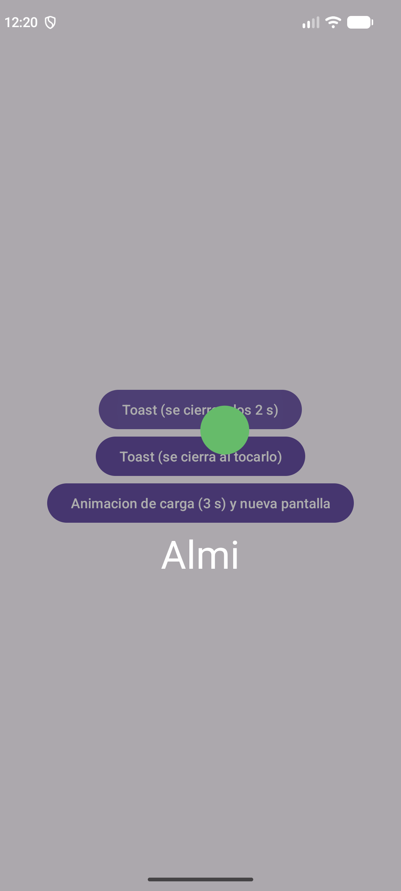
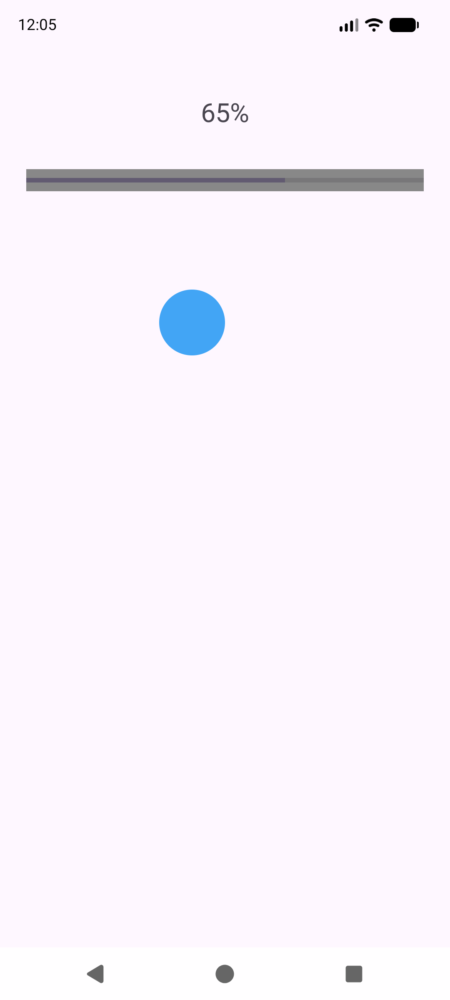
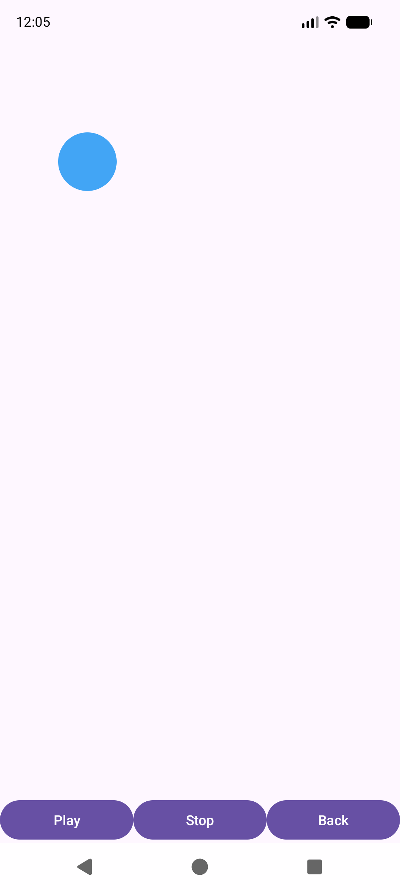
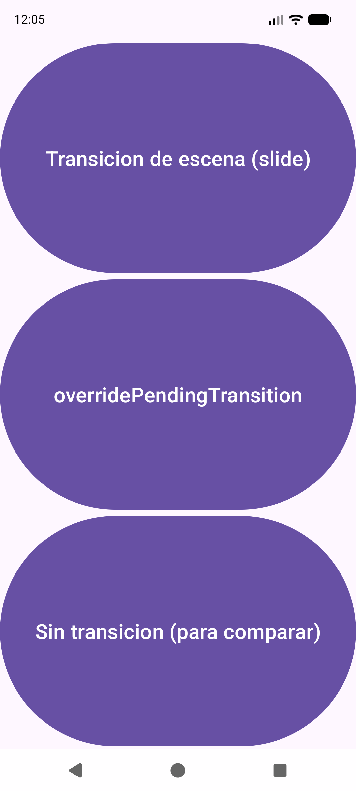

---
tags:
  - android
  - ejercicio
---

# Nivel 4 ⭐⭐⭐⭐ — Toast personalizado, AsyncTask, animaciones y transiciones

**Antes de empezar, lee:** [04 — Toast personalizado](../conceptos/04-toast-personalizado.md), [05 — AsyncTask e hilos](../conceptos/05-asynctask-e-hilos.md), [06 — Animaciones frame by frame](../conceptos/06-animaciones-frame-by-frame.md) y [08 — Transiciones](../conceptos/08-transiciones.md). Los proyectos de los que salen: [Diseobesos](../proyectos/Diseobesos.md), [EjercicioDiseno](../proyectos/EjercicioDiseno.md) y [AdapterDam2](../proyectos/AdapterDam2.md).

> Código verificado en el zip, paquete `ej/`: `Ej41ToastPerActivity`, `Ej42AsyncActivity`, `ProgressAndando`, `Ej43FrameActivity`, `Ej44TransicionesActivity`, `Ej44SlideActivity`, `Ej35GridActivity`, `Ej45DetalleFotoActivity`. Recursos: `res/drawable/ej_andando1..4.xml`, `ej_framebyframe.xml`, `res/values/ej_frames.xml`, `res/transition/`, `res/anim/`.

> **Sobre las imágenes:** en clase se usan las imágenes `andando1…4` (un niño andando). Aquí los fotogramas son una **pelota que se desplaza** dibujada con XML, para que puedas hacer los ejercicios sin necesitar ninguna imagen. Si tienes tus `andando1…4`, sustituye `@drawable/ej_andando1` por `@drawable/andando1` y el resto funciona igual.

---

## Ejercicio 4.1 — Toast personalizado con `Dialog` + `Handler`

### 📝 Enunciado
Tres botones:
1. **Toast (se cierra a los 2 s):** muestra una ventana con una imagen y un texto grande que desaparece sola a los 2 segundos.
2. **Toast (se cierra al tocarlo):** la ventana se cierra cuando el usuario toca la imagen.
3. **Animación de carga (3 s):** *(enunciado de `EjercicioAnimaciones.pdf`)* "Crea una animación de carga al darle al botón que dure 3 segundos. Al terminar la animación se cargará una nueva activity vacía."

*(De clase: `3-ToasPersonalizado.pdf`, `Diseobesos` y `EjercicioDiseno`.)*



### 🎯 Qué practicas
`Dialog` sin fondo, `LayoutInflater.inflate(…, null)`, `Handler.postDelayed`, `final` y `MiActividad.this` en clases anónimas ([04](../conceptos/04-toast-personalizado.md)).

### 💡 Pistas
1. Un `Toast` normal solo admite texto: para imagen + texto se usa un **`Dialog`** con un layout propio.
2. `inflate(R.layout.x, null)`: el `null` es porque la vista **no necesita padre** (va dentro de un `Dialog`).
3. Por defecto un `Dialog` tiene fondo blanco: `setBackgroundDrawableResource(android.R.color.transparent)`.
4. Para cerrarlo con temporizador: `new Handler(Looper.getMainLooper()).postDelayed(runnable, milisegundos)`.
5. La variable del diálogo debe ser **`final`** (se usa en otra clase anónima).

### ✅ Solución

**El "toast" `ej_toast_per.xml`** (el del PDF: imagen de 200 dp y texto de 40 sp):

```xml
<?xml version="1.0" encoding="utf-8"?>
<LinearLayout xmlns:android="http://schemas.android.com/apk/res/android"
    android:id="@+id/layoutToast"
    android:layout_width="wrap_content"
    android:layout_height="wrap_content"
    android:orientation="vertical"
    android:padding="16dp">

    <ImageView
        android:id="@+id/ivToast"
        android:layout_width="200dp"
        android:layout_height="200dp"
        android:contentDescription="Imagen del toast" />

    <TextView
        android:id="@+id/tvToast"
        android:layout_width="match_parent"
        android:layout_height="wrap_content"
        android:gravity="center"
        android:text="Almi"
        android:textColor="#FFFFFF"
        android:textSize="40sp" />
</LinearLayout>
```

**La Activity** (con un método auxiliar `crearDialogo` para no repetir el código tres veces; en clase se repite dentro de cada botón):

```java
public class Ej41ToastPerActivity extends AppCompatActivity {

    @Override
    protected void onCreate(Bundle savedInstanceState) {
        super.onCreate(savedInstanceState);
        EdgeToEdge.enable(this);
        setContentView(R.layout.ej_toast_menu);
        // ... (bloque de insets de siempre, ver 01-fundamentos §5)

        Button btnToast2s = findViewById(R.id.btnToast2s);
        Button btnToastTocar = findViewById(R.id.btnToastTocar);
        Button btnCarga3s = findViewById(R.id.btnCarga3s);

        // (1) Se cierra solo a los 2 segundos
        btnToast2s.setOnClickListener(new View.OnClickListener() {
            @Override
            public void onClick(View v) {
                final Dialog dialogo = crearDialogo("Almi");
                dialogo.show();

                new Handler(Looper.getMainLooper()).postDelayed(new Runnable() {
                    @Override
                    public void run() {
                        dialogo.dismiss();
                    }
                }, 2000);
            }
        });

        // (2) Se cierra cuando el usuario toca la imagen
        btnToastTocar.setOnClickListener(new View.OnClickListener() {
            @Override
            public void onClick(View v) {
                final Dialog dialogo = crearDialogo("Tocame");
                ImageView imagen = dialogo.findViewById(R.id.ivToast);
                imagen.setOnClickListener(new View.OnClickListener() {
                    @Override
                    public void onClick(View v) {
                        dialogo.dismiss();
                    }
                });
                dialogo.show();
            }
        });

        // (3) Enunciado de clase: "animacion de carga de 3 segundos; al terminar, una nueva activity vacia"
        btnCarga3s.setOnClickListener(new View.OnClickListener() {
            @Override
            public void onClick(View v) {
                final Dialog dialogo = crearDialogo("Cargando...");
                dialogo.show();

                new Handler(Looper.getMainLooper()).postDelayed(new Runnable() {
                    @Override
                    public void run() {
                        Intent intent = new Intent(getApplicationContext(), EjVaciaActivity.class);
                        startActivity(intent);
                        dialogo.dismiss();
                    }
                }, 3000);
            }
        });
    }

    // Crea el "toast": infla el layout SIN padre (null), lo rellena y lo mete en un Dialog sin fondo
    private Dialog crearDialogo(String textoMostrar) {
        View vista = getLayoutInflater().inflate(R.layout.ej_toast_per, null);

        ImageView imagen = vista.findViewById(R.id.ivToast);
        imagen.setImageResource(R.drawable.ej_andando3);
        TextView texto = vista.findViewById(R.id.tvToast);
        texto.setText(textoMostrar);

        final Dialog dialogo = new Dialog(Ej41ToastPerActivity.this);
        dialogo.setContentView(vista);
        if (dialogo.getWindow() != null) {
            dialogo.getWindow().setBackgroundDrawableResource(android.R.color.transparent);
        }
        return dialogo;
    }
}
```

**Explicación:**
- `crearDialogo` hace lo del PDF: infla, rellena (`setImageResource`, `setText`), mete la vista en un `new Dialog(Ej41ToastPerActivity.this)` y quita el fondo.
- **`Ej41ToastPerActivity.this`** y no `this`: dentro de una clase anónima `this` sería el listener, no la Activity ([04 §4.1](../conceptos/04-toast-personalizado.md)).
- **`final Dialog dialogo`**: se usa dentro del `Runnable`, otra clase anónima.
- `Handler.postDelayed(…, 2000)` ejecuta el `run()` **dentro de 2000 ms en el hilo principal** sin congelar la pantalla.
- En el tercer botón, **primero** se abre la nueva Activity y **después** se cierra el diálogo, exactamente como en el botón *Pikachu* de `EjercicioDiseno`.

### ⚠️ Errores típicos
- 📌 Olvidar el `android.R.color.transparent`: aparece un recuadro blanco alrededor.
- 📌 `new Dialog(this)` dentro del listener: no compila (`this` no es un `Context`).
- No declarar `dialogo` como `final` → error de compilación en el `Runnable`.
- Olvidar `dialogo.show()`.

**🚀 Reto extra:** cambia el `Handler` del tercer botón para que dure 5 segundos y lleve a `Ej43FrameActivity` en vez de a la pantalla vacía.

---

## Ejercicio 4.2 — `AsyncTask`: barra de progreso y animación

### 📝 Enunciado
Una pantalla con un **porcentaje**, una **barra de progreso** y una **imagen** que va cambiando de fotograma. La animación y el progreso los controla **una clase que hereda de `AsyncTask`**. Al terminar, la pantalla se cierra sola.

*(De clase: `4-asyncTask.pdf`, `ProgressAndando` de `Diseobesos`, `ProgresoCaballo` de `EjercicioDiseno`. En clase dura 20 s; aquí, 4 s para poder probarlo.)*



### 🎯 Qué practicas
`AsyncTask<Params, Progress, Result>`, `doInBackground`, `onProgressUpdate`, `onPostExecute`, `publishProgress`, `TypedArray`, getters ([05](../conceptos/05-asynctask-e-hilos.md), [12](../conceptos/12-hilos-en-profundidad.md)).

### 💡 Pistas
1. Los fotogramas van en un `<string-array>` con `@drawable/…`; se cargan con `obtainTypedArray`.
2. La Activity guarda las vistas en **atributos** y ofrece **getters** para que la tarea (otra clase) pueda usarlas.
3. Los **tres tipos genéricos** de `AsyncTask` son: los parámetros de `execute`, el tipo del progreso y el tipo del resultado.
4. `doInBackground` corre en **otro hilo**: ahí **no** se tocan las vistas. Para avisar al hilo principal se llama a **`publishProgress(...)`**, que dispara `onProgressUpdate` (este sí toca las vistas).

### ✅ Solución

**Los fotogramas `res/values/ej_frames.xml`** (como el `frames.xml` del PDF):

```xml
<?xml version="1.0" encoding="utf-8"?>
<resources>
    <string-array name="ej_imagenes">
        <item>@drawable/ej_andando1</item>
        <item>@drawable/ej_andando2</item>
        <item>@drawable/ej_andando3</item>
        <item>@drawable/ej_andando4</item>
    </string-array>
</resources>
```

**El layout `ej_async.xml`** (`ConstraintLayout` con `TextView` `tvAnimacion`, `ProgressBar` `pbAnimacion` e `ImageView` `ivAnimacion`, igual que el del PDF).

**La Activity:**

```java
public class Ej42AsyncActivity extends AppCompatActivity {

    //Typed Array es un array de recursos.
    private TypedArray imagenes = null;
    private ProgressBar barra = null;
    private ImageView imageCentral = null;
    private TextView texto = null;

    @Override
    protected void onCreate(Bundle savedInstanceState) {
        super.onCreate(savedInstanceState);
        EdgeToEdge.enable(this);
        setContentView(R.layout.ej_async);
        // ... (bloque de insets de siempre, ver 01-fundamentos §5)

        //Obtener los fotogramas del XML: R.array es un array de Strings que se convierte en un TypedArray
        imagenes = getResources().obtainTypedArray(R.array.ej_imagenes);

        barra = findViewById(R.id.pbAnimacion);
        imageCentral = findViewById(R.id.ivAnimacion);
        texto = findViewById(R.id.tvAnimacion);

        //Parametros para el ProgressBar: valor maximo, inicio y color de fondo
        barra.setMax(100);
        barra.setProgress(0);
        barra.setBackgroundColor(Color.GRAY);

        //Creamos la tarea, pasandole "this" (la Activity), y la lanzamos
        ProgressAndando hilo = new ProgressAndando(this);
        hilo.execute();
    }

    // getters: para que la tarea (otra clase) pueda usar estas vistas
    public TypedArray getImagenes() { return imagenes; }
    public ProgressBar getBarra() { return barra; }
    public ImageView getImageCentral() { return imageCentral; }
    public TextView getTexto() { return texto; }
}
```

**La tarea:**

```java
// AsyncTask<Params, Progress, Result>: aqui no hay parametros (Void), el progreso son Integer y no devuelve nada (Void)
public class ProgressAndando extends AsyncTask<Void, Integer, Void> {

    private Ej42AsyncActivity activity;

    public ProgressAndando(Ej42AsyncActivity activity) {
        this.activity = activity;
    }

    // Se ejecuta en un HILO SECUNDARIO (aqui NO se tocan las vistas)
    @Override
    protected Void doInBackground(Void... voids) {
        int foto = 0;
        for (int i = 0; i < 40; i++) {
            foto++;
            if (foto >= 4) {
                foto = 0;           // hay 4 fotogramas (0,1,2,3): se reinicia el ciclo
            }
            try {
                Thread.sleep(100);
            } catch (InterruptedException e) {
                e.printStackTrace();
            }
            publishProgress(foto, i);   // avisa al hilo principal: (fotograma, porcentaje)
        }
        return null;
    }

    // Se ejecuta en el HILO PRINCIPAL cada vez que se llama a publishProgress: aqui SI se tocan las vistas
    @Override
    protected void onProgressUpdate(Integer... values) {
        activity.getImageCentral().setImageResource(activity.getImagenes().getResourceId(values[0], -1));
        activity.getBarra().setProgress(values[1] * 100 / 40);
        activity.getTexto().setText(values[1] * 100 / 40 + "%");
    }

    // Se ejecuta en el HILO PRINCIPAL cuando doInBackground termina
    @Override
    protected void onPostExecute(Void unused) {
        activity.finish();
    }
}
```

**Explicación (el orden en que se ejecuta):**

| Método | Hilo | Para qué |
|---|---|---|
| `onPreExecute` (opcional) | principal | Preparar la pantalla antes de arrancar |
| `doInBackground` | **secundario** | El trabajo largo (aquí, un bucle con `Thread.sleep(100)`) |
| `onProgressUpdate` | principal | Actualizar la pantalla con lo que envía `publishProgress` |
| `onPostExecute` | principal | Lo que pasa al terminar (aquí `activity.finish()`) |

- `publishProgress(foto, i)` envía **dos** valores (`Integer...`): `values[0]` = fotograma y `values[1]` = paso.
- `new ProgressAndando(this)` le pasa la Activity para poder llamar a `activity.getBarra()`, etc.
- `hilo.execute()` arranca la tarea.

> ℹ️ **`AsyncTask` está obsoleto** desde Android 11 (Android Studio lo muestra tachado), pero **es lo que se usa en clase y compila y funciona**. Las alternativas modernas se explican en [05 §7](../conceptos/05-asynctask-e-hilos.md).
>
> 📌 **Variante del PDF** (`Runnable` + `ThreadExecutor` con `new Thread(command).start()`): allí `run()` toca las vistas **directamente desde el hilo secundario**. Es válido para entender qué es un hilo, pero **no es correcto** para tocar la interfaz (puede lanzar `CalledFromWrongThreadException`). Los proyectos reales (`ProgresoCaballo`, `ProgressAndando`) usan `AsyncTask`, que sí garantiza el salto al hilo principal. Está explicado en [05 §5](../conceptos/05-asynctask-e-hilos.md).

### ⚠️ Errores típicos
- 📌 Tocar una vista dentro de `doInBackground`: `CalledFromWrongThreadException`.
- 📌 `Thread.sleep` sin `try/catch (InterruptedException)`: no compila.
- Olvidar `hilo.execute()`: la pantalla no se mueve.
- Usar `getStringArray` en vez de `obtainTypedArray` para las imágenes.

**🚀 Reto extra:** que el tercer fotograma sea siempre el que se ve al terminar, y que `onPostExecute` muestre un `Toast` antes de cerrar.

---

## Ejercicio 4.3 — Animación frame a frame con `animation-list` (Play / Stop / Back)

### 📝 Enunciado
Una pantalla con un `ImageView` vacío y tres botones: **Play** (arranca la animación), **Stop** (la para) y **Back** (cierra la pantalla). Los fotogramas están en un `animation-list` y cada uno dura 100 ms.

*(De clase: `5-frameByFrame.pdf`, `EjemploFrameByFrame`.)*



### 🎯 Qué practicas
`animation-list`, `AnimationDrawable`, `setBackgroundResource`, `start()` / `stop()` / `isRunning()` ([06](../conceptos/06-animaciones-frame-by-frame.md)).

### 💡 Pistas
1. El `ImageView` se deja **vacío** en el layout; la animación se pone como **fondo** (`background`) desde Java.
2. El drawable raíz es `<animation-list>` con un `<item android:drawable="…" android:duration="…"/>` por fotograma.
3. `imagen.getBackground()` devuelve un `Drawable` que hay que **convertir** (casting) a `AnimationDrawable`.

### ✅ Solución

**El drawable `ej_framebyframe.xml`:**

```xml
<?xml version="1.0" encoding="utf-8"?>
<animation-list xmlns:android="http://schemas.android.com/apk/res/android">
    <item
        android:drawable="@drawable/ej_andando1"
        android:duration="100" />
    <item
        android:drawable="@drawable/ej_andando2"
        android:duration="100" />
    <item
        android:drawable="@drawable/ej_andando3"
        android:duration="100" />
    <item
        android:drawable="@drawable/ej_andando4"
        android:duration="100" />
</animation-list>
```

**La Activity** (layout `ej_frame.xml`: un `ImageView` `imagenFrame` con peso 1 y una fila de tres botones `btnPlay`, `btnStop`, `btnBack`):

```java
public class Ej43FrameActivity extends AppCompatActivity {

    private ImageView imagen;
    private Button btnPlay;
    private Button btnStop;
    private Button btnBack;
    private AnimationDrawable frame;

    @Override
    protected void onCreate(Bundle savedInstanceState) {
        super.onCreate(savedInstanceState);
        EdgeToEdge.enable(this);
        setContentView(R.layout.ej_frame);
        // ... (bloque de insets de siempre, ver 01-fundamentos §5)

        imagen = findViewById(R.id.imagenFrame);
        btnPlay = findViewById(R.id.btnPlay);
        btnStop = findViewById(R.id.btnStop);
        btnBack = findViewById(R.id.btnBack);

        // Se pone la animacion como fondo del ImageView y se obtiene el AnimationDrawable
        imagen.setBackgroundResource(R.drawable.ej_framebyframe);
        frame = (AnimationDrawable) imagen.getBackground();

        btnPlay.setOnClickListener(new View.OnClickListener() {
            @Override
            public void onClick(View v) {
                if (!frame.isRunning()) {
                    frame.start();
                }
            }
        });

        btnStop.setOnClickListener(new View.OnClickListener() {
            @Override
            public void onClick(View v) {
                if (frame.isRunning()) {
                    frame.stop();
                }
            }
        });

        btnBack.setOnClickListener(new View.OnClickListener() {
            @Override
            public void onClick(View v) {
                finish();
            }
        });
    }
}
```

**Explicación:**
- Es **otra forma** de animar distinta a la del 4.2: ahí la gestión del avance la hacía un hilo desde Java; aquí lo hace el sistema con un `animation-list`.
- `if (!frame.isRunning()) frame.start()` evita arrancar una animación que ya está en marcha.
- El casting `(AnimationDrawable) imagen.getBackground()` le dice a Java el tipo real del fondo.

### ⚠️ Errores típicos
- 📌 Poner la animación como `src` en vez de como **fondo**: `getBackground()` devuelve `null` → `NullPointerException`.
- Fotogramas con `android:duration` muy alto: parece que no se anima.

**🚀 Reto extra:** que la animación no se repita (`android:oneshot="true"` en el `animation-list`).

---

## Ejercicio 4.4 — Transiciones entre pantallas

### 📝 Enunciado
Un menú con tres botones que abren una pantalla vacía de tres formas distintas:
1. **Transición de escena `slide`** (desliza desde abajo, 1 segundo), con `ActivityOptionsCompat`.
2. **`overridePendingTransition`** con dos animaciones de `res/anim` (entra por la derecha con fundido, sale por la izquierda).
3. **Sin transición**, para comparar.

*(De clase: `7-Transiciones.pdf` y `MainActivity`/`ListDam` de `AdapterDam2`.)*



### 🎯 Qué practicas
`res/transition`, `TransitionInflater`, `setEnterTransition`, `ActivityOptionsCompat.makeSceneTransitionAnimation`, `overridePendingTransition` ([08](../conceptos/08-transiciones.md)).

### 💡 Pistas
1. Tipos de transición de entrada/salida: **explode** (expandir), **slide** (deslizar) y **fade** (difuminar).
2. Una transición se **declara en el destino** (`getWindow().setEnterTransition`, **antes** de `setContentView`) **y** hay que **lanzarla con opciones** desde el origen (`startActivity(intent, options.toBundle())`). Si falta un lado, no se ve nada.
3. `overridePendingTransition(entra, sale)` va **justo después** de `startActivity`.

### ✅ Solución

**Las transiciones `res/transition/`** (`ej_slide.xml`; hay otra `ej_explode.xml` con `<explode />`):

```xml
<?xml version="1.0" encoding="utf-8"?>
<transitionSet xmlns:android="http://schemas.android.com/apk/res/android">
    <slide
        android:duration="1000"
        android:slideEdge="bottom" />
</transitionSet>
```

**Las animaciones `res/anim/`** (`ej_entrada.xml` y `ej_salida.xml`):

```xml
<?xml version="1.0" encoding="utf-8"?>
<set xmlns:android="http://schemas.android.com/apk/res/android">
    <translate
        android:duration="500"
        android:fromXDelta="100%"
        android:toXDelta="0%" />
    <alpha
        android:duration="500"
        android:fromAlpha="0.0"
        android:toAlpha="1.0" />
</set>
```

**El menú (origen) `Ej44TransicionesActivity`:**

```java
public class Ej44TransicionesActivity extends AppCompatActivity {

    @Override
    protected void onCreate(Bundle savedInstanceState) {
        super.onCreate(savedInstanceState);
        EdgeToEdge.enable(this);
        setContentView(R.layout.ej_transiciones);
        // ... (bloque de insets de siempre, ver 01-fundamentos §5)

        // (1) Transicion de ESCENA: hay que lanzar con ActivityOptionsCompat...
        Button btnSlide = findViewById(R.id.btnSlide);
        btnSlide.setOnClickListener(new View.OnClickListener() {
            @Override
            public void onClick(View v) {
                Intent intent = new Intent(getApplicationContext(), Ej44SlideActivity.class);
                ActivityOptionsCompat options = ActivityOptionsCompat.makeSceneTransitionAnimation(Ej44TransicionesActivity.this);
                startActivity(intent, options.toBundle());
            }
        });

        // (2) ...o la tecnica mas sencilla: overridePendingTransition con animaciones de res/anim
        Button btnAnim = findViewById(R.id.btnAnim);
        btnAnim.setOnClickListener(new View.OnClickListener() {
            @Override
            public void onClick(View v) {
                startActivity(new Intent(getApplicationContext(), EjVaciaActivity.class));
                overridePendingTransition(R.anim.ej_entrada, R.anim.ej_salida);
            }
        });

        // (3) Sin transicion, para comparar
        Button btnSin = findViewById(R.id.btnSinTransicion);
        btnSin.setOnClickListener(new View.OnClickListener() {
            @Override
            public void onClick(View v) {
                startActivity(new Intent(getApplicationContext(), EjVaciaActivity.class));
            }
        });
    }
}
```

**El destino con transición propia `Ej44SlideActivity`:**

```java
public class Ej44SlideActivity extends AppCompatActivity {

    @Override
    protected void onCreate(Bundle savedInstanceState) {
        super.onCreate(savedInstanceState);
        EdgeToEdge.enable(this);

        // Transicion de entrada propia (slide). Va ANTES de setContentView
        Transition slide = TransitionInflater.from(this).inflateTransition(R.transition.ej_slide);
        getWindow().setEnterTransition(slide);

        setContentView(R.layout.ej_vacia);
        // ... (bloque de insets de siempre, ver 01-fundamentos §5)
    }
}
```

**Explicación:**
- Botón 1 → **transición de escena**: se declara en el destino (`slide`) y se lanza con `makeSceneTransitionAnimation(this)` (sin `Pair`, así que es de **contenido**, no de elemento compartido).
- Botón 2 → la técnica **más simple**: animaciones de ventana con recursos `anim/`.
- Otra opción del PDF: declarar la transición en el **tema** para **toda** la app (`android:windowActivityTransitions`, `windowEnterTransition`, `windowExitTransition`). En el zip no se hace para no afectar a las demás pantallas.
- Fíjate en que en `Ej44SlideActivity` el `EdgeToEdge.enable(this)` va primero y la transición **antes** de `setContentView`, como `ListDam` del PDF.

> ℹ️ `overridePendingTransition` está marcado como obsoleto en Android 14, pero sigue funcionando y es lo que usa `AdapterDam2`.

### ⚠️ Errores típicos
- 📌 **Transición "que no hace nada"**: comprueba **los dos lados** por separado (¿declarada en el destino antes de `setContentView`? ¿lanzada con `ActivityOptionsCompat`?). Es el caso real depurado en `EjercicioAdaptadoresFinal`.
- 📌 Declarar la **misma** transición dos veces (tema + código): la ventana se "pausa" y la pantalla deja de responder un momento.
- `overridePendingTransition` **antes** de `startActivity`.

**🚀 Reto extra:** cambia `ej_slide.xml` para que deslice desde la derecha (`android:slideEdge="end"`) o prueba `<fade />`.

---

## Ejercicio 4.5 — Transición de elemento compartido (la foto que "crece")

### 📝 Enunciado
En la galería del [ejercicio 3.5](03-nivel-3-adaptadores.md), al pulsar una imagen se abre su **detalle** (imagen grande, título y descripción) con una animación en la que **la propia imagen crece** de una pantalla a la otra.

*(De clase: `GridDam` + `DetalleActivity` del PDF `7-Transiciones.pdf`; `AdapterDam2` es el único proyecto que la usa.)*

### 🎯 Qué practicas
`Pair`, `ViewCompat.setTransitionName`, `VIEW_NAME_HEADER_IMAGE` como `public static final` ([08 §3](../conceptos/08-transiciones.md)).

### 💡 Pistas
1. **Origen:** `Intent` con `putExtra("idFoto", position)`, y las opciones con un `Pair` (la imagen pulsada + un **nombre**).
2. **Destino:** a **su** `ImageView` se le pone **el mismo nombre** con `ViewCompat.setTransitionName`.
3. El nombre es una constante `public static final` en la Activity destino: así lo comparten los dos lados sin escribirlo dos veces.
4. Al importar `Pair` fíjate en que el paquete empiece por **`androidx`**.

### ✅ Solución

**Origen — el clic de la rejilla (en `Ej35GridActivity`):**

```java
grid.setOnItemClickListener(new AdapterView.OnItemClickListener() {
    @Override
    public void onItemClick(AdapterView<?> parent, View view, int position, long id) {
        Intent intent = new Intent(Ej35GridActivity.this, Ej45DetalleFotoActivity.class);
        intent.putExtra("idFoto", position);

        // La imagen de la celda pulsada es el elemento compartido
        View imagenPulsada = view.findViewById(R.id.imagenGridView);
        ActivityOptionsCompat opciones = ActivityOptionsCompat.makeSceneTransitionAnimation(
                Ej35GridActivity.this,
                new Pair<>(imagenPulsada, Ej45DetalleFotoActivity.VIEW_NAME_HEADER_IMAGE));

        ActivityCompat.startActivity(Ej35GridActivity.this, intent, opciones.toBundle());
    }
});
```

**Destino — `Ej45DetalleFotoActivity`** (layout `ej_detalle_foto.xml` como el del PDF: `ImageView` de 300 dp y un `ScrollView` con título y descripción):

```java
public class Ej45DetalleFotoActivity extends AppCompatActivity {

    // La "clave" de la transicion: el mismo nombre en el origen y en el destino
    public static final String VIEW_NAME_HEADER_IMAGE = "imagenCabecera";

    @Override
    protected void onCreate(Bundle savedInstanceState) {
        super.onCreate(savedInstanceState);
        EdgeToEdge.enable(this);
        setContentView(R.layout.ej_detalle_foto);
        // ... (bloque de insets de siempre, ver 01-fundamentos §5)

        int pos = getIntent().getIntExtra("idFoto", 0);

        TypedArray paisajes = getResources().obtainTypedArray(R.array.ej_paisajes);
        int idImagen = paisajes.getResourceId(pos, -1);
        paisajes.recycle();

        // La imagen destino recibe el mismo nombre de transicion que la de origen
        ImageView ivImagen = findViewById(R.id.ivDetalles);
        ViewCompat.setTransitionName(ivImagen, VIEW_NAME_HEADER_IMAGE);
        Glide.with(getApplicationContext())
                .load(idImagen)
                .into(ivImagen);

        TextView tvTitulo = findViewById(R.id.tvDetallesTitulo);
        tvTitulo.setText("Paisaje " + (pos + 1));

        TextView tvDescripcion = findViewById(R.id.tvDetallesDescripcion);
        tvDescripcion.setText("Imagen numero " + pos + " de la galeria.");
    }
}
```

**Explicación:**
1. `intent.putExtra("idFoto", position)`: qué imagen se pulsó (un `int`).
2. `view.findViewById(R.id.imagenGridView)`: la vista **exacta** de la celda pulsada.
3. `new Pair<>(imagenPulsada, VIEW_NAME_HEADER_IMAGE)`: la empareja con la etiqueta que usará el destino.
4. `ActivityCompat.startActivity(…, opciones.toBundle())`: lanza con la animación.
5. En el destino, `setTransitionName` marca **su** `ImageView` con **la misma etiqueta**: Android sabe que es "la misma foto" y la anima.
6. `paisajes.recycle()` libera el `TypedArray` (buena práctica).

### ⚠️ Errores típicos
- 📌 Nombres de transición **distintos** en origen y destino: no hay animación de la foto.
- 📌 `Pair` importado del paquete equivocado (`android.util.Pair` en vez de `androidx.core.util.Pair`): no compila.
- Pasar toda la vista del `GridView` en lugar de la imagen de la celda pulsada.

**🚀 Reto extra:** añade `android:transitionName` directamente en el XML de la imagen del destino (en vez de `setTransitionName`).

---

## Preguntas de teoría (sin código)

1. **¿Por qué el "toast personalizado" es un `Dialog` y no un `Toast`?** → Un `Toast` normal solo admite texto; para una vista propia (imagen + texto) se usa un `Dialog` sin fondo que se cierra con un `Handler`.
2. **¿Qué hace `new Handler(Looper.getMainLooper()).postDelayed(r, 2000)`?** → Ejecuta `r.run()` en el hilo principal dentro de 2 segundos.
3. **¿En qué hilo se ejecuta cada método de `AsyncTask`?** → `doInBackground` en uno **secundario**; `onPreExecute`, `onProgressUpdate` y `onPostExecute` en el **principal**.
4. **¿Para qué sirve `publishProgress`?** → Para avisar al hilo principal desde `doInBackground`: dispara `onProgressUpdate`.
5. **¿Diferencia entre animar con `AsyncTask` y con `animation-list`?** → Con `AsyncTask` el avance lo gestiona tu código Java en un hilo; con `animation-list` lo gestiona el sistema con `AnimationDrawable`.
6. **¿Cuántos lados tiene que tener una transición para que se vea?** → Dos: declararla en el destino y lanzar la Activity con `ActivityOptionsCompat` desde el origen.
7. **¿Tipos de transición de entrada/salida y de elemento compartido?** → Entrada/salida: expandir (`explode`), deslizar (`slide`) y difuminar (`fade`). Compartido: `changeBounds`, `changeClipBounds`, `changeTransform` y `changeImageTransform`.
8. **¿Por qué `VIEW_NAME_HEADER_IMAGE` es `public static final`?** → `static` para usarla sin crear el objeto, `final` porque no cambia y `public` para que el origen la lea.

---

## ✅ Autoevaluación del Nivel 4

- [ ] Hacer un toast personalizado con `Dialog` y cerrarlo con `Handler` o con un toque.
- [ ] Escribir una `AsyncTask` completa con sus tres tipos genéricos y decir qué hilo ejecuta cada método.
- [ ] Explicar por qué no se tocan las vistas en `doInBackground`.
- [ ] Hacer una animación frame a frame con `animation-list` y controlarla con Play/Stop.
- [ ] Lanzar una Activity con `slide`, con `overridePendingTransition` y sin transición.
- [ ] Hacer una transición de elemento compartido y explicar el papel del nombre común.

Siguiente: **[Nivel 5 — Fragmentos](05-nivel-5-fragmentos.md)**.
