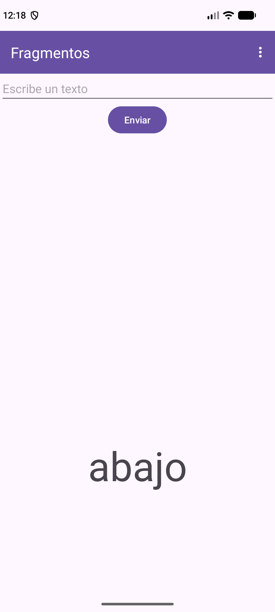
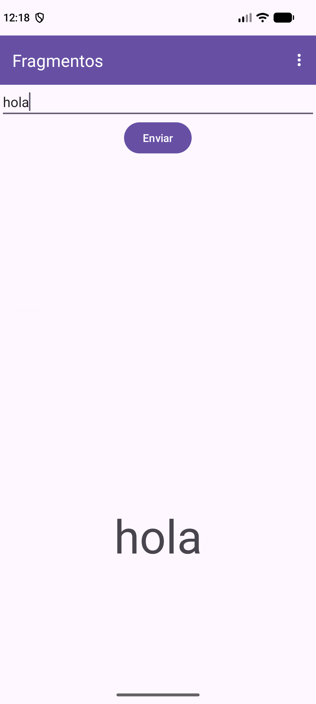
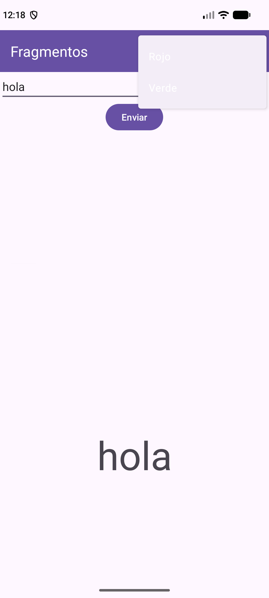
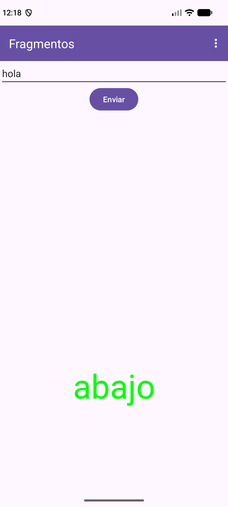

---
tags:
  - android
  - ejercicio
---

# Nivel 5 ⭐⭐⭐⭐ — Fragmentos

**Antes de empezar, lee:** [16 — Fragmentos](../conceptos/16-fragmentos.md) y los proyectos [EjemploFragmentos](../proyectos/EjemploFragmentos.md) y [EjercicioFragmentos](../proyectos/EjercicioFragmentos.md), de donde salen estos ejercicios (y el PDF `8-Fragmentos.pdf`).

> Código verificado en el zip, paquete `ej/`: `IControlFragmentos`, `FragmentoArriba`, `FragmentoAbajo`, `Ej51FragmentosActivity`, y para el formulario: `Persona`, `IControlFichas`, `Fragmento1`, `Fragmento2`, `Fragmento3`, `FichaAdapter`, `Ej54FichasActivity`.

## Qué es un fragmento (PDF)

Un fragmento es un **componente de una actividad que puede reutilizarse en distintas actividades**: la actividad se forma con varios componentes independientes entre sí. Al crearlos, **importa la versión `androidx.fragment.app.Fragment`**.

Los métodos del ciclo de vida que aparecen en el PDF:

| Método | Cuándo |
|---|---|
| `onAttach(Context)` | Al engancharse a la Activity (`context` **es** la Activity) |
| `onCreate(Bundle)` | Al crearse el fragmento (no necesariamente si se muestra) |
| `onCreateView(...)` | Para cargar el **layout** asociado |
| `onViewCreated(view, Bundle)` | Al cargar la vista: aquí se hacen los `findViewById` y los listeners |
| `onViewStateRestored(Bundle)` | Cuando el fragmento vuelve a ser visible |
| `onDetach()` | Al eliminarse el fragmento de la Activity |

---

## Ejercicio 5.1 — Dos fragmentos en una Activity

### 📝 Enunciado
Una pantalla con **dos contenedores** (uno encima del otro). En el de arriba, un fragmento con un campo de texto y un botón **"Enviar"** (`FragmentoArriba`). En el de abajo, un fragmento con un `TextView` grande que dice `abajo` (`FragmentoAbajo`). Se cargan desde Java **solo la primera vez**.

*(De clase: `EjemploFragmentos`, PDF `8-Fragmentos.pdf`.)*



### 🎯 Qué practicas
`Fragment`, `onCreateView`, `FragmentContainerView`, `getSupportFragmentManager().beginTransaction().add(...).commit()` ([16](../conceptos/16-fragmentos.md)).

### 💡 Pistas
1. Un layout por fragmento (`ej_fragment_arriba.xml`, `ej_fragment_abajo.xml`) y otro para la Activity con **dos `FragmentContainerView`** (`contenedor1`, `contenedor2`) con peso 1 cada uno.
2. El fragmento hereda de `Fragment` y **carga su layout en `onCreateView`** con `inflater.inflate(R.layout.x, container, false)`.
3. Los fragmentos se añaden desde `onCreate` con una transacción.
4. Envuelve la carga en `if (savedInstanceState == null)` para **no duplicarlos** cuando la Activity se recrea (p. ej., al girar la pantalla).

### ✅ Solución

**Los layouts de los fragmentos** (`ej_fragment_arriba.xml`: `EditText` `etTexto` + `Button` `btnEnviar`; `ej_fragment_abajo.xml`: `TextView` `tvAbajo` de 60 sp).

**El layout de la Activity `ej_fragmentos_main.xml`** (la barra `MaterialToolbar` se usa en el 5.3):

```xml
<?xml version="1.0" encoding="utf-8"?>
<LinearLayout xmlns:android="http://schemas.android.com/apk/res/android"
    xmlns:app="http://schemas.android.com/apk/res-auto"
    android:id="@+id/main"
    android:layout_width="match_parent"
    android:layout_height="match_parent"
    android:orientation="vertical">

    <com.google.android.material.appbar.MaterialToolbar
        android:id="@+id/toolbar"
        android:layout_width="match_parent"
        android:layout_height="?attr/actionBarSize"
        android:background="?attr/colorPrimary"
        android:theme="@style/ThemeOverlay.MaterialComponents.Dark.ActionBar"
        app:title="Fragmentos"
        app:titleTextColor="?attr/colorOnPrimary" />

    <androidx.fragment.app.FragmentContainerView
        android:id="@+id/contenedor1"
        android:layout_width="match_parent"
        android:layout_height="0dp"
        android:layout_weight="1" />

    <androidx.fragment.app.FragmentContainerView
        android:id="@+id/contenedor2"
        android:layout_width="match_parent"
        android:layout_height="0dp"
        android:layout_weight="1" />

</LinearLayout>
```

**El fragmento de arriba** (el del PDF, ya con la interfaz del 5.2):

```java
public class FragmentoArriba extends Fragment {

    private Button btnEnviar;
    private EditText etTexto;
    private IControlFragmentos mainActivity;

    // Constructor (publico y sin parametros)
    public FragmentoArriba() {
        super();
    }

    // Al engancharse a la actividad, se guarda su referencia como IControlFragmentos
    @Override
    public void onAttach(@NonNull Context context) {
        super.onAttach(context);
        this.mainActivity = (IControlFragmentos) context;
    }

    // Metodo para cargar el layout asociado
    @Nullable
    @Override
    public View onCreateView(@NonNull LayoutInflater inflater, @Nullable ViewGroup container, @Nullable Bundle savedInstanceState) {
        View vista = inflater.inflate(R.layout.ej_fragment_arriba, container, false);
        return vista;
    }

    // Se ejecuta al cargar la vista del fragmento
    @Override
    public void onViewCreated(@NonNull View view, @Nullable Bundle savedInstanceState) {
        super.onViewCreated(view, savedInstanceState);

        btnEnviar = view.findViewById(R.id.btnEnviar);
        etTexto = view.findViewById(R.id.etTexto);

        btnEnviar.setOnClickListener(new View.OnClickListener() {
            @Override
            public void onClick(View v) {
                mainActivity.cambiarTexto(etTexto.getText().toString());
            }
        });
    }
}
```

**El fragmento de abajo:**

```java
public class FragmentoAbajo extends Fragment {

    private TextView tvTexto;

    public FragmentoAbajo() {
        super();
    }

    // Paso de parametros: crea la instancia y le fija los argumentos (Bundle)
    public static FragmentoAbajo newInstance(Bundle argumentos) {
        FragmentoAbajo fragmentoAbajo = new FragmentoAbajo();

        if (argumentos != null) {
            fragmentoAbajo.setArguments(argumentos);
        }

        return fragmentoAbajo;
    }

    @Nullable
    @Override
    public View onCreateView(@NonNull LayoutInflater inflater, @Nullable ViewGroup container, @Nullable Bundle savedInstanceState) {
        View vista = inflater.inflate(R.layout.ej_fragment_abajo, container, false);
        tvTexto = vista.findViewById(R.id.tvAbajo);
        return vista;
    }

    @Override
    public void onViewCreated(@NonNull View view, @Nullable Bundle savedInstanceState) {
        super.onViewCreated(view, savedInstanceState);

        Bundle argumentos = getArguments();
        if (argumentos != null) {
            if (argumentos.containsKey("saludo")) {
                tvTexto.setText(argumentos.getString("saludo"));
            }

            if (argumentos.containsKey("color")) {
                tvTexto.setTextColor(argumentos.getInt("color"));
            }
        }
    }
}
```

**La carga en la Activity** (`onCreate` de `Ej51FragmentosActivity`):

```java
if (savedInstanceState == null) {
    getSupportFragmentManager()
            .beginTransaction()
            .add(R.id.contenedor1, new FragmentoArriba())
            .commit();

    getSupportFragmentManager()
            .beginTransaction()
            .add(R.id.contenedor2, FragmentoAbajo.newInstance(new Bundle()))
            .commit();
}
```

**Explicación:**
- `FragmentContainerView` es el "hueco" de la pantalla donde vive un fragmento.
- `.add(R.id.contenedor1, new FragmentoArriba())` = "pon este fragmento en ese hueco"; `.commit()` ejecuta la transacción.
- **`onCreateView`** solo **infla** el layout y lo devuelve. Los `findViewById` y los listeners van mejor en **`onViewCreated`** (la vista ya existe). En `FragmentoAbajo` el PDF guarda el `TextView` en `onCreateView`, y lo usa en `onViewCreated`.
- Los `findViewById` del fragmento se hacen sobre **`view.`**, no sobre la Activity.

### ⚠️ Errores típicos
- 📌 **`Unable to instantiate fragment`**: el fragmento no tiene constructor **público y sin argumentos**.
- 📌 Importar `android.app.Fragment` (obsoleto) en vez de `androidx.fragment.app.Fragment`.
- Olvidar `.commit()`: el fragmento no aparece.
- Sin `if (savedInstanceState == null)`: al girar la pantalla se cargan **dos veces**.

**🚀 Reto extra:** cambia los pesos de los dos contenedores a `1` y `2`.

---

## Ejercicio 5.2 — El fragmento de arriba controla el de abajo (`IControlFragmentos`)

### 📝 Enunciado
Al pulsar **Enviar**, el texto escrito en el `EditText` del fragmento de arriba debe aparecer en grande en el fragmento de abajo. Los fragmentos **no deben conocer** la clase de la Activity: se comunican con una **interfaz** `IControlFragmentos` con dos métodos: `cambiarColor(int color)` y `cambiarTexto(String texto)`.

*(De clase: `IControlFragmentos` y `newInstance(Bundle)` del PDF.)*



### 🎯 Qué practicas
Interfaz Fragment ↔ Activity, `onAttach` + casting, `newInstance(Bundle)`, `setArguments` / `getArguments`, `replace` ([16 §4–§7](../conceptos/16-fragmentos.md)).

### 💡 Pistas
1. Crea la interfaz y haz que la Activity la **`implements`**: así garantizas que tiene esos métodos.
2. En `FragmentoArriba.onAttach`, guarda el `context` con un casting: `(IControlFragmentos) context`.
3. Los datos viajan a `FragmentoAbajo` en un **`Bundle`** con `newInstance(bundle)` (que hace `setArguments`); ahí se leen con `getArguments()`.
4. Para cambiar el fragmento de abajo: `beginTransaction().replace(R.id.contenedor2, FragmentoAbajo.newInstance(bundle)).commit()`.

### ✅ Solución

**La interfaz:**

```java
// El "contrato": cualquier Activity que use estos fragmentos debe implementarlo
public interface IControlFragmentos {

    void cambiarColor(int color);

    void cambiarTexto(String texto);
}
```

**En la Activity**, los métodos de la interfaz:

```java
public void cambiarColor(int color) {
    Bundle bundle = new Bundle();
    bundle.putInt("color", color);

    // Se recarga el fragmento de abajo con el nuevo color
    getSupportFragmentManager()
            .beginTransaction()
            .replace(R.id.contenedor2, FragmentoAbajo.newInstance(bundle))
            .commit();
}

@Override
public void cambiarTexto(String texto) {
    Bundle bundle = new Bundle();
    bundle.putString("saludo", texto);

    // Se recarga el fragmento de abajo con el nuevo texto
    getSupportFragmentManager()
            .beginTransaction()
            .replace(R.id.contenedor2, FragmentoAbajo.newInstance(bundle))
            .commit();
}
```

(`FragmentoArriba` ya mostraba arriba su `onAttach` y su botón: `mainActivity.cambiarTexto(etTexto.getText().toString())`. `FragmentoAbajo.newInstance(...)` y la lectura de `"saludo"` y `"color"` también.)

**Explicación:**
- **Interfaz = contrato:** `implements IControlFragmentos` obliga a `Ej51FragmentosActivity` a escribir esos dos métodos. Así `FragmentoArriba` funciona con **cualquier** Activity que la implemente.
- **`newInstance(Bundle)`** es el método de fábrica del PDF: crea el fragmento y le fija los argumentos, de modo que **sobreviven** aunque Android lo recree. **No** se pasan datos por el constructor.
- `replace` **sustituye** el fragmento del contenedor por uno nuevo con los datos nuevos.

> 🔎 **Detalle del código de clase:** `cambiarColor` crea un `Bundle` **solo con el color** y `cambiarTexto` **solo con el texto**. Como cada llamada recrea `FragmentoAbajo` desde cero, **al cambiar el color el texto vuelve a `abajo`** y al cambiar el texto se pierde el color. Para conservar ambos habría que guardar los dos valores en la Activity y meterlos **siempre** en el `Bundle`.

### ⚠️ Errores típicos
- 📌 **`ClassCastException`** al abrir la pantalla: la Activity **no** tiene `implements IControlFragmentos`.
- 📌 Pasar los datos por un **constructor con parámetros**: se pierden al recrear el fragmento; usa `newInstance` + `Bundle`.
- Leer `getArguments()` sin comprobar `!= null`.

**🚀 Reto extra:** guarda en la Activity el último texto y el último color y mételos **siempre** en el `Bundle`, para que cambiar el color no borre el texto.

---

## Ejercicio 5.3 — Menú de los tres puntos que cambia el color

### 📝 Enunciado
Añade una barra superior con un menú de los tres puntos con dos opciones: **Rojo** y **Verde**. Al elegir una, el texto del fragmento de abajo cambia de color.

*(De clase: menú y `MaterialToolbar` del PDF `8-Fragmentos.pdf`.)*

| Menú abierto | Elegir "Verde" |
|---|---|
|  |  |

### 🎯 Qué practicas
`res/menu`, `MaterialToolbar`, `setSupportActionBar`, `onCreateOptionsMenu`, `onOptionsItemSelected`.

### 💡 Pistas
1. Un fichero `res/menu/ej_menu_colores.xml` con dos `<item>`; `app:showAsAction="never"` los deja dentro del menú de los 3 puntos.
2. La barra es un `com.google.android.material.appbar.MaterialToolbar` en el layout (ya lo tiene `ej_fragmentos_main.xml`).
3. El tema del proyecto debe ser **sin ActionBar** (`Theme.Material3.DayNight.NoActionBar`), como el de tus proyectos.

### ✅ Solución

**El menú `res/menu/ej_menu_colores.xml`:**

```xml
<?xml version="1.0" encoding="utf-8"?>
<menu xmlns:android="http://schemas.android.com/apk/res/android"
    xmlns:app="http://schemas.android.com/apk/res-auto">

    <item
        android:id="@+id/rojo"
        android:title="Rojo"
        app:showAsAction="never" />

    <item
        android:id="@+id/verde"
        android:title="Verde"
        app:showAsAction="never" />
</menu>
```

**En la Activity:**

```java
MaterialToolbar toolbar = findViewById(R.id.toolbar);
setSupportActionBar(toolbar);
```

```java
public boolean onCreateOptionsMenu(Menu menu) {
    getMenuInflater().inflate(R.menu.ej_menu_colores, menu);
    return true;
}

@Override
public boolean onOptionsItemSelected(@NonNull MenuItem item) {
    int id = item.getItemId();
    if (id == R.id.rojo) {
        cambiarColor(Color.RED);
        return true;
    } else if (id == R.id.verde) {
        cambiarColor(Color.GREEN);
        return true;
    }
    return super.onOptionsItemSelected(item);
}
```

**Explicación:**
- `setSupportActionBar(toolbar)` hace que la barra funcione como **ActionBar** y aparezca el menú.
- `onCreateOptionsMenu` **infla** el XML del menú; `onOptionsItemSelected` se llama al elegir una opción y se distingue por `item.getItemId()`.
- Devuelves `true` cuando **has gestionado** la opción.
- Se reutiliza `cambiarColor(...)` del 5.2.

### ⚠️ Errores típicos
- 📌 `IllegalStateException: This Activity already has an action bar supplied by the window decor`: el tema **sí** tiene ActionBar; usa un tema `NoActionBar`.
- Olvidar `return true` (o el `super.onOptionsItemSelected` al final).
- Escribir los `id` del menú distintos en el XML y en Java.

**🚀 Reto extra:** añade una tercera opción **Azul** (`Color.BLUE`).

---

## Ejercicio 5.4 — Formulario de tres fragmentos (`EjercicioFragmentos`)

### 📝 Enunciado
Un mini-formulario de "ficha de persona" con **tres fragmentos** en la misma pantalla:
- **`Fragmento1`:** pide el **nombre** y tiene un botón **Crear**. Si el nombre está vacío, muestra un error en el propio campo.
- **`Fragmento2`:** llega con el **nombre ya escrito**, pide **apellido y fecha** y tiene un botón **Ficha**. Si falta algo, muestra un `Toast`.
- **`Fragmento3`:** muestra en un **`GridView`** (2 columnas) **todas las fichas** creadas hasta ahora, sin borrar las anteriores.

*(De clase: `EjercicioFragmentos`, el ejercicio de fragmentos "a máxima complejidad".)*


### 🎯 Qué practicas
Tres fragmentos coordinados por la Activity, `Serializable` en un `Bundle`, `newInstance`, `BaseAdapter` en un `GridView`, `instanceof` en `onAttach`, `onDetach` ([16 §5–§8](../conceptos/16-fragmentos.md)).

### 💡 Pistas
1. **Flujo:** `Fragmento1` → (Activity) → `Fragmento2` (con `"nombre"` precargado) → (Activity) crea una `Persona` y la añade a una lista → `Fragmento3` (con la lista completa).
2. La lista `ArrayList<Persona>` **vive en la Activity** y crece con cada ficha; se manda **entera** cada vez, porque `Fragmento3` se reconstruye desde cero.
3. Los métodos de la interfaz describen el **evento** ("se completó el nombre"), no la acción técnica.
4. En `onAttach`, comprueba con `instanceof` que la Activity implementa la interfaz; en `onDetach`, pon la referencia a `null`.

### ✅ Solución

**El modelo y la interfaz:**

```java
// POJO Serializable: solo guarda datos
public class Persona implements Serializable {

    private String nombre, apellido, fecha;

    public Persona(String nombre, String apellido, String fecha) {
        this.nombre = nombre;
        this.apellido = apellido;
        this.fecha = fecha;
    }

    public String getNombre() { return nombre; }
    public String getApellido() { return apellido; }
    public String getFecha() { return fecha; }
}
```

```java
public interface IControlFichas {

    void onNombreCompletado(String nombre);

    void onApellidoYFechaCompletado(String nombre, String apellido, String fecha);
}
```

**`Fragmento1`** (con validación `setError`, `instanceof` y `onDetach`):

```java
public class Fragmento1 extends Fragment {

    private IControlFichas activity;

    public Fragmento1() {
        super();
    }

    @Override
    public void onAttach(@NonNull Context context) {
        super.onAttach(context);
        if (context instanceof IControlFichas) {
            activity = (IControlFichas) context;
        } else {
            throw new RuntimeException(context + " debe implementar IControlFichas");
        }
    }

    @Nullable
    @Override
    public View onCreateView(@NonNull LayoutInflater inflater, @Nullable ViewGroup container, @Nullable Bundle savedInstanceState) {
        return inflater.inflate(R.layout.ej_fragmento1, container, false);
    }

    @Override
    public void onViewCreated(@NonNull View view, @Nullable Bundle savedInstanceState) {
        super.onViewCreated(view, savedInstanceState);

        final EditText etNombre = view.findViewById(R.id.etNombre);
        Button btnCrear = view.findViewById(R.id.btnCrear);

        btnCrear.setOnClickListener(new View.OnClickListener() {
            @Override
            public void onClick(View v) {
                String nombre = etNombre.getText().toString().trim();
                if (nombre.isEmpty()) {
                    etNombre.setError("Introduce un nombre");
                    return;
                }
                activity.onNombreCompletado(nombre);
            }
        });
    }

    @Override
    public void onDetach() {
        super.onDetach();
        activity = null;     // liberamos la referencia (evita fugas de memoria)
    }
}
```

**`Fragmento2`** (recibe el nombre por `newInstance(Bundle)`; valida con un `Toast`):

```java
public class Fragmento2 extends Fragment {

    private IControlFichas activity;

    public Fragmento2() {
        super();
    }

    public static Fragmento2 newInstance(Bundle bundle) {
        Fragmento2 fragmento2 = new Fragmento2();
        if (bundle != null) {
            fragmento2.setArguments(bundle);
        }
        return fragmento2;
    }

    @Override
    public void onAttach(@NonNull Context context) {
        super.onAttach(context);
        if (context instanceof IControlFichas) {
            activity = (IControlFichas) context;
        } else {
            throw new RuntimeException(context + " debe implementar IControlFichas");
        }
    }

    @Nullable
    @Override
    public View onCreateView(@NonNull LayoutInflater inflater, @Nullable ViewGroup container, @Nullable Bundle savedInstanceState) {
        return inflater.inflate(R.layout.ej_fragmento2, container, false);
    }

    @Override
    public void onViewCreated(@NonNull View view, @Nullable Bundle savedInstanceState) {
        super.onViewCreated(view, savedInstanceState);

        final EditText etNombre = view.findViewById(R.id.etNombre);
        final EditText etApellido = view.findViewById(R.id.etApellido);
        final EditText etFecha = view.findViewById(R.id.etFecha);
        Button btnFicha = view.findViewById(R.id.btnFicha);

        // El nombre llega precargado desde el Fragmento1 (sigue siendo editable)
        Bundle bundle = getArguments();
        if (bundle != null && bundle.containsKey("nombre")) {
            etNombre.setText(bundle.getString("nombre"));
        }

        btnFicha.setOnClickListener(new View.OnClickListener() {
            @Override
            public void onClick(View v) {
                String nombre = etNombre.getText().toString().trim();
                String apellido = etApellido.getText().toString().trim();
                String fecha = etFecha.getText().toString().trim();
                if (apellido.isEmpty() || fecha.isEmpty()) {
                    Toast.makeText(getContext(), "Completa apellido y fecha", Toast.LENGTH_SHORT).show();
                    return;
                }
                activity.onApellidoYFechaCompletado(nombre, apellido, fecha);
            }
        });
    }

    @Override
    public void onDetach() {
        super.onDetach();
        activity = null;
    }
}
```

**`Fragmento3` y su adaptador:**

```java
public class Fragmento3 extends Fragment {

    private Context mContext;

    public Fragmento3() {
        super();
    }

    public static Fragmento3 newInstance(Bundle bundle) {
        Fragmento3 fragmento3 = new Fragmento3();
        if (bundle != null) {
            fragmento3.setArguments(bundle);
        }
        return fragmento3;
    }

    @Override
    public void onAttach(@NonNull Context context) {
        super.onAttach(context);
        this.mContext = context;
    }

    @Nullable
    @Override
    public View onCreateView(@NonNull LayoutInflater inflater, @Nullable ViewGroup container, @Nullable Bundle savedInstanceState) {
        return inflater.inflate(R.layout.ej_fragmento3, container, false);
    }

    @Override
    public void onViewCreated(@NonNull View view, @Nullable Bundle savedInstanceState) {
        super.onViewCreated(view, savedInstanceState);

        GridView gridFicha = view.findViewById(R.id.gridFicha);
        Bundle argumentos = getArguments();
        if (argumentos != null && argumentos.containsKey("personas")) {
            // Casting: getSerializable solo devuelve un tipo general
            ArrayList<Persona> personas = (ArrayList<Persona>) argumentos.getSerializable("personas");
            gridFicha.setAdapter(new FichaAdapter(mContext, personas));
        }
    }
}
```

```java
public class FichaAdapter extends BaseAdapter {

    private final LayoutInflater inflater;
    private final ArrayList<Persona> listaPersonas;

    public FichaAdapter(Context context, ArrayList<Persona> listaPersonas) {
        this.inflater = LayoutInflater.from(context);
        this.listaPersonas = listaPersonas;
    }

    @Override
    public int getCount() {
        return listaPersonas.size();
    }

    @Override
    public Object getItem(int position) {
        return listaPersonas.get(position);
    }

    @Override
    public long getItemId(int position) {
        return position;
    }

    @Override
    public View getView(int position, View convertView, ViewGroup parent) {
        View vista = convertView;              // reciclaje de vistas
        if (vista == null) {
            vista = inflater.inflate(R.layout.ej_ficha_item, parent, false);
        }
        TextView tvNombre = vista.findViewById(R.id.tvNombre);
        TextView tvApellido = vista.findViewById(R.id.tvApellido);
        TextView tvFecha = vista.findViewById(R.id.tvFecha);

        Persona persona = listaPersonas.get(position);
        tvNombre.setText(persona.getNombre());
        tvApellido.setText(persona.getApellido());
        tvFecha.setText(persona.getFecha());
        return vista;
    }
}
```

**La Activity que lo coordina** (layout `ej_fichas_main.xml` con tres `FragmentContainerView`; layouts de los fragmentos `ej_fragmento1/2/3.xml` y de la celda `ej_ficha_item.xml`):

```java
public class Ej54FichasActivity extends AppCompatActivity implements IControlFichas {

    // Vive mientras la Activity no se destruya y CRECE con cada ficha nueva
    private ArrayList<Persona> personas = new ArrayList<>();

    @Override
    protected void onCreate(Bundle savedInstanceState) {
        super.onCreate(savedInstanceState);
        EdgeToEdge.enable(this);
        setContentView(R.layout.ej_fichas_main);
        // ... (bloque de insets de siempre, ver 01-fundamentos §5)

        if (savedInstanceState == null) {
            getSupportFragmentManager().beginTransaction().add(R.id.contenedor1, new Fragmento1()).commit();
            getSupportFragmentManager().beginTransaction().add(R.id.contenedor2, Fragmento2.newInstance(new Bundle())).commit();
            getSupportFragmentManager().beginTransaction().add(R.id.contenedor3, Fragmento3.newInstance(new Bundle())).commit();
        }
    }

    // El Fragmento1 nos avisa: recargamos el Fragmento2 con el nombre ya escrito
    @Override
    public void onNombreCompletado(String nombre) {
        Bundle bundle = new Bundle();
        bundle.putString("nombre", nombre);
        getSupportFragmentManager().beginTransaction()
                .replace(R.id.contenedor2, Fragmento2.newInstance(bundle))
                .commit();
    }

    // El Fragmento2 nos avisa: creamos la Persona, la acumulamos y recargamos el Fragmento3
    @Override
    public void onApellidoYFechaCompletado(String nombre, String apellido, String fecha) {
        Bundle bundle = new Bundle();
        Persona persona = new Persona(nombre, apellido, fecha);
        personas.add(persona);                          // se acumula, no se reemplaza
        bundle.putSerializable("personas", personas);   // se manda la LISTA COMPLETA cada vez
        getSupportFragmentManager().beginTransaction()
                .replace(R.id.contenedor3, Fragmento3.newInstance(bundle))
                .commit();
    }
}
```

**Explicación:**
- `etNombre.setError("…")` muestra el mensaje de error estándar de Material sin `Toast` ni diálogo. En `Fragmento2` se usa `Toast` porque afecta a **dos** campos.
- `.trim()` quita espacios antes de comprobar `.isEmpty()`.
- `(ArrayList<Persona>) argumentos.getSerializable("personas")` → **casting** porque `getSerializable` devuelve un tipo general.
- Los **`EditText` de `Fragmento1` y `Fragmento2` no son el mismo objeto** (layouts distintos); el segundo solo se **precarga** con el valor recibido.
- `Fragmento1` y `Fragmento2` están siempre a la vista; `Fragmento3` se **reemplaza** con la lista actualizada cada vez.

### ⚠️ Errores típicos
- 📌 `getArguments()` sin comprobar `null`: en `Fragmento3` no falla porque la Activity siempre lo crea con `newInstance(new Bundle())`, pero es un punto frágil (aquí se comprueba).
- 📌 `ClassCastException`/`RuntimeException` por olvidar `implements IControlFichas`.
- Que `Persona` no sea `Serializable`: falla **al ejecutar**, no al compilar.
- Mandar solo la **última** persona a `Fragmento3`: la rejilla solo mostraría una ficha.

**🚀 Reto extra:** que al crear una ficha se **vacíen** los campos de apellido y fecha del `Fragmento2`.

---

## Preguntas de teoría (sin código)

1. **¿Qué es un fragmento y para qué sirve?** → Un componente reutilizable de una Activity; permite formar pantallas con partes independientes.
2. **¿Por qué se comunica el fragmento con la Activity mediante una interfaz?** → Para no depender de una Activity concreta: sirve cualquiera que implemente la interfaz.
3. **¿Qué es `context` en `onAttach` y por qué se hace casting?** → Es la Activity que contiene el fragmento; el casting `(MiInterfaz) context` la trata como algo que implementa la interfaz (si no, `ClassCastException`).
4. **¿Por qué `newInstance(Bundle)` y no un constructor con parámetros?** → Android puede recrear el fragmento llamando al constructor sin argumentos; los datos guardados con `setArguments` sobreviven.
5. **¿Diferencia entre `add` y `replace`?** → `add` añade un fragmento a un contenedor; `replace` sustituye el que hubiera por otro.
6. **¿Para qué sirve `if (savedInstanceState == null)` al cargar fragmentos?** → Para no duplicarlos cuando la Activity se recrea (p. ej., al girar la pantalla).
7. **¿Qué requisito tiene un fragmento sobre su constructor?** → Debe ser **público y sin argumentos**.
8. **¿Por qué la lista de personas vive en la Activity y no en un fragmento?** → Porque los fragmentos se recrean con `replace`; la Activity sobrevive y es quien coordina.

---

## ✅ Autoevaluación del Nivel 5

- [ ] Crear un fragmento con su layout en `onCreateView` y cargarlo en un `FragmentContainerView`.
- [ ] Escribir la interfaz, implementarla en la Activity y usarla desde el fragmento (`onAttach` + casting).
- [ ] Pasar datos a un fragmento con `newInstance(Bundle)` y leerlos con `getArguments()`.
- [ ] Sustituir un fragmento con `replace`.
- [ ] Crear un menú de los 3 puntos con `MaterialToolbar`.
- [ ] Coordinar varios fragmentos y pasar objetos `Serializable` entre ellos.

Siguiente: **[Nivel 6 — Diálogos y Room](06-nivel-6-dialogos-y-room.md)**.
