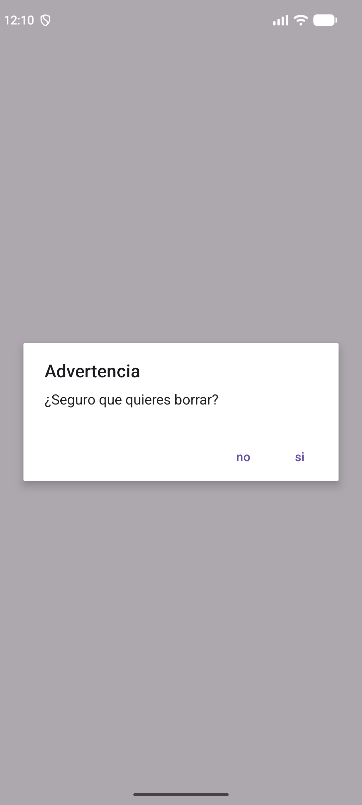
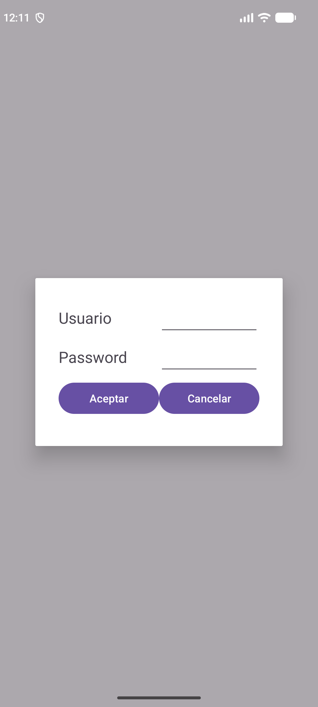
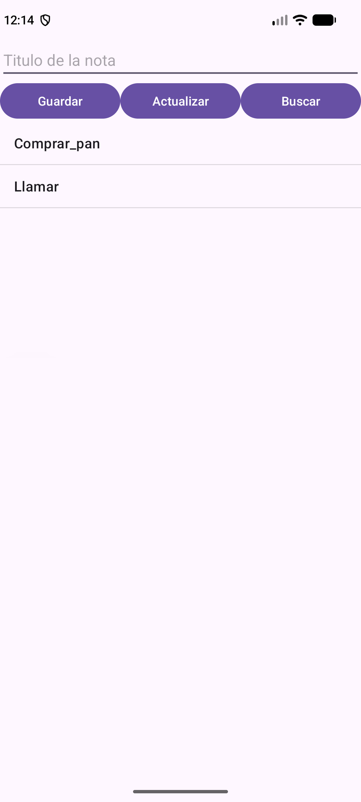

---
tags:
  - android
  - ejercicio
---

# Nivel 6 ⭐⭐⭐⭐⭐ — Diálogos y base de datos Room

**Antes de empezar, lee:** [18 — Diálogos](../conceptos/18-dialogos.md), [17 — Room](../conceptos/17-room-base-de-datos.md), [20 — Executors y LiveData](../conceptos/20-executors-y-livedata.md) y el proyecto [EjemploDialogoPersonalizado](../proyectos/EjemploDialogoPersonalizado.md). Estos ejercicios siguen **paso a paso** el PDF `1-DialogSQLitePersonalizado.pdf`.

> Código verificado en el zip, paquete `ej/`: `Ej61DialogosActivity`, `LoginDialogEj`, `Ej62LoginActivity`, `Nota`, `NotasDao`, `NotasDb`, `NotasAdapter`, `Ej63NotasActivity`. Usan el `AppExecutors` del paquete `bbdd` de tu proyecto.

## Cómo se construye (el orden del PDF)

```
1. AlertDialog sencillo                       (6.1)
2. DialogFragment con diseño propio + login   (6.2)
3. Dependencias de Room                       (6.3, paso 0)
4. Entidad → DAO → AppDatabase → AppExecutors (6.3)
5. Adaptador (ArrayAdapter) + Activity con LiveData (6.3)
6. Editar y borrar; buscar (login contra la BD) (6.3 / 6.4)
```

---

## Ejercicio 6.1 — `AlertDialog` de confirmación

### 📝 Enunciado
Un botón **"Borrar (AlertDialog)"**. Al pulsarlo aparece un diálogo con título `Advertencia`, mensaje `¿Seguro que quieres borrar?` y botones **si** / **no**. Cada botón muestra un `Toast`.

*(De clase: el diálogo de borrado de `RegisterActivity`.)*



### 🎯 Qué practicas
`AlertDialog.Builder`, botones positivo/negativo, `DialogInterface.OnClickListener` ([18 §1](../conceptos/18-dialogos.md)).

### 💡 Pistas
1. Se crea con `new AlertDialog.Builder(contexto)`; con `setTitle`, `setMessage`, `setPositiveButton`, `setNegativeButton`.
2. Al final hay que llamar a **`.show()`**.
3. Importa `androidx.appcompat.app.AlertDialog`.

### ✅ Solución

```java
public class Ej61DialogosActivity extends AppCompatActivity {

    @Override
    protected void onCreate(Bundle savedInstanceState) {
        super.onCreate(savedInstanceState);
        EdgeToEdge.enable(this);
        setContentView(R.layout.ej_dialogos);
        // ... (bloque de insets de siempre, ver 01-fundamentos §5)

        Button btnBorrar = findViewById(R.id.btnBorrar);
        btnBorrar.setOnClickListener(new View.OnClickListener() {
            @Override
            public void onClick(View v) {
                //AlertDialog.Builder = constructor de dialogos de alerta (titulo, mensaje, botones...)
                AlertDialog.Builder alerta = new AlertDialog.Builder(Ej61DialogosActivity.this);
                alerta.setTitle("Advertencia");
                alerta.setMessage("¿Seguro que quieres borrar?");
                //Boton SI
                alerta.setPositiveButton("si", new DialogInterface.OnClickListener() {
                    @Override
                    public void onClick(DialogInterface dialog, int which) {
                        Toast.makeText(getApplicationContext(), "Borrado", Toast.LENGTH_SHORT).show();
                    }
                });
                //Boton NO
                alerta.setNegativeButton("no", new DialogInterface.OnClickListener() {
                    @Override
                    public void onClick(DialogInterface dialog, int which) {
                        Toast.makeText(getApplicationContext(), "NO SE ELIMINO", Toast.LENGTH_SHORT).show();
                    }
                });
                alerta.show();
            }
        });
    }
}
```

**Explicación:**
- Es el **patrón Builder**: vas configurando y al final `show()` lo construye y lo muestra.
- Al pulsar **cualquier** botón, el diálogo **se cierra solo**.
- Se usa `Ej61DialogosActivity.this` (no `this`) porque estás dentro de una clase anónima.

### ⚠️ Errores típicos
- 📌 **Falta `.show()`**: no aparece nada.
- 📌 **`AlertaDialog` / `AlertDialog`** mal escrito: `cannot find symbol` (error real de tu proyecto).
- Sin `setMessage`: el usuario no sabe qué va a borrar.

**🚀 Reto extra:** añade un botón neutro **"Más tarde"** con `setNeutralButton`.

---

## Ejercicio 6.2 — `DialogFragment` personalizado: el login

### 📝 Enunciado
Una pantalla con un botón **Acceder** que abre un diálogo con **tu propio diseño**: dos campos (**Usuario** y **Password**, este oculto) y dos botones (**Aceptar** / **Cancelar**). Si el usuario es `Almi` y la contraseña `Almi123`, se muestra un `Toast` `Bienvenido` y se abre otra pantalla; si no, el diálogo se cierra. **Cancelar** también lo cierra.

*(De clase: `LoginDialogFrag` del PDF, en su fase 2: usuario "escrito en el código".)*



### 🎯 Qué practicas
`DialogFragment`, `onCreateDialog`, `onCreateView`, `onViewCreated`, `show`, `dismiss` ([18 §2](../conceptos/18-dialogos.md)).

### 💡 Pistas
1. Diseña el contenido en `ej_dialog_login.xml` (dos filas con `layout_weight`, `inputType="textPassword"` para ocultar la contraseña y dos botones).
2. La clase hereda de `DialogFragment` y necesita un **constructor público y vacío**.
3. Se muestra con `new LoginDialogEj().show(getSupportFragmentManager(), "Login")`.
4. Cierra con `dismiss()`. Abrir otra pantalla: `startActivity(new Intent(getContext(), Destino.class))`.

### ✅ Solución

**El diseño `ej_dialog_login.xml`:**

```xml
<?xml version="1.0" encoding="utf-8"?>
<LinearLayout xmlns:android="http://schemas.android.com/apk/res/android"
    android:layout_width="match_parent"
    android:layout_height="wrap_content"
    android:minWidth="320dp"
    android:orientation="vertical"
    android:padding="30dp">

    <LinearLayout
        android:layout_width="match_parent"
        android:layout_height="wrap_content"
        android:orientation="horizontal">

        <TextView
            android:layout_width="0dp"
            android:layout_height="wrap_content"
            android:layout_weight="1"
            android:text="Usuario"
            android:textSize="20sp" />

        <EditText
            android:id="@+id/etUser"
            android:layout_width="0dp"
            android:layout_height="wrap_content"
            android:layout_weight="1"
            android:autofillHints="username"
            android:inputType="text" />
    </LinearLayout>

    <LinearLayout
        android:layout_width="match_parent"
        android:layout_height="wrap_content"
        android:orientation="horizontal">

        <TextView
            android:layout_width="0dp"
            android:layout_height="wrap_content"
            android:layout_weight="1"
            android:text="Password"
            android:textSize="20sp" />

        <EditText
            android:id="@+id/etPassword"
            android:layout_width="0dp"
            android:layout_height="wrap_content"
            android:layout_weight="1"
            android:autofillHints="password"
            android:inputType="textPassword" />
    </LinearLayout>

    <LinearLayout
        android:layout_width="match_parent"
        android:layout_height="wrap_content"
        android:orientation="horizontal">

        <Button
            android:id="@+id/btnAceptar"
            android:layout_width="0dp"
            android:layout_height="wrap_content"
            android:layout_weight="1"
            android:text="Aceptar" />

        <Button
            android:id="@+id/btnCancelar"
            android:layout_width="0dp"
            android:layout_height="wrap_content"
            android:layout_weight="1"
            android:text="Cancelar" />
    </LinearLayout>

</LinearLayout>
```

**La clase del diálogo:**

```java
public class LoginDialogEj extends DialogFragment {

    //ATRIBUTOS DE LA CLASE
    private EditText etNombre;
    private EditText etPassword;
    private Button btnAceptar;
    private Button btnCancelar;

    // Un DialogFragment necesita constructor publico vacio
    public LoginDialogEj() {
        super();
    }

    @Override
    public void onCancel(@NonNull DialogInterface dialog) {
        super.onCancel(dialog);
    }

    @Override
    public void onDetach() {
        super.onDetach();
    }

    // Crea la ventana del dialogo y le pone el titulo
    @NonNull
    @Override
    public Dialog onCreateDialog(@Nullable Bundle savedInstanceState) {
        Dialog dialog = super.onCreateDialog(savedInstanceState);
        dialog.setTitle("Login");
        return dialog;
    }

    // Crea el CONTENIDO: "infla" el XML del dialogo
    @Nullable
    @Override
    public View onCreateView(@NonNull LayoutInflater inflater, @Nullable ViewGroup container, @Nullable Bundle savedInstanceState) {
        return inflater.inflate(R.layout.ej_dialog_login, container, false);
    }

    @Override
    public void onViewCreated(@NonNull View view, @Nullable Bundle savedInstanceState) {
        super.onViewCreated(view, savedInstanceState);
        //INSTANCIAMOS LOS EDITTEXT Y LOS BOTONES
        etNombre = view.findViewById(R.id.etUser);
        etPassword = view.findViewById(R.id.etPassword);
        btnAceptar = view.findViewById(R.id.btnAceptar);
        btnCancelar = view.findViewById(R.id.btnCancelar);

        //PROGRAMAMOS LOS BOTONES
        btnAceptar.setOnClickListener(new View.OnClickListener() {
            @Override
            public void onClick(View v) {
                String nombre = etNombre.getText().toString();
                String password = etPassword.getText().toString();

                // Fase 2 del PDF: el usuario esta escrito en el codigo (en el ejercicio 6.4 se comprueba en la BD)
                if (nombre.equals("Almi") && password.equals("Almi123")) {
                    Toast.makeText(getContext(), "Bienvenido", Toast.LENGTH_SHORT).show();
                    Intent intent = new Intent(getContext(), EjVaciaActivity.class);
                    startActivity(intent);
                } else {
                    dismiss();
                }
            }
        });

        btnCancelar.setOnClickListener(new View.OnClickListener() {
            @Override
            public void onClick(View v) {
                dismiss();
            }
        });
    }
}
```

**La pantalla que lo abre** (layout con un botón `btnAcceder`):

```java
public class Ej62LoginActivity extends AppCompatActivity {

    private Button btnAcceder;
    private LoginDialogEj dialog;

    @Override
    protected void onCreate(Bundle savedInstanceState) {
        super.onCreate(savedInstanceState);
        EdgeToEdge.enable(this);
        setContentView(R.layout.ej_login_menu);
        // ... (bloque de insets de siempre, ver 01-fundamentos §5)

        btnAcceder = findViewById(R.id.btnAcceder);
        btnAcceder.setOnClickListener(new View.OnClickListener() {
            @Override
            public void onClick(View v) {
                dialog = new LoginDialogEj();
                dialog.show(getSupportFragmentManager(), "Login");
            }
        });
    }
}
```

**Explicación:**

| Método | Cuándo se llama | Qué se hace aquí |
|---|---|---|
| `onCreateDialog` | Al crear la **ventana** | Poner el título |
| `onCreateView` | Al crear el **contenido** | `inflate` del XML del diálogo |
| `onViewCreated` | Justo después | `findViewById` y programar los botones |

- **`getContext()`** devuelve la Activity que contiene el fragmento.
- Tras `startActivity`, el diálogo **no se cierra solo**: sigue debajo de la nueva pantalla. En el proyecto real se puede añadir `dismiss()` (ver [Nivel 7](07-nivel-7-mejoras-del-proyecto.md)).
- `minWidth="320dp"` evita que el diálogo salga tan estrecho que el texto de los botones se parta.

### ⚠️ Errores típicos
- 📌 Constructor con parámetros: `Unable to instantiate fragment`.
- 📌 Olvidar `dismiss()`: el diálogo no se cierra.
- `equals` con `==` en la comprobación de usuario y contraseña.

**🚀 Reto extra:** en vez de "escribir" el usuario en el código, haz el ejercicio 6.4 (comprobarlo en la base de datos).

---

## Ejercicio 6.3 — Room: una app de notas (CRUD completo)

### 📝 Enunciado
Una pantalla con un campo de texto y tres botones (**Guardar**, **Actualizar**, **Buscar**) y una lista de notas.
- **Guardar** crea una nota (y vacía el campo).
- **Clic corto** en una nota → la carga en el campo.
- **Actualizar** → guarda los cambios de la nota cargada (si no hay ninguna, avisa).
- **Clic largo** → `AlertDialog` para confirmar el borrado.
- **Buscar** → dice si existe una nota con ese título.
- **Todas las operaciones de base de datos van en segundo plano**, con `AppExecutors`.

*(De clase: es `RegisterActivity` del PDF, con una entidad más sencilla.)*



### 🎯 Qué practicas
`@Entity`, `@Dao`, `@Database`, Singleton, `AppExecutors`, `LiveData`/`observe`, adaptador que hereda de `ArrayAdapter` ([17](../conceptos/17-room-base-de-datos.md), [20](../conceptos/20-executors-y-livedata.md)).

### 💡 Pistas
1. **Paso 0:** dependencias en `app/build.gradle.kts`, las dos con **la misma versión** (el PDF usa `2.6.1`; tu proyecto, `2.8.5`).
2. El orden: entidad → DAO → base de datos → adaptador → Activity.
3. Room **no** deja operar en el hilo principal: usa `AppExecutors.getInstance().getDiskIO().execute(...)`.
4. La lista se refresca sola porque el DAO devuelve `LiveData` y la Activity lo **observa una sola vez**.

### ✅ Solución

**Paso 0 — dependencias** (`app/build.gradle.kts`):
```kotlin
implementation("androidx.room:room-runtime:2.8.5")
annotationProcessor("androidx.room:room-compiler:2.8.5")
```
Después, **Sync Now**.

**Paso 1 — la entidad:**

```java
@Entity(tableName = "Nota") //Consulta en la tabla Nota
public class Nota {

    @PrimaryKey(autoGenerate = true)
    private int id;
    private String titulo;

    public Nota() {
    }

    @Ignore //Para que Room no use este constructor (le falta un parametro)
    public Nota(String titulo) {
        this.titulo = titulo;
    }

    public int getId() {
        return id;
    }

    public void setId(int id) {
        this.id = id;
    }

    public String getTitulo() {
        return titulo;
    }

    public void setTitulo(String titulo) {
        this.titulo = titulo;
    }
}
```

**Paso 2 — el DAO** (las operaciones; Room escribe el código real):

```java
@Dao //DATA ACCESS OBJECT
public interface NotasDao {

    @Query("SELECT * FROM Nota ORDER BY id")
    LiveData<List<Nota>> loadAllNotas();

    @Insert
    void insertNota(Nota nota);

    @Update
    void updateNota(Nota nota);

    @Delete
    void deleteNota(Nota nota);

    @Query("SELECT * FROM Nota WHERE id = :id") //:id es el parametro del metodo
    Nota loadNotaById(int id);

    @Query("SELECT * FROM Nota WHERE titulo = :titulo")
    Nota loadNotaByTitulo(String titulo);
}
```

**Paso 3 — la base de datos** (patrón Singleton):

```java
@Database(entities = {Nota.class}, version = 1, exportSchema = false)
public abstract class NotasDb extends RoomDatabase  //abstract: no se puede instanciar, solo heredar
{
    private static final String LOG_TAG = NotasDb.class.getSimpleName();
    private static final String DATABASE_NAME = NotasDb.class.getSimpleName();
    private static final Object LOCK = new Object();
    private static NotasDb sInstance; //Patron SINGLETON: solo hay una instancia

    public static NotasDb getInstance(Context context) {
        if (sInstance == null) {
            synchronized (LOCK) //Solo un hilo a la vez
            {
                Log.d(LOG_TAG, "Creando la base de datos");
                sInstance = Room.databaseBuilder(context.getApplicationContext(), NotasDb.class, NotasDb.DATABASE_NAME).build();
            }
        }
        return sInstance;
    }

    public abstract NotasDao notasDao();
}
```

**Paso 4 — `AppExecutors`** (ya lo tienes en el paquete `bbdd` de tu proyecto; aquí, con el orden de argumentos **corregido**, ver [Nivel 7 — 7.2](07-nivel-7-mejoras-del-proyecto.md)):

```java
/*
 * EJECUTORES DE HILOS
 * Android NO deja acceder a la base de datos desde el hilo principal (el de la pantalla),
 * porque la app se quedaria congelada. Esta clase nos da "hilos" (trabajadores en segundo plano)
 * donde ejecutar esas tareas. Ejemplo de uso:
 *     AppExecutors.getInstance().getDiskIO().execute(() -> { ...consulta a la BD... });
 */
public class AppExecutors
{
    private static final Object LOCK = new Object();
    //Unica instancia (patron SINGLETON, igual que en AppDatabase)
    private static AppExecutors sInstance;
    private final Executor diskIO;      //Para tareas de disco / base de datos
    private final Executor mainThread;  //Pensado para el hilo principal (la pantalla)
    private final Executor networkIO;   //Pensado para tareas de red
    //OJO: en getInstance() los ejecutores se pasan en otro orden, asi que mainThread en realidad
    //es un grupo de 3 hilos secundarios y networkIO es el que ejecuta en el hilo principal.

    //Ejecutor que lanza el codigo en el hilo principal (el unico que puede tocar la interfaz)
    private static class MainThreadExecutor implements Executor
    {
        //Handler asociado al hilo principal
        private final Handler mainTreadHandler = new Handler(Looper.getMainLooper());

        @Override
        public void execute(Runnable command) {
            //post = "manda esta tarea al hilo principal"
            mainTreadHandler.post(command);
        }
    }

    //Constructor privado: nadie puede hacer "new AppExecutors()", solo usar getInstance()
    private AppExecutors(Executor diskIO, Executor mainThread, Executor networkIO)
    {
        this.diskIO = diskIO;
        this.mainThread = mainThread;
        this.networkIO = networkIO;
    }

    //Devuelve la unica instancia, creandola la primera vez
    public static AppExecutors getInstance()
    {
        if(sInstance == null)
        {
            synchronized (LOCK)
            {
                //diskIO: un solo hilo (las operaciones de BD se hacen de una en una, en orden)
                sInstance = new AppExecutors(Executors.newSingleThreadExecutor(), new MainThreadExecutor(), Executors.newFixedThreadPool(3));
            }
        }
        return sInstance;
    }

    public Executor getDiskIO()
    {
        return this.diskIO;
    }

    public Executor getMainThread()
    {
        return this.mainThread;
    }

    public Executor getNetworkIO()
    {
        return this.networkIO;
    }
}
```

**Paso 5 — el adaptador** (hereda de `ArrayAdapter` como `UsuariosAdapter`; sobrescribe `getCount`, `getItem` y `getView`):

```java
public class NotasAdapter extends ArrayAdapter<Nota> {

    private final Context context;
    private List<Nota> mNotaList;

    public NotasAdapter(@NonNull Context context, int resource) {
        super(context, resource);
        this.context = context;
        this.mNotaList = new ArrayList<>();
    }

    @Override
    public int getCount() {
        return mNotaList.size();
    }

    @Nullable
    @Override
    public Nota getItem(int position) {
        return mNotaList.get(position);
    }

    @NonNull
    @Override
    public View getView(int position, @Nullable View convertView, @NonNull ViewGroup parent) {
        LayoutInflater inflater = LayoutInflater.from(context);
        View view = inflater.inflate(android.R.layout.simple_list_item_1, parent, false);
        TextView tvNota = view.findViewById(android.R.id.text1);
        tvNota.setText(mNotaList.get(position).getTitulo());
        return view;
    }

    //Se llama cuando la BD cambia: guarda la lista nueva y avisa al ListView para que se redibuje
    public void setmNotaList(List<Nota> mNotaList) {
        this.mNotaList = mNotaList;
        notifyDataSetChanged();
    }
}
```

**Paso 6 — la Activity** (layout `ej_notas.xml`: `EditText` `etTitulo`, botones `btnGuardar`/`btnActualizar`/`btnBuscar` y `ListView` `lvNotas`):

```java
public class Ej63NotasActivity extends AppCompatActivity {

    private ListView lvNotas;
    private Button btnGuardar, btnActualizar, btnBuscar;
    private EditText etTitulo;
    private NotasDb mDb;
    private NotasAdapter notasAdapter;
    private int idNota = -1;   // -1 = ninguna nota seleccionada

    @Override
    protected void onCreate(Bundle savedInstanceState) {
        super.onCreate(savedInstanceState);
        EdgeToEdge.enable(this);
        setContentView(R.layout.ej_notas);
        // ... (bloque de insets de siempre, ver 01-fundamentos §5)

        //Instanciamos la BD
        mDb = NotasDb.getInstance(getApplicationContext());

        lvNotas = findViewById(R.id.lvNotas);
        etTitulo = findViewById(R.id.etTitulo);
        btnGuardar = findViewById(R.id.btnGuardar);
        btnActualizar = findViewById(R.id.btnActualizar);
        btnBuscar = findViewById(R.id.btnBuscar);

        //Creamos el adaptador y se lo asignamos al ListView
        this.notasAdapter = new NotasAdapter(this, 1);
        lvNotas.setAdapter(notasAdapter);

        //CLIC CORTO: carga la nota en el campo para poder editarla
        lvNotas.setOnItemClickListener(new AdapterView.OnItemClickListener() {
            @Override
            public void onItemClick(AdapterView<?> parent, View view, int position, long id) {
                Nota nota = notasAdapter.getItem(position);
                idNota = nota.getId();
                etTitulo.setText(nota.getTitulo());
            }
        });

        //CLIC LARGO: AlertDialog para confirmar el borrado
        lvNotas.setOnItemLongClickListener(new AdapterView.OnItemLongClickListener() {
            @Override
            public boolean onItemLongClick(AdapterView<?> parent, View view, int position, long id) {
                final int idEliminar = notasAdapter.getItem(position).getId();
                AlertDialog.Builder alerta = new AlertDialog.Builder(Ej63NotasActivity.this);
                alerta.setTitle("Advertencia");
                alerta.setMessage("¿Seguro que quieres eliminar esta nota?");
                alerta.setPositiveButton("si", new DialogInterface.OnClickListener() {
                    @Override
                    public void onClick(DialogInterface dialog, int which) {
                        eliminar(idEliminar);
                    }
                });
                alerta.setNegativeButton("no", new DialogInterface.OnClickListener() {
                    @Override
                    public void onClick(DialogInterface dialog, int which) {
                        Toast.makeText(Ej63NotasActivity.this, "NO SE ELIMINO", Toast.LENGTH_SHORT).show();
                    }
                });
                alerta.show();
                return true;   //"ya he gestionado el clic largo"
            }
        });

        btnGuardar.setOnClickListener(new View.OnClickListener() {
            @Override
            public void onClick(View v) {
                guardarNota(etTitulo.getText().toString());
                etTitulo.setText("");   //vaciamos el campo para escribir la siguiente
            }
        });

        btnActualizar.setOnClickListener(new View.OnClickListener() {
            @Override
            public void onClick(View v) {
                if (idNota == -1) {
                    Toast.makeText(Ej63NotasActivity.this, "Pulsa antes una nota de la lista", Toast.LENGTH_SHORT).show();
                    return;
                }
                actualizar(idNota, etTitulo.getText().toString());
            }
        });

        btnBuscar.setOnClickListener(new View.OnClickListener() {
            @Override
            public void onClick(View v) {
                buscar(etTitulo.getText().toString());
            }
        });

        consultarNotas();
    }

    //Se suscribe UNA vez: cada cambio en la tabla llama a onChanged con la lista nueva
    private void consultarNotas() {
        mDb.notasDao().loadAllNotas().observe(this, new Observer<List<Nota>>() {
            @Override
            public void onChanged(List<Nota> notas) {
                notasAdapter.setmNotaList(notas);
            }
        });
    }

    //Guarda en la BD (en un hilo secundario)
    private void guardarNota(String titulo) {
        final Nota nota = new Nota(titulo);
        AppExecutors.getInstance().getDiskIO().execute(new Runnable() {
            @Override
            public void run() {
                mDb.notasDao().insertNota(nota);
            }
        });
    }

    private void actualizar(final int id, final String titulo) {
        AppExecutors.getInstance().getDiskIO().execute(new Runnable() {
            @Override
            public void run() {
                Nota nota = mDb.notasDao().loadNotaById(id);
                if (nota != null) {
                    nota.setTitulo(titulo);
                    mDb.notasDao().updateNota(nota);
                }
            }
        });
    }

    private void eliminar(final int idEliminar) {
        AppExecutors.getInstance().getDiskIO().execute(new Runnable() {
            @Override
            public void run() {
                //Primero la buscamos, porque @Delete necesita el objeto completo
                Nota nota = mDb.notasDao().loadNotaById(idEliminar);
                if (nota != null) {
                    mDb.notasDao().deleteNota(nota);
                }
            }
        });
    }

    //Patron del login del PDF: consulta en segundo plano (getDiskIO) y vuelta al hilo principal (getMainThread)
    private void buscar(final String titulo) {
        AppExecutors.getInstance().getDiskIO().execute(new Runnable() {
            @Override
            public void run() {
                final Nota encontrada = mDb.notasDao().loadNotaByTitulo(titulo);

                AppExecutors.getInstance().getMainThread().execute(new Runnable() {
                    @Override
                    public void run() {
                        if (encontrada != null) {
                            Toast.makeText(Ej63NotasActivity.this, "Existe", Toast.LENGTH_SHORT).show();
                        } else {
                            Toast.makeText(Ej63NotasActivity.this, "No existe", Toast.LENGTH_SHORT).show();
                        }
                    }
                });
            }
        });
    }
}
```

**Explicación:**
1. **Listar (`observe`).** Se llama **una vez** en `onCreate`. Cada `insert`, `update` o `delete` cambia la tabla → Room lo detecta → llama a `onChanged` con la lista nueva → `setmNotaList` → `notifyDataSetChanged()` → el `ListView` se redibuja. **Nunca hay que volver a consultar.**
2. **Guardar/actualizar/borrar** van dentro de `getDiskIO().execute(new Runnable() {…})`: **un solo hilo** de fondo que hace las operaciones de una en una.
3. **`@Update` y `@Delete` necesitan el objeto completo**, por eso `actualizar` y `eliminar` primero hacen `loadNotaById(id)` y comprueban `if (nota != null)`.
4. **`buscar`** es el patrón del **login del PDF**: consulta en `getDiskIO()` y, con el resultado, **vuelta al hilo principal** con `getMainThread()` para mostrar el `Toast`.
5. `idNota = -1` significa "ninguna nota seleccionada".
6. `return true` en `onItemLongClick` = "ya lo gestioné" (así no se dispara también el clic corto).

> ⚠️ **Cuidado con `getMainThread()`:** en tu proyecto original (y en el PDF) los argumentos de `AppExecutors.getInstance()` están en **otro orden** que el del constructor, así que `getMainThread()` **no devuelve el hilo principal** y un `Toast` desde ahí puede fallar. Arréglalo primero ([Nivel 7 — 7.2](07-nivel-7-mejoras-del-proyecto.md)); el `AppExecutors` de arriba ya lo tiene corregido.

### ⚠️ Errores típicos
- 📌 **`IllegalStateException: Cannot access database on the main thread`**: hiciste una operación de BD fuera de `getDiskIO().execute`.
- 📌 **Volver a llamar a `observe` en cada clic**: se duplican los observadores.
- 📌 **`@Update`/`@Delete` no hacen nada**: el objeto tiene un `id` que no existe.
- 📌 **Room cannot pick a constructor**: dos constructores sin `@Ignore` en uno.
- Cambiar la entidad sin subir `version` (o sin desinstalar la app): crash al abrir.
- Olvidar `.show()` en el `AlertDialog` o los `Toast`.

**🚀 Reto extra:** que **Guardar** no permita un título vacío (mira el [Nivel 7](07-nivel-7-mejoras-del-proyecto.md), ejercicio 7.4).

---

## Ejercicio 6.4 — Login contra la base de datos

### 📝 Enunciado
Cambia el login del 6.2 para que **compruebe el usuario en la base de datos** (la tabla de tu proyecto): si existe un usuario con ese nombre y contraseña, abre la pantalla central; si no, avisa y cierra el diálogo.

*(De clase: fase 3 del PDF, `loadUsuarioByNamePass`.)*

### 🎯 Qué practicas
`@Query` con dos parámetros, resultado `null`, **los dos hilos**: consulta en segundo plano y vuelta al hilo principal.

### 💡 Pistas
1. El DAO ya tiene la consulta: `Usuario loadUsuarioByNamePass(String usu, String pass)` (devuelve `null` si no existe).
2. Lee los campos **antes** (en el hilo principal), consulta **dentro** de `getDiskIO().execute`, y decide **dentro** de `getMainThread().execute`.
3. `startActivity`, `Toast` y `dismiss` tocan la pantalla → van en el hilo principal.

### ✅ Solución

Es exactamente el `LoginDialogFrag` de tu proyecto (ver [su documento](../proyectos/EjemploDialogoPersonalizado.md)):

```java
btnAceptar.setOnClickListener(new View.OnClickListener() {
    @Override
    public void onClick(View v) {
        //Leemos lo que ha escrito el usuario
        String nombre = etNombre.getText().toString();
        String password = etPassword.getText().toString();

        //1) La consulta a la BD se hace en un hilo secundario (diskIO)
        AppExecutors.getInstance().getDiskIO().execute(new Runnable() {
            @Override
            public void run() {
                //Devuelve el Usuario si nombre y password coinciden, o null si no existe
                final Usuario usu = mDb.usuariosDao().loadUsuarioByNamePass(nombre, password);

                //2) Con el resultado, volvemos a otro ejecutor para actuar sobre la pantalla
                AppExecutors.getInstance().getMainThread().execute(new Runnable() {
                    @Override
                    public void run() {
                        if(usu != null){
                            //Login correcto: abrimos CentralActivity
                            Intent intent = new Intent(getContext(), CentralActivity.class);
                            startActivity(intent);
                            dismiss();   //cerramos tambien el dialogo (si no, seguiria debajo de la nueva pantalla)
                        }else {
                            //Login incorrecto: avisamos y cerramos el dialogo
                            Toast.makeText(getContext(), "Usuario o contraseña incorrectos", Toast.LENGTH_SHORT).show();
                            dismiss();
                        }
                    }
                });
            }
        });

    }
});
```

*(Fragmento del botón **Aceptar**. `mDb` es la instancia de `AppDatabase` que se obtiene en `onViewCreated`.)*

**Explicación — el patrón que se repite siempre:**

```
hilo principal:  lees los datos de la pantalla (nombre, password)
       │
       ▼
getDiskIO():     consulta a la BD  → Usuario o null
       │
       ▼
getMainThread(): reaccionas (abrir CentralActivity, Toast, dismiss)
```

> El PDF resume la regla: **las operaciones de BD no pueden ejecutarse en el hilo principal** (lo bloquearían y la app se congelaría), y **solo el hilo principal puede modificar la interfaz**. Por eso se usa `getDiskIO` para el trabajo pesado y `getMainThread` para actualizar la pantalla.

### ⚠️ Errores típicos
- Mostrar el `Toast` desde `getDiskIO()`: falla.
- Comparar el resultado con `.equals(null)` en vez de `== null` / `!= null`.

**🚀 Reto extra:** registra un usuario con la pantalla `RegisterActivity` y comprueba que puedes entrar con él.

---

## Preguntas de teoría (sin código)

1. **¿Diferencia entre `AlertDialog` y `DialogFragment`?** → `AlertDialog`: ventana estándar (título, mensaje, botones). `DialogFragment`: ventana con **diseño propio** (XML) y ciclo de vida de fragmento.
2. **¿Para qué sirve `dismiss()`?** → Cierra el diálogo.
3. **¿Qué hacen `@Entity`, `@PrimaryKey(autoGenerate = true)` y `@Ignore`?** → Convierten la clase en tabla; la clave primaria se numera sola; `@Ignore` indica a Room que no use ese constructor.
4. **¿Cómo localizan `@Update` y `@Delete` la fila?** → Por su **clave primaria** (el `id` del objeto que les pasas).
5. **¿Qué es un DAO?** → Una interfaz con las operaciones sobre la tabla; Room genera el código.
6. **¿Qué es el patrón Singleton y por qué se usa con la BD?** → Solo existe **una instancia**; abrir la BD es costoso y dos instancias sobre el mismo fichero darían problemas.
7. **¿Qué hace `AppExecutors.getDiskIO()` y por qué es necesario?** → Da un hilo secundario para operar en la BD; Room prohíbe hacerlo en el hilo principal porque congelaría la app.
8. **¿Qué es `LiveData`?** → Un contenedor de datos observable: quien lo observa recibe la lista nueva cada vez que cambia la tabla.
9. **¿Por qué `observe` se llama una sola vez?** → Porque desde entonces cada cambio en la BD llama a `onChanged` automáticamente.
10. **¿Por qué el `Toast` del resultado se hace en `getMainThread()`?** → Porque solo el hilo principal puede tocar la interfaz.

---

## ✅ Autoevaluación del Nivel 6

- [ ] Construir un `AlertDialog` con título, mensaje y dos botones.
- [ ] Crear un `DialogFragment` con diseño propio (los tres métodos) y mostrarlo/cerrarlo.
- [ ] Escribir entidad, DAO y base de datos con Singleton.
- [ ] Usar `AppExecutors` para las operaciones de BD y para volver al hilo principal.
- [ ] Observar un `LiveData` y refrescar un `ListView` con un adaptador propio.
- [ ] Hacer un CRUD completo y un login contra la BD.

Siguiente: **[Nivel 7 — Mejoras del proyecto real](07-nivel-7-mejoras-del-proyecto.md)**.
