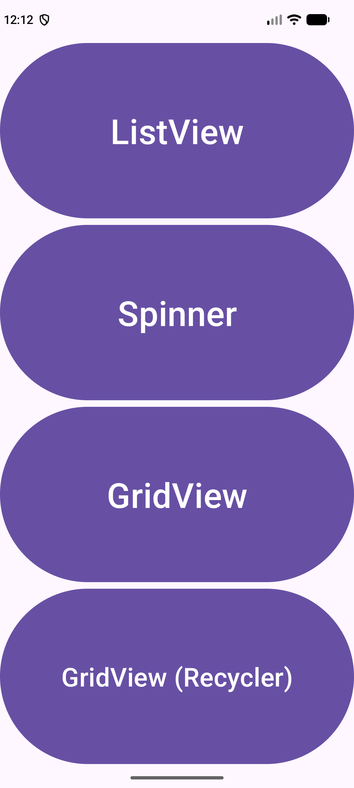
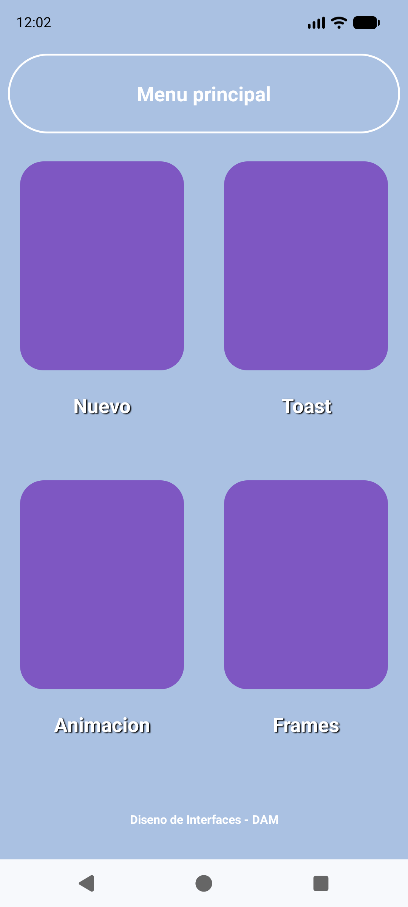
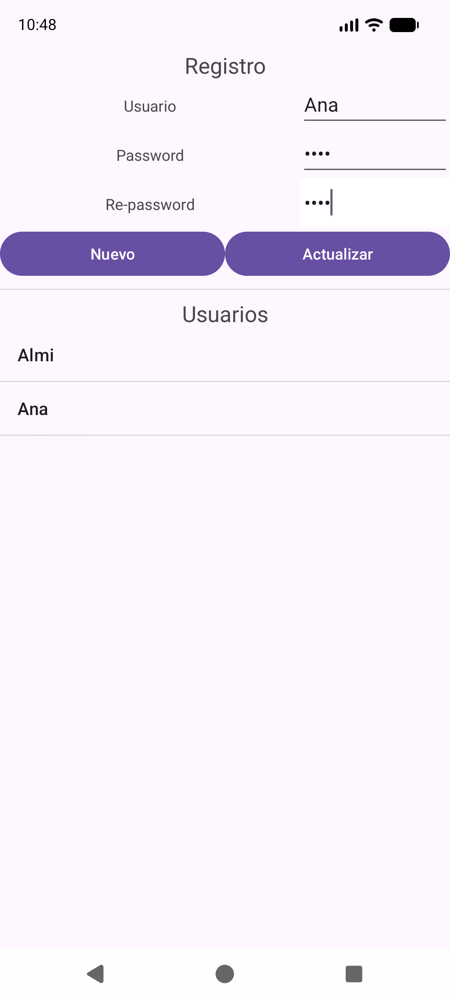
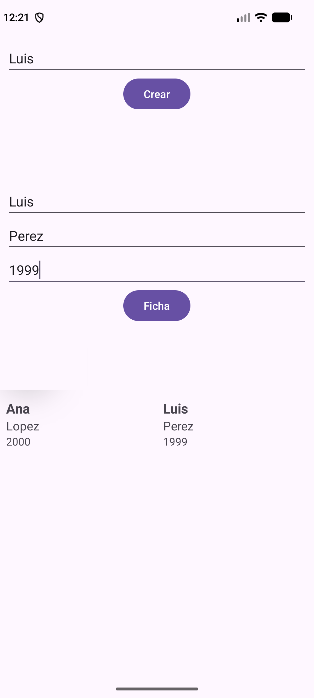

---
tags:
  - android
  - ejercicio
---

# Nivel 8 🎯 — Simulacros de examen

Cuatro exámenes completos, **calcados de lo que hiciste en clase** (tus proyectos `AdapterDam2`, `EjercicioDiseno`, `EjemploDialogoPersonalizado` y `EjercicioFragmentos`), más un **test de teoría de 30 preguntas**. Solo usan técnicas que ya has visto: clases anónimas, `Bundle`, `getApplicationContext()`, el bloque `EdgeToEdge`, adaptadores propios, `AsyncTask`, `AppExecutors`…

> ✅ **Verificado:** las soluciones de los simulacros A, B y D se compilaron y se probaron en el emulador. El simulacro C **es tu proyecto real** `EjemploDialogoPersonalizado` con las mejoras del [Nivel 7](07-nivel-7-mejoras-del-proyecto.md). Todo está en `proyectos-zip\EjemploDialogoPersonalizado-con-soluciones.zip` (menú "Ejercicios": *Simulacro A*, *Simulacro B*, *5.4* y la app original).

## Cómo hacer un simulacro

1. **Reserva el tiempo** indicado y pon un cronómetro.
2. **Crea un proyecto nuevo vacío** (*Empty Views Activity*, Java). Nada de abrir las soluciones.
3. Ve **guardando y ejecutando** ▶ cada pocos minutos.
4. Cuando acabes (o se agote el tiempo), **puntúate con la rúbrica** y anota qué fallaste.
5. Repite el simulacro a los dos o tres días.

> 🖼️ Las imágenes de los enunciados las tienes en el zip (carpeta `res/drawable`, dentro de `EjemploDialogoPersonalizado-con-soluciones.zip`). En el examen real tendrás las tuyas.

---

## 🅰️ Simulacro A — Menú de adaptadores (`AdapterDam2`) · 120 min · 10 puntos

### Enunciado
Crea una app con una pantalla de menú de **cuatro botones**:

1. **ListView** → una lista de **equipos** (nombre + escudo) con un `BaseAdapter`. Al pulsar un equipo se abre la lista de sus **jugadores**, y al pulsar un jugador, su **ficha**. Se llega con `ActivityOptionsCompat.makeSceneTransitionAnimation` (transición de escena).
2. **Spinner** → un `Spinner` de **cursos** con un adaptador propio que hereda de `ArrayAdapter`, con la primera fila *"Selecciona una opción"*. Al elegir un curso se abre otra pantalla con el curso elegido. Se llega con `overridePendingTransition`.
3. **GridView** → una rejilla de **imágenes** con Glide y `TypedArray`. Al pulsar una, se abre el detalle con **transición de elemento compartido**.
4. **GridView con RecyclerView** → la misma rejilla con `RecyclerView`, `ViewHolder` y `GridLayoutManager`.

**Todas las `Activity` deben estar declaradas en el manifiesto.**



### Qué se evalúa
Los tres tipos de transición de [08](../conceptos/08-transiciones.md), `BaseAdapter` y `ArrayAdapter`, `Bundle` con objetos `Serializable`, Glide, `RecyclerView`.

### Solución

Las cuatro pantallas son las de los ejercicios del [Nivel 3](03-nivel-3-adaptadores.md) (**3.1–3.3** equipos/jugadores/ficha, **3.4** Spinner, **3.5** GridView, **3.6** RecyclerView). Lo que este simulacro añade es **el menú** que las une, con las tres formas de lanzar una pantalla:

```java
public class SimulacroAActivity extends AppCompatActivity {

    @Override
    protected void onCreate(Bundle savedInstanceState) {
        super.onCreate(savedInstanceState);
        EdgeToEdge.enable(this);
        setContentView(R.layout.ej_simulacro_a);
        // ... (bloque de insets de siempre, ver 01-fundamentos §5)

        // ListView: con transicion de escena
        Button btnListView = findViewById(R.id.btnListView);
        btnListView.setOnClickListener(new View.OnClickListener() {
            @Override
            public void onClick(View v) {
                Intent intent = new Intent(getApplicationContext(), Ej31EquiposActivity.class);
                ActivityOptionsCompat options = ActivityOptionsCompat.makeSceneTransitionAnimation(SimulacroAActivity.this);
                startActivity(intent, options.toBundle());
            }
        });

        // Spinner: con overridePendingTransition
        Button btnSpinner = findViewById(R.id.btnSpinner);
        btnSpinner.setOnClickListener(new View.OnClickListener() {
            @Override
            public void onClick(View v) {
                startActivity(new Intent(getApplicationContext(), Ej34SpinnerActivity.class));
                overridePendingTransition(R.anim.ej_entrada, R.anim.ej_salida);
            }
        });

        // GridView: el detalle lleva la transicion de elemento compartido (se programa en el GridView)
        Button btnGridView = findViewById(R.id.btnGridView);
        btnGridView.setOnClickListener(new View.OnClickListener() {
            @Override
            public void onClick(View v) {
                startActivity(new Intent(getApplicationContext(), Ej35GridActivity.class));
            }
        });

        // GridView con RecyclerView
        Button btnGridRecycler = findViewById(R.id.btnGridRecycler);
        btnGridRecycler.setOnClickListener(new View.OnClickListener() {
            @Override
            public void onClick(View v) {
                startActivity(new Intent(getApplicationContext(), Ej36RecyclerActivity.class));
            }
        });
    }
}
```

**Explicación:**
- **ListView** usa `makeSceneTransitionAnimation(SimulacroAActivity.this)` y `options.toBundle()` como segundo argumento de `startActivity`.
- **Spinner** usa `overridePendingTransition(R.anim.ej_entrada, R.anim.ej_salida)` **justo después** de `startActivity`.
- **GridView**: el efecto de elemento compartido no se programa en el menú, sino **en el `GridView` al pulsar la imagen** (ejercicio 3.5).
- `getApplicationContext()` sirve como contexto del `Intent`; `SimulacroAActivity.this` es necesario cuando una clase anónima necesita **la Activity**.

### Rúbrica

| Apartado | Puntos | Lo tienes si… |
|---|---|---|
| Menú con 4 botones y sus `Intent` | 1 | Cada botón abre su pantalla; todas en el manifiesto |
| ListView de equipos + jugadores + ficha | 3 | `BaseAdapter` con los 4 métodos, `Serializable` en el `Bundle`, `onItemClickListener` con `position` |
| Spinner personalizado | 2 | `ArrayAdapter`, `getCount` con `+1`, `getView` y `getDropDownView`, `OnItemSelectedListener` |
| GridView con Glide y detalle compartido | 2 | `TypedArray`, `Glide.with(...).load(...).into(...)`, `Pair` + `setTransitionName` |
| RecyclerView | 1 | `ViewHolder`, `onCreateViewHolder`/`onBindViewHolder`/`getItemCount`, `GridLayoutManager` |
| Transiciones | 1 | Las tres formas usadas donde toca |

### Los errores que suelen costar puntos
- 📌 `Activity` sin declarar en `AndroidManifest.xml`: *ActivityNotFoundException*.
- 📌 Spinner: olvidar restar 1 a `position` al leer los datos (el `+1` de la fila de aviso).
- 📌 Transición de elemento compartido sin **el mismo `transitionName`** en las dos pantallas.
- Glide/Picasso sin la dependencia en `build.gradle.kts` (o Picasso sin permiso `INTERNET`).

---

## 🅱️ Simulacro B — Menú de diseño con toast y animaciones (`EjercicioDiseno`) · 120 min · 10 puntos

### Enunciado
*(Es el enunciado de `1-EjercicioDiseno.pdf` ampliado con `EjercicioAnimaciones.pdf`.)*

Diseña una pantalla de menú **lo más adaptativa posible** (con pesos), con cabecera, **rejilla 2×2 de botones** con imagen y pie:

1. Botones con **dos imágenes** cada uno (normal / pulsado).
2. Un `TextView` con **sombra** bajo cada botón (con un estilo reutilizable).
3. Sin barra de título.
4. **Nuevo** → abre una nueva actividad **vacía**.
5. **Toast** → muestra un *toast* personalizado (imagen + texto) durante **3 segundos** con la animación de carga y, al terminar, abre una nueva actividad **vacía**.
6. **Animación** → una barra de progreso que avanza con un **`AsyncTask`** y mueve un personaje.
7. **Frames** → la animación frame a frame con botones **Play** y **Stop**.



### Qué se evalúa
Diseño con pesos, `selector` y estilos ([Nivel 2](02-nivel-2-disenos-xml.md)); `Dialog` + `Handler.postDelayed`, `AsyncTask` y `animation-list` ([Nivel 4](04-nivel-4-toast-asynctask-animaciones-transiciones.md)).

### Solución

El diseño y los estilos son los del ejercicio **2.4**; el toast, la barra y los frames son los de **4.1, 4.2 y 4.3**. Aquí está **la pantalla de menú** que los une:

```java
public class SimulacroBActivity extends AppCompatActivity {

    @Override
    protected void onCreate(Bundle savedInstanceState) {
        super.onCreate(savedInstanceState);
        EdgeToEdge.enable(this);
        setContentView(R.layout.ej_menu_diseno);
        // ... (bloque de insets de siempre, ver 01-fundamentos §5)

        // Boton "Nuevo": va a una nueva actividad
        ImageButton btnNuevo = findViewById(R.id.btnNuevo);
        btnNuevo.setOnClickListener(v -> {
            Intent intent = new Intent(SimulacroBActivity.this, EjVaciaActivity.class);
            startActivity(intent);
        });

        // Boton "Toast": animacion de carga de 3 segundos y, al terminar, una nueva actividad vacia
        ImageButton btnToast = findViewById(R.id.btnToast);
        btnToast.setOnClickListener(new View.OnClickListener() {
            @Override
            public void onClick(View v) {
                View vista = getLayoutInflater().inflate(R.layout.ej_toast_per, null);
                ImageView imagen = vista.findViewById(R.id.ivToast);
                imagen.setImageResource(R.drawable.ej_andando3);
                TextView texto = vista.findViewById(R.id.tvToast);
                texto.setText("Cargando...");

                final Dialog dialogo = new Dialog(SimulacroBActivity.this);
                dialogo.setContentView(vista);
                if (dialogo.getWindow() != null) {
                    dialogo.getWindow().setBackgroundDrawableResource(android.R.color.transparent);
                }
                dialogo.show();

                new Handler(Looper.getMainLooper()).postDelayed(new Runnable() {
                    @Override
                    public void run() {
                        startActivity(new Intent(getApplicationContext(), EjVaciaActivity.class));
                        dialogo.dismiss();
                    }
                }, 3000);
            }
        });

        // Boton "Animacion": la barra de progreso con AsyncTask
        ImageButton btnAsync = findViewById(R.id.btnAsync);
        btnAsync.setOnClickListener(v -> startActivity(new Intent(getApplicationContext(), Ej42AsyncActivity.class)));

        // Boton "Frames": la animacion frame a frame
        ImageButton btnFrames = findViewById(R.id.btnFrames);
        btnFrames.setOnClickListener(v -> startActivity(new Intent(getApplicationContext(), Ej43FrameActivity.class)));
    }
}
```

**Explicación:**
- **Nuevo** usa la forma corta con lambda; los demás usan clase anónima, como en clase.
- **Toast de 3 s:** se infla `ej_toast_per`, se mete en un `Dialog` sin fondo, y `Handler.postDelayed(…, 3000)` abre la pantalla vacía y **cierra el diálogo** (`dismiss()`).
- `getMainThread` no hace falta: `Handler(Looper.getMainLooper())` ya ejecuta en el hilo principal.
- La variable `dialogo` es **`final`** porque la usa la clase anónima del `Runnable`.

### Rúbrica

| Apartado | Puntos | Lo tienes si… |
|---|---|---|
| Diseño con pesos (cabecera, rejilla 2×2, pie) | 2 | `LinearLayout` + `layout_weight` + `0dp`, sin medidas fijas |
| `selector` de imágenes y estilo de sombra | 1.5 | `state_pressed` **y** el estado por defecto **al final**; `shadowColor/Dx/Dy/Radius` en un `style` |
| Sin barra de título | 0.5 | Tema `NoActionBar` |
| Botón *Nuevo* | 0.5 | `Intent` a una Activity registrada en el manifiesto |
| Toast de 3 s → nueva Activity | 2 | `Dialog` transparente, `Handler.postDelayed`, `dismiss()` |
| `AsyncTask` con progreso | 2 | `doInBackground` + `publishProgress` + `onProgressUpdate` + `onPostExecute` |
| Frames Play/Stop | 1.5 | `animation-list`, `AnimationDrawable.start()` / `stop()` |

### Los errores que suelen costar puntos
- 📌 Tocar la interfaz dentro de `doInBackground` (debe hacerse en `onProgressUpdate`).
- 📌 Dialog con fondo blanco (falta `setBackgroundDrawableResource(android.R.color.transparent)`).
- 📌 `AnimationDrawable.start()` en `onCreate`: **no arranca** (la vista aún no está lista); hay que llamarlo desde un botón.
- 📌 En `selector`, poner el estado por defecto **el primero**: siempre gana y nunca cambia la imagen.

---

## 🅲 Simulacro C — Login y registro con Room y diálogos (`EjemploDialogoPersonalizado`) · 150 min · 10 puntos

### Enunciado
*(Es tu proyecto real, del PDF `1-DialogSQLitePersonalizado.pdf`.)*

Crea una app con estas pantallas:

1. **Principal:** un botón **Login** que abre un **`DialogFragment` con diseño propio** (usuario, password, Aceptar y Cancelar) y otro botón que abre **Registro**.
2. **Registro (CRUD de usuarios con Room):**
   - Campos usuario, password y re-password. **Nuevo** solo se activa si las dos contraseñas coinciden (el campo re-password se pone rojo si no).
   - Lista de usuarios con un **adaptador propio** (hereda de `ArrayAdapter`, `getView` con su layout).
   - **Clic corto** en un usuario → lo carga en los campos. **Actualizar** guarda los cambios.
   - **Clic largo** → `AlertDialog` con título, mensaje y botones *si* / *no* para borrar; *no* muestra un `Toast` "NO SE ELIMINO".
3. **Login:** si el usuario y la contraseña existen en la base de datos, abre una pantalla **Central**; si no, avisa con un `Toast` y cierra el diálogo.
4. **Toda la base de datos en segundo plano** con `AppExecutors` (`getDiskIO`) y los cambios de pantalla desde `getMainThread`.




### Qué se evalúa
`@Entity`, `@Dao`, `@Database` Singleton, `LiveData` y `observe`, `AppExecutors`, `DialogFragment`, `AlertDialog`, `TextWatcher`, adaptador propio ([Nivel 6](06-nivel-6-dialogos-y-room.md) y [Nivel 7](07-nivel-7-mejoras-del-proyecto.md)).

### Solución
Tu proyecto `EjemploDialogoPersonalizado`, ya documentado: [proyectos/EjemploDialogoPersonalizado.md](../proyectos/EjemploDialogoPersonalizado.md). Las piezas clave:

**La consulta de login del DAO:**

```java
//Busca un usuario por nombre y password (sirve para comprobar un login).
//Devuelve null si no existe ninguno que coincida.
@Query("SELECT * FROM Usuario WHERE usuario = :usu AND password = :pass")
Usuario loadUsuarioByNamePass(String usu, String pass);
```

**El botón Aceptar del diálogo de login** (base de datos en `getDiskIO`, aviso en `getMainThread`):

```java
btnAceptar.setOnClickListener(new View.OnClickListener() {
    @Override
    public void onClick(View v) {
        //Leemos lo que ha escrito el usuario
        String nombre = etNombre.getText().toString();
        String password = etPassword.getText().toString();

        //1) La consulta a la BD se hace en un hilo secundario (diskIO)
        AppExecutors.getInstance().getDiskIO().execute(new Runnable() {
            @Override
            public void run() {
                //Devuelve el Usuario si nombre y password coinciden, o null si no existe
                final Usuario usu = mDb.usuariosDao().loadUsuarioByNamePass(nombre, password);

                //2) Con el resultado, volvemos a otro ejecutor para actuar sobre la pantalla
                AppExecutors.getInstance().getMainThread().execute(new Runnable() {
                    @Override
                    public void run() {
                        if(usu != null){
                            //Login correcto: abrimos CentralActivity
                            Intent intent = new Intent(getContext(), CentralActivity.class);
                            startActivity(intent);
                            dismiss();   //cerramos tambien el dialogo (si no, seguiria debajo de la nueva pantalla)
                        }else {
                            //Login incorrecto: avisamos y cerramos el dialogo
                            Toast.makeText(getContext(), "Usuario o contraseña incorrectos", Toast.LENGTH_SHORT).show();
                            dismiss();
                        }
                    }
                });
            }
        });

    }
});
```

### Rúbrica

| Apartado | Puntos | Lo tienes si… |
|---|---|---|
| Entidad, DAO y base de datos | 2 | `@Entity` con `@PrimaryKey(autoGenerate)`, 4 métodos de DAO, `@Database` con Singleton `synchronized` |
| Adaptador y lista con `observe` | 1.5 | `ArrayAdapter` con `getCount`/`getItem`/`getView`; `setmUsuarioList` + `notifyDataSetChanged` |
| Formulario con `TextWatcher` | 1 | Nuevo activo solo si coinciden; re-password rojo si no |
| Clic corto / Actualizar | 1 | Carga el usuario y guarda su `id` |
| Clic largo con `AlertDialog` | 1 | Título, mensaje, *si* borra y *no* muestra `Toast` |
| `DialogFragment` de login | 1.5 | Constructor vacío, `onCreateView` con `inflate`, `dismiss()` |
| Comprobación del login y `AppExecutors` | 1 | Consulta en `getDiskIO`, `Intent`/`Toast` en `getMainThread` |

### Los errores que suelen costar puntos
- 📌 `Cannot access database on the main thread` (consulta directa en `onClick`).
- 📌 `getMainThread()` con el orden de argumentos original: el `Toast` se cae ([7.2](07-nivel-7-mejoras-del-proyecto.md)).
- 📌 Olvidar `dismiss()` en el login.
- Olvidar la entidad en `@Database(entities = {...})`.
- Comprobar el usuario con `==` en vez de en la consulta.

---

## 🅳 Simulacro D — Ficha de personas con tres fragmentos (`EjercicioFragmentos`) · 90 min · 10 puntos

### Enunciado
Es el ejercicio **5.4** del [Nivel 5](05-nivel-5-fragmentos.md): un formulario de tres fragmentos (`Fragmento1` nombre → `Fragmento2` apellido y fecha → `Fragmento3` `GridView` con **todas** las fichas), comunicados **a través de la Activity** con una interfaz. Hazlo **sin mirar la solución**, con este orden de trabajo:

1. Modelo `Persona` (`Serializable`) e interfaz `IControlFichas`.
2. Los tres layouts (`ej_fragmento1/2/3`) y la Activity con su contenedor.
3. `Fragmento1` con `newInstance`, `onCreateView`, `onAttach` (cast) y validación con `setError`.
4. `Fragmento2` con el nombre recibido por `Bundle`.
5. `Fragmento3` con un `BaseAdapter` propio en el `GridView`.
6. La Activity: crear `Persona`, añadirla a la lista y mostrar el fragmento siguiente con `replace`.



### Rúbrica

| Apartado | Puntos | Lo tienes si… |
|---|---|---|
| Modelo e interfaz | 1 | `Persona implements Serializable`; los métodos de la interfaz describen eventos |
| Los 3 fragmentos con `onCreateView` | 2.5 | `inflate(..., container, false)` y `findViewById` sobre la vista devuelta |
| `newInstance` + `Bundle` | 1.5 | Argumentos con `setArguments`, leídos en `onCreate`/`onCreateView` |
| Comunicación por la interfaz | 2 | Cast en `onAttach`; llamada al pulsar; `onDetach` pone `null` |
| Validaciones | 1 | `setError` en Fragmento1, `Toast` en Fragmento2 |
| `GridView` con adaptador propio y lista acumulada | 2 | Las fichas anteriores **no se pierden** al crear una nueva |

### Los errores que suelen costar puntos
- 📌 Constructor con parámetros en un `Fragment`.
- 📌 `ClassCastException` en `onAttach`: la Activity no `implements` la interfaz.
- 📌 Crear una lista nueva en `Fragmento3` en vez de recibir **la lista completa** de la Activity.
- `commit()` olvidado tras `replace`.

---

# 🧠 TEST DE TEORÍA (30 preguntas)

Responde sin mirar. Las respuestas están debajo.

**Java y Android básico**
1. ¿Qué imprime `System.out.println(7 % 3);`?  a) 2  b) 1  c) 2.33  d) 0
2. ¿Qué diferencia hay entre `==` y `.equals()` con `String`?
3. ¿Qué palabra clave usa una clase para heredar de otra, y cuál para cumplir una interfaz?
4. ¿Qué pasa si llamas a `findViewById` **antes** de `setContentView`?
5. ¿Qué dos cosas obligatorias hay que hacer para poder abrir una segunda pantalla?

**Diseño**
6. En un `LinearLayout` horizontal con tres hijos de pesos 1, 2, 1, ¿qué porcentaje ocupa el de en medio?
7. ¿Qué valor debe tener `layout_width` de un hijo que reparte el ancho con pesos?
8. En un `selector`, ¿dónde debe ir el item por defecto (sin estado)?
9. ¿Para qué sirve el bloque `EdgeToEdge.enable(this)` + `setOnApplyWindowInsetsListener` y qué `id` debe tener el layout raíz sobre el que se aplica?

**Adaptadores**
10. ¿Cuáles son los 4 métodos que obliga a escribir `BaseAdapter`?
11. En `inflate(R.layout.fila, parent, false)`, ¿qué significa el `false`?
12. ¿Qué es `position` en `onItemClick`?
13. ¿Qué listener se usa en un `Spinner` y qué método extra hay que implementar?
14. En el `Spinner` personalizado de clase, ¿por qué `getCount` devuelve `datos.length + 1` y qué hay que restar en `getView`?
15. ¿Para qué se usa `TypedArray` con Glide en el `GridView` de imágenes?
16. ¿Qué papel tiene el `ViewHolder` en un `RecyclerView` y qué tres métodos obliga a escribir el adaptador?

**Toast, AsyncTask, animaciones y transiciones**
17. ¿Por qué un *toast* con imagen se hace con un `Dialog` y no con `Toast`?
18. ¿Qué hace `new Handler(Looper.getMainLooper()).postDelayed(runnable, 3000)`?
19. ¿Cuál de los métodos de `AsyncTask` se ejecuta en el hilo de fondo?
20. ¿Qué método llamas dentro de `doInBackground` para actualizar la pantalla, y qué método recibe ese aviso?
21. ¿Qué clase controla una animación `animation-list` y qué método la arranca?
22. Nombra las tres formas de lanzar una transición al abrir una `Activity`.
23. ¿Qué necesitan las **dos** pantallas para una transición de elemento compartido?
24. ¿Qué permiso hace falta para cargar una imagen con Picasso desde internet?

**Fragmentos y diálogos**
25. ¿Para qué se define una interfaz dentro de un fragmento?
26. ¿Qué es el `context` de `onAttach` y por qué se hace un *casting*?
27. ¿Qué requisito tiene un `Fragment` sobre su constructor?
28. ¿Cuándo usar `AlertDialog` y cuándo `DialogFragment`? ¿Qué método cierra un diálogo?

**Hilos y Room**
29. ¿Qué hacen `AppExecutors.getInstance().getDiskIO()` y `.getMainThread()`, y cuáles son las dos reglas de oro de los hilos?
30. ¿Qué hace `@PrimaryKey(autoGenerate = true)` y qué ventaja tiene un DAO que devuelve `LiveData<List<X>>`?

---

## ✅ Respuestas del test

1. **b) 1** (7 dividido entre 3 da 2 con resto 1).
2. `==` compara si son **el mismo objeto**; `.equals()` compara **el contenido**. Con textos hay que usar `.equals()`.
3. **`extends`** para heredar; **`implements`** para cumplir una interfaz.
4. Devuelve `null`, y al usar la vista → `NullPointerException`.
5. Crear su **clase Activity** (y su layout) y **declararla en `AndroidManifest.xml`**; después abrirla con un `Intent` y `startActivity`.
6. **50 %** (2 de un total de 4).
7. **`0dp`**.
8. **El último** (los estados se comprueban de arriba abajo y el primero que encaja gana).
9. Dibuja la app **bajo** las barras del sistema (de borde a borde) y el *listener* añade **padding** para que no las tapen. El layout raíz debe tener **`android:id="@+id/main"`**.
10. `getCount`, `getItem`, `getItemId` y `getView`.
11. **No** añadir la vista automáticamente al `parent`: el `ListView` ya la coloca. Con `true` falla (`UnsupportedOperationException`).
12. El **índice** (empieza en 0) de la fila pulsada.
13. **`OnItemSelectedListener`**, y hay que implementar también **`onNothingSelected`**.
14. Porque la posición 0 es una fila **de aviso** ("Selecciona una opción") que no es un dato. Por eso los datos reales están **desplazados**: hay que usar `datos[position - 1]`.
15. `TypedArray` es la **lista de imágenes** declarada en `res/values` (`obtainTypedArray`); con `getResourceId(position, -1)` se obtiene el id de cada una para pasárselo a `Glide.with(...).load(...)`.
16. El `ViewHolder` **guarda las vistas de una fila** para no volver a buscarlas con `findViewById` y **reciclarlas**. Obliga a escribir `onCreateViewHolder`, `onBindViewHolder` y `getItemCount`.
17. Porque `Toast` solo admite texto por defecto; un `Dialog` permite **cualquier diseño** (imagen y texto grande) con un layout propio.
18. **Ejecuta el `Runnable` en el hilo principal tras 3 segundos** (3000 ms). Sirve para cerrar el diálogo o abrir otra pantalla.
19. **`doInBackground`**. (`onPreExecute`, `onProgressUpdate` y `onPostExecute` van en el hilo principal.)
20. **`publishProgress(valor)`** dentro de `doInBackground`, y lo recibe **`onProgressUpdate`**, que sí puede tocar la pantalla.
21. **`AnimationDrawable`**; se arranca con **`start()`** (y se para con `stop()`).
22. **(1)** `ActivityOptionsCompat.makeSceneTransitionAnimation(this)` con `options.toBundle()`; **(2)** `overridePendingTransition(entrada, salida)`; **(3)** transición de **elemento compartido** con `Pair` de vista + nombre.
23. El **mismo `transitionName`** en la vista de origen y en la de destino (con `ViewCompat.setTransitionName`) y lanzar la Activity con `ActivityOptionsCompat`.
24. **`INTERNET`** en el manifiesto: `<uses-permission android:name="android.permission.INTERNET" />`.
25. Para **comunicarse con la Activity** sin depender de una Activity concreta (así el fragmento es reutilizable).
26. La **Activity** que contiene al fragmento (como `Context`). Se hace *casting* a la interfaz: `(MiInterfaz) context`; si la Activity no la implementa, `ClassCastException`.
27. Debe tener un constructor **público y sin argumentos** (Android lo recrea, p. ej. al girar la pantalla). Por eso se usa `newInstance(Bundle)`.
28. `AlertDialog` para **preguntas simples** (título, mensaje, botones); `DialogFragment` para **diseño propio** (formularios). Se cierra con **`dismiss()`**.
29. `getDiskIO()` ejecuta en **un hilo de fondo** (base de datos); `getMainThread()` vuelve al **hilo principal** (pantalla). Reglas: **(1)** nada lento en el hilo principal; **(2)** solo el hilo principal toca las vistas.
30. Marca `id` como **clave primaria** y Room le asigna el valor solo (1, 2, 3…). Con `LiveData`, quien la **observa** recibe la lista nueva cada vez que cambia la tabla, **sin volver a consultar**.

**Cómo puntuarte:** 27–30 → dominas el temario · 22–26 → repasa los temas que has fallado · menos de 22 → vuelve a los niveles 1–6.

---

## Ver también
- [00 — Cómo usar los ejercicios](00-como-usar.md)
- [Guía 03 — Errores comunes](../guias/03-errores-comunes.md)
- [INDICE](../INDICE.md)
